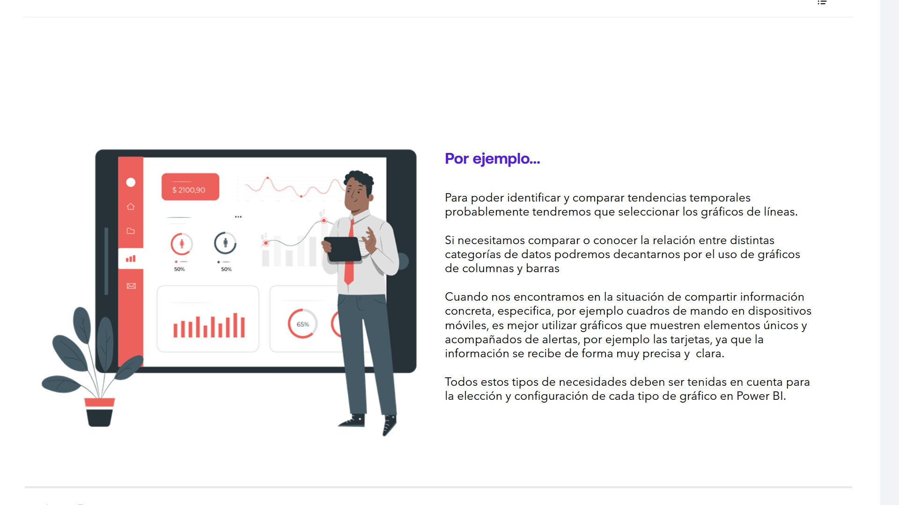

# 08-017:	Elegir el gráfico adecuado

## **Las necesidades de la empresa y el tipo de gráfico adecuado**

> Cada organización genera sus propios datos, y tiene necesidades específicas para poder exprimir la información que contienen

La elección del tipo de gráfico adecuado para cada proyecto de **Business Intelligence**, para cada informe, para cada panel o para cada cuadro de mando, debe hacerse en función de distintas necesidades:

* 	La **percepción visual de la información** contenida en los datos **que se desea lograr**.

* 	El tipo de **relación entre los datos** que se necesita mostrar.

* 	La **cantidad de tipos de datos a mostrar** en los informes.

* 	La **relación que existe entre los datos contenidos en los datasets con los que se va a diseñar**.

* 	Los **destinatarios** de la información creada con las visualizaciones.

> Por ello, los profesionales del área de datos deben reflexionar sobre qué visualizaciones deberán contener los informes

-	** Por ejemplo...**:  

	* Para **poder identificar y comparar tendencias temporales** probablemente tendremos que seleccionar los **gráficos de líneas**.

	* Si necesitamos **comparar o conocer la relación entre distintas categorías** de datos podremos decantarnos por el uso de **gráficos de columnas y barras**.

	* Cuando nos encontramos en la situación de compartir información concreta, específica, por ejemplo cuadros de mando en dispositivos móviles**, es mejor utilizar **gráficos que muestren elementos únicos y acompañados de alertas**, por ejemplo **las tarjetas**, ya que la información se recibe de forma muy precisa y clara.

Todos estos tipos de necesidades deben ser tenidas en cuenta para la elección y configuración de cada tipo de gráfico en Power BI.