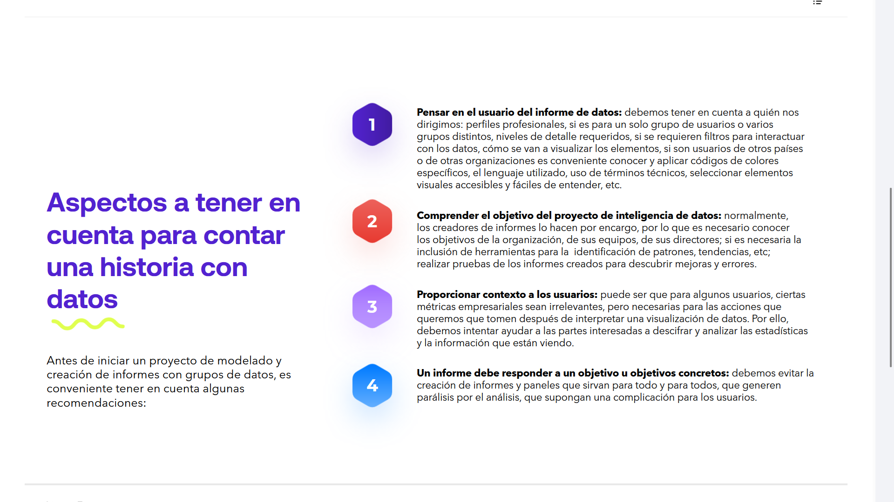
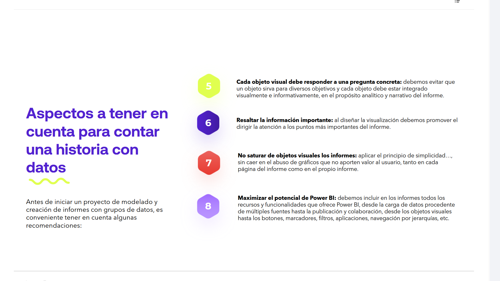
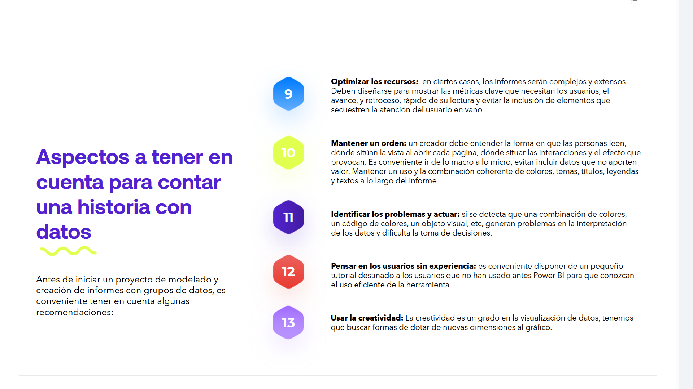

# 08-018:	Contar una historia con datos

## **Aspectos a tener en cuenta para contar una historia con datos**

Antes de iniciar un proyecto de modelado y creación de informes con grupos de datos, es conveniente tener en cuenta algunas recomendaciones:

### 1. **Pensar en el usuario del informe de datos** 

Debemos tener en cuenta **a quién nos dirigimos**:   

	- 	Perfiles profesionales
	- 	Número de receptores, si es para un solo grupo de usuarios o varios grupos distintos
	-	Niveles de detalle requeridos
	-	Si se requieren filtros para interactuar con los datos
	-	Cómo se van a visualizar los elementos
	-	Localización de los usuarios, si son usuarios de otros países o de otras organizaciones es conveniente conocer y aplicar códigos de colores específicos
	-	El lenguaje utilizado
	-	Uso de términos técnicos o no
	- 	La elección de elementos visuales accesibles y fáciles de entender
	-	Etc....

###	2. **Comprender el objetivo del proyecto de inteligencia de datos** 

Normalmente, los creadores de informes lo hacen por encargo, por lo que es necesario:

- 	Conocer los objetivos de la organización, de sus equipos, de sus directores.  
- 	Si es necesaria la inclusión de herramientas para la identificación de patrones, tendencias, etc
-	Realizar pruebas de los informes creados para descubrir mejoras y errores.

###	3. **Proporcionar contexto a los usuarios** 

Puede ser que para algunos usuarios, ciertas métricas empresariales sean irrelevantes, pero necesarias para las acciones que queremos que tomen después de interpretar una visualización de datos.   

Por ello, **debemos intentar ayudar a las partes interesadas a descifrar y analizar las estadísticas y la información** que están viendo.

####	4. **Un informe debe responder a un objetivo u objetivos concretos**

Debemos **evitar la creación de informes y paneles que sirvan para todo y para todos, que generen parálisis por el análisis, que supongan una complicación para los usuarios**.

####	5. **Cada objeto visual debe responder a una pregunta concreta**

-	Debemos **evitar que un objeto sirva para diversos objetivos**

-	Cada objeto debe estar integrado visualmente e informativamente, en el propósito** analítico y narrativo del informe.

####	6. **Resaltar la información importante**

- Al diseñar la visualización debemos **promover el dirigir la atención a los puntos más importantes** del informe.  

####	7. **No saturar de objetos visuales los informes**

- Aplicar el **principio de simplicidad**..., sin caer en el abuso de gráficos que no aporten valor al usuario, tanto en cada página del informe como en el propio informe.

####	8. **Maximizar el potencial de Power BI** 

Debemos **incluir en los informes todos los recursos y funcionalidades que ofrece Power BI**:

- 	Desde la carga de datos procedente de múltiples fuentes
-	Hasta la publicación y colaboración

-	Desde los objetos visuales
-	Hasta los botones, marcadores, filtros, aplicaciones, navegación por jerarquías, etc.

####	9. **Optimizar los recursos**

En ciertos casos, los informes serán complejos y extensos:

-	Deben diseñarse para mostrar las métricas clave que necesitan los usuarios

-	El avance, y retroceso rápido de su lectura **evitando la inclusión de elementos que secuestren la atención** del usuario en vano.

####	10. **Mantener un orden**

Un creador debe entender:

- 	La forma en que las personas leen
-	Dónde sitúan la vista al abrir cada página
-	Dónde situar las interacciones y el efecto que provocan.

-	Es **conveniente ir de lo macro a lo micro**
-	Evitar incluir datos que no aporten valor
- 	Mantener un uso y la combinación coherente de colores, temas, títulos, leyendas y textos a lo largo del informe

####	11. **Identificar los problemas y actuar**

Si se detecta que una combinación de colores, un código de colores, un objeto visual, etc, generarán problemas en la interpretación de los datos y dificulta la toma de decisiones, y deben ser resueltos

####	12. **Pensar en los usuarios sin experiencia** 

Conviene disponer de un pequeño tutorial destinado a los usuarios que no han usado antes Power BI para que conozcan el uso eficiente de la herramienta.

####	13. **Usar la creatividad**
 
> Lo más importante, además de conocer los datos y las necesidades, es **utilizar la creatividad a la hora de desarrollar un proyecto de visualización de datos**

La creatividad es un grado en la visualización de datos, tenemos que buscar formas de dotar de nuevas dimensiones al gráfico.

