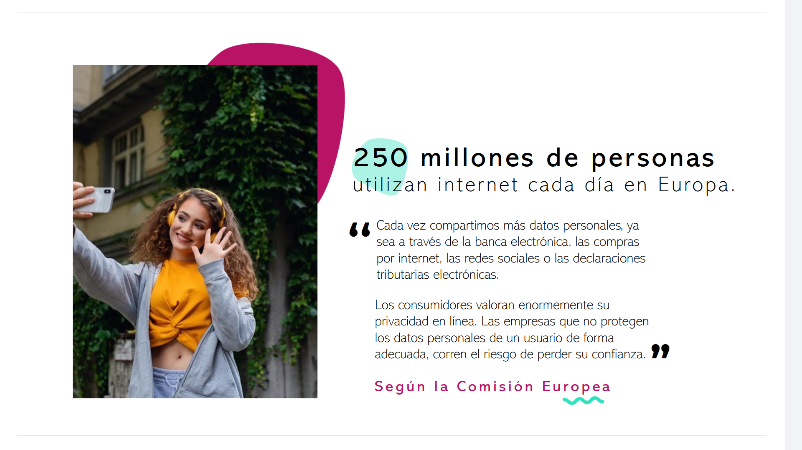
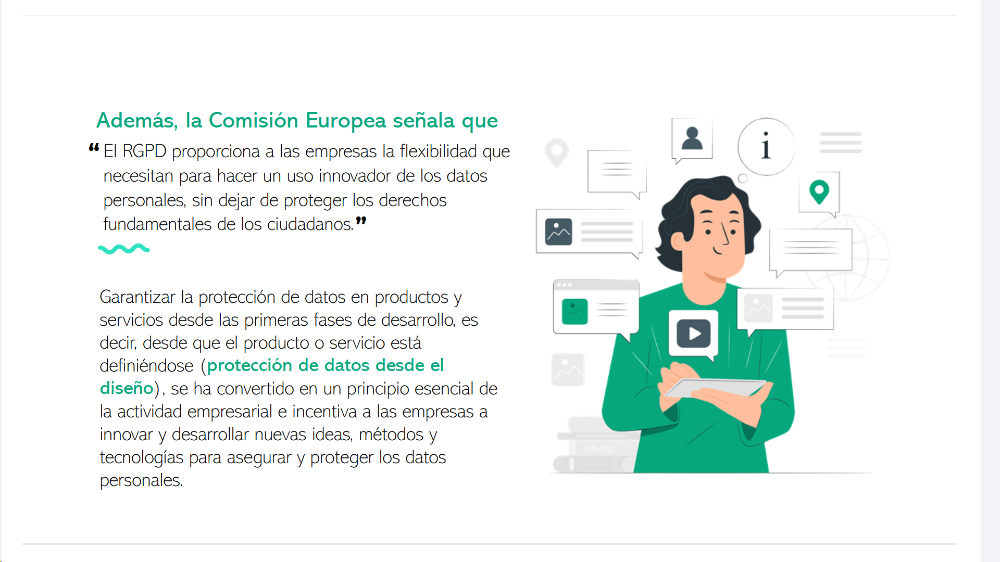
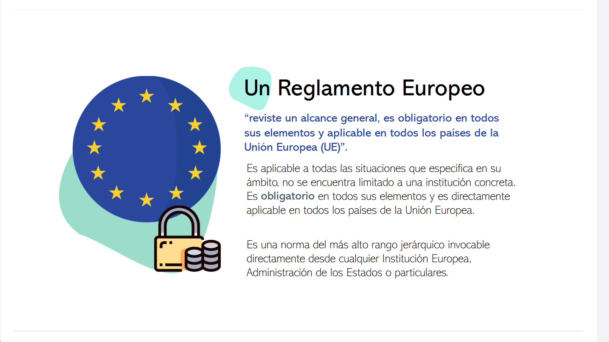
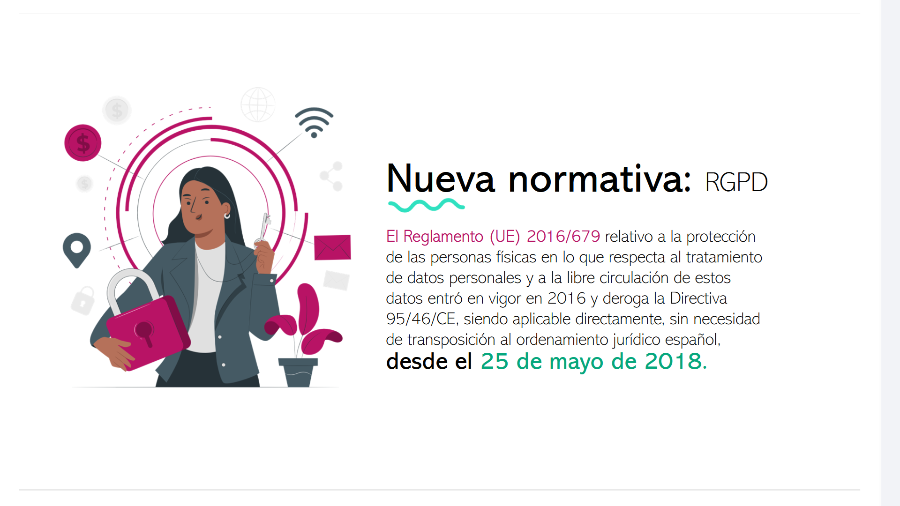
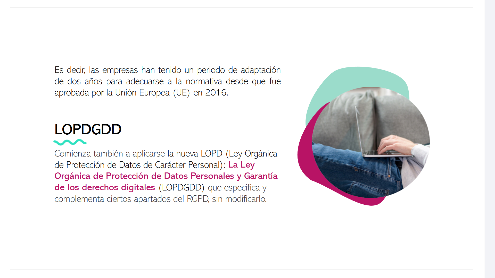

# 09-001:	RGPD

> **250 millones de personas** utilizan internet cada día en Europa.

-	Cada vez compartimos más datos personales, ya sea a través de la banca electrónica, las compras por internet, las redes sociales o las declaraciones tributarias electrónicas.

-	Los consumidores valoran enormemente su privacidad en línea. Las empresas que no protegen los datos personales de un usuario de forma adecuada, corren el riesgo de perder su confianza.

> ... **Según la Comisión Europea**

---

### **Además, la Comisión Europea señala que ... **

> 	**"El RGPD proporciona a las empresas la flexibilidad que necesitan para hacer un uso innovador de los datos personales, sin dejar de proteger los derechos fundamentales de los ciudadanos."**

-	Garantizar la protección de datos en productos y servicios desde las primeras fases de desarrollo, es decir, desde que el producto o servicio está definiéndose (**protección de datos desde el diseño**, **privacy-by-design**), se ha convertido en un principio esencial de la actividad empresarial e incentiva a las empresas a innovar y desarrollar nuevas ideas, métodos y tecnologías para asegurar y proteger los datos personales.

---

## Reglamento Europeo**

> 	*“Reviste un alcance general, es obligatorio en todos sus elementos y aplicable en todos los países de la Unión Europea (UE)”*.

1.	Es **aplicable a todas las situaciones** que especifica en su ámbito

2.	No se encuentra limitado a una institución concreta.

3.	Es **obligatorio** en todos sus elementos.

4.	Es directamente aplicable en todos los países de la Unión Europea.

Es una norma del más alto rango jerárquico invocable directamente desde cualquier Institución Europea, Administración de los Estados o particulares.

### **Reglamento Europeo:** RGPD, Reglamento (UE) 2016/679

- 	Fechas Clave:

	*	Entrada en Vigor: **2016**
	*	De obligado cumplimiento desde:	**25 de Mayo de 2018**
	

El ***Reglamento (UE) 2016/679*** *relativo a la protección de las personas físicas en lo que respecta al tratamiento de datos personales y a la libre circulación de estos datos* entró en vigor en 2016, derogando la Directiva 95/46/CE, siendo aplicable directamente, sin necesidad de transposición al ordenamiento jurídico español, **desde el 25 de mayo de 2018.**

Es decir, las empresas han tenido un periodo de adaptación de dos años para adecuarse a la normativa desde que fue aprobada por la Unión Europea (UE) en 2016.

---

## Reglamento del Estado español:	**LOPDGDD**

Comienza también a aplicarse la nueva LOPD (Ley Orgánica de Protección de Datos de Carácter Personal): **La Ley Orgánica de Protección de Datos Personales y Garantía de los derechos digitales** (LOPDGDD) que especifica y complementa ciertos apartados del RGPD, sin modificarlo.

- 	El **25 de mayo de 2018** empezó a ser aplicable el nuevo *Reglamento General de Protección de Datos*. 

-	El objeto del Reglamento es **establecer las normas relativas a la protección de las personas físicasen lo que respecta al tratamiento de los datos personales y la libre circulación de estos** datos personales.  

-	Por otro lado **en diciembre de 2018** entró en vigor en el Estado español la **LOPDGDD** - *Ley Orgánica de Protección de Datos Personales y Garantía de los Derechos Digitales*, que tiene por objeto adaptar el ordenamiento jurídico español al Reglamento Europeo.

-	En concreto, **especifica y complementa ciertos apartados del Reglamento sin modificarlo**. Esta nueva normativa supone cambios y novedades en la protección de datos personales.

-	**Uno de los más importantes** está relacionado con el **consentimiento del interesado**, es decir, el titular de los datos personales.

-	El nuevo reglamento **suprime la posibilidad del consentimiento tácito o el consentimiento proporcionado** por el interesado. 
- 	Este **debe manifestarse de manera expresa**, es decir, a través de una declaración o una clara acción afirmativa.
-	Por ejemplo, el consentimiento puede ser necesario para:

	*	**Enviar publicidad** sobre un producto o servicio a un interesado
	*	**Transferir los datos personales a un tercer país** 
	*	**Realizar un perfil de la persona física**.

-	Entre otras novedades importantes, el reglamento **ha revisado y ha añadido derechos en el listado existente** en la antigua normativa.
-	Ahora, el interesado podrá ejercer sus **derechos de acceso**, **rectificación**, **supresión**, **oposición**, **limitación del tratamiento**, **portabilidad** y **derecho a no ser objeto de decisiones individualizadas**. 

-	Además, el interesado tiene también **derecho a revocar en cualquier momento el consentimiento previamente dado**, así como a presentar una reclamación ante la Autoridad de Protección de Datos competente. 

-	**Es preciso que las empresas estén al tanto del nuevo reglamento**, ya que este les proporciona la flexibilidad que necesitan para hacer un uso innovador de los datos personales, sin dejar de proteger los derechos fundamentales de los ciudadanos.

