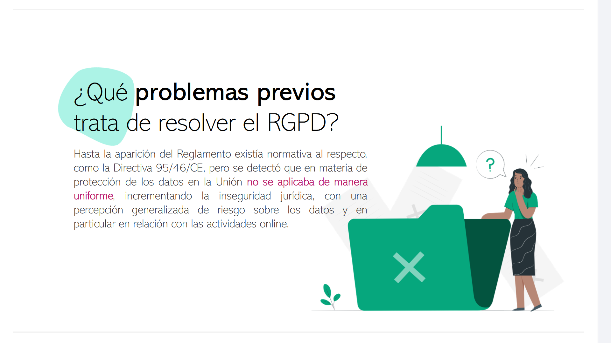
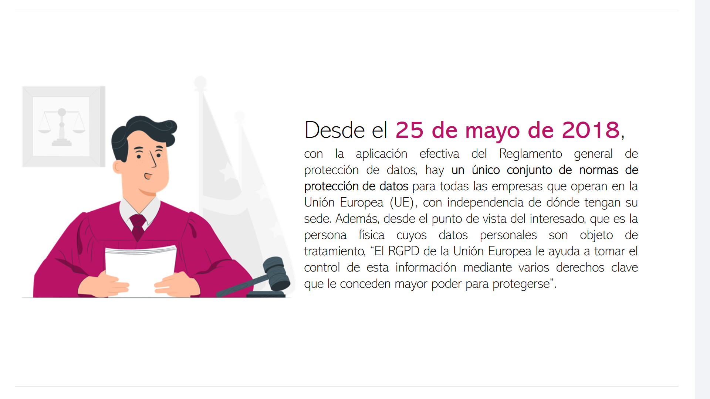
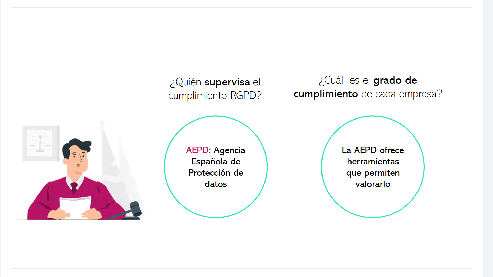
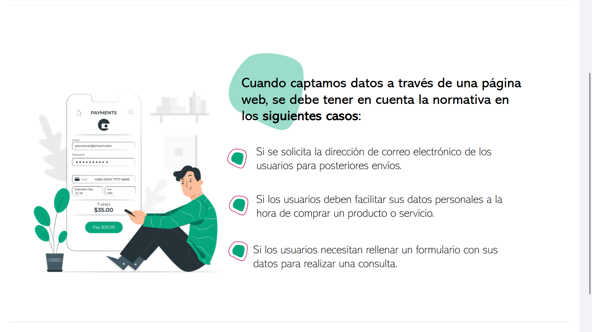
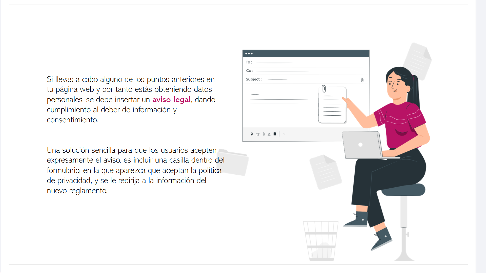
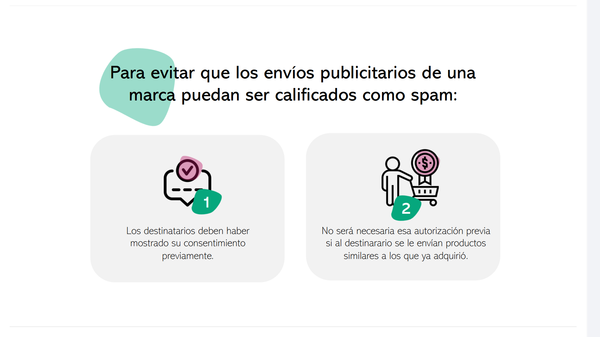

# 09-002:	**¿Qué problemas previos trata de resolver el RGPD?**

- 	Hasta la aparición del Reglamento existía normativa al respecto, como la Directiva 95/46/CE, pero se detectó que en materia de protección de los datos en la Unión **no se aplicaba de manera uniforme**, incrementando la inseguridad jurídica, con una percepción generalizada de riesgo sobre los datos y en particular en relación con las actividades online.

- 	Desde el **25 de mayo de 2018**, con la aplicación efectiva del Reglamento general de protección de datos, hay un único conjunto de normas de **protección de datos** para todas las empresas que operan en la Unión Europea (UE), con independencia de dónde tengan su sede.

-	Además, desde el punto de vista del interesado, que es la persona física cuyos datos personales son objeto de tratamiento, *“El RGPD de la Unión Europea le ayuda a tomar el control de esta información mediante varios derechos clave que le conceden mayor poder para protegerse”*.

#### ¿Quién **supervisa** el cumplimiento RGPD en el Estado español?

* 	**AEPD: Agencia Española de Protección de datos**, aunque los cambios deriven de una normativa de ámbito Europep

#### ¿Cuál es el **grado de cumplimiento** de cada empresa?

* La AEPD ofrece herramientas que permiten valorarlo

---

### Casos de Uso

**Cuando captamos datos a través de una página web, se debe tener en cuenta la normativa en los siguientes casos:**  

-	Si se solicita la dirección de correo electrónico de los usuarios para posteriores envíos.
-	Si los usuarios deben facilitar sus datos personales a la hora de comprar un producto o servicio.
-	Si los usuarios necesitan rellenar un formulario con sus datos para realizar una consulta.

Si llevas a cabo alguno de los puntos anteriores en tu página web y por tanto estás obteniendo datos personales, se debe insertar un **aviso legal**, dando cumplimiento al deber de información y consentimiento.

Una solución sencilla para que los usuarios acepten expresamente el aviso, es:

1.	Incluir una casilla dentro del formulario, en la que aparezca que aceptan la política de privacidad.
2.	Que se le redirija a la información del nuevo reglamento.

---

**Para evitar que los envíos publicitarios de una marca puedan ser calificados como spam:**  

* **1.** Los destinatarios deben haber mostrado su consentimiento previamente.
* **2.** No será necesaria esa autorización previa si al destinatario se le envían productos similares a los que ya adquirió.