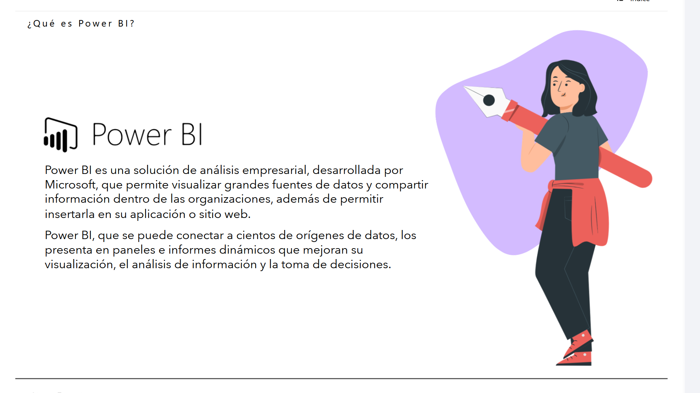
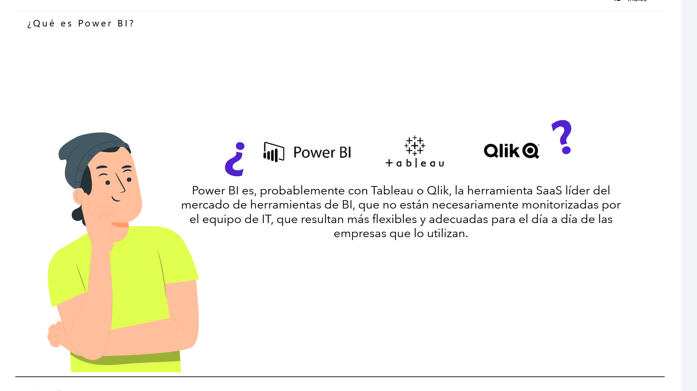
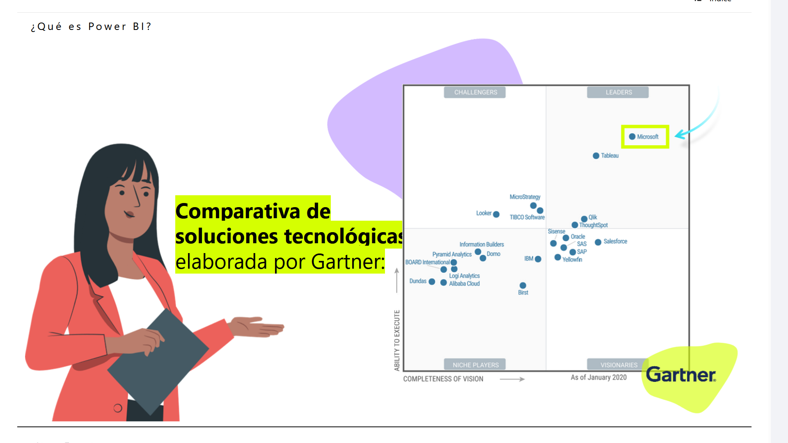
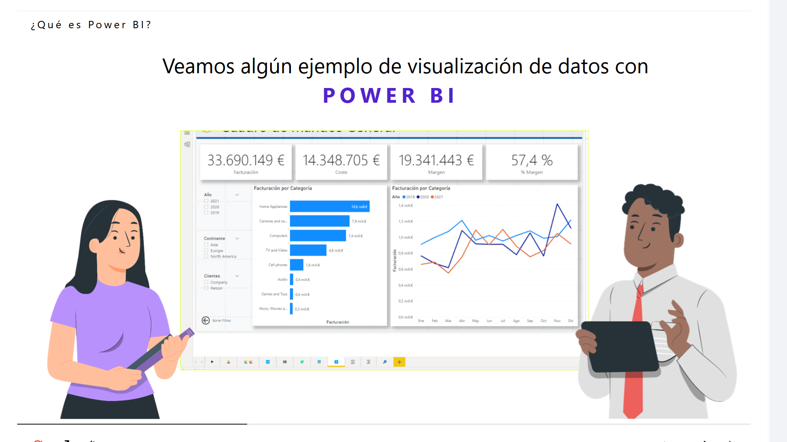
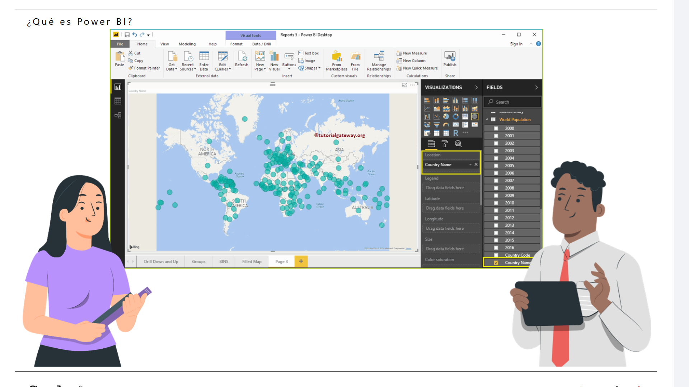

# 01-001:	Introducción a PowerBI

## 1.1 ¿Qué es Power BI?

> [!IMPORTANT]
> Es la apuesta de Microsoft para la gestión de proyectos de visualización de datos.



Power BI es una solución de análisis empresarial, desarrollada por Microsoft, que permite visualizar grandes fuentes de datos y compartir información dentro de las organizaciones, además de permitir insertarla en su aplicación o sitio web.

Power BI, que se puede conectar a cientos de orígenes de datos, los presenta en paneles e informes dinámicos que mejoran su visualización, el análisis de información y la toma de decisiones.


> [!IMPORTANT]
> Junto con Tableau, es la herramienta más empleada de proyectos de BI



Power BI es, probablemente con Tableau o Qlik, la herramienta SaaS líder del mercado de herramientas de BI, que no están necesariamente monitorizadas por el equipo de IT, que resultan más flexibles y adecuadas para el día a día de las empresas que lo utilizan.


### Análisis de Gartner


La consultora **Gartner** publica anualmente su informe sobre los diferentes proveedores de este tipo de software destinados a BI, con un cuadrante comparativo de las distintas soluciones comerciales, en el cual aparece destacada la herramienta de Microsoft.

> [!IMPORTANT]
> En la actualidad probablemente se trata del software preferido para la elaboración de informes visuales de información




---

## Lectura sobre PowerBI, 5mins

- Documento, [aquí](3./01-001-01_Lectura_PowerBI.pdf)
- **TIEMPO ESTIMADO**:	5 min

```text
# Smart Book: Qué es Power BI

## Introducción

En la era de la transformación digital, las organizaciones dependen cada vez más de los datos. Las empresas de todo tipo usan los datos para tomar decisiones sobre ventas, contratación, realizar adquisiciones, establecer objetivos, realizar inversiones, etc., y en todas las áreas en las que disponen de datos.

La cantidad y variedad de datos puede ser intimidante para intentar comprenderlos sin conocimientos sobre su analítica o la estadística, ya que solo son útiles si se dispone de la capacidad para interpretarlos y comunicar su significado. Incluso si se comprenden los datos, es un reto mostrarlos de una manera fácil de comprender para comunicar lo que realmente se pretende.

---

## El Desafío de los Datos Raw

Tradicionalmente, la información se presenta en hojas de cálculo complejas o tablas densas, lo cual dificulta la extracción rápida de valor empresarial:

| Fecha | Apertura | Máximo | Mínimo | Cerrar | Volumen | Ajustes de Cierre* |
| :--- | :--- | :--- | :--- | :--- | :--- | :--- |
| **3 de mar de 2014** | 9.991,60 | 10.172,40 | 9.855,10 | 9.878,70 | 391.420.600 | 9.878,70 |
| **28 de feb de 2014** | 9.951,60 | 10.174,20 | 9.996,10 | 10.114,20 | 439.188.100 | 10.114,20 |
| **27 de feb de 2014** | 10.228,10 | 10.213,30 | 10.063,90 | 10.164,10 | 253.334.400 | 10.164,10 |
| **26 de feb de 2014** | 10.269,00 | 10.243,90 | 10.191,70 | 10.224,30 | 215.455.700 | 10.224,30 |
| **25 de feb de 2014** | 10.176,10 | 10.242,70 | 10.150,90 | 10.242,50 | 239.977.200 | 10.242,50 |
| **24 de feb de 2014** | 10.193,10 | 10.060,20 | 10.035,30 | 10.193,10 | 238.493.000 | 10.193,10 |
| **21 de feb de 2014** | 10.104,10 | 10.108,80 | 10.009,20 | 10.071,00 | 227.194.300 | 10.071,00 |

---

## Solución: Microsoft Power BI

Aquí es donde entra en juego **Power BI**, la herramienta de Microsoft que facilita el análisis y la visualización de los datos mediante la conexión a uno o varios de los cientos de orígenes de datos existentes. Utiliza una interfaz segura y fácil de comprender, permitiendo diseñar el *dashboard* o cuadro de mando deseado para visualizar e interactuar rápidamente con los datos y comprenderlos para mejorar la toma de decisiones en los complejos sistemas empresariales.

**Microsoft Power BI** es una colección de servicios de software, aplicaciones y conectores que operan conjuntamente para convertir datos, incluso sin relación entre sí, en información relevante, interactiva y visual. Power BI facilita la conexión con las fuentes de datos disponibles, su limpieza y modelado, para finalmente visualizar la información más importante para el usuario y aquellos con los que éste quiera compartirla.

---

## Ecosistema de Power BI

El ecosistema de Power BI se compone de tres pilares principales:

```
+-----------------------------------------------------------------------+
|                           ECOSISTEMA POWER BI                         |
+-----------------------------------------------------------------------+
|                                                                       |
|  [ Power BI Desktop ] ---->  [ Power BI Service ] ----> [ Mobile ]    |
|   (Creación & Modelado)       (Publicación & SaaS)       (Consulta)   |
|                                                                       |
+-----------------------------------------------------------------------+
```

1. **Power BI Desktop**
   * Aplicación gratuita para instalar en el equipo local.
   * Permite conectarse a los datos, combinarlos, transformarlos y visualizarlos mediante objetos visuales.
   * Diseñada para preparar y crear informes completos antes de compartirlos.

2. **Power BI Service**
   * Servicio online en la nube (*SaaS*) con funcionalidad similar a Desktop.
   * Permite publicar informes en la organización y configurar la actualización automática de los datos.

3. **Power BI Mobile**
   * Aplicación móvil disponible para **Windows**, **iOS** y **Android**.
   * Permite consultar informes e interactuar con ellos sobre la marcha, actualizándose en tiempo real.

> **Flujo de Trabajo Habitual:** La mayoría de los usuarios que trabajan en proyectos de inteligencia empresarial se decantan por usar **Power BI Desktop** para preparar y crear informes, para luego usar **Power BI Service** y **Power BI Mobile** al momento de compartir y consultar dichos informes.
```
---

### Ejemplos de PowerBI

> [!IMPORTANT]
> PowerBI aporta una colección de software y servicios on-line que operan conjuntamente para convertir distintas fuentes de datos en información relevante 

- Ejemplo "Cuadro de Mando General:


- Ejemplo con Mapas:

