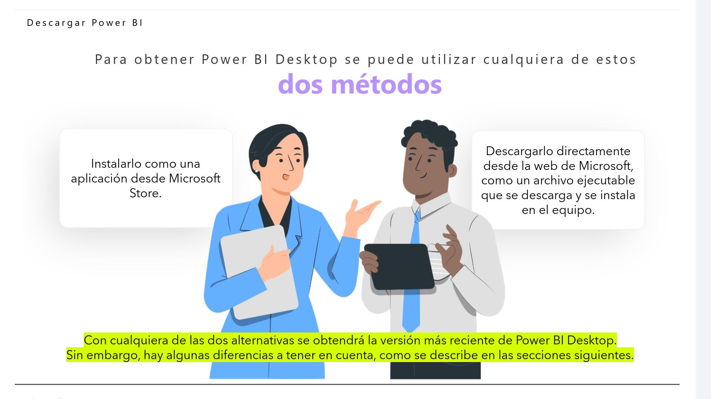
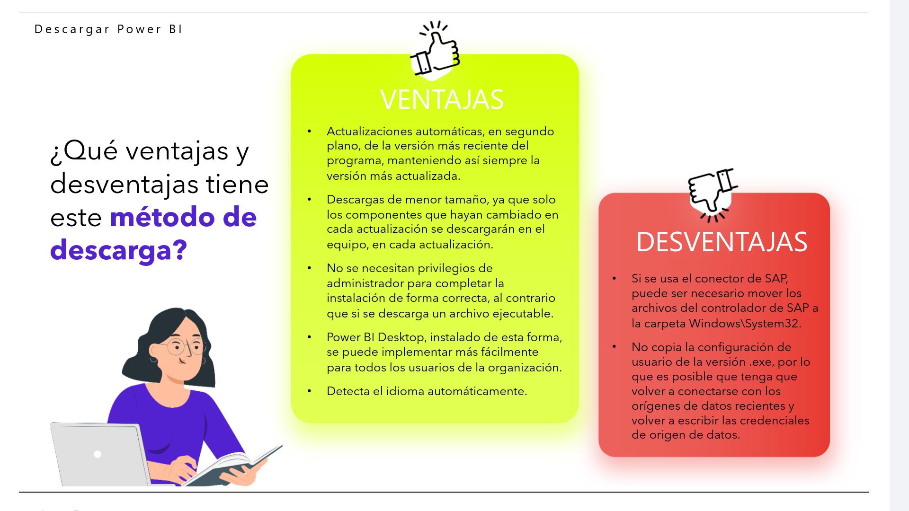
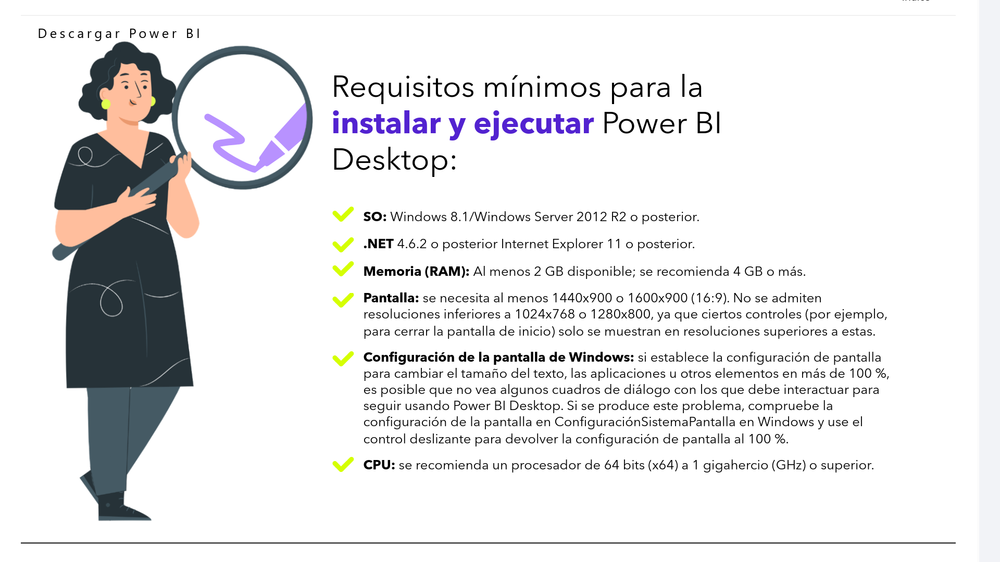
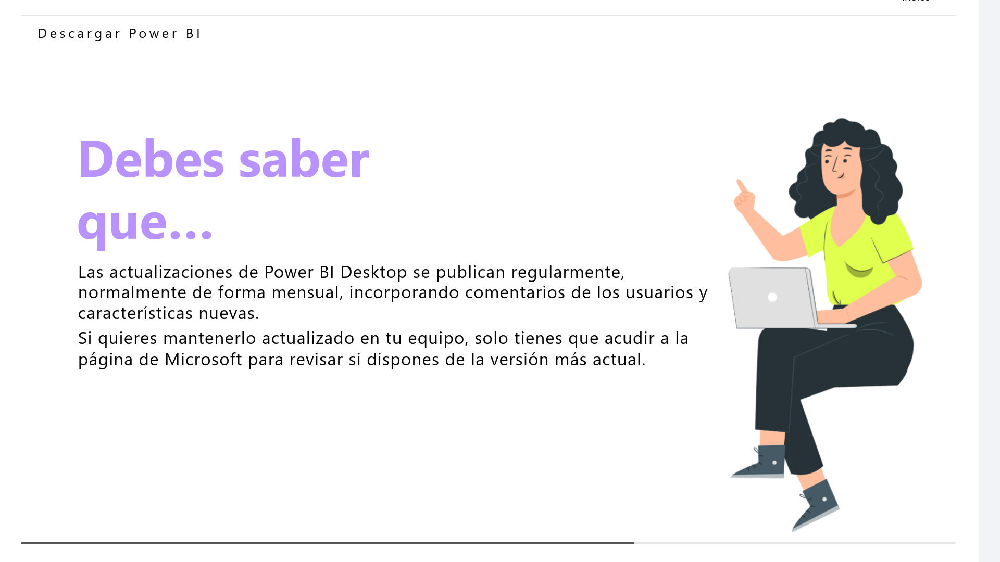
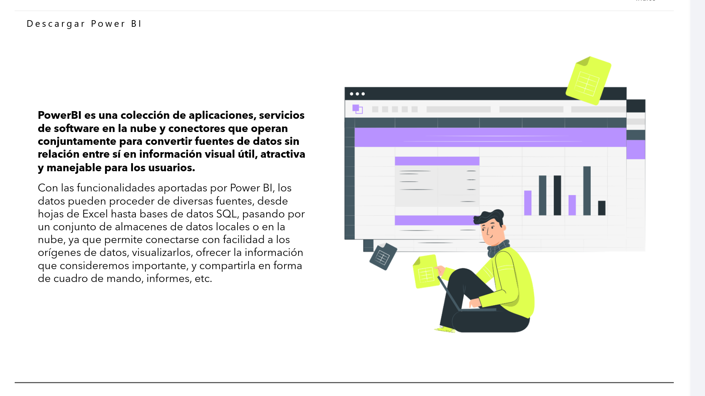
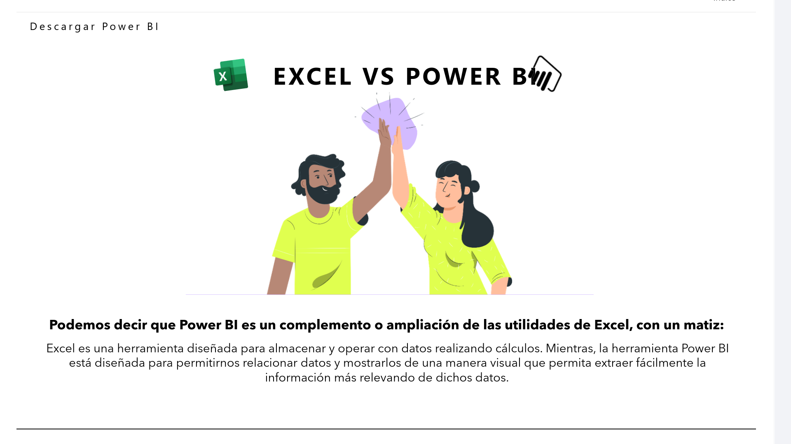
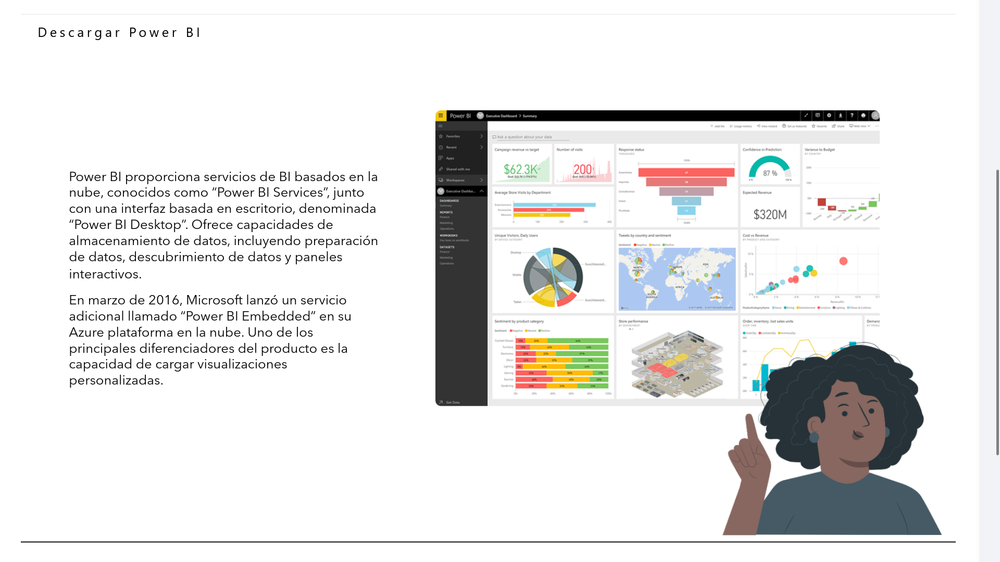

# 01-002:   Descargando PowerBI

## Descargar Power BI

Para obtener Power BI Desktop se puede utilizar cualquiera de estos dos métodos:  

1.  Instalarlo como una aplicación desde Microsoft Store.

2.  Descargarlo directamente desde la web de Microsoft, como un archivo ejecutable que se descarga y se instala en el equipo.

Con cualquiera de las dos alternativas se obtendrá la versión más reciente de Power BI Desktop. Sin embargo, hay algunas diferencias a tener en cuenta, como se describe en las secciones siguientes.

### Vía Store

- [Lectura PDF paso a paso App Store de MS](./01-002-01_Lectura_InstalarPowerBI_Store.pdf)

-   VENTAJAS
    * Actualizaciones automáticas, en segundo plano, de la versión más reciente del programa, manteniendo así siempre la versión más actualizada.
    * Descargas de menor tamaño, ya que solo los componentes que hayan cambiado en cada actualización se descargarán en el equipo, en cada actualización.
    * No se necesitan privilegios de administrador para completar la instalación de forma correcta, al contrario que si se descarga un archivo ejecutable.
    * Power BI Desktop, instalado de esta forma, se puede implementar más fácilmente para todos los usuarios de la organización.
    * Detecta el idioma automáticamente.

-   DESVENTAJAS
    * Si se usa el conector de SAP, puede ser necesario mover los archivos del controlador de SAP a la carpeta Windows\System32.
    * No copia la configuración de usuario de la versión .exe, por lo que es posible que tenga que volver a conectarse con los orígenes de datos recientes y volver a escribir las credenciales de origen de datos.

### Vía Desktop

- [Lectura PDF paso a paso PowerBI Desktop descargando instalador](./01-002-02_Lectura_InstalarPowerBI_Desktop.pdf)

## Requisitos mínimos para la instalar y ejecutar Power BI Desktop:

*   SO: Windows 8.1/Windows Server 2012 R2 o posterior.

*   .NET 4.6.2 o posterior Internet Explorer 11 o posterior.

*   Memoria (RAM): Al menos 2 GB disponible; se recomienda 4 GB o más.

*   Pantalla: se necesita al menos 1440x900 o 1600x900 (16:9). No se admiten resoluciones inferiores a 1024x768 o 1280x800, ya que ciertos controles (por ejemplo, para cerrar la pantalla de inicio) solo se muestran en resoluciones superiores a estas.

*       Configuración de la pantalla de Windows: si establece la configuración de pantalla para cambiar el tamaño del texto, las aplicaciones u otros elementos en más de 100 %, es posible que no vea algunos cuadros de diálogo con los que debe interactuar para seguir usando Power BI Desktop. Si se produce este problema, compruebe la configuración de la pantalla en ConfiguraciónSistemaPantalla en Windows y use el control deslizante para devolver la configuración de pantalla al 100 %.

*   CPU: se recomienda un procesador de 64 bits (x64) a 1 gigahercio (GHz) o superior.

Descargar Power BI

> ![IMPORTANT]
Las actualizaciones de Power BI Desktop se publican regularmente, normalmente de forma mensual, incorporando comentarios de los usuarios y características nuevas.
>
> Si quieres mantenerlo actualizado en tu equipo, solo tienes que acudir a la página de Microsoft para revisar si dispones de la versión más actual.

> [!NOTE]
> Debido a que las actualizaciones de los componentes de Power BI son muy frecuentes, algunas de las imágenes o indicaciones presentadas en este curso pueden no corresponderse con las nuevas funcionalidades presentes en sucesivas actualizaciones de la aplicación.

---

**PowerBI es una colección de aplicaciones, servicios de software en la nube y conectores que operan conjuntamente para convertir fuentes de datos sin relación entre sí en información visual útil, atractiva y manejable para los usuarios.**  

Con las funcionalidades aportadas por Power BI, los datos pueden proceder de diversas fuentes, desde hojas de Excel hasta bases de datos SQL, pasando por un conjunto de almacenes de datos locales o en la nube, ya que permite conectarse con facilidad a los orígenes de datos, visualizarlos, ofrecer la información que consideremos importante, y compartirla en forma de cuadro de mando, informes, etc.  

---

## EXCEL VS POWER BI

> [!IMPORTANT]
> PowerBI se basa en tablas de datos con utilidades compartidas con Excel

Podemos decir que Power BI es un complemento o ampliación de las utilidades de Excel, con un matiz:

-   Excel es una herramienta diseñada para almacenar y operar con datos realizando cálculos.  

-   Power BI está diseñada para permitirnos relacionar datos y mostrarlos de una manera visual que permita extraer fácilmente la información más relevando de dichos datos.

## PowerBI Services

> [!IMPORTANT]
> Permite conectarnos a los datos, crear un informe o panel y poder formularle preguntas a los datos

- Power BI proporciona servicios de BI basados en la nube, conocidos como "Power BI Services", junto con una interfaz basada en escritorio, denominada "Power BI Desktop".  

- Ofrece capacidades de almacenamiento de datos, incluyendo preparación de datos, descubrimiento de datos y paneles interactivos.  

* En marzo de 2016, Microsoft lanzó un servicio adicional llamado "Power BI Embedded" en su Azure plataforma en la nube.  
* Uno de los principales diferenciadores del producto es la capacidad de cargar visualizaciones personalizadas.
