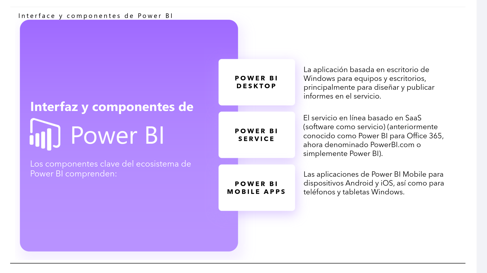
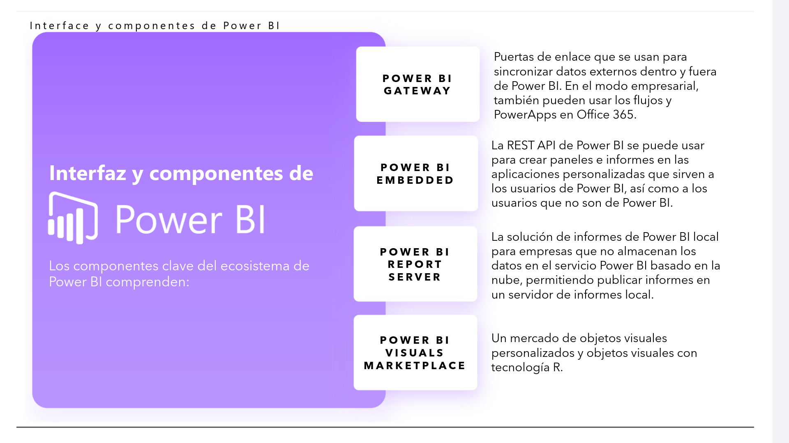

# 01-003:   Interfaz y Componentes de PowerBI

**Los componentes clave del ecosistema de Power BI comprenden:**

* **POWER BI DESKTOP:** La aplicación basada en escritorio de Windows para equipos y escritorios, principalmente para diseñar y publicar informes en el servicio.

* **POWER BI SERVICE:** El servicio en línea basado en SaaS (software como servicio) (anteriormente conocido como Power BI para Office 365, ahora denominado PowerBI.com o simplemente Power BI).

* **POWER BI MOBILE APPS:** Las aplicaciones de Power BI Mobile para dispositivos Android y iOS, así como para teléfonos y tabletas Windows.

* **POWER BI GATEWAY:** Puertas de enlace que se usan para sincronizar datos externos dentro y fuera de Power BI. En el modo empresarial, también pueden usar los flujos y PowerApps en Office 365.

* **POWER BI EMBEDDED:** La REST API de Power BI se puede usar para crear paneles e informes en las aplicaciones personalizadas que sirven a los usuarios de Power BI, así como a los usuarios que no son de Power BI.

* **POWER BI REPORT SERVER:** La solución de informes de Power BI local para empresas que no almacenan los datos en el servicio Power BI basado en la nube, permitiendo publicar informes en un servidor de informes local.

* **POWER BI VISUALS MARKETPLACE:** Un mercado de objetos visuales personalizados y objetos visuales con tecnología R.
