# 01-004:   Casos de uso

## Casos prácticos en Compras y Ventas

> [!IMPORTANT]
> En la era de la tecnología, uno de los retos de las organizaciones, es el de extraer información relevante de los datos generados por su actividad

### La visualización de datos

* La Visualización de datos en el Big Data se ha convertido en una herramienta valiosa y un gran aliado en producción de datos, los cuales se obtienen gracias a múltiples fuentes como las redes sociales, los correos electrónicos, las páginas web, los motores de búsqueda, etc.

* Es un reto para las organizaciones el lograr interpretar dicha información para la toma de decisiones.
  
  El Big Data contribuye en almacenar y procesar los datos pero necesita el apoyo de otras herramientas que permitan visualizarlos, como Power BI, para apreciar los resultados o evaluar su proceso productivo.

* Por todo esto es muy importante tener herramientas que muestren esa masiva cantidad de datos en gráficos.

---

### Data visualisation

> **¿Qué descubrimientos podemos hacer de los conjuntos de datos? ¿Cómo podemos extraer esa información?**

*   El Data Visualisation permite a los analistas de datos extraer insights de su Big Data de forma mucho más rápida. Otro de sus principales usos es ser la herramienta de comunicación ideal entre los analistas y la dirección de una compañía.

*   La comprensión del Big Data genera un nuevo reto en cuanto al Data Visualization debido a la cantidad y diversidad de variables y datos que se manejan. Analizar la información a través de imágenes es más sencillo.

> [!IMPORTANT]
> El objetivo es ayudar a tomar mejores decisiones.

-   Los gerentes y Data Scientists que utilizan Data Visualization para presentar la data, tienen **28% más de probabilidad de encontrar datos relevantes** para el análisis y predicción de tendencias en su negocio, que los que analizan la información en dashboards tradicionales:
    * **Mejorando** el proceso de toma de decisiones
    * **Reduciendo** el tiempo dedicado al análisis
    * **Facilitando** la predicción de tendencias

---

## Principios de Data Visualisation

* **El Data Visualisation** es la forma más óptima de exponer la infinidad de datos que están al alcance de las empresas en la era digital  

* Gracias a esta exposición visual de los cientos de variables y cruces que puede incluir una BBDD, un analista de datos tiene una herramienta que le permite extraer y exponer mucho más rápido y con mayor certeza insights de negocio.

1.  **Simplificar:** presentar la cantidad de variables adecuadas.

2.  **Comparar:** para facilitar la comprensión y evitar errores de memoria, es importante poder visualizar todos los datos en una imagen.

3.  **Mostrar:** dónde y cómo mostrar la información que se quiere destacar para captar la atención.

4.  **Diversificar:** diferentes representaciones de los mismos datos pueden llevar a nuevas conclusiones.

5.  **El por qué:** la meta del Data Visualization no es encontrar qué ocurre, sino dar una forma visual fácilmente interpretable a la miríada de datos de los que dispone una compañía.

---

## Técnicas de representación de datos

* Crear un gráfico a partir de una tabla de Excel como las que se han utilizado tradicionalmente es bastante sencillo. Las variables apenas pasaban las 100 columnas y no todas estaban relacionadas entre sí. Sin embargo, a medida que se agregan e interrelacionan variables esto se vuelve más complicado.

* Para datos estructurados, como ventas, ingresos, etc, los gráficos sencillos son más que suficiente. Sin embargo, para los datos desestructurados, como textos o imágenes, captados con sistemas de Big Data, hace falta otro tipo de técnica para visualizar la información adecuadamente.

---

## Preguntas que debemos hacernos para decidir qué tipos de gráficos necesitamos

> [!IMPORTANT]
> Antes de iniciar un proyecto de visualización de datos, debemos responder a una serie de preguntas clave.
>
> Estas preguntas **deben ir orientadas a comprender las necesidades de la organización**.

Para tener éxito en nuestro proyecto de visualización de datos es necesario que acertemos con los objetos visuales que mejor se ajustan a las necesidades de los usuarios de los informes y paneles.

Enmarcados en Compras y Ventas, **podemos usar algunas preguntas como guía...**

#### 1. ¿Necesitamos comparar valores?

Los gráficos son la herramienta visual perfecta para comparar grandes conjuntos de datos ya que resaltan las pendientes, las subidas y bajadas o los ganadores y perdedores.

* Para comparar datos se pueden utilizar varios tipos de gráficos, como por ejemplo:
  * Gráficos de anillo
  * Gráficos de líneas
  * Gráficos de barras
  * Gráficos de dispersión
  * Etc.

> [!NOTE]
> Si debemos trabajar con grupos de datos muy numerosos, el gráfico debe ser claro y sencillo o no se podrán extraer las conclusiones fácilmente.

#### 2. ¿Necesitamos comprender la distribución de los datos?

Acudiremos a gráficos que ayuden a descubrir, ver y entender valores anómalos, atípicos, agregados, rangos de información, etc.

* Algunos de los más interesantes son:
  * Gráficos de dispersión
  * Gráficos de línea
  * Gráficos de columna
  * Gráficos de cintas
  * Mapas
  * Etc.

> [!NOTE]
> Es importante encontrar los formatos adecuados para extraer fácilmente conclusiones de los datos.

#### 3. ¿Pretendemos mostrar la composición de algo?

Para mostrar la composición de una variable, uno de los recursos más utilizados en cualquier organización.

* Podemos optar por una amplia variedad de tipos de gráficos:
  * Gráficos circulares
  * Gráficos de barras o columnas apiladas
  * Treemaps
  * Etc.

> [!IMPORTANT]
> No debemos olvidar la regla esencial de la composición: 
>
> **El total debe ser igual a la suma de todas sus partes.**

#### 4. ¿Queremos analizar tendencias entre un conjunto de datos?

Para obtener mayor información sobre cómo han variado los datos durante un periodo de tiempo determinado... podemos acudir a los gráficos que mejor muestran las tendencias temporales y sus variaciones, como por ejemplo:

* Gráficos de línea
* Gráficos de línea apilada
* Gráficos de cinta
* Gráficos de columna
* Gráficos de áreas
* Etc.

> [!NOTE]
> Son la mejor opción para ver la evolución general de los datos.

#### 5. ¿Nos interesa profundizar en la relación entre los conjuntos de datos?

En este caso, debemos aproximarnos a los gráficos de relaciones, para mostrar cómo una variable se relaciona con una o muchas variables diferentes, sus correlaciones, etc. De esta forma podemos identificar si afecta positivamente, negativamente o tiene diferentes efectos con respecto a otras variables analizadas.

* Algunos gráficos a usar pueden ser:
  * Gráficos de línea
  * Gráficos de áreas apiladas
  * Gráficos de dispersión
  * Gráficos de burbujas
  * Etc.

> [!TIP]
> Es conveniente decantarse por aquel tipo de gráfico que simplifique el análisis de la información.

---

## La clave de representación de datos

> [!IMPORTANT]
> Una vez tenemos las respuestas a qué necesitamos responder con los datos, la siguiente tarea es descubrir qué visalizaciones son las más adecuadas para ello.

* Dicha clave, se encuentra en seleccionar la representación visual que queremos extraer a nuestros datos en función del tipo de conclusión que queremos hallar. Es decir, **escoger la representación según la hipótesis que queramos demostrar**.

---

## Necesidad real de la inteligencia de negocio

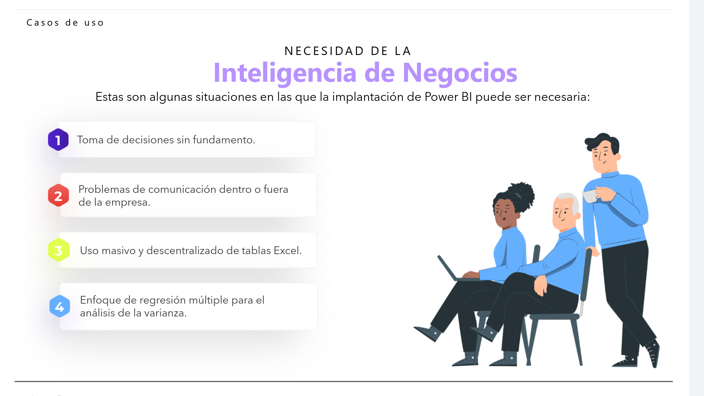
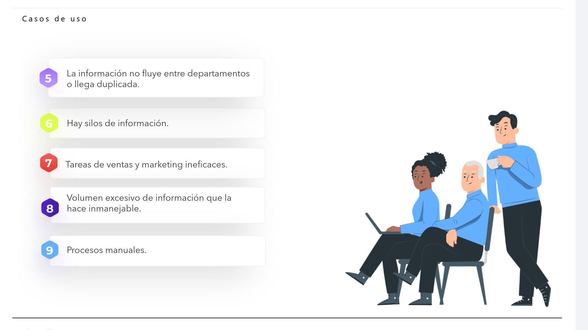

Estas son algunas situaciones en las que la implantación de Power BI puede ser necesaria:

1.  Toma de decisiones sin fundamento.
2.  Problemas de comunicación dentro o fuera de la empresa.
3.  Uso masivo y descentralizado de tablas Excel.
4.  Enfoque de regresión múltiple para el análisis de la varianza.
5.  La información no fluye entre departamentos o llega duplicada.
6.  Hay silos de información.
7.  Tareas de ventas y marketing ineficaces.
8.  Volumen excesivo de información que la hace inmanejable.
9.  Procesos manuales.

---

## CASOS DE USO:  Industria, Producción

> [!IMPORTANT]
> El sector industrial es uno de los sectores donde mayor impacto ha tenido la implantación de business intelligence

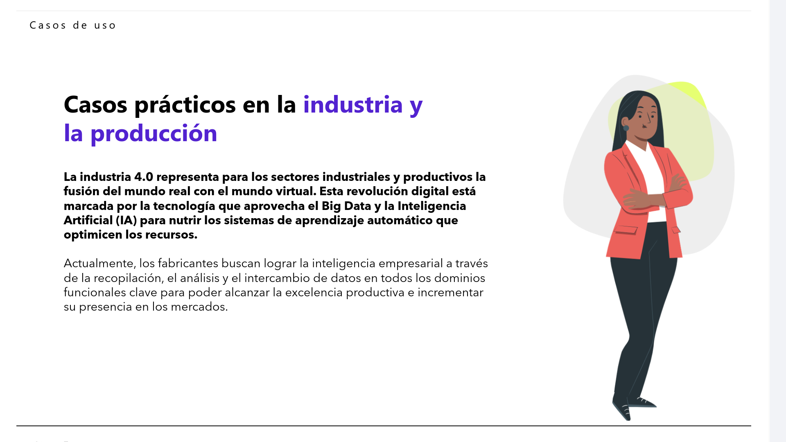

**La industria 4.0 representa para los sectores industriales y productivos la fusión del mundo real con el mundo virtual. Esta revolución digital está marcada por la tecnología que aprovecha el Big Data y la Inteligencia Artificial (IA) para nutrir los sistemas de aprendizaje automático que optimicen los recursos.**  

Actualmente, los fabricantes buscan lograr la inteligencia empresarial a través de la recopilación, el análisis y el intercambio de datos en todos los dominios funcionales clave para poder alcanzar la excelencia productiva e incrementar su presencia en los mercados.  

### Big Data en la industria 4.0

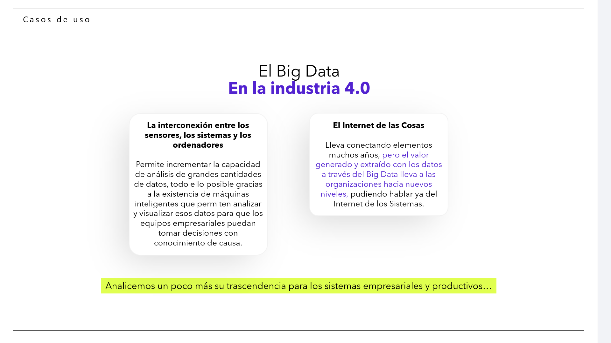

*   **Interconexión entre los sensores, los sistemas y los ordenadores** 
Permite **incrementar la capacidad de análisis de grandes cantidades de datos**, todo ello posible gracias a la existencia de máquinas inteligentes que permiten **analizar y visualizar** esos datos para que los equipos empresariales puedan tomar decisiones con conocimiento de causa.  

*   **Internet de las Cosas** 
Lleva conectando elementos muchos años, pero el valor generado y extraído con los datos a través del Big Data lleva a las organizaciones hacia nuevos niveles, pudiendo hablar ya del Internet de los Sistemas.  

---

### Casos de uso de Big data y visualización de datos en las Fábricas 4.0

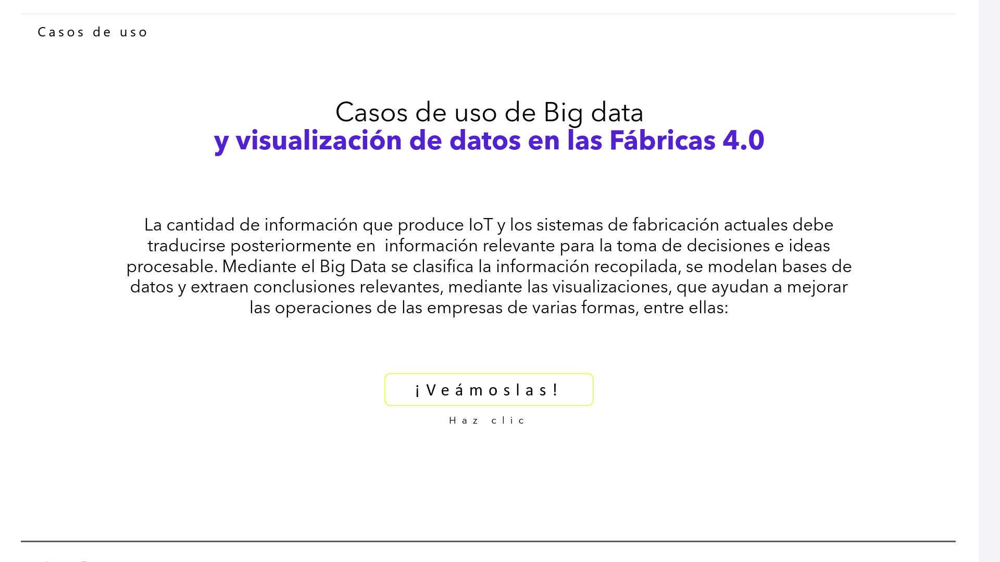

- La cantidad de información que produce IoT y los sistemas de fabricación actuales debe traducirse posteriormente en información relevante para la toma de decisiones e ideas procesable.  

> ![IMPORTANT]
> Mediante el Big Data se clasifica la información recopilada, se modelan bases de datos y extraen conclusiones relevantes, mediante las visualizaciones, que ayudan a mejorar las operaciones de las empresas de varias formas, entre ellas:

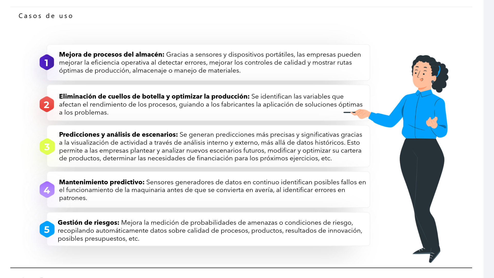
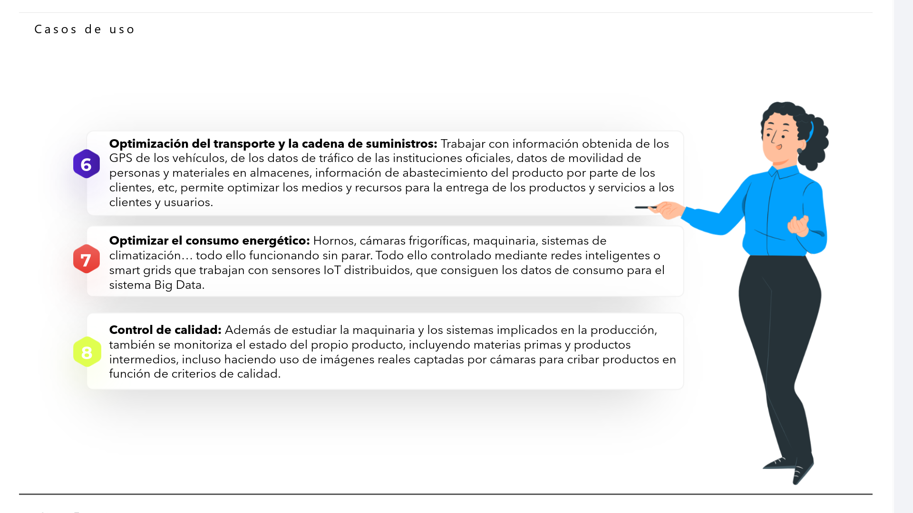

1.  **Mejora de procesos del almacén:**  
Gracias a sensores y dispositivos portátiles, las empresas pueden mejorar la eficiencia operativa al detectar errores, mejorar los controles de calidad y mostrar rutas óptimas de producción, almacenaje o manejo de materiales.

2.  **Eliminación de cuellos de botella y optimizar la producción:**  
Se identifican las variables que afectan el rendimiento de los procesos, guiando a los fabricantes la aplicación de soluciones óptimas a los problemas.

3.  **Predicciones y análisis de escenarios:**  
Se generan predicciones más precisas y significativas gracias a la visualización de actividad a través de análisis interno y externo, más allá de datos históricos. Esto permite a las empresas plantear y analizar nuevos escenarios futuros, modificar y optimizar su cartera de productos, determinar las necesidades de financiación para los próximos ejercicios, etc.

4.  **Mantenimiento predictivo:**  
Sensores generadores de datos en continuo identifican posibles fallos en el funcionamiento de la maquinaria antes de que se convierta en avería, al identificar errores en patrones.

5.  **Gestión de riesgos:**  
Mejora la medición de probabilidades de amenazas o condiciones de riesgo, recopilando automáticamente datos sobre calidad de procesos, productos, resultados de innovación, posibles presupuestos, etc.

6.  **Optimización del transporte y la cadena de suministros**  
Trabajar con información obtenida de los GPS de los vehículos, de los datos de tráfico de las instituciones oficiales, datos de movilidad de personas y materiales en almacenes, información de abastecimiento del producto por parte de los clientes, etc, permite optimizar los medios y recursos para la entrega de los productos y servicios a los clientes y usuarios.

7.  **Optimizar el consumo energético:**  
Hornos, cámaras frigoríficas, maquinaria, sistemas de climatización... todo ello funcionando sin parar. Todo ello controlado mediante redes inteligentes o smart grids que trabajan con sensores IoT distribuidos, que consiguen los datos de consumo para el sistema Big Data.

8.  **Control de calidad:**  
Además de estudiar la maquinaria y los sistemas implicados en la producción, también se monitoriza el estado del propio producto, incluyendo materias primas y productos intermedios, incluso haciendo uso de imágenes reales captadas por cámaras para cribar productos en función de criterios de calidad.

---

## CASOS DE USO:  Contabilidad, Gestión Empresarial

> [!IMPORTANT]
> Las herramientas de visualización de datos nos ayudan a interpretar y construir significado a partir de los datos de tal manera que nos permite responder preguntas y decisiones de negocio.

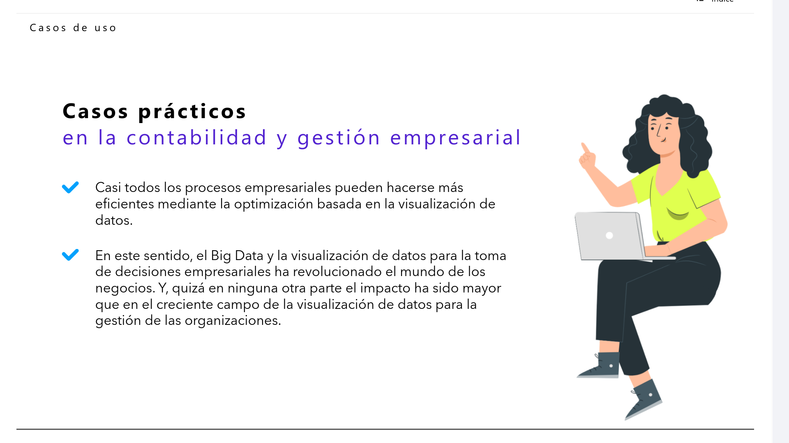

* Casi todos los procesos empresariales pueden hacerse más eficientes mediante la optimización basada en la visualización de datos.  

* En este sentido, el Big Data y la visualización de datos para la toma de decisiones empresariales ha revolucionado el mundo de los negocios. Y, quizá, en ninguna otra parte el impacto ha sido mayor que en el creciente campo de la visualización de datos para la gestión de las organizaciones.  

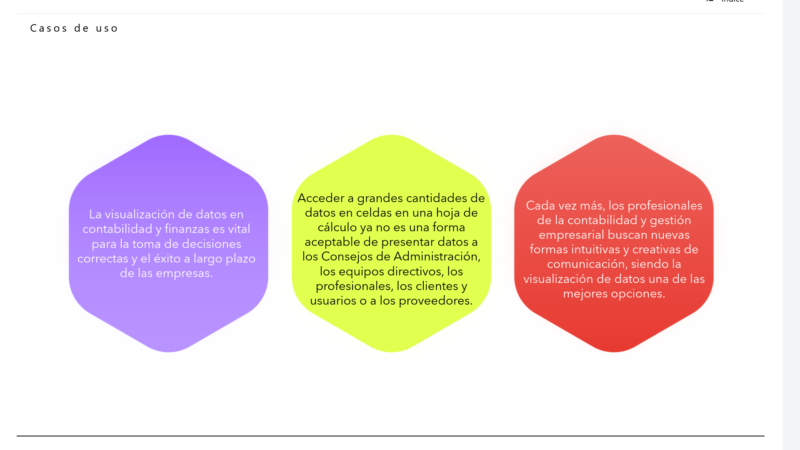

-  **La visualización de datos en contabilidad y finanzas** es vital para la toma de decisiones correctas y el éxito a largo plazo de las empresas.

- **Acceder a grandes cantidades de datos** en celdas en una hoja de cálculo ya no es una forma aceptable de presentar datos a los Consejos de Administración, los equipos directivos, los profesionales, los clientes y usuarios o a los proveedores.

- **Cada vez más, los profesionales de la contabilidad y gestión empresarial** buscan nuevas formas intuitivas y creativas de comunicación, siendo la visualización de datos una de las mejores opciones.

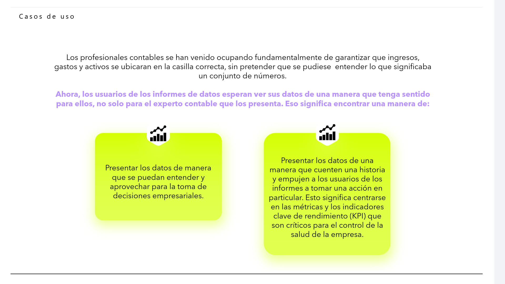

*   Los profesionales contables se han venido ocupando fundamentalmente de garantizar que ingresos, gastos y activos se ubicaran en la casilla correcta, sin pretender que se pudiese entender lo que significaba un conjunto de números.

* **Ahora, los usuarios de los informes de datos esperan ver sus datos de una manera que tenga sentido para ellos, no solo para el experto contable que los presenta. Eso significa encontrar una manera de:**

- Presentar los datos de manera que se puedan entender y aprovechar para la toma de decisiones empresariales.

- Presentar los datos de una manera que cuenten una historia y empujen a los usuarios de los informes a tomar una acción en particular. Esto significa centrarse en las métricas y los indicadores clave de rendimiento (KPI) que son críticos para el control de la salud de la empresa.

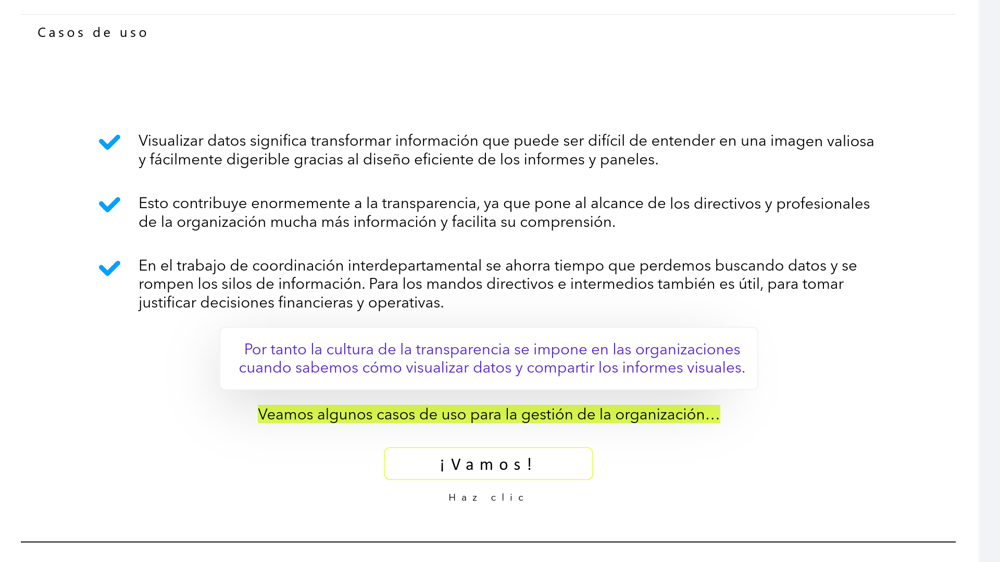

> [!NOTE]
> La generación de grandes volúmenes de datos de distintas fuentes exige formas innovadoras y prácticas para procesar y analizar la información

*   Visualizar datos significa transformar información que puede ser difícil de entender en una imagen valiosa y fácilmente digerible gracias al diseño eficiente de los informes y paneles.

*   Esto contribuye enormemente a la transparencia, ya que pone al alcance de los directivos y profesionales de la organización mucha más información y facilita su comprensión.

*   En el trabajo de coordinación interdepartamental se ahorra tiempo que perdemos buscando datos y se rompen los silos de información. Para los mandos directivos e intermedios también es útil, para tomar justificar decisiones financieras y operativas.

> [!IMPORTANT]
> Por tanto la cultura de la transparencia se impone en las organizaciones cuando sabemos cómo visualizar datos y compartir los informes visuales.

---

### Envíos automáticos de la información y alertas

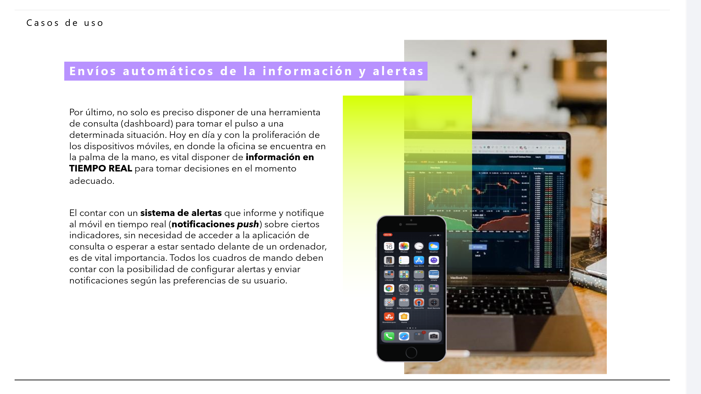

- Por último, no solo es preciso disponer de una herramienta de consulta (dashboard) para tomar el pulso a una determinada situación.

- Hoy en día y con la proliferación de los dispositivos móviles, en donde la oficina se encuentra en la palma de la mano, es vital disponer de **información en TIEMPO REAL** para tomar decisiones en el momento adecuado.

- El contar con un **sistema de alertas** que informe y notifique al móvil en tiempo real (**notificaciones push**) sobre ciertos indicadores, sin necesidad de acceder a la aplicación de consulta o esperar a estar sentado delante de un ordenador, es de vital importancia.

- Todos los cuadros de mando deben contar con la posibilidad de configurar alertas y enviar notificaciones según las preferencias de su usuario.

---

## Cuadros de Mando / Dashboard -> ¿Para qué?

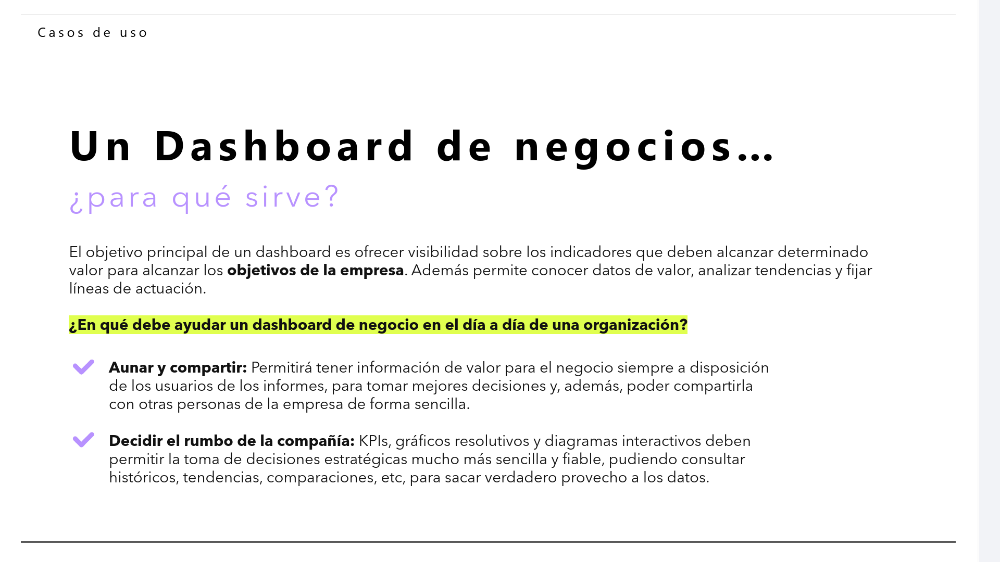

> [!IMPORTANT]
> Para poder desarrollar su utilidad, es debido poder responder a la pregunta de qué es lo que el usuario espera del cuadro de mando

El objetivo principal de un dashboard es ofrecer visibilidad sobre los indicadores que deben alcanzar determinado valor para alcanzar los **objetivos de la empresa**. Además permite conocer datos de valor, analizar tendencias y fijar líneas de actuación.

> **¿En qué debe ayudar un dashboard de negocio en el día a día de una organización?**

*   **Aunar y compartir:** Permitirá tener información de valor para el negocio siempre a disposición de los usuarios de los informes, para tomar mejores decisiones y, además, poder compartirla con otras personas de la empresa de forma sencilla.

*   **Decidir el rumbo de la compañía:** KPIs, gráficos resolutivos y diagramas interactivos deben permitir la toma de decisiones estratégicas mucho más sencilla y fiable, pudiendo consultar históricos, tendencias, comparaciones, etc, para sacar verdadero provecho a los datos.

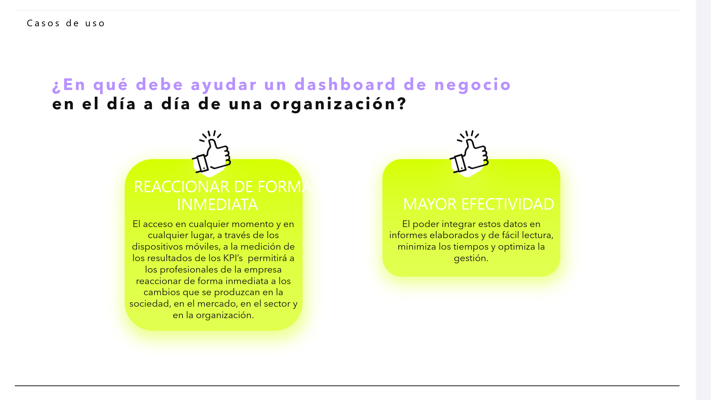

*   **REACCIONAR DE FORMA INMEDIATA:**  El acceso en cualquier momento y en cualquier lugar, a través de los dispositivos móviles, a la medición de los resultados de los KPI's permitirá a los profesionales de la empresa reaccionar de forma inmediata a los cambios que se produzcan en la sociedad, en el mercado, en el sector y en la organización.

*   **MAYOR EFECTIVIDAD:**  El poder integrar estos datos en informes elaborados y de fácil lectura, minimiza los tiempos y optimiza la gestión.

> [!IMPORTANT]
> El cuadro de mando efectivo es aquél que recoge la representación más adecuada para transmitir el mensaje.

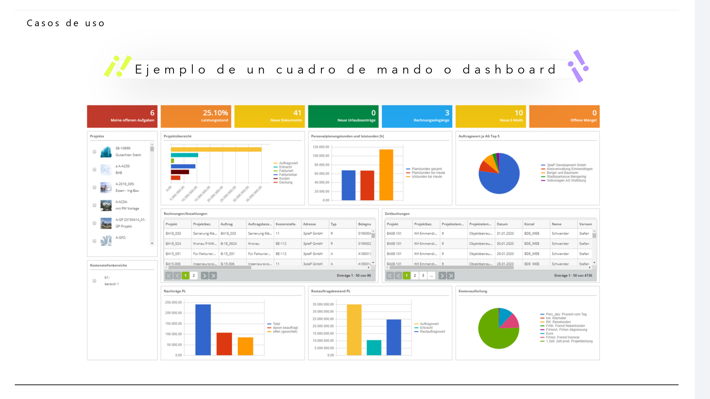

---

## CASOS DE USO:  Sector Servicios, Administración Públicas

> [!NOTE]
> A medida que las organizaciones tienen que lidiar con conjuntos masivos de datos procedentes de una gran variedad de fuentes, a los usuarios se les hace imposible encontrar sentido a la desconcertante variedad de información.

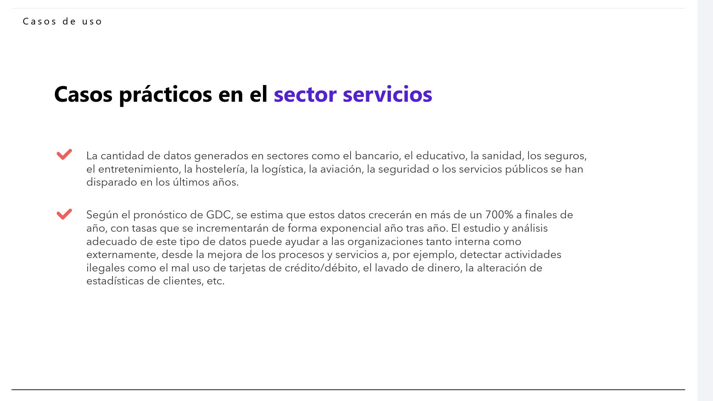

*   La cantidad de datos generados en sectores como el bancario, el educativo, la sanidad, los seguros, el entretenimiento, la hostelería, la logística, la aviación, la seguridad o los servicios públicos se han disparado en los últimos años.  

* Según el pronóstico de GDC₁, se estima que estos datos crecerán en más de un 700% a finales de año, con tasas que se incrementarán de forma exponencial año tras año. El estudio y análisis adecuado de este tipo de datos puede ayudar a las organizaciones tanto interna como externamente, desde la mejora de los procesos y servicios a, por ejemplo, detectar actividades ilegales como el mal uso de tarjetas de crédito/débito, el lavado de dinero, la alteración de estadísticas de clientes, etc.

*₁ = GDC (GD Culture Group Ltd), holding que provee servicios de marketing digital, comercio electrónico y soluciones de IA. Reporta periódicamente ante la SEC (Formularios 10-K/10-Q); [sus informes financieros](https://www.gdculturegroup.com/financials.html) actualizados consolidan una fase de desarrollo con alta volatilidad operativa, reestructuraciones de capital e ingresos netos limitados.*

### Ejemplos en distintos ámbitos del sector servicios

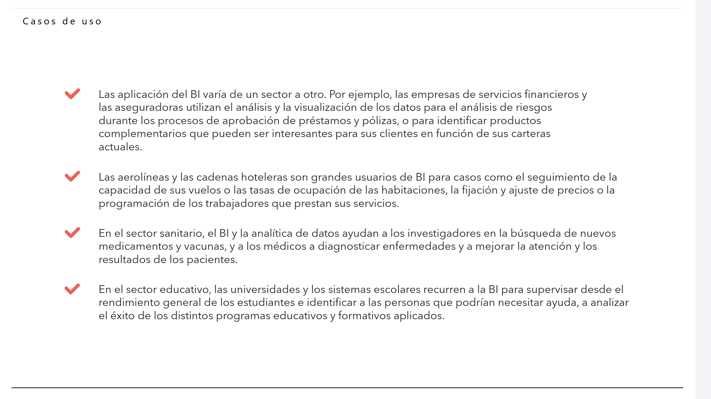
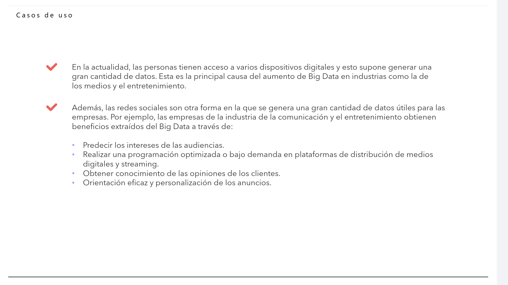

*   Las aplicación del BI varía de un sector a otro. Por ejemplo, las empresas de servicios financieros y las aseguradoras utilizan el análisis y la visualización de los datos para el análisis de riesgos durante los procesos de aprobación de préstamos y pólizas, o para identificar productos complementarios que pueden ser interesantes para sus clientes en función de sus carteras actuales.

*   Las aerolíneas y las cadenas hoteleras son grandes usuarios de BI para casos como el seguimiento de la capacidad de sus vuelos o las tasas de ocupación de las habitaciones, la fijación y ajuste de precios o la programación de los trabajadores que prestan sus servicios.

*   En el sector sanitario, el BI y la analítica de datos ayudan a los investigadores en la búsqueda de nuevos medicamentos y vacunas, y a los médicos a diagnosticar enfermedades y a mejorar la atención y los resultados de los pacientes.

*   En el sector educativo, las universidades y los sistemas escolares recurren a la BI para supervisar desde el rendimiento general de los estudiantes e identificar a las personas que podrían necesitar ayuda, a analizar el éxito de los distintos programas educativos y formativos aplicados.

* En la actualidad, las personas tienen acceso a varios dispositivos digitales y esto supone generar una gran cantidad de datos. Esta es la principal causa del aumento de Big Data en industrias como la de los medios y el entretenimiento.

* Además, las redes sociales son otra forma en la que se genera una gran cantidad de datos útiles para las empresas. Por ejemplo, las empresas de la industria de la comunicación y el entretenimiento obtienen beneficios extraídos del Big Data a través de:
  - Predecir los intereses de las audiencias.
  - Realizar una programación optimizada o bajo demanda en plataformas de distribución de medios digitales y streaming.
  - Obtener conocimiento de las opiniones de los clientes.
  - Orientación eficaz y personalización de los anuncios.

### Ejemplos en la Administración Pública

> [!IMPORTANT]
> Incluso en el sector público, la visualización de datos ha generado una importante fuente de valor.

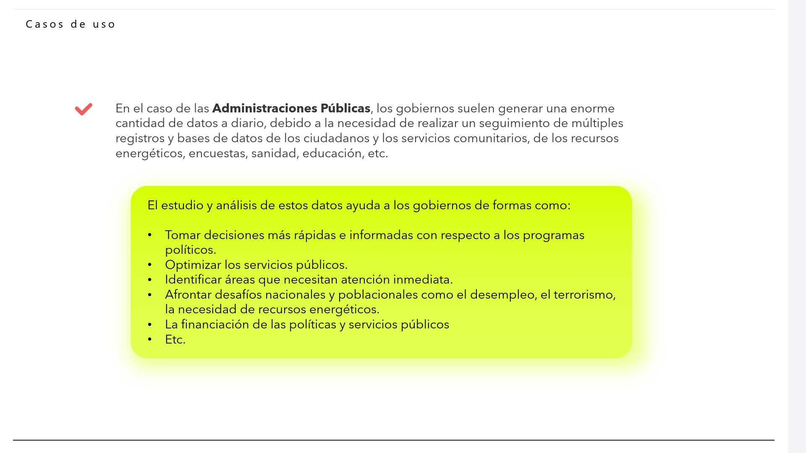

* En el caso de las **Administraciones Públicas**, los gobiernos suelen generar una enorme cantidad de datos a diario, debido a la necesidad de realizar un seguimiento de múltiples registros y bases de datos de los ciudadanos y los servicios comunitarios, de los recursos energéticos, encuestas, sanidad, educación, etc.

* **El estudio y análisis de estos datos ayuda a los gobiernos de formas como:**

  - Tomar decisiones más rápidas e informadas con respecto a los programas políticos.
  - Optimizar los servicios públicos.
  - Identificar áreas que necesitan atención inmediata.
  - Afrontar desafíos nacionales y poblacionales como el desempleo, el terrorismo, la necesidad de recursos energéticos.
  - La financiación de las políticas y servicios públicos
  - ....
