# 01-004:   Casos de uso

## Casos prácticos en Compras y Ventas

> [!IMPORTANT]
> En la era de la tecnología, uno de los retos de las organizaciones, es el de extraer información relevante de los datos generados por su actividad

### La visualización de datos

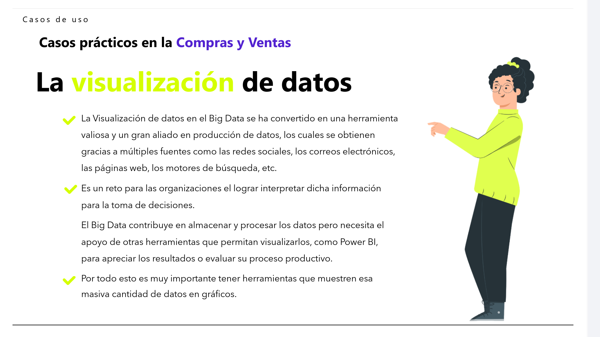

* La Visualización de datos en el Big Data se ha convertido en una herramienta valiosa y un gran aliado en producción de datos, los cuales se obtienen gracias a múltiples fuentes como las redes sociales, los correos electrónicos, las páginas web, los motores de búsqueda, etc.

* Es un reto para las organizaciones el lograr interpretar dicha información para la toma de decisiones.
  
  El Big Data contribuye en almacenar y procesar los datos pero necesita el apoyo de otras herramientas que permitan visualizarlos, como Power BI, para apreciar los resultados o evaluar su proceso productivo.

* Por todo esto es muy importante tener herramientas que muestren esa masiva cantidad de datos en gráficos.

---

### Data visualisation

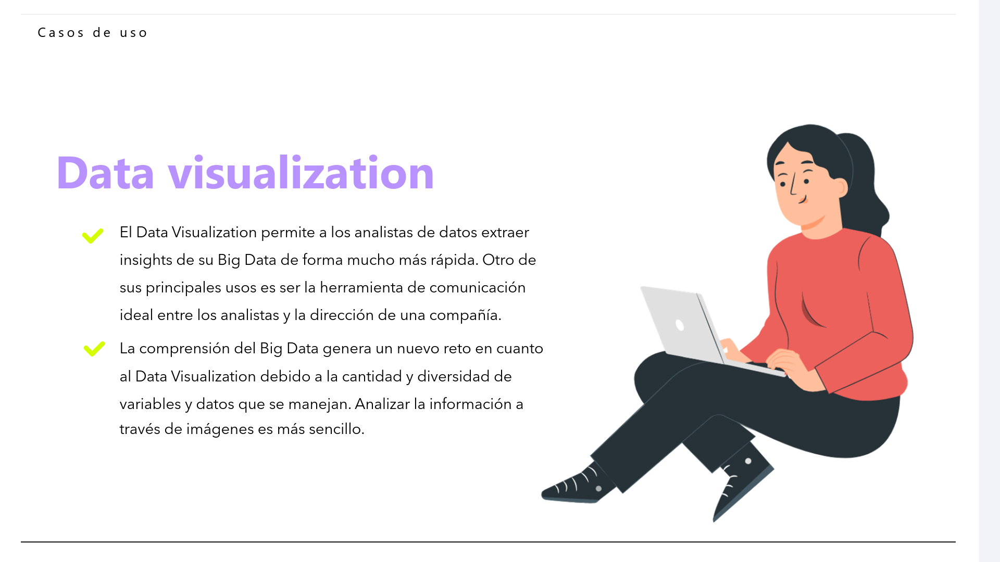

> **¿Qué descubrimientos podemos hacer de los conjuntos de datos? ¿Cómo podemos extraer esa información?**

*   El Data Visualisation permite a los analistas de datos extraer insights de su Big Data de forma mucho más rápida. Otro de sus principales usos es ser la herramienta de comunicación ideal entre los analistas y la dirección de una compañía.

*   La comprensión del Big Data genera un nuevo reto en cuanto al Data Visualization debido a la cantidad y diversidad de variables y datos que se manejan. Analizar la información a través de imágenes es más sencillo.

> [!IMPORTANT]
> El objetivo es ayudar a tomar mejores decisiones.

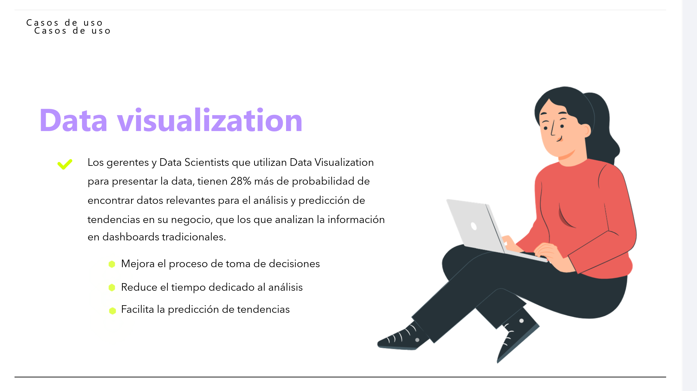

-   Los gerentes y Data Scientists que utilizan Data Visualization para presentar la data, tienen **28% más de probabilidad de encontrar datos relevantes** para el análisis y predicción de tendencias en su negocio, que los que analizan la información en dashboards tradicionales:
    * **Mejorando** el proceso de toma de decisiones
    * **Reduciendo** el tiempo dedicado al análisis
    * **Facilitando** la predicción de tendencias

---

## Principios de Data Visualisation

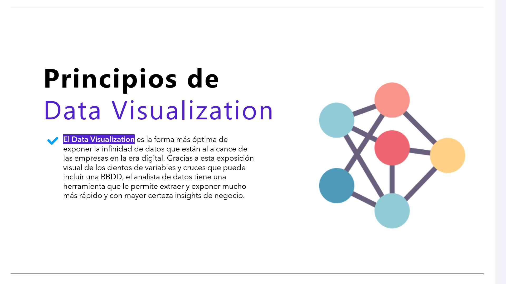

* **El Data Visualisation** es la forma más óptima de exponer la infinidad de datos que están al alcance de las empresas en la era digital  

* Gracias a esta exposición visual de los cientos de variables y cruces que puede incluir una BBDD, un analista de datos tiene una herramienta que le permite extraer y exponer mucho más rápido y con mayor certeza insights de negocio.

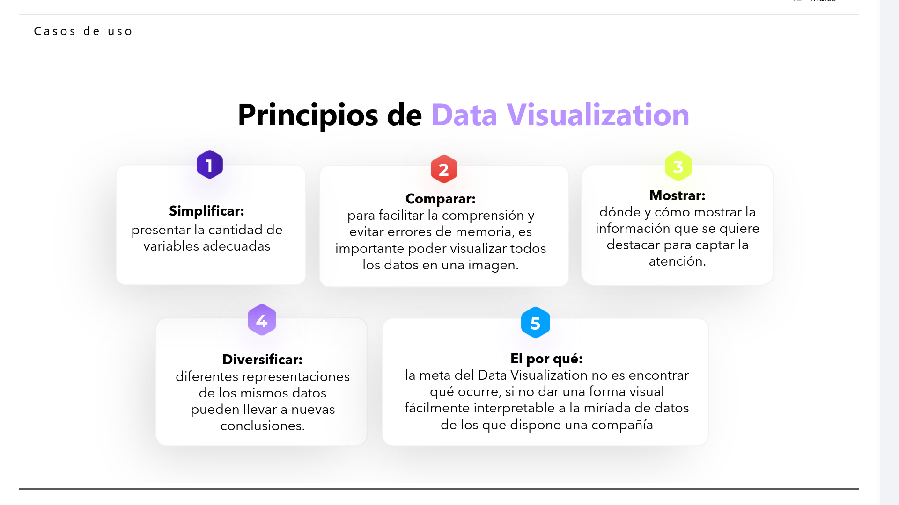

1.  **Simplificar:** presentar la cantidad de variables adecuadas.

2.  **Comparar:** para facilitar la comprensión y evitar errores de memoria, es importante poder visualizar todos los datos en una imagen.

3.  **Mostrar:** dónde y cómo mostrar la información que se quiere destacar para captar la atención.

4.  **Diversificar:** diferentes representaciones de los mismos datos pueden llevar a nuevas conclusiones.

5.  **El por qué:** la meta del Data Visualization no es encontrar qué ocurre, sino dar una forma visual fácilmente interpretable a la miríada de datos de los que dispone una compañía.

---

## Técnicas de representación de datos

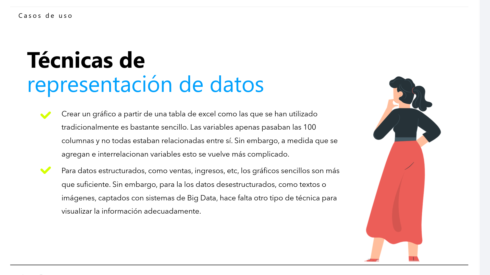

* Crear un gráfico a partir de una tabla de Excel como las que se han utilizado tradicionalmente es bastante sencillo. Las variables apenas pasaban las 100 columnas y no todas estaban relacionadas entre sí. Sin embargo, a medida que se agregan e interrelacionan variables esto se vuelve más complicado.

* Para datos estructurados, como ventas, ingresos, etc, los gráficos sencillos son más que suficiente. Sin embargo, para los datos desestructurados, como textos o imágenes, captados con sistemas de Big Data, hace falta otro tipo de técnica para visualizar la información adecuadamente.

---

## Preguntas que debemos hacernos para decidir qué tipos de gráficos necesitamos

> [!IMPORTANT]
> Antes de iniciar un proyecto de visualización de datos, debemos responder a una serie de preguntas clave.
>
> Estas preguntas **deben ir orientadas a comprender las necesidades de la organización**.

Para tener éxito en nuestro proyecto de visualización de datos es necesario que acertemos con los objetos visuales que mejor se ajustan a las necesidades de los usuarios de los informes y paneles.

Enmarcados en Compras y Ventas, **podemos usar algunas preguntas como guía...**

#### 1. ¿Necesitamos comparar valores?
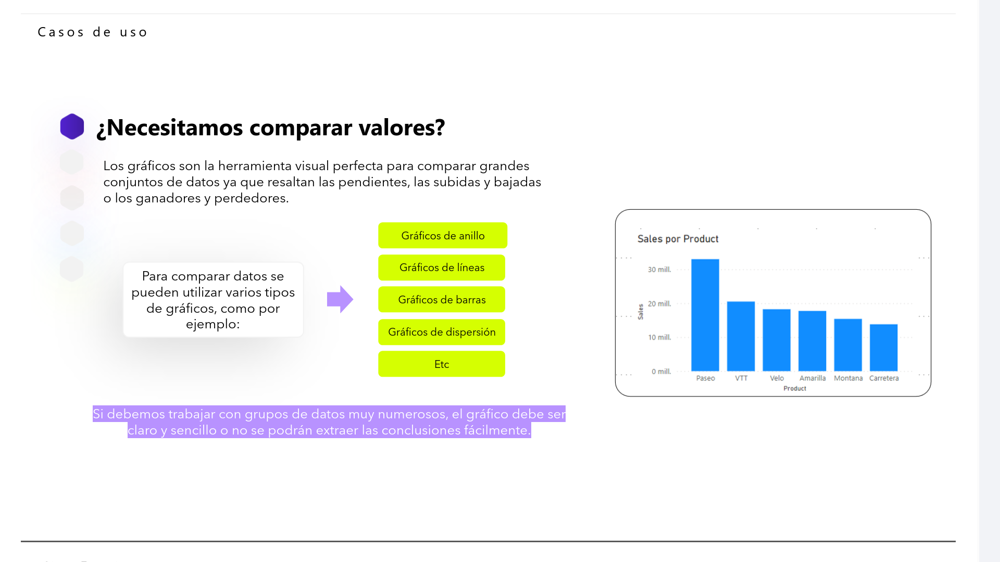

Los gráficos son la herramienta visual perfecta para comparar grandes conjuntos de datos ya que resaltan las pendientes, las subidas y bajadas o los ganadores y perdedores.

* Para comparar datos se pueden utilizar varios tipos de gráficos, como por ejemplo:
  * Gráficos de anillo
  * Gráficos de líneas
  * Gráficos de barras
  * Gráficos de dispersión
  * Etc.

> [!NOTE]
> Si debemos trabajar con grupos de datos muy numerosos, el gráfico debe ser claro y sencillo o no se podrán extraer las conclusiones fácilmente.

#### 2. ¿Necesitamos comprender la distribución de los datos?

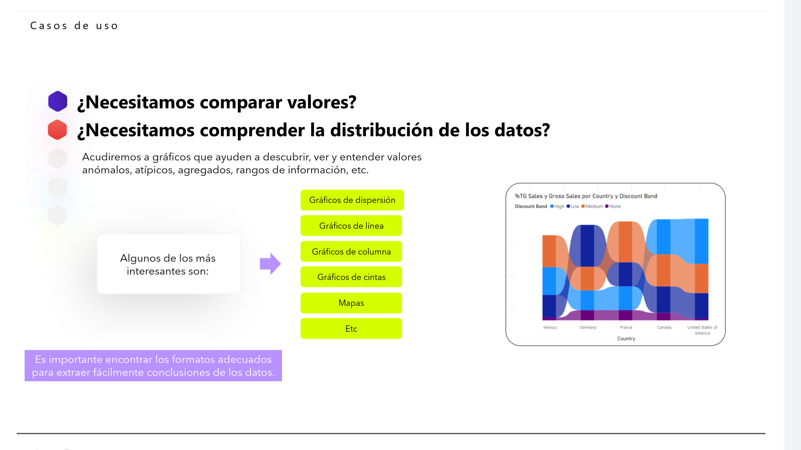

Acudiremos a gráficos que ayuden a descubrir, ver y entender valores anómalos, atípicos, agregados, rangos de información, etc.

* Algunos de los más interesantes son:
  * Gráficos de dispersión
  * Gráficos de línea
  * Gráficos de columna
  * Gráficos de cintas
  * Mapas
  * Etc.

> [!NOTE]
> Es importante encontrar los formatos adecuados para extraer fácilmente conclusiones de los datos.

#### 3. ¿Pretendemos mostrar la composición de algo?

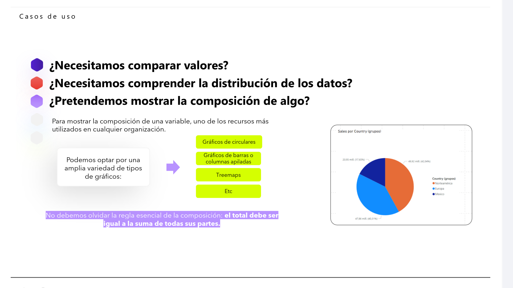

Para mostrar la composición de una variable, uno de los recursos más utilizados en cualquier organización.

* Podemos optar por una amplia variedad de tipos de gráficos:
  * Gráficos circulares
  * Gráficos de barras o columnas apiladas
  * Treemaps
  * Etc.

> [!IMPORTANT]
> No debemos olvidar la regla esencial de la composición: 
>
> **El total debe ser igual a la suma de todas sus partes.**

#### 4. ¿Queremos analizar tendencias entre un conjunto de datos?

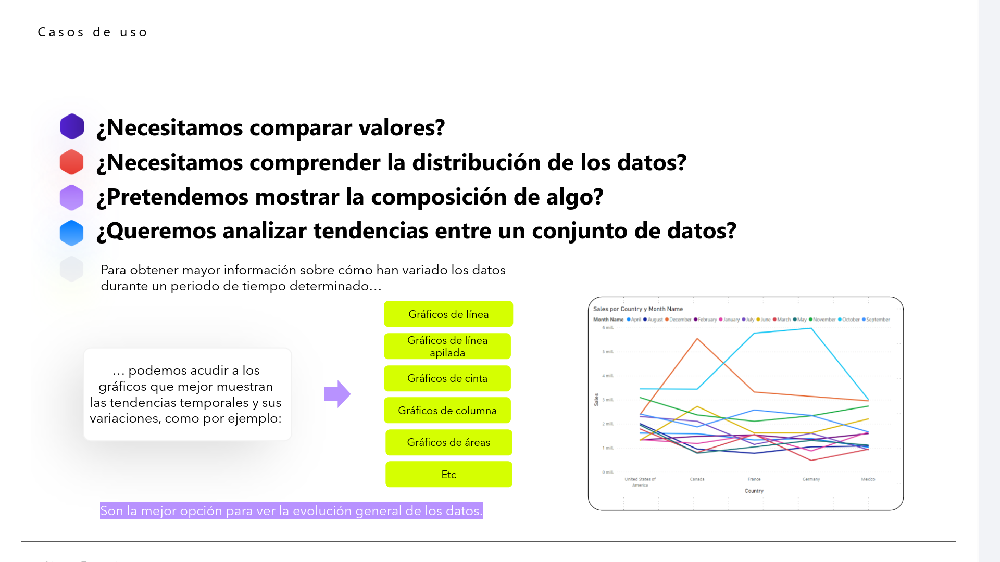

Para obtener mayor información sobre cómo han variado los datos durante un periodo de tiempo determinado... podemos acudir a los gráficos que mejor muestran las tendencias temporales y sus variaciones, como por ejemplo:

* Gráficos de línea
* Gráficos de línea apilada
* Gráficos de cinta
* Gráficos de columna
* Gráficos de áreas
* Etc.

> [!NOTE]
> Son la mejor opción para ver la evolución general de los datos.

#### 5. ¿Nos interesa profundizar en la relación entre los conjuntos de datos?

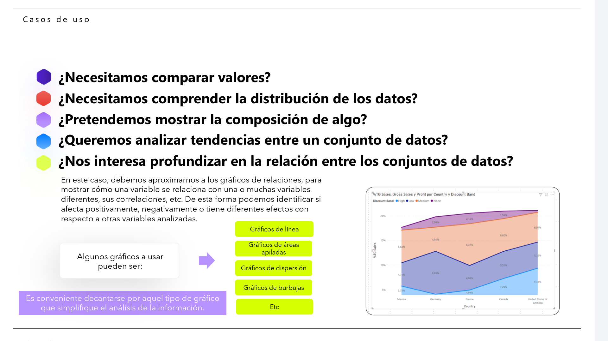

En este caso, debemos aproximarnos a los gráficos de relaciones, para mostrar cómo una variable se relaciona con una o muchas variables diferentes, sus correlaciones, etc. De esta forma podemos identificar si afecta positivamente, negativamente o tiene diferentes efectos con respecto a otras variables analizadas.

* Algunos gráficos a usar pueden ser:
  * Gráficos de línea
  * Gráficos de áreas apiladas
  * Gráficos de dispersión
  * Gráficos de burbujas
  * Etc.

> [!TIP]
> Es conveniente decantarse por aquel tipo de gráfico que simplifique el análisis de la información.

---

## La clave de representación de datos

> [!IMPORTANT]
> Una vez tenemos las respuestas a qué necesitamos responder con los datos, la siguiente tarea es descubrir qué visalizaciones son las más adecuadas para ello.

* Dicha clave, se encuentra en seleccionar la representación visual que queremos extraer a nuestros datos en función del tipo de conclusión que queremos hallar. Es decir, **escoger la representación según la hipótesis que queramos demostrar**.
