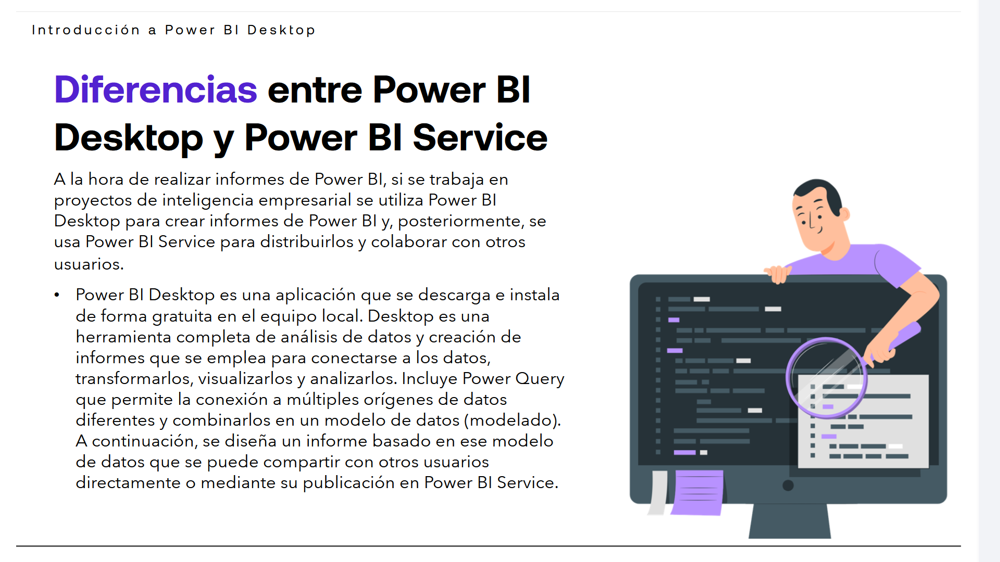
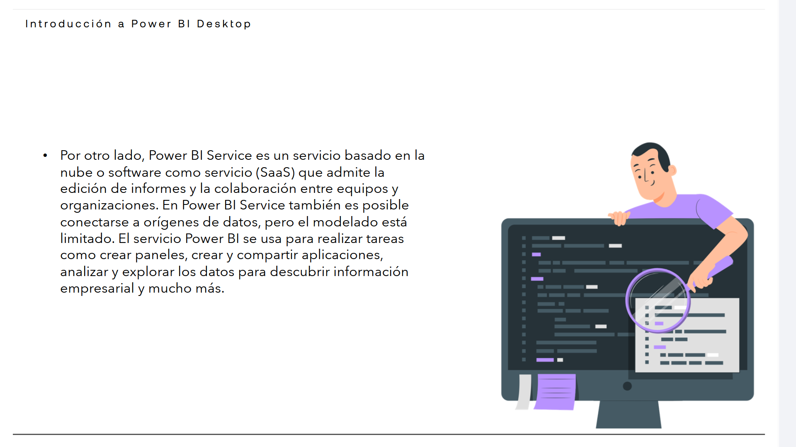
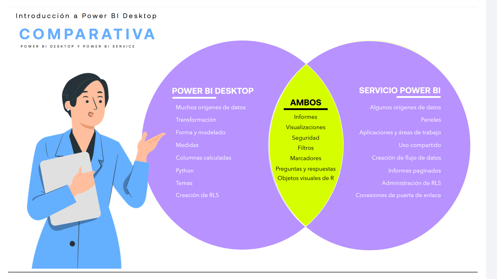
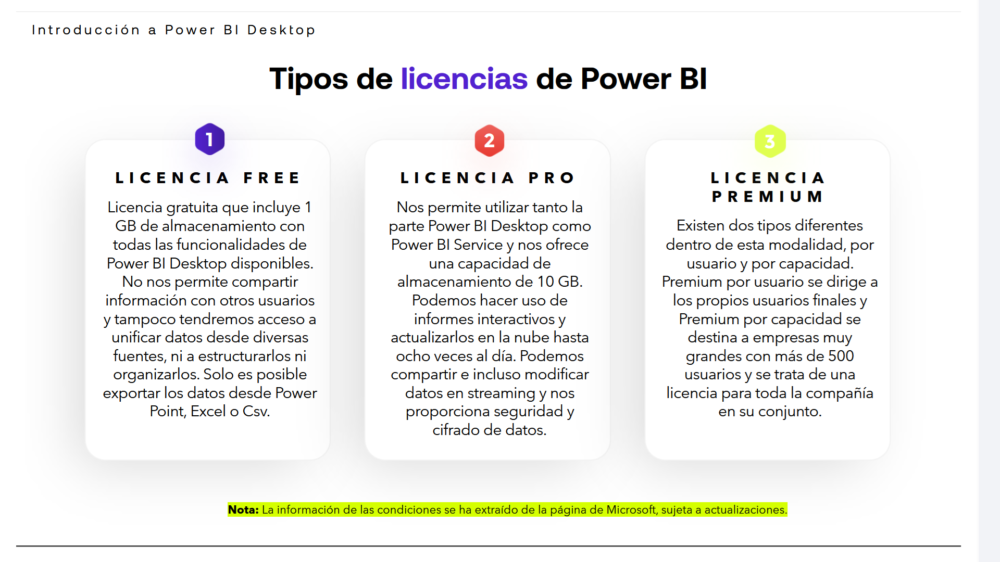
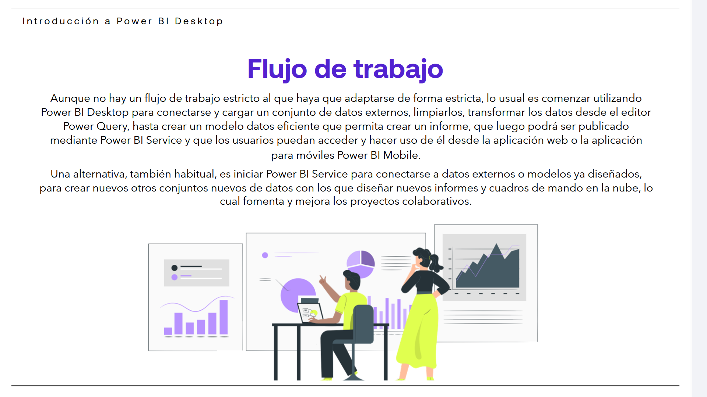
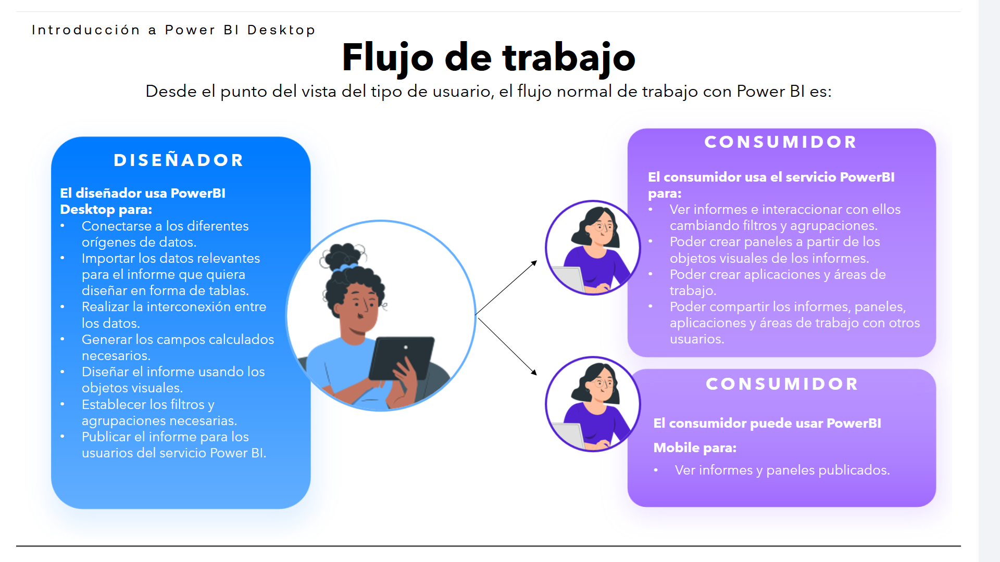

# 02-001:	PowerBI Desktop

[Lectura](./02-001-01_Lectura_PowerBI_Desktop.pdf)

Power BI Desktop es la aplicación gratuita de escritorio del entorno Power BI, para instalar en el equipo local y que permite conectarse a los datos, transformarlos y visualizarlos.  

Power BI Desktop nos permite conectarnos a varios orígenes de datos diferentes y combinarlos, o lo que es lo mismo, su modelado en un modelo de datos. Este modelo de datos creado permite compilar objetos visuales y colecciones de objetosvisuales que se pueden convertir y compartir como informes, útiles para la gestión y
toma de datos dentro de las organizaciones.  

La mayoría de los profesionales analistas de datos que desarrollan proyectos de inteligencia empresarial usan Power BI Desktop para crear informes y luego publicarlos en Power BI Service para compartirlos con los interesados en el proyecto.  

> [!IMPORTANT]
> Los usos más comunes de Power BI Desktop son los siguientes:  

> 	* Conectar a fuentes de los datos.
>	* Transformar y limpiar los datos, para crear un modelo de datos.
>	* Crear objetos visuales, ya sean gráfico, métricas, tarjetas de KPIs, mapas, tablas, etc, que proporcionan representaciones visuales de los datos.
>	* Crear informes que incluyen las colecciones de objetos visuales.
>	* Compartir los informes.
	
Todo analista de datos debe tener entre sus objetivos el crear informes atractivos visualmente y fácilmente comprensibles para sus usuarios, aplicando la creatividad en su creación y diseño.

---

## Diferencias entre Power BI Desktop y Power BI Service

A la hora de realizar informes de Power BI, si se trabaja en proyectos de inteligencia empresarial se utiliza Power BI Desktop para crear informes de Power BI y, posteriormente, se usa Power BI Service para distribuirlos y colaborar con otros usuarios.

> [!IMPORTANT]
> Lo habitual es usar PowerBI Desktop para toda la carga, generación, ETL, diseño, etcétera, y PowerBI Service para distribuir los informes, colaborar con otras personas; pero **en ambos modos es posible hacer exactamente lo mismo**.

- Sobre PowerBI Desktop: 
 
* Power BI Desktop es una aplicación que se descarga e instala de forma gratuita en el equipo local.   

* Desktop es una herramienta completa de análisis de datos y creación de informes que se emplea para conectarse a los datos, transformarlos, visualizarlos y analizarlos.  

* Incluye Power Query que permite la conexión a múltiples orígenes de datos diferentes y combinarlos en un modelo de datos (modelado).   

* A continuación, se diseña un informe basado en ese modelo de datos que se puede compartir con otros usuarios directamente o mediante su publicación en Power BI Service.

- Sobre PowerBI Service:

* Por otro lado, Power BI Service es un servicio basado en la nube o software como servicio (SaaS) que admite la edición de informes y la colaboración entre equipos y organizaciones.  

* En Power BI Service también es posible conectarse a orígenes de datos, pero el modelado está limitado.  

* El servicio Power BI se usa para realizar tareas como crear paneles, crear y compartir aplicaciones, analizar y explorar los datos para descubrir información empresarial y mucho más.

#### Comparativa entre ambos

| POWER BI DESKTOP | **AMBOS** | SERVICIO POWER BI |
| :--- | :--- | :--- |
| Muchos orígenes de datos | **Informes** | Algunos orígenes de datos |
| Transformación | **Visualizaciones** | Paneles |
| Forma y modelado | **Seguridad** | Aplicaciones y áreas de trabajo |
| Medidas | **Filtros** | Uso compartido |
| Columnas calculadas | **Marcadores** | Creación de flujo de datos |
| Python | **Preguntas y Respuestas** | Informes paginados |
| Temas | **Objetos visuales de R** | Administración de RLS |
| Creación de RLS | | Conexiones de puerta de enlace |

---

---

## Tipos de licencias de Power BI

> [!WARNING]
> En el pasado, las licencias Free de PowerBI estaban mucho más limitadas. Se incluye, a continuación, la información actualizada (2026, Septiembre).

Actualmente Power BI se ofrece principalmente mediante tres modalidades de licencia por usuario: **Free**, **Pro** y **Premium Per User (PPU)**. Además, las organizaciones pueden contratar capacidad de **Microsoft Fabric**, que permite distribuir contenido de Power BI a usuarios que no dispongan de una licencia de pago.

### 1. **LICENCIA FREE**

Es la licencia gratuita de Power BI. Incluye **Power BI Desktop** y acceso al **Power BI Service**.

Con una cuenta Free es posible:

- Crear informes y modelos de datos con Power BI Desktop.
- Publicar informes en **My workspace**.
- Crear y visualizar informes, paneles y otros contenidos en Power BI Service.
- Interactuar con informes y utilizar numerosas funcionalidades del servicio.
- Trabajar con diferentes fuentes de datos.
- Crear y transformar modelos de datos.

Sin embargo, existen importantes limitaciones para la colaboración:

- **El contenido de **My workspace** es privado para el usuario.**
- **No permite compartir informes y paneles de forma privada** con otros usuarios.
- **No permite publicar contenido en espacios de trabajo compartidos** (*App workspaces*).
- Para colaborar y compartir contenido de forma privada normalmente es necesario **Power BI Pro** o **Premium Per User**.

Un usuario Free sí puede **visualizar e interactuar con contenido compartido por otras personas** cuando dicho contenido está alojado en una capacidad compatible, como **Microsoft Fabric F64 o superior** o una capacidad Premium. Por tanto, la licencia Free no significa que el usuario esté limitado exclusivamente a Power BI Desktop.

### 2. **LICENCIA PRO**

Power BI Pro es la licencia orientada a usuarios que necesitan **publicar, compartir y colaborar** con otros usuarios.

Incluye todas las funcionalidades de la licencia Free y permite:

- Publicar informes en espacios de trabajo compartidos.
- Compartir informes y paneles con otros usuarios.
- Colaborar con otros usuarios dentro de Power BI Service.
- Crear y distribuir aplicaciones de Power BI.
- Acceder a contenido compartido en espacios de trabajo que no utilizan una capacidad Premium/Fabric adecuada.
- Utilizar las funcionalidades de colaboración de Power BI.

Actualmente, tiene un precio orientativo de  **12,10 € por usuario/mes**, con facturación anual y sin IVA.

- Los modelos de Power BI asociados a Pro tienen, entre otros límites, **1 GB de tamaño máximo de modelo** y una frecuencia de actualización programada de hasta **8 veces al día**.  
- El almacenamiento nativo disponible es de **10 GB por licencia**. 

### 3. **LICENCIA PREMIUM PER USER (PPU)**

*Premium Per User (PPU)* está orientada a usuarios que necesitan funcionalidades avanzadas de Power BI sin que toda la organización tenga que contratar una capacidad Premium/Fabric.

Incluye **todas las funcionalidades de Power BI Pro** y añade características de escala empresarial, entre ellas:

- Modelos de datos de mayor tamaño.
- Mayor frecuencia de actualización.
- Funcionalidades Premium específicas.
- Características avanzadas para trabajar con modelos y datos.

- Los modelos pueden alcanzar hasta **100 GB**, la actualización programada puede llegar hasta **48 veces al día** y el almacenamiento nativo puede llegar hasta **100 TB**.

Actualmente, tiene un coste dee **20,80 € por usuario/mes**, con facturación anual y sin IVA.

### 4. **MICROSOFT FABRIC Y CAPACIDAD**

La antigua idea de **"Power BI Premium por capacidad"** ha evolucionado hacia el modelo de **Microsoft Fabric**.

Las organizaciones pueden contratar una capacidad de Fabric que proporciona recursos compartidos para Power BI y otras cargas de trabajo de Fabric.

Una capacidad suficientemente grande, actualmente **F64 o superior**, permite que usuarios con licencia Free puedan consumir informes y contenido de Power BI sin necesidad de disponer individualmente de una licencia Pro o PPU.

Para publicar contenido en estas capacidades siguen existiendo determinados requisitos de licencia para los usuarios que crean y publican el contenido. 

| Característica | Free | Pro | Premium Per User |
|---|:---:|:---:|:---:|
| Power BI Desktop | ✅ | ✅ | ✅ |
| Power BI Service | ✅ | ✅ | ✅ |
| Crear contenido en My workspace | ✅ | ✅ | ✅ |
| Trabajar con múltiples fuentes de datos | ✅ | ✅ | ✅ |
| Compartir privadamente | ❌ | ✅ | ✅ |
| Publicar en espacios de trabajo compartidos | ❌ | ✅ | ✅ |
| Colaboración con otros usuarios | ❌ | ✅ | ✅ |
| Tamaño máximo de modelo | Limitado | 1 GB | 100 GB |
| Actualizaciones programadas | Limitadas | 8/día | 48/día |
| Almacenamiento nativo | NO | 10 GB/licencia | 100 TB |
| Funcionalidades Premium | ❌ | ❌ | ✅ |

> [!IMPORTANT]
> Las capacidades disponibles para un usuario no dependen únicamente de su licencia. También influyen el tipo de espacio de trabajo, la capacidad de Microsoft Fabric/Premium donde está alojado el contenido y los permisos asignados al usuario.

> [!NOTE]
> Las condiciones, precios, límites y funcionalidades de Power BI pueden cambiar. La información anterior se ha actualizado tomando como referencia la documentación y página de precios oficial de Microsoft.

---

## Flujo de trabajo habitual

Aunque no hay un flujo de trabajo estricto al que haya que adaptarse de forma estricta, lo usual es comenzar utilizando Power BI Desktop para conectarse y cargar un conjunto de datos externos, limpiarlos, transformar los datos desde el editor Power Query, hasta crear un modelo datos eficiente que permita crear un informe, que luego podrá ser publicado mediante Power BI Service y que los usuarios puedan acceder y hacer uso de él desde la aplicación web o la aplicación para móviles Power BI Mobile.    

- Una alternativa, también habitual, es iniciar Power BI Service para conectarse a datos externos o modelos ya diseñados, para crear nuevos otros conjuntos nuevos de datos con los que diseñar nuevos informes y cuadros de mando en la nube, lo cual fomenta y mejora los proyectos colaborativos.  

### Perfiles de Usuario de PowerBI

- **CONSUMIDOR**
Utiliza el servicio Power BI y Power BI mobile. Puede ver la información en objetos visuales, recibe la información en los paneles, informes y aplicaciones que han creado los diseñadores. Interacciona con la aplicación para obtener la información deseada.

- **DISEÑADOR**
Utiliza la aplicación Power BI desktop para obtener la información desde la diferentes fuentes de datos, crea modelos de datos con sus relaciones, genera diferentes métricas y diseña los paneles, informes y aplicaciones para consumo de otros usuarios.

- **ADMINISTRADOR**
Administra el servicio Power BI: activa característica, revisa el uso y rendimiento, administra licencias y acceso de usuarios, administra recursos y capacidad.

- **DESARROLLADOR**
Power BI desktop integra por defecto los objetos visuales más comunes, además permite importar objetos desarrollados por terceros tanto gratuitos como de compra. Los desarrolladores pueden crear de objetos visuales personalizados.

### Flujo de trabajo dado el perfil de usuario

> [!IMPORTANT]
> EL diseñador "trabaja" para que el consumidor obtenga aquello que necesita de PowerBI de manera fácil.

Desde el punto del vista del tipo de usuario, el flujo normal de trabajo con Power BI es:

**El diseñador usa PowerBI Desktop para:**  
	* Conectarse a los diferentes orígenes de datos.
	* Importar los datos relevantes para el informe que quiera diseñar en forma de tablas.
	* Realizar la interconexión entre los datos.
	* Generar los campos calculados necesarios.
	* Diseñar el informe usando los objetos visuales.
	* Establecer los filtros y agrupaciones necesarias.
	* Publicar el informe para los usuarios del servicio Power BI.

**El consumidor usa el servicio PowerBI para:**
	* Ver informes e interaccionar con ellos cambiando filtros y agrupaciones.
	* Poder crear paneles a partir de los objetos visuales de los informes.
	* Poder crear aplicaciones y áreas de trabajo.
	* Poder compartir los informes, paneles, aplicaciones y áreas de trabajo con otros usuarios.

**El consumidor puede usar PowerBI Mobile para:**
	* Ver informes y paneles publicados.