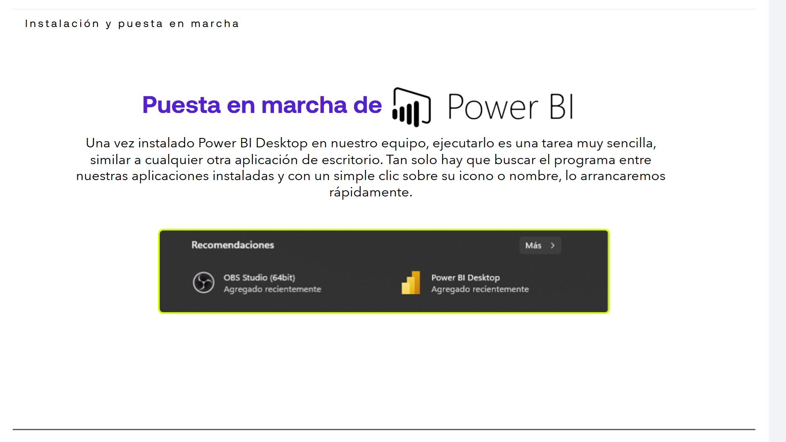
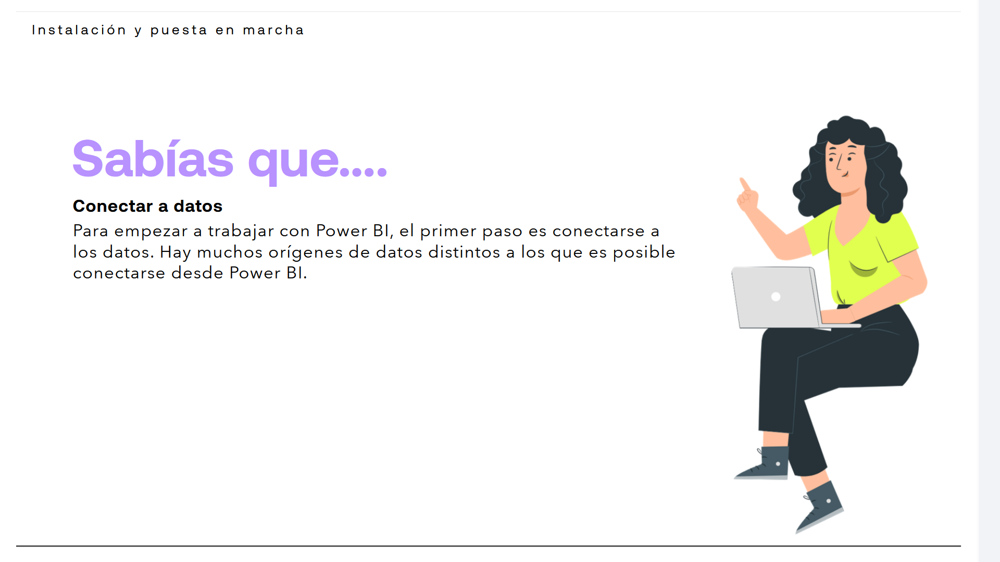

# 02-002:	Instalación y puesta en marcha de PowerBI

Una vez instalado Power BI Desktop en nuestro equipo, ejecutarlo es una tarea muy sencilla, similar a cualquier otra aplicación de escritorio. Tan solo hay que buscar el programa entre nuestras aplicaciones instaladas y con un simple clic sobre su icono o nombre, lo arrancaremos rápidamente.

---

[Lectura](./02-002-02_Lectura_instalacion.pdf)  

> [!IMPORTANT]
> Podemos encontrar fácilmente PowerBI Desktop en la propia tienda de aplicaciones de Microsoft, o desde su página web.

- Para iniciar Power BI, empezamos buscando el programa en nuestro equipo. Para ello, podemos buscarlo directamente en el listado de aplicaciones instaladas o en la herramienta de búsqueda de Windows o de IOS, tecleando Power BI Desktop.  

- Una vez encontrado, hacemos doble clic en el programa y este se inicia, abriéndose finalmente el programa en una nueva ventana.

- Una vez ejecutado el programa, vemos que lo primero que se nos muestra es una ventana de bienvenida, con dos áreas diferenciadas. El área de la izquierda muestra la opción de cargar datos, mediante el botón Obtener datos, un botón para acceder a los últimos orígenes de datos, Orígenes recientes y enlaces directos a los últimos
informes a los que hemos accedido un acceso para cargar los datos (enlace "Obtener datos"), enlaces a los últimos informes accedidos.

- En la parte derecha de esta primera ventana de bienvenida tenemos disponibles diferentes enlaces que apuntan a videotutoriales del programa:  

	* Introducción a Power Bi Desktop.
	* Elaboración de informes.
	* Conceptos de vista de datos.
	* Carga de informes.
	* Creación de informes.
	* Enlace a otros videos en la página de Microsoft.
	* Enlace a la página de Microsoft para ver otra documentación sobre el programa y sus novedades más recientes.
	* Enlace a los foros, en la página de Microsoft, donde se pueden realizar preguntas e interactuar con otros usuarios del programa.
	* Enlaces a eventos próximos de Microsoft.

- Podemos acceder a estos servicios iniciales o, directamente cerrar esta ventana inicial para pasar a utilizar el programa, mostrándosenos la siguiente pantalla:

En este punto, habremos completado la ejecución inicial de Power BI y podremos comenzar a usarlo, creando un nuevo proyecto, comenzando con la carga de los primeros datos, o abriendo un proyecto ya en desarrollo.

---

> [!NOTE]
> El primer paso lógico de PowerBI será **Conectar a datos**.
> Para empezar a trabajar con Power BI, el primer paso es conectarse a los datos. Hay muchos orígenes de datos distintos a los que es posible conectarse desde Power BI.