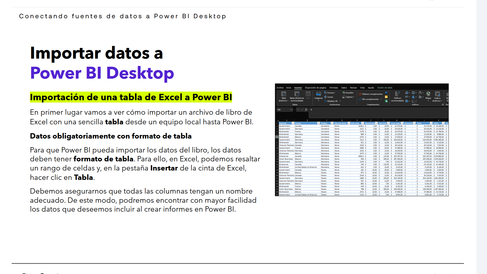
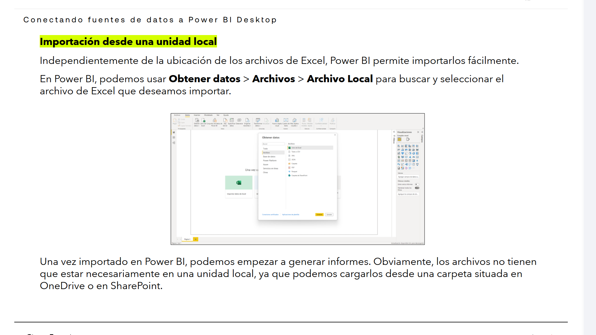
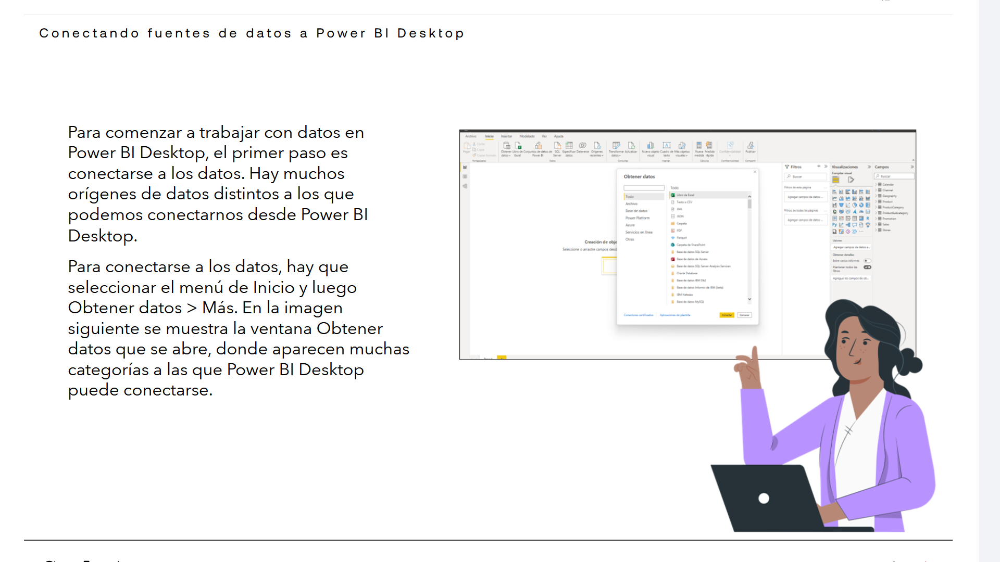
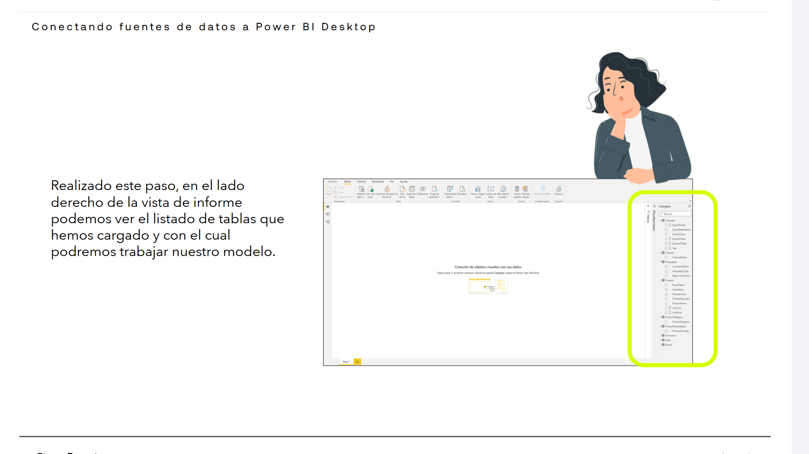

# 02-003:	Conectando fuentes de datos a Power BI Desktop

## Importar desde Excel

En primer lugar vamos a ver cómo importar un archivo de libro de Excel con una sencilla **tabla** desde un equipo local hasta Power BI.

### **Datos obligatoriamente con formato de tabla**

Para que Power BI pueda importar los datos del libro, los datos deben tener **formato de tabla**.  

Para ello, en Excel, podemos resaltar un rango de celdas y, en la pestaña **Insertar** de la cinta de Excel, hacer clic en **Tabla**.

> [!IMPORTANT]
> Debemos asegurarnos que todas las columnas tengan un nombre adecuado (una adecuada **homogeneización  de los datos, de las categorías, etc**).  
>  De este modo, podremos encontrar con mayor facilidad los datos que deseemos incluir al crear informes en Power BI.

---

## Importar desde unidades locales / OneDrive / SharePoint

Independientemente de la ubicación de los archivos de Excel, Power BI permite importarlos fácilmente.

En Power BI, podemos usar **Obtener datos > Archivos > Archivo Local** para buscar y seleccionar el archivo de Excel que deseamos importar.

Una vez importado en Power BI, podemos empezar a generar informes. Obviamente, los archivos no tienen que estar necesariamente en una unidad local, ya que podemos cargarlos desde una carpeta situada en OneDrive o en SharePoint.

---

## Comenzando a trabajar con los datos

Para comenzar a trabajar con datos en Power BI Desktop, el primer paso es conectarse a los datos.  

Hay **muchos orígenes de datos distintos** a los que podemos conectarnos desde Power BI Desktop:

#### **Archivos**

* Excel: Libros de trabajo (.xlsx o .xls).
* Texto o CSV: Archivos de texto plano o valores separados por comas.
* JSON: Archivos con estructura de datos JavaScript Object Notation.
* XML: Archivos de lenguaje de marcado extensible.
* PDF: Tablas y texto extraído de documentos PDF.
* Parquet: Formato de almacenamiento columnar optimizado.
* Carpeta: Combina varios archivos de una misma carpeta local o en red.
* Carpeta de SharePoint: Archivos alojados en SharePoint.

#### **Bases de datos**

* SQL Server: Base de datos relacional de Microsoft.
* Azure SQL Database: Base de datos SQL alojada en la nube de Azure.
* SQL Server Analysis Services (SSAS): Modelos tabulares o multidimensionales.
* Azure Synapse Analytics: Almacén de datos a gran escala.
* MySQL: Base de datos de código abierto.
* PostgreSQL: Base de datos relacional avanzada.
* Oracle Database: Base de datos empresarial de Oracle.
* Snowflake: Plataforma de almacenamiento de datos en la nube.
* IBM DB2: Base de datos de IBM.
* Teradata: Sistema de gestión de bases de datos masivas.
* SAP HANA / SAP Business Warehouse: Entornos de datos de SAP.
* Amazon Redshift / Amazon Athena: Almacenes y consultas de AWS.
* Google BigQuery: Almacén de datos en la nube de Google.

#### **Microsoft Fabric y Power Platform**

* Modelos semánticos de BI: Conjuntos de datos ya publicados en Power BI.
* Flujos de datos (Dataflows): Procesos ETL en la nube.
* Almacenes (Warehouses) y Lagos de datos (Lakehouses) de Fabric.
* Dataverse (antes Common Data Service): Entorno de datos de Power Platform.

#### **Servicios en línea y Web**

* Web: Extracción de datos mediante URL, tablas HTML o APIs REST.
* Google Analytics: Estadísticas de sitios web y tráfico.
* Salesforce: Objetos e informes de ventas (Salesforce Objects & Reports).
* Dynamics 365: Módulos de ventas, finanzas y operaciones.
* OData: Fuente de datos basada en el protocolo Open Data.
* ODBC / OLE DB: Conectores genéricos para sistemas personalizados.

- Para conectarse a los datos, hay que seleccionar el menú de Inicio y luego **Obtener datos > Más**.  

- En la imagen siguiente se muestra la ventana **Obtener datos** que se abre, donde aparecen muchas categorías a las que Power BI Desktop puede conectarse.

- Una vez seleccionado el archivo de datos que queremos cargar, haciendo clic en **Abrir**, el programa nos muestra, después de unos segundos, las tablas que contiene el archivo.  

- Seleccionamos aquellas tablas que queremos cargar, con lo que podemos previsualizar sus datos contenidos, y finalmente hacemos clic en **Cargar**, procediendo el programa a cargar las tablas seleccionadas.

- Realizado este paso, en el lado derecho de la vista de informe podemos ver el listado de tablas que hemos cargado y con el cual podremos trabajar nuestro modelo.

