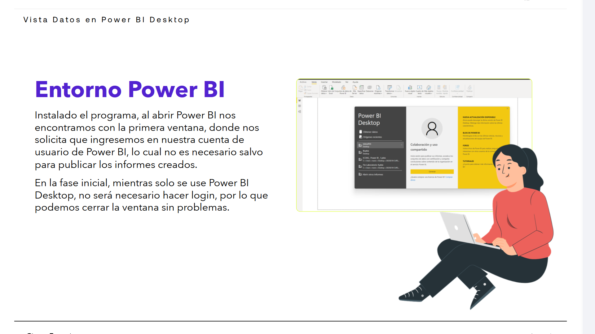
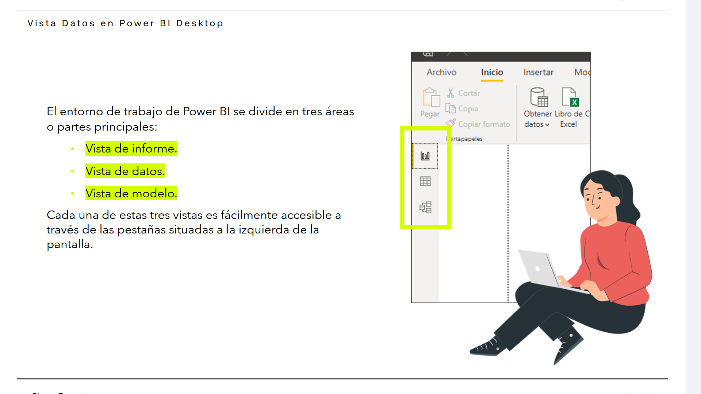
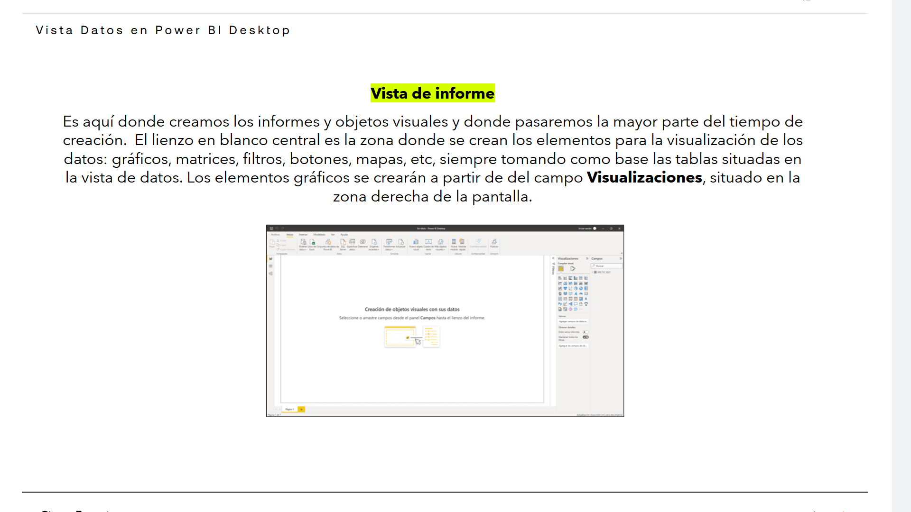
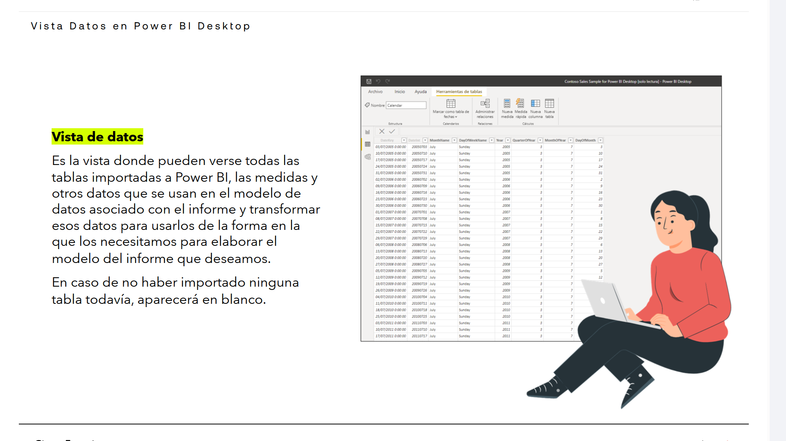
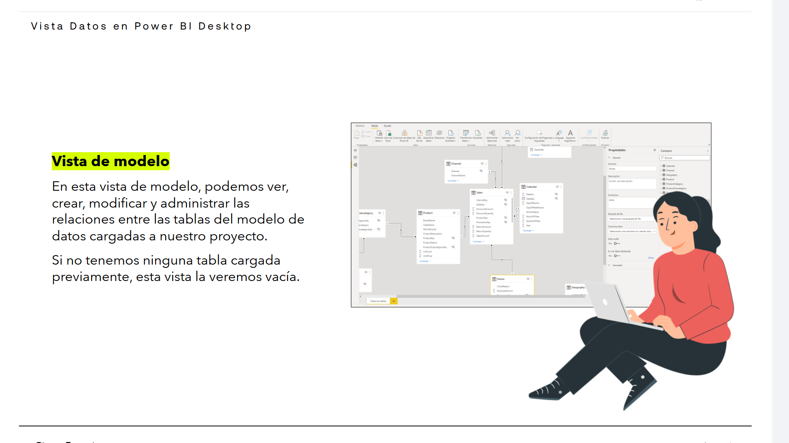

# 02-004:	Vistas en PowerBI (Informe, Datos, Modelo)

## Entorno Power BI

> [!NOTE]
> Aunque al arrancar nos solicite iniciar sesión, si no usamos PowerBI Service (en modo SaaS; on-line), no hace falta iniciarla para poder trabajar con Desktop.  

Instalado el programa, al abrir Power BI nos encontramos con la primera ventana, donde nos solicita que ingresemos en nuestra cuenta de usuario de Power BI, lo cual no es necesario salvo para publicar los informes creados.   

En la fase inicial, mientras solo se use Power BI Desktop, no será necesario hacer login, por lo que podemos cerrar la ventana sin problemas.  

El entorno de trabajo de Power BI se divide en tres vistas (áreas o partes principales):  

* **Vista de Informe.**
* **Vista de Datos.**
* **Vista de Modelo.**

Cada una de estas tres vistas es fácilmente accesible a través de las pestañas situadas a la izquierda de la pantalla.  

---

### Vista de informe

> [!NOTE]
> Una vez arrancado el programa debemos comenzar cargando una fuente de datos; lo mejor es comenzar con una tabla de Excel.
>
> Completada la carga, se pueden ver las tablas en el margen derecho de la Vista de Informe.

Es aquí donde creamos los informes y objetos visuales y donde pasaremos la mayor parte del tiempo de creación.  

El lienzo en blanco central es la zona donde se crean los elementos para la visualización de los datos:  

- Gráficos
- Matrices
- Filtros
- Botones
- Mapas
- Etc...

Siempre tomando como base las tablas situadas en la vista de datos.  

Los elementos gráficos se crearán a partir del campo **Visualizaciones**, situado en la zona derecha de la pantalla.  

---

### Vista de datos

Es la vista donde pueden verse todas las tablas importadas a Power BI, las medidas y otros datos que se usan en el modelo de datos asociado con el informe y transformar esos datos para usarlos de la forma en la que los necesitamos para elaborar el modelo del informe que deseamos.  

En caso de no haber importado ninguna tabla todavía, aparecerá en blanco.  

### Vista de modelo

En esta vista de modelo, podemos ver, crear, modificar y administrar las relaciones entre las tablas del modelo de datos cargadas a nuestro proyecto.

Si no tenemos ninguna tabla cargada previamente, esta vista la veremos vacía.

