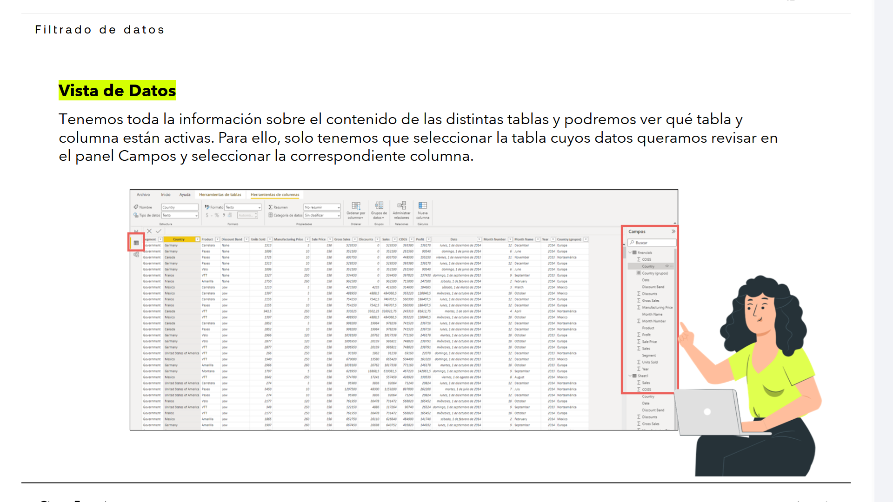
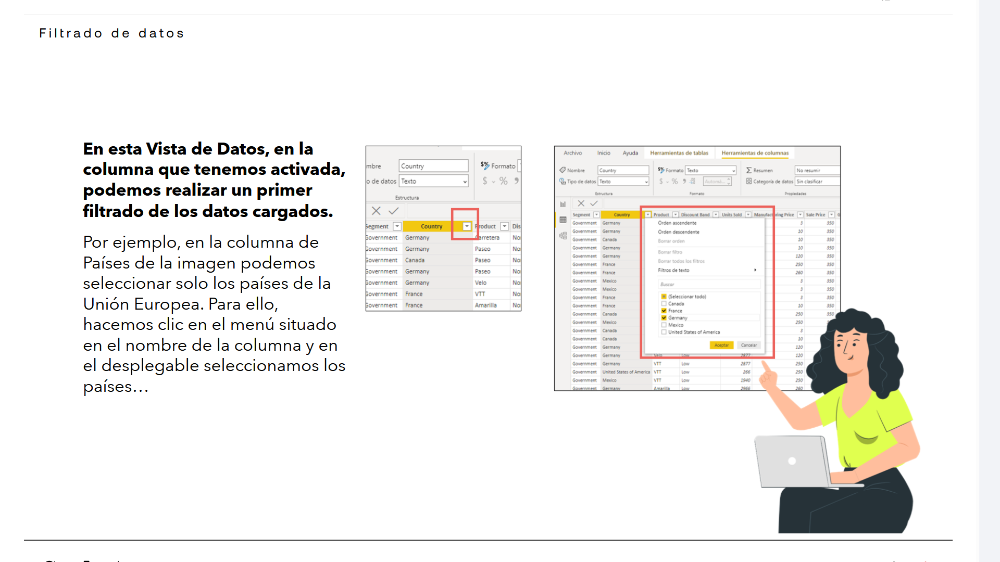
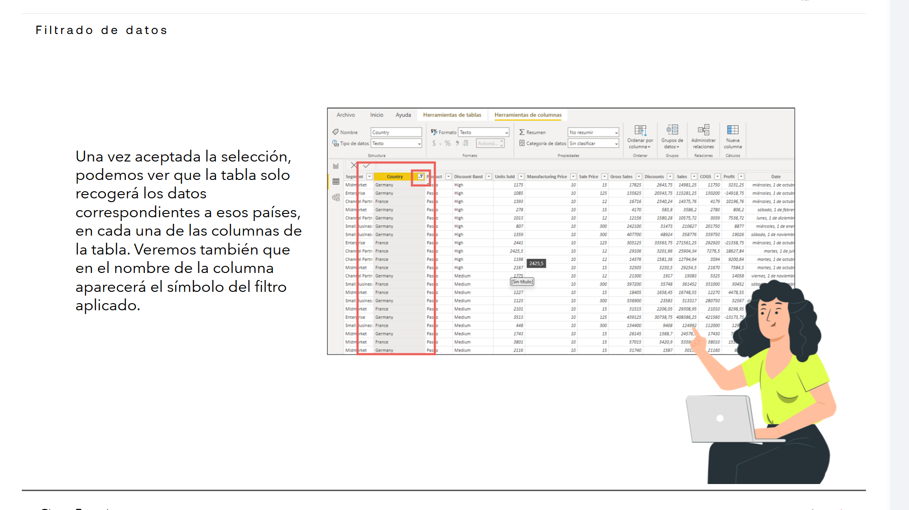
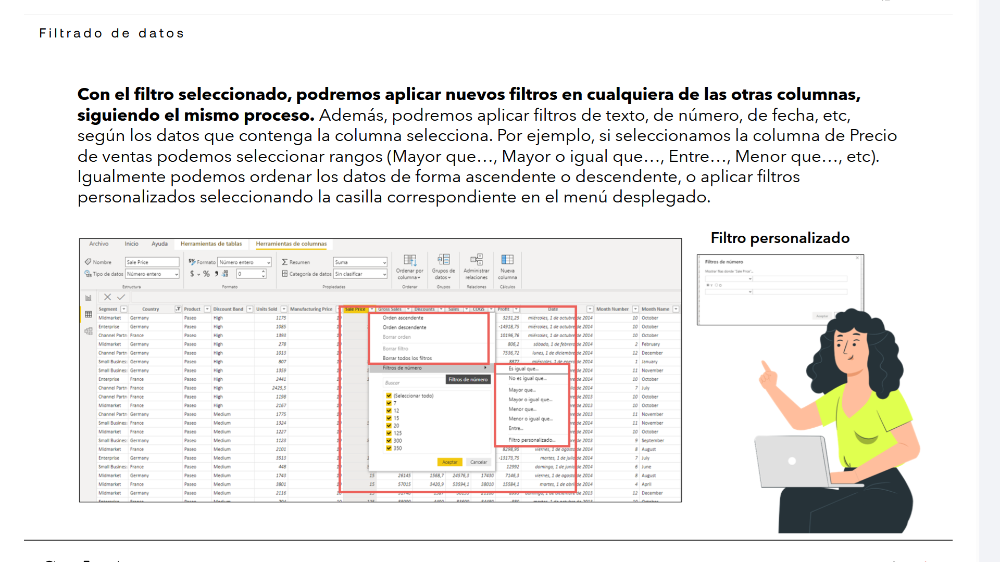

# 02-005:	Filtrado de datos

## Filtrado desde la Vista de Datos

> [!IMPORTANT]
> Una vez que tenemos cargadas las tablas con los datos, en la Vista de Datos se puede revisar todos los datos importados, donde podremos acceder a la totalidad de datos que hemos incorporado a nuestro proyecto.  

Tenemos toda la información sobre el contenido de las distintas tablas y podremos ver qué tabla y columna están activas.  

- Para ello, solo tenemos que seleccionar la tabla cuyos datos queramos revisar en el panel **Campos** y seleccionar la correspondiente columna.  

> [!IMPORTANT]
> En esta **Vista de Datos**, en la columna que tenemos activada, podemos realizar un primer filtrado de los datos cargados.  

Por ejemplo, en la columna de Países de la imagen podemos seleccionar solo los países de la Unión Europea.  

- Para ello, hacemos clic en el menú situado en el nombre de la columna y en el desplegable seleccionamos los países.  

- Una vez aceptada la selección, podemos ver que la tabla solo recogerá los datos correspondientes a esos países, en cada una de las columnas de la tabla.  

Veremos también que en el nombre de la columna aparecerá el símbolo del filtro aplicado.  

> [!IMPORTANT]
> **Con el filtro seleccionado, podremos aplicar nuevos filtros en cualquiera de las otras columnas, siguiendo el mismo proceso.** 

Además, podremos aplicar filtros de texto, de número, de fecha, etc., según los datos que contenga la columna seleccionada.  

- Por ejemplo, si seleccionamos la columna de Precio de ventas podemos seleccionar rangos (*Mayor que...*, *Mayor o igual que*..., *Entre*..., *Menor que*..., etc.).  

- Igualmente podemos ordenar los datos de forma ascendente o descendente, o aplicar filtros personalizados seleccionando la casilla correspondiente en el menú desplegable.  

### Filtro personalizado

> [!IMPORTANT]
> En el menú de opciones de filtrado de número, al hacer clic en **Filtro personalizado...**, se abre una ventana específica para definir criterios de condición detallados (como valores mayores, menores o iguales a una cifra determinada).
