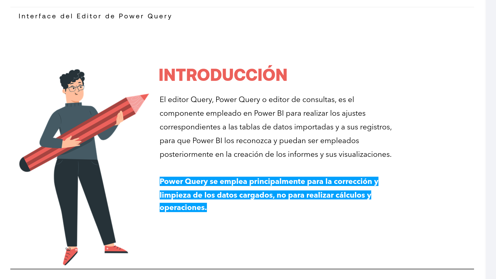
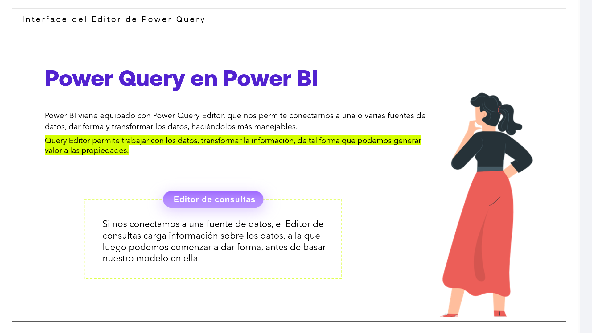
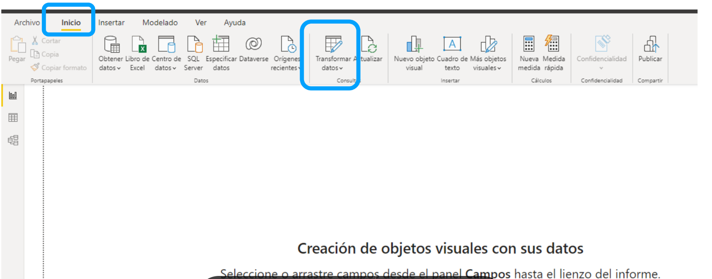
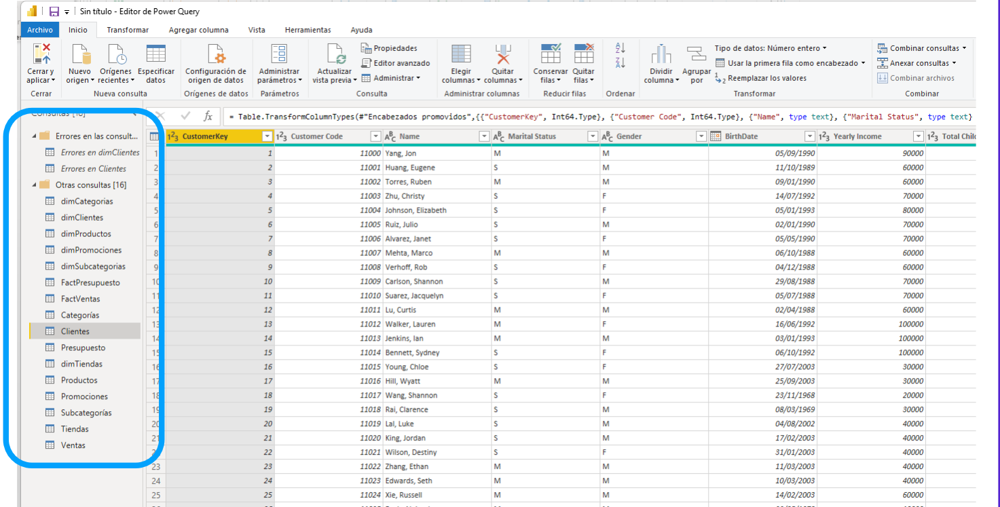
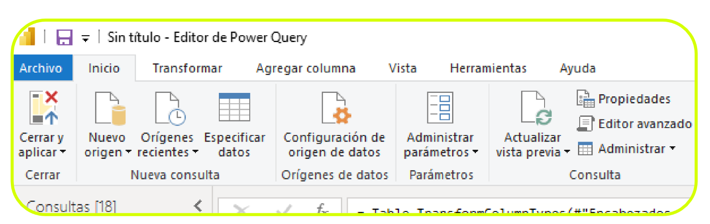
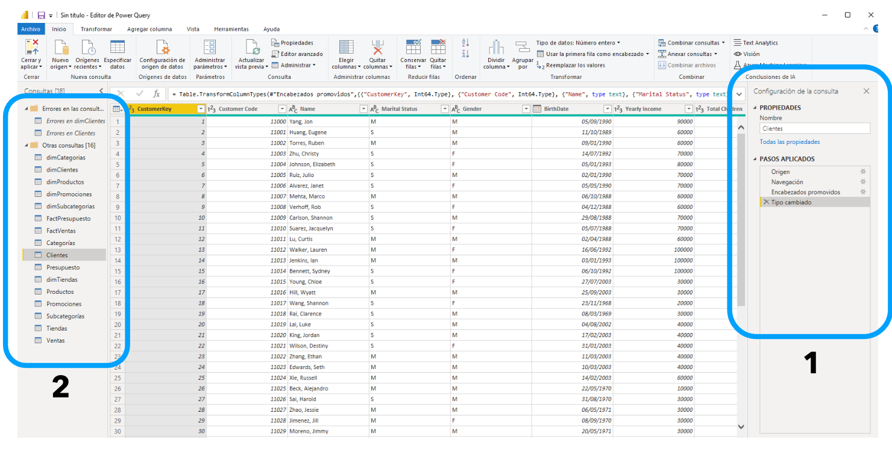
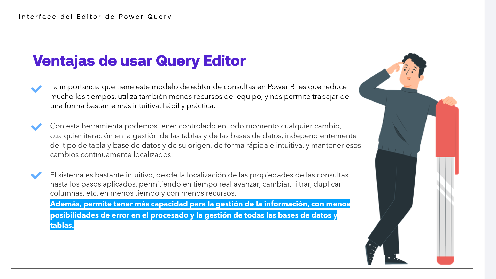

# 03-001:   Interface del editor PowerQuery

## Interface del Editor de Power Query

El editor Query, Power Query o editor de consultas, es el componente empleado en Power BI para **realizar los ajustes correspondientes a las tablas de datos importadas y a sus registros**, para que Power BI los reconozca y puedan ser empleados posteriormente en la creación de los informes y sus visualizaciones.  

> [!NOTE] 
> Power Query se emplea principalmente para la **corrección y limpieza de los datos cargados**, no para realizar cálculos y operaciones.

---

### Transformación y limpieza de datos y creación de un modelo

> [!IMPORTANT]
> El proceso de ETL: Limpiar y transformar los datos
>
> PowerBI incluye un editor ditor de Power Query, integrado en PowerBI.

Con el Editor de Power Query podemos realizar modificaciones en los datos:  

- Cambiar un tipo de datos
- Quitar columnas
- Combinar datos de varios orígenes.

Podemos decir que es como esculpir los datos: se empieza con un gran bloque de datos, y se van descartando grandes o pequeños grupos de datos, o se agregan otros según sea necesario, **hasta que el conjunto final de los datos seleccionados adoptan la forma deseada**.  

Una vez que los datos tengan la forma deseada, ya podremos crear objetos visuales, como se desarrolla en profundidad más adelante, una vez conocidas todas las claves de un proyecto de Business Intelligence.  

---
### ¿Qué es Power Query?

Power Query es la herramienta de preparación de datos y conectividad de datos de Microsoft, que accede sin problemas a los datos almacenados en fuentes de datos, dando la opción de modificarlos para adaptarlos a nuestras necesidades.

- **FUENTES DE DATOS**
    * Las fuentes de datos admitidas incluyen una amplia gama de tipos de archivos, bases de datos, servicios de Microsoft Azure y múltiples servicios en línea de terceros.

---

### Power Query en Power BI

> [!IMPORTANT]
> Power BI viene equipado con **Power Query Editor**, que nos permite conectarnos a una o varias fuentes de datos, dar forma y transformar los datos, haciéndolos más manejables.  

Query Editor permite trabajar con los datos, transformar la información, de tal forma que podemos generar valor a las propiedades.

- **Editor de Consultas**
    * Si nos conectamos a una fuente de datos, el Editor de Consultas carga información sobre los datos, a la que luego podemos comenzar a dar forma, antes de basar nuestro modelo en ella.
    

---

### Limpieza y transformación de los datos con el Editor de consultas

> [!IMPORTANT]
> El editor de consultas es una herramienta eficaz para dar forma y transformar  a los datos y transformarlos con el objetivo de que estén listos para los modelos y sus visualizaciones

1. **Power BI Desktop** incluye el **Editor de consultas**, una herramienta eficaz para dar forma a los datos y transformarlos con el objetivo de que estén listos para sus modelos y visualizaciones.

2. La cinta del **Editor de consultas** contiene herramientas adicionales que permiten desde cambiar el tipo de datos de columnas hasta añadir anotaciones o extraer elementos de fechas, como el día de la semana o del año.

3. A medida que se aplican las transformaciones, aparece cada uno de los pasos en la lista **Pasos aplicados**, en el panel **del Editor de consultas**, lo que permite tener un control total de los cambios realizados y deshacer o revisar cambios específicos.

---

Power Query ejerce como editor de consultas ya que a cada una de las tablas que importamos a Power BI, Query lo llama Consulta. Por tanto, se puede entender el Editor de consultas como un editor de las tablas cargadas al programa.  

En el **Editor de Consultas** es donde conseguimos editar las tablas incorporadas. Es en este momento, cuando podemos decir que ya podemos trabajar con las tablas para comenzar a elaborar los objetos visuales que incorporaremos a nuestros informes finales.  

---

### Abrir Power Query

[Lectura](./03-001-01_Lectura_Abrir_PowerQuery.pdf)

Para abrir el editor Query, tan solo tenemos que abrir Power BI:

1. En el **menú Inicio**
2. Selecciona rel botón **Transformar datos**, situado en el apartado **Consultas**.

3. Una vez tenemos **abierto el Editor de Consultas**...

4. En la zona izquierda tenemos la **relación de tablas cargadas, o consultas**, que podemos editar. Solo tendremos que seleccionar la tabla que nos interese y podremos visualizar su contenido.

5. **En el menú superior de Query** podemos ver varios botones que nos recuerdan al menú
de un libro de Excel: *Archivo, Inicio, Transformar, Vista, Herramientas, etc*, que iremos
usando en diferentes momentos de nuestro proyecto de elaboración de los informes visuales.

> [!IMPORTANT]
> Vamos a ver algunos de los principales cambios o transformaciones que podemos hacer en las tablas que hayamos cargado a nuestro proyecto.

#### Ejemplo 1:     Denominar de forma diferente a cada una de las tablas

El primer cambio que podemos hacer es denominar de forma diferente a cada una de las tablas. Para ello:  

1. El el campo de **Propiedades**, situado **a la derecha de la ventana**-..

2. Sustituir el nombre que viene por defecto para la tabla, introducir el nuevo nombre y pulsar Enter (1). 

3. Veremos que el nombre de la tabla cambia automáticamente en las Consultas situadas a la izquierda (2).

#### Ejemplo 2:     Transformación de los datos para incluirlos en un informe

> [!IMPORTANT]
> **Esto ES**, precisamente, el ETL (Extracción, Transformación, Carga; de los datos).
> *Método de integración de datos que recopila información de diversas fuentes, la adapta mediante limpieza y estandarización, y la almacena en un repositorio unificado para su análisis*.

A veces, es posible que los datos importados a nuestro proyecto de Business Intelligence con Power BI tengan datos adicionales o datos con formato incorrecto.  

El Editor de Power Query puede ayudar a dar forma a los datos y a transformarlos, para que estén listos para los posteriores modelos. las visualizaciones de la información y la elaboración de informes para su publicación.  

Hay numerosas opciones disponibles al transformar los datos en el Editor de consultas, incluidas las transformaciones avanzadas, que permite casi infinitas formas en las que poder transformar los datos con el Editor de consultas.  

---

### Ventajas de usar Query Editor

> [!IMPORTANT]
> **BENEFICIOS PARA EL ETL:**
>   * **Eficiencia y rendimiento**
>   * **Control total de modificaciones**
>   * **Agilidad operativa**
>   * **Reducción de errores**

* La importancia que tiene este modelo de editor de consultas en Power BI es:
    - **Reduce mucho los tiempos (de todo el proceso ETL)**.  
    - **Utiliza también menos recursos** del equipo.  
    - **Permite trabajar de una forma bastante más intuitiva, hábil y práctica**.  

* Con esta herramienta podemos tener controlado en todo momento cualquier cambio, cualquier iteración en la gestión de las tablas y de las bases de datos, independientemente del tipo de tabla y base de datos y de su origen, de forma rápida e intuitiva, y mantener esos cambios continuamente localizados.  

* El sistema es bastante intuitivo, desde la localización de **Propiedades de la consulta** hasta los **Pasos Aplicados**, permitiendo en tiempo real avanzar, cambiar, filtrar, duplicar columnas, **pivotar o despivotar** tablas, etc, en menos tiempo y con necesidad de menores recursos en uso.  

* **Además, permite tener más capacidad para la gestión de la información, con menos posibilidad de errores en el procesado y la gestión de todas las bases de datos y tablas.  

