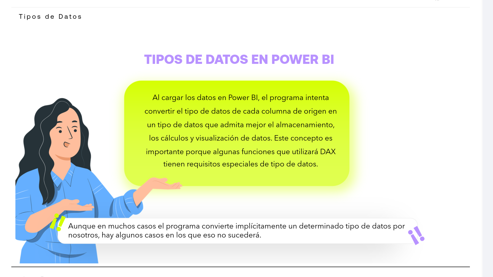
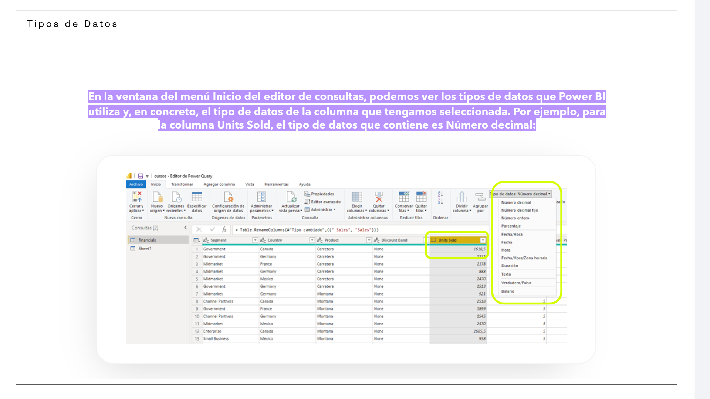
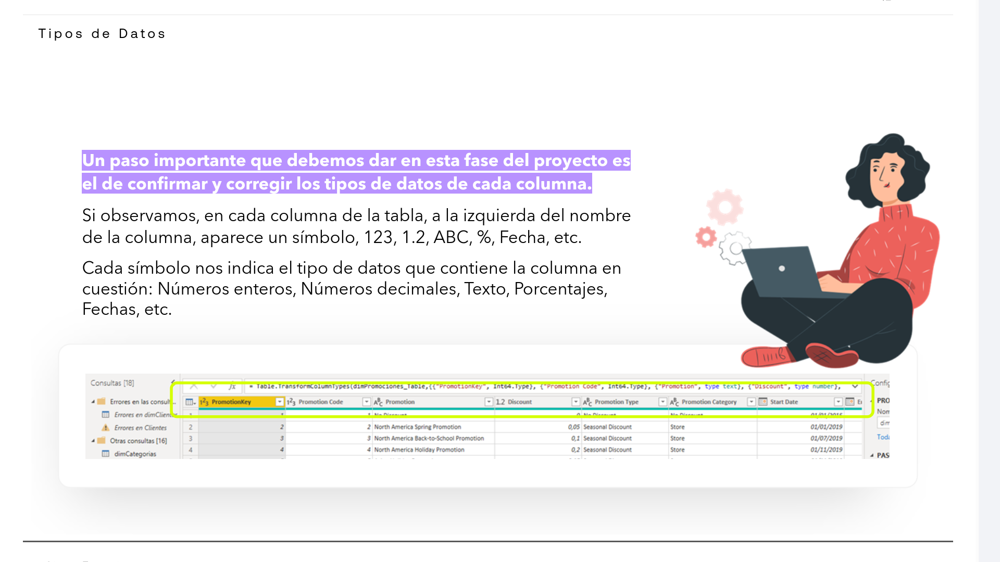
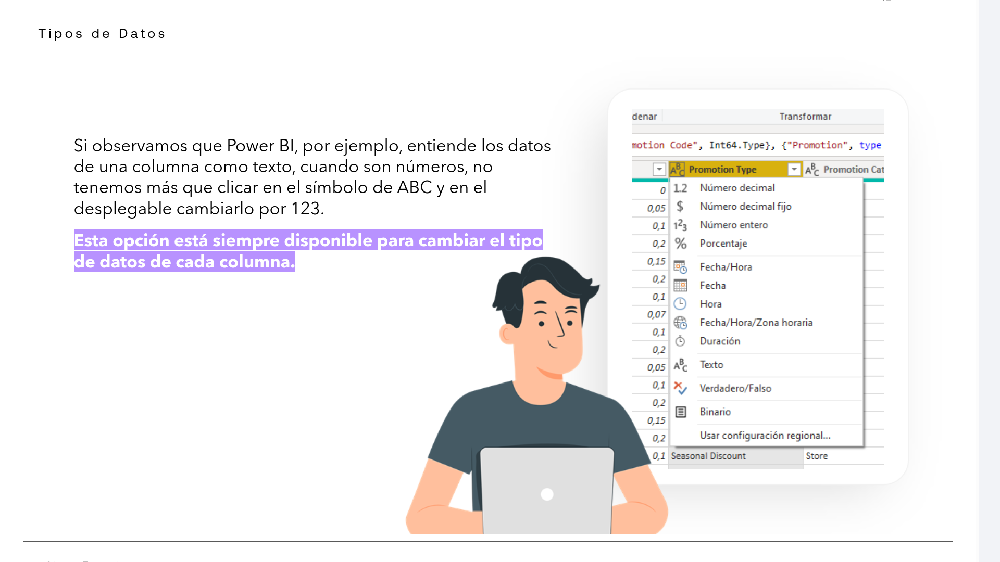
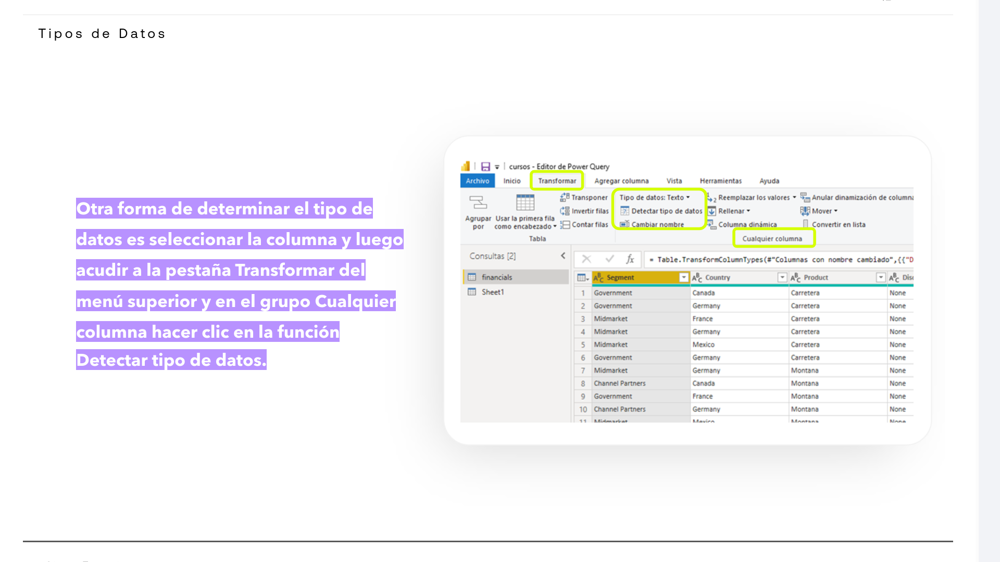
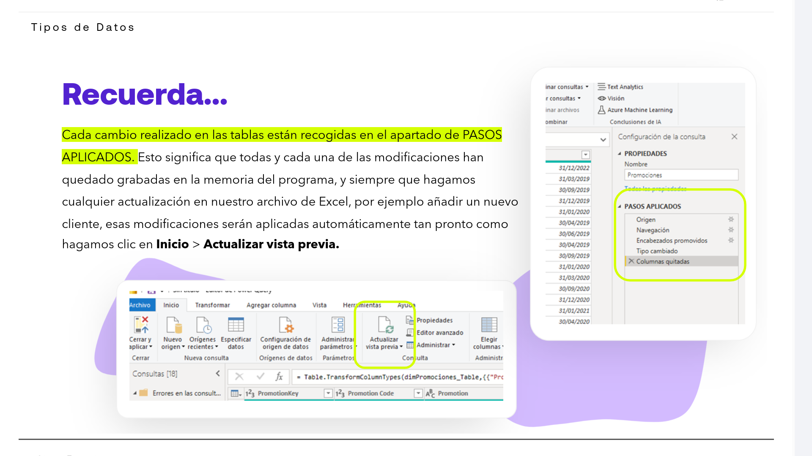
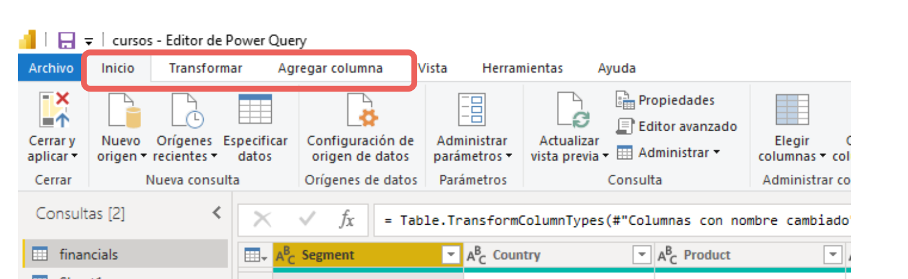

# 03-002:   Tipos de Datos

## Tipos de Datos en PowerBI

Este concepto es importante porque algunas funciones que utilizará DAX tienen requisitos especiales de tipo de datos.  

> [!TIP]
> **CONVERSIÓN AUTOMÁTICA EN POWER BI**
>
> * Al cargar los datos en Power BI, el programa intenta convertir el tipo de datos de cada columna de origen en un tipo de datos que admita mejor el almacenamiento, los cálculos y visualización de datos.

> [!WARNING]
> Aunque en muchos casos el programa convierte implícitamente un determinado tipo de datos por nosotros, hay algunos casos en los que eso no sucederá.

* En la ventana del menú **Inicio** del editor de consultas, podemos ver los tipos de datos que Power BI utiliza y, en concreto, el tipo de datos de la columna que tengamos seleccionada.

* **Ejemplo:** Para la columna **Units Sold**, el tipo de datos que contiene es **Número decimal**.

> [!IMPORTANT]
> **REVISIÓN OBLIGATORIA DE TIPOS DE DATOS**
> Un paso importante que debemos dar en esta fase del proyecto es el de **confirmar y corregir los tipos de datos de cada columna**.

* **Símbolos e indicadores:** Si observamos, en cada columna de la tabla, a la izquierda del nombre de la columna, aparece un símbolo: `123`, `1.2`, `ABC`, `%`, `Fecha`, etc.  

* **Tipos de datos representados:** Cada símbolo nos indica el tipo de datos que contiene la columna en cuestión:
  * `123`  Números enteros
  * `1.2`  Números decimales (floats)
  * `ABC`  Texto
  * `%`  Porcentajes
  * `Fecha` Fechas

### **Cambio manual de tipo de datos**

Si observamos que Power BI, por ejemplo, entiende los datos de una columna como texto, cuando son números, no tenemos más que clicar en el símbolo de **ABC** y en el desplegable cambiarlo por **123**.  

> [!IMPORTANT] 
> Esta opción está siempre disponible para cambiar el tipo de datos de cada columna.

### **Detección automática desde la cinta de opciones**

*  Otra forma de determinar el tipo de datos es seleccionar la columna y luego acudir a la pestaña **Transformar** del menú superior y en el grupo **Cualquier columna** hacer clic en la función **Detectar tipo de datos**.

> [!IMPORTANT] 
> En cualquier caso, es mejor verificar el tipo de dato de cada columna uno por uno, PowerBI no es infalible.

### Pasos Aplicados

> [!IMPORTANT]
> Cada cambio realizado en las tablas están recogidas en el apartado de **PASOS APLICADOS**.

- Esto significa que todas y cada una de las modificaciones han quedado grabadas en la memoria del programa.

- Siempre que hagamos cualquier actualización en nuestro archivo de Excel, por ejemplo añadir un nuevo cliente, esas modificaciones serán aplicadas automáticamente tan pronto como hagamos clic en **Inicio** > **Actualizar vista previa**.

---

## Herramientas de Power Query

[Lectura](./03-001-02_Lectura_Herramientas_de_PowerQuery.pdf)

En el editor de consultas Query **podemos hacer modificaciones a nuestras tablas de datos incorporados**, de múltiples formas, sin más que hacer uso de las **tres pestañas principales situadas* en la barra de herramientas:  

#### 1. INICIO

Es la pestaña principal, donde podemos realizar ajustes generales y las transformaciones más comunes, como modificar fuentes, eliminar columnas o filas, combinar tablas, configurar orígenes de datos, etc.

#### 2. TRANSFORMAR

En esta pestaña podremos realizar las operaciones cuyos ajustes realizados se reflejarán en la columna previamente seleccionada:

- Reemplazar valores, extraer caracteres, dar formato a la columna, detectar
tipos de datos, etc.

#### 3. AGREGAR COLUMNA

Desde esta pestaña se podrán añadir nuevas columnas a la tabla seleccionada, por lo general con referencia a los datos contenidos en algunas de las otras columnas: índices, extraer mes de columna fecha,
extraer año de columna fecha, columnas condicionales, duplicar columnas, analizar columnas, etc.

> [!IMPORTANT]
> Diferencias entre 2. TRANSFORMAR y 3. AGREGAR COLUMNNA
>
>   - Las operaciones que se pueden realizar en la pestaña Transformar consisten en **modificar datos o eliminar datos de la columna seleccionada en la tabla**.
>
>   - Las operaciones que se realizan en la pestaña Agregar columna nos **permiten extraer datos desde una columna, hacer referencia o ver desde otra perspectiva los datos contenidos en una determinada columna**.

---

## Integridad del origen de los datos

> [!IMPORTANT]
> **Power BI solo se conecta a las fuentes de datos y no provocará ningún cambio en estas.**

* El editor Query modifica la estructura que será empleada en Power BI, pero **no afecta a la estructura o registros** de las fuentes de datos cargadas al proyecto de visualización de datos abierto.

