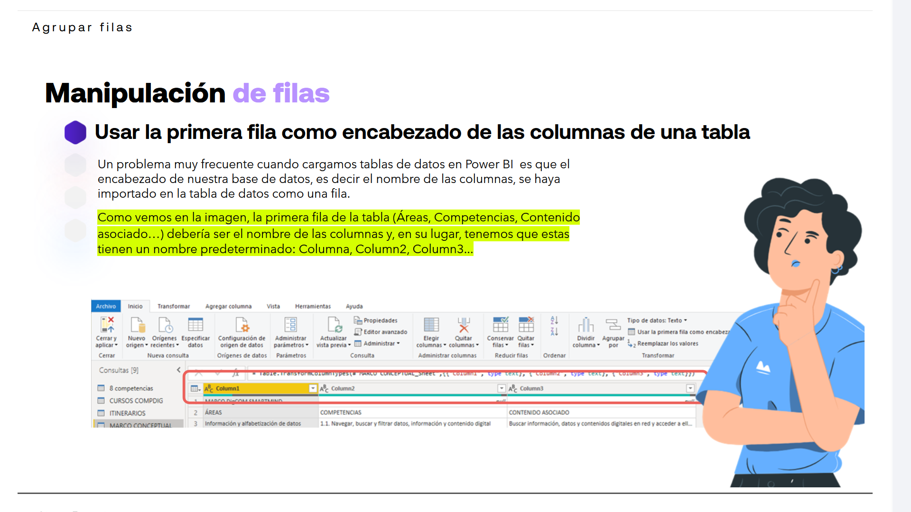
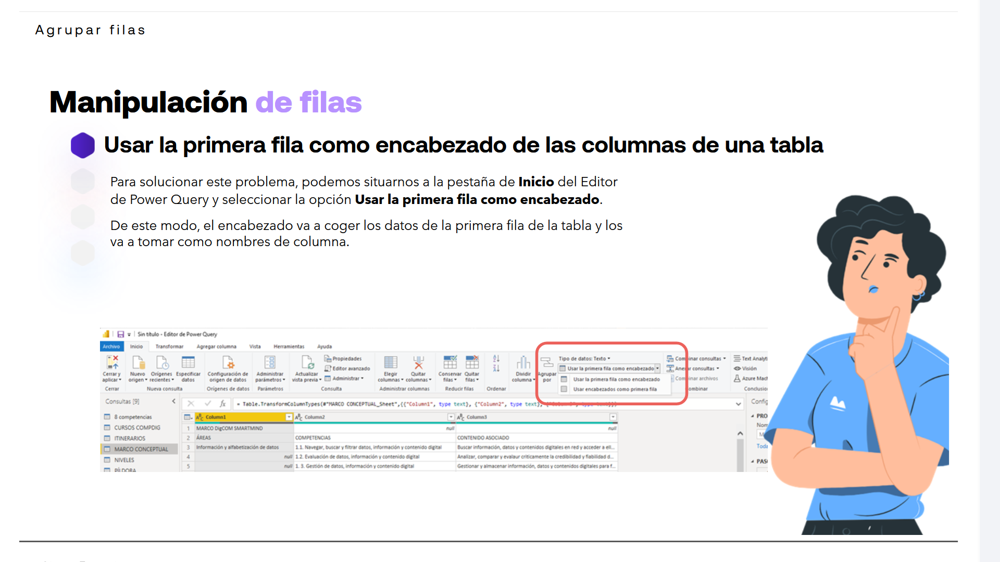
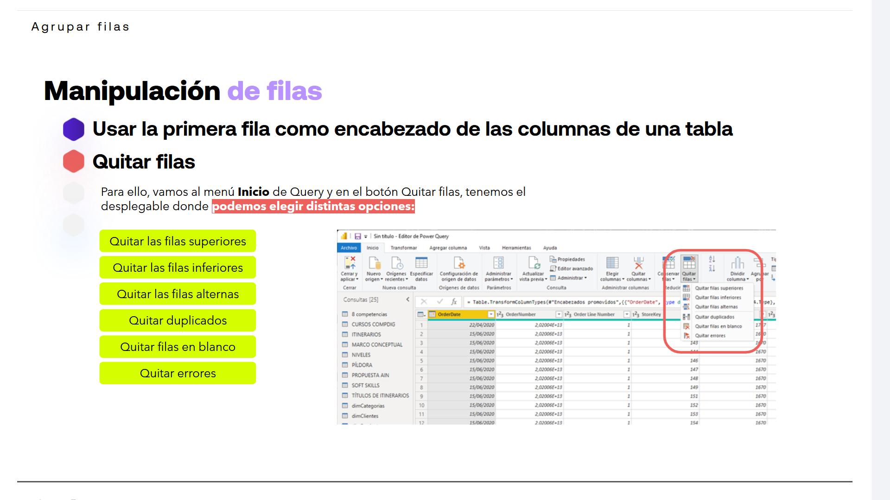
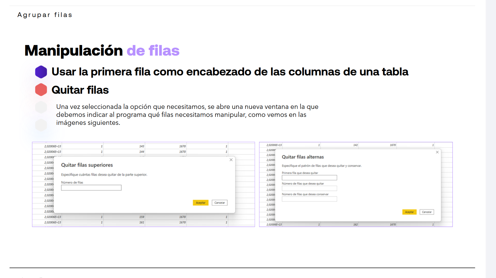
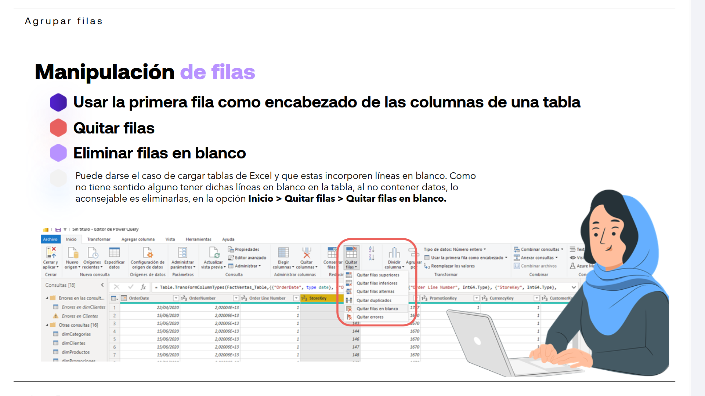
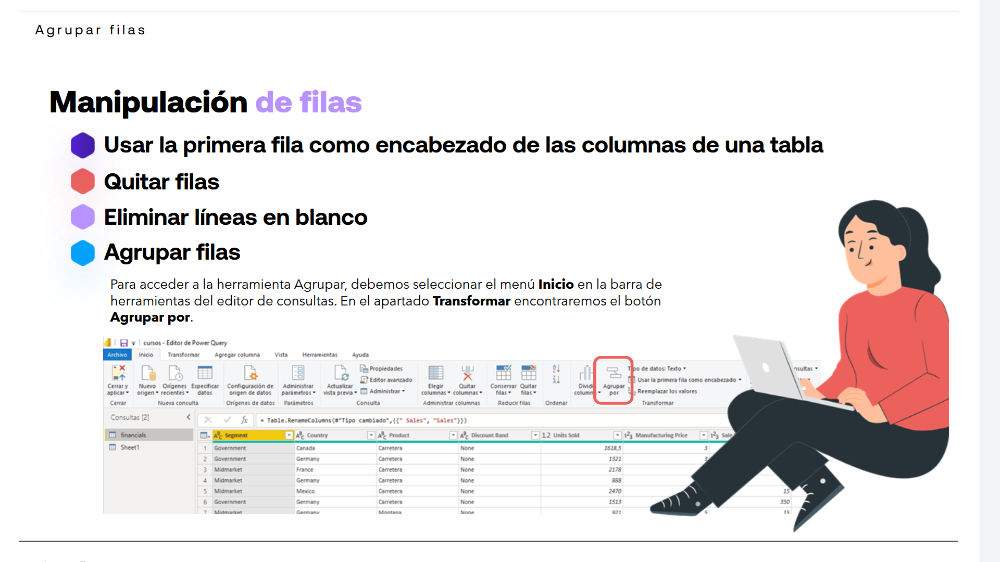
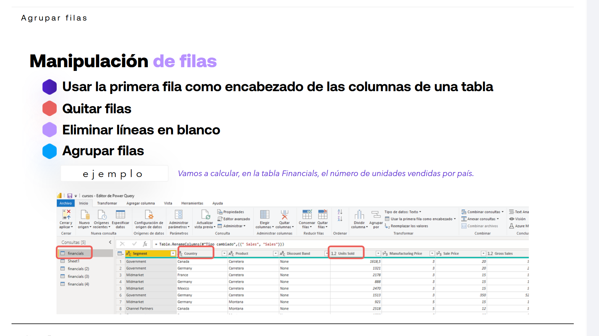
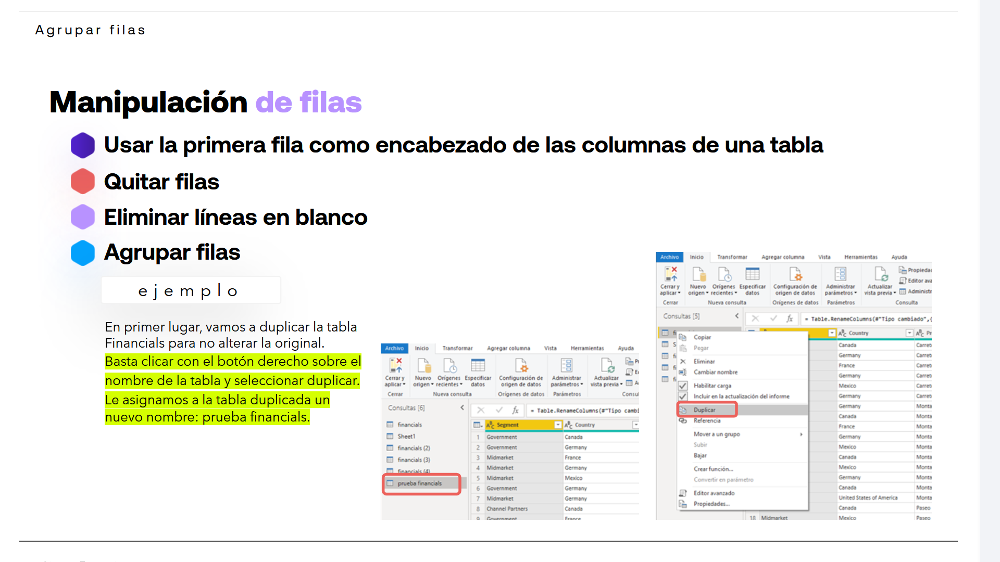
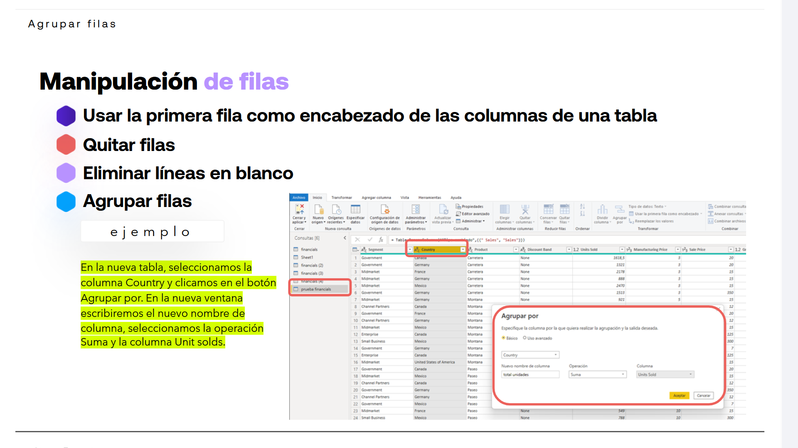
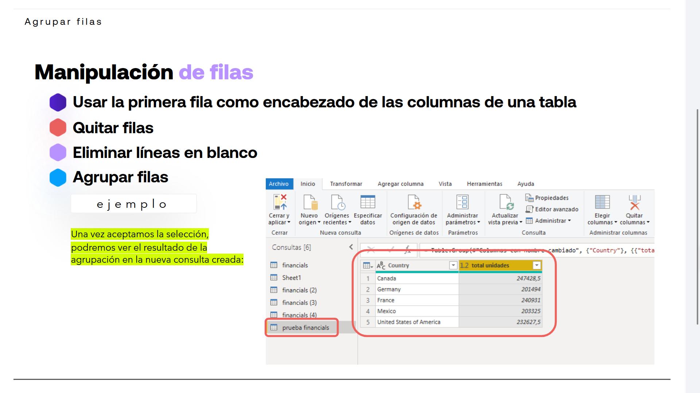

# 03-003:	Agrupar Filas

Veamos algunas de las manipulaciones que podemos hacer con Power Query en las filas de las tablas incorporadas a nuestro proyecto:

* **Usar la primera fila como encabezado de las columnas de una tabla.**
* **Quitar filas.**
* **Eliminar líneas en blanco.**
* **Agrupar filas.**

---

## Manipulación de filas

### Usar la primera fila como encabezado de las columnas de una tabla

Un problema muy frecuente cuando cargamos tablas de datos en Power BI es que el encabezado de nuestra base de datos, es decir el nombre de las columnas, se haya importado en la tabla de datos como una fila.

> [!NOTE]
> Como vemos en la imagen, la primera fila de la tabla (Áreas, Competencias, Contenido asociado...) debería ser el nombre de las columnas y, en su lugar, tenemos que estas tienen un nombre predeterminado: Columna, Column2, Column3...

Para solucionar este problema:

1.	Pestaña **Inicio** del Editor de Power Query
2.	Seleccionar la opción **Usar la primera fila como encabezado**.

De este modo, el encabezado va a coger los datos de la primera fila de la tabla y los va a tomar como nombres de columna.

---

### Quitar filas

En algunas ocasiones necesitaremos eliminar ciertas filas de las tablas, ya que contendrán información no necesaria para nuestro informe. Para ello, eliminamos fácilmente esas filas que no necesitamos mediante la opción **Quitar filas** del editor Power Query.

1.	Menú **Inicio** de Query
2. 	En el botón Quitar filas, tenemos el desplegable donde **podemos elegir distintas opciones:**

* **Quitar las filas superiores**
* **Quitar las filas inferiores**
* **Quitar las filas alternas**
* **Quitar duplicados**
* **Quitar filas en blanco**
* **Quitar errores**

3.	Una vez seleccionada la opción que necesitamos, se abre una nueva ventana en la que debemos indicar al programa qué filas necesitamos manipular, como vemos en las imágenes siguientes.

---

### Eliminar filas en blanco

Puede darse el caso de cargar tablas de Excel y que estas incorporen líneas en blanco. Como no tiene sentido alguno tener dichas líneas en blanco en la tabla, al no contener datos, lo aconsejable es eliminarlas

> [!WARNING]
> Aunque lo aconsejable es eliminar filas en blanco, en realidad es **MUY IMPORTANTE** saber qué hacer con dichas filas, cuando la columna pertenece a valores numéricos que después son usados para cálculos.
>
> Es decir, en una tabla consolidada que pueda tener columnas con valores económicos, o valores brutos, netos, relativos a números de ventas, pedidos, etc, quizás es más importante convertir esos valores en *null* para no romper las métricas y ser veraces en los datos.

1.	Menú **Inicio > 
2.	Botón **Quitar filas** > 
3.	**Quitar filas en blanco**

---

### Agrupar filas

> [!NOTE]
> Idéntico a Tablas Dinámicas en Excel.

En Power Query, podemos agrupar los valores de varias filas en un solo valor agrupando las filas según los valores de una o varias columnas. Podemos elegir entre dos tipos de operaciones de agrupación:

* **Agrupaciones de columnas**
* **Agrupaciones de filas**

Para acceder a la herramienta Agrupar:  

1.	Menú **Inicio**  >
2. 	En el apartado **Transformar** > 
3.	Botón **Agrupar por**.

* Esta funcionalidad del editor Query nos **permite agrupar conjuntos de filas** y **aplicar funciones de agregación sobre ellos**, como por ejemplo suma, promedio, contar, mínimo, máximo, etc.

* Por ejemplo, a partir de la tabla de clientes, podremos agrupar los datos por provincia y obtener una fila por cada provincia con el número de clientes que tenemos en ella.

* O podríamos obtener el número de empleados que nuestra organización tiene en esa provincia, incluyendo los costes salariales.

* La función **Agrupar por** es similar a las tablas dinámicas de Excel.

#### Ejemplo Agrupando Filas

> [!NOTE]
> *Vamos a calcular, en la tabla Financials, el número de unidades vendidas por país.*

1.	En primer lugar, vamos a duplicar la tabla Financials para no alterar la original.  
**Basta clicar con el botón derecho sobre el nombre de la tabla y seleccionar duplicar. Le asignamos a la tabla duplicada un nuevo nombre: prueba financials.**

2.	En la nueva tabla, **seleccionamos la columna Country y clicamos en el botón** ***Agrupar por***.  

3.	En la nueva ventana escribiremos el nuevo nombre de columna, seleccionamos la operación Suma y la columna Unit solds.**

4.	**Una vez aceptamos la selección, podremos ver el resultado de la agrupación en la nueva consulta creada:**

---