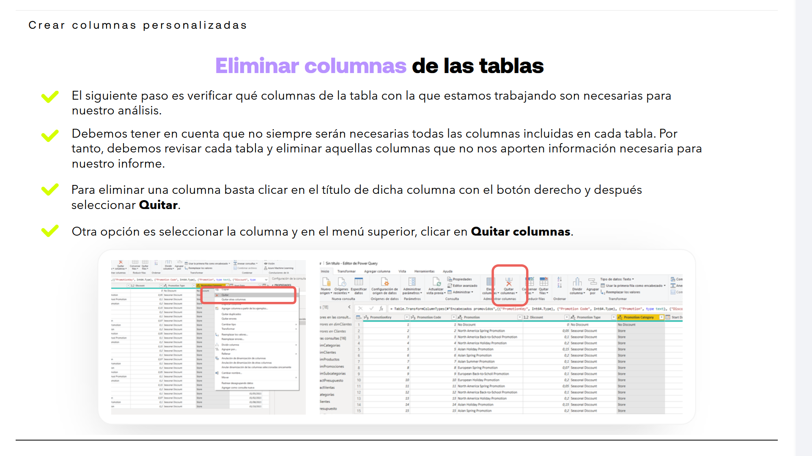
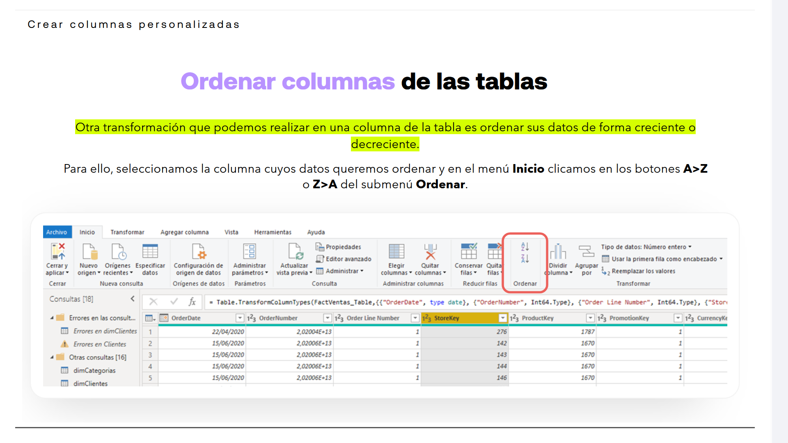
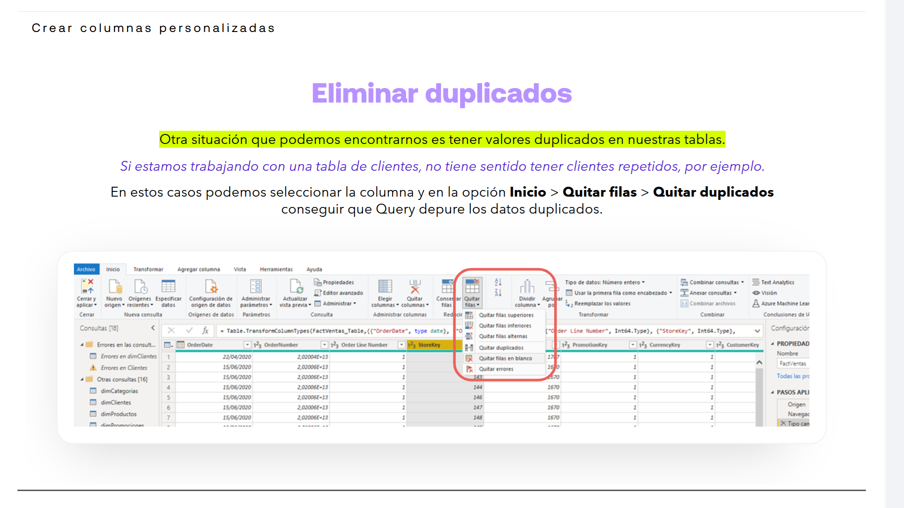

# 03-004:	Crear Columnas Dinámicas

## Eliminar columnas de las tablas

El siguiente paso es verificar qué columnas de la tabla con la que estamos trabajando son necesarias para nuestro análisis.

> [!IMPORTANT]
> Debe tenerse en cuenta que no siempre serán necesarias todas las columnas incluidas en cada tabla. Por tanto, debemos revisar cada tabla y eliminar aquellas columnas que no nos aporten información necesaria para nuestro informe.

Para eliminar una columna:  

1.	Click en el título de dicha columna con el botón derecho.

2. 	Después **Quitar**.

Otra opción es seleccionar la columna y en el menú superior, clicar en **Quitar columnas**.

> [!WARNING]
> Al quitar columnas, quitas datos, quitas un indicador concreto de datos. Verifica realmente si necesitas tener esos datos o no.

> [!NOTE]
> Si te equivocas, vuelve a **Pasos Aplicados** y deshaz lo que necesites.

No te preocupes si haces un cambio en las tablas, como borrar accidentalmente la columna equivocada, ya que en la columna de Pasos aplicados podrás encontrar cada cambio realizado en la tabla y eliminar aquellos que desees, sin más que clicar en el aspa del cambio que queremos revertir.

---

### Ordenar columnas de las tablas

> [!NOTE]
> Otra transformación que podemos realizar en una columna de la tabla es ordenar sus datos de forma creciente (A->Z) o decreciente (Z->A).

1. Seleccionamos la columna cuyos datos queremos ordenar

2. Menú **Inicio** > 
3. Click en los botones **A>Z** o **Z>A** del submenú **Ordenar**.

---

### Eliminar duplicados

> [!NOTE]
> Otra situación que podemos encontrarnos es tener valores duplicados en nuestras tablas.

> [!WARNING]
> Un valor duplicado no significa que deba ser eliminado. Eliminarás tantas filas como contengan esos valores. Imagina una tabla con resultados similares, pero que deben mantenerse porque son datos **diferenciados** aunque sean el mismo.

* En cambio, **si estamos trabajando con una tabla de clientes, no tiene sentido tener clientes repetidos**, por ejemplo.  
* Para esos casos:

1. Seleccionar la columna

2. **Inicio** > 
3. **Quitar filas** > 
3. **Quitar duplicados** 

Query depurará los datos duplicados.
