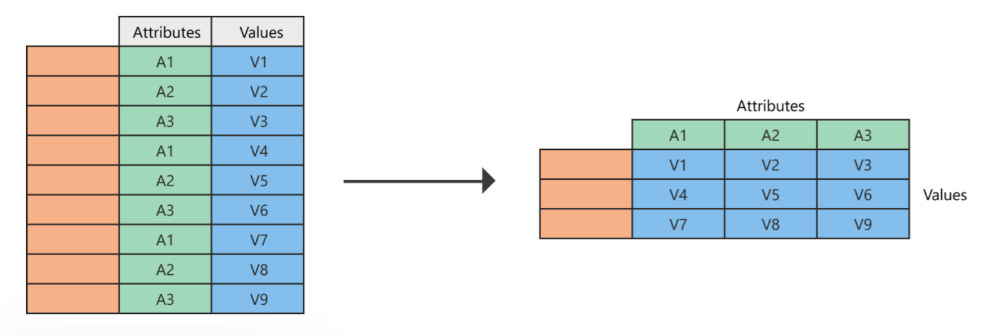
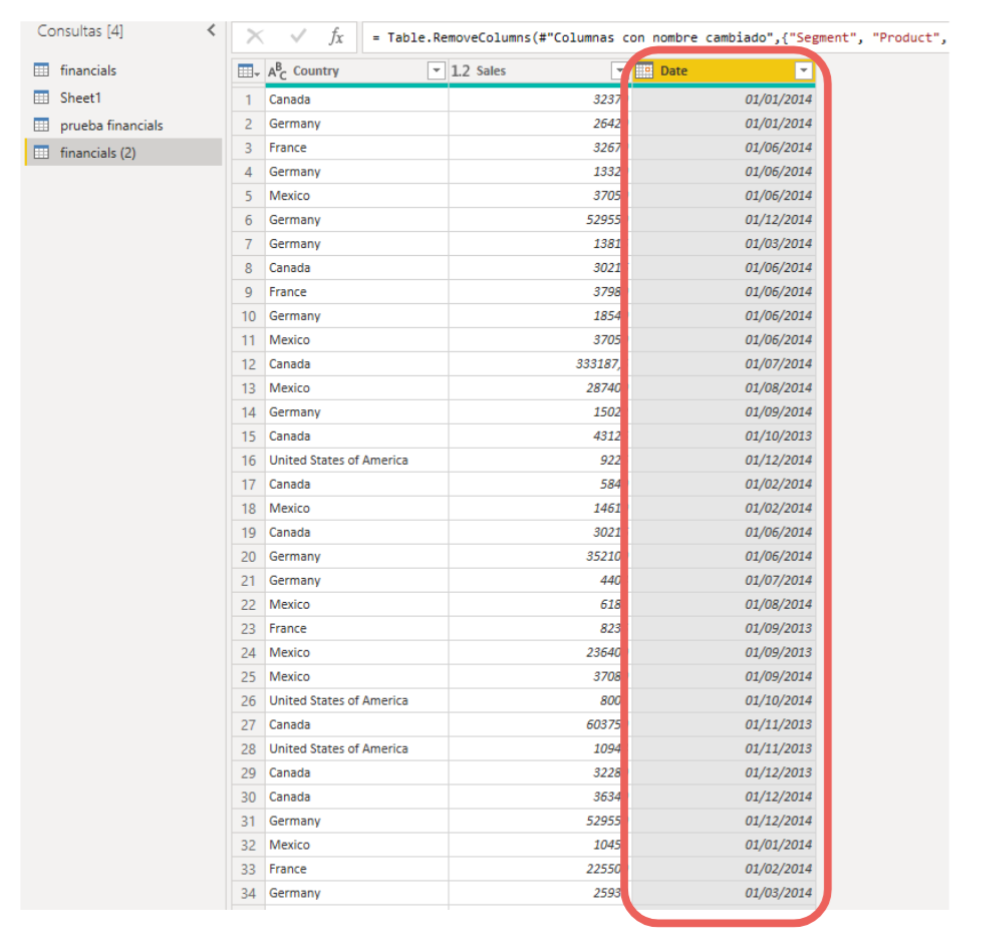
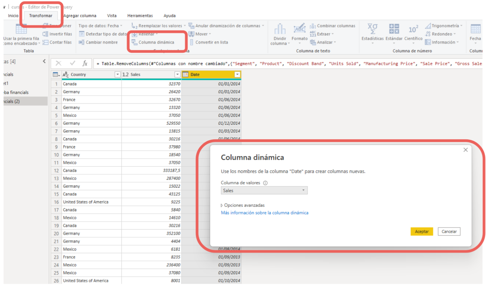
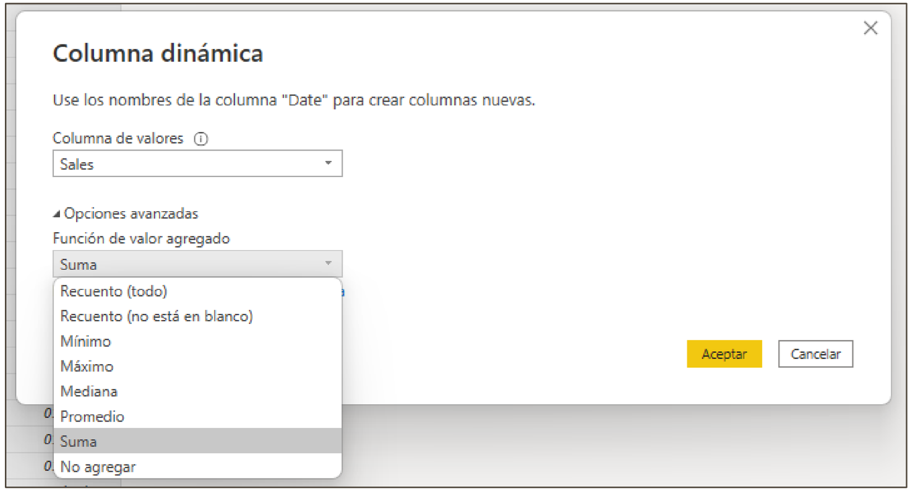
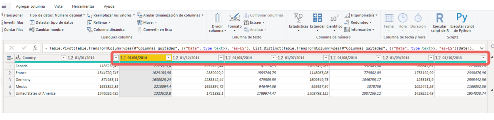

# 03-005:	Dinamizar Columnas

> [!IMPORTANT]
> Otra opción tan importante y útil como dinamizar comlumnas, es DESDINAMIZARLAS, **unpivot** (en tablas que agrupan columnas internas dentro de filas, dentro de otras, que predominan el diseño visual sin tener en cuenta la presentación de datos en un formato BBDD real, ... 
>
> Aquí se muestra el paso para dinamizar, pero recoge la noción contraria también.

[Lectura](./03-005_01_Lectura_Dinamizar_columnas_que_es.pdf)

- En Power Query podemos crear una tabla que contenga un valor agregado para cada
valor único de una columna.  

- Power Query agrupará cada valor único, realizando un cálculo agregado para cada valor y dinamizando la columna en una nueva tabla.

### Ejemplo dinamizando Columnas

- Supongamos la siguiente tabla, en la que tenemos una columna con datos de ventas por país correspondientes a distintas fechas.

- En este ejemplo, deseamos transformar esta tabla en la que se dinamiza la
columna de fecha.

Para dinamizar la columna de fechas ...:  

1. 	Seleccionamos dicha Columna.
2.	En pestaña **Transformar** >, 
3.	Botón **Columna dinámica**. 

4.	En el cuadro de diálogo de columna dinámica en la columna de valores seleccionaremos Sales y haremos clic en aceptar.

- De forma predeterminada, Power Query intentará realizar una suma como agregación, pero podemos seleccionar la opción Avanzadas para ver otras agregaciones disponibles:

*	Recuento (todos)
*	Recuento (no en blanco)
*	Mínimo
*	Máximo
*	Mediana
*	Promedio
*	Suma
*	No agregar

5.	Finalmente, tendremos nuestra nueva consulta con la columna de fechas
dinamizada:

---
