# 03-007:	Columnas Condicionales

[Lectura](./03-007_01_Lectura_Columnas_Condicionales.pdf)

> [!IMPORTANT]
Una opción interesante en Power Query es la de establecer condiciones por medio de la opción Columna condicional.

Para acceder a esta funcionalidad:  

1. 	En el apartado **Añadir columna** de la barra de herramientas de Query.
2.	Seleccionar el botón **Columna condicional** 

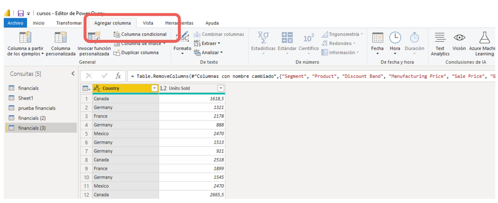

3. Se nos abrirá una ventana donde pondremos el nombre de nuestra columna, seguido de los detalles de la condición, que son:
	- El nombre de la columna a evaluar
	- El Operador o tipo de condición
	- El valor con el cual comparar, que puede ser arbitrario, o seleccionar una columna existente para comparar su valor.
	- Lo que debe devolver en caso de cumplir dicha condición
	- Además, se puede agregar una cláusula adicional, es decir, una segunda pregunta condicional, generando lo que se conoce como condicional anidado.
	- Finalmente, podemos detallar el valor a devolver en caso de que ninguna condición se cumpla.

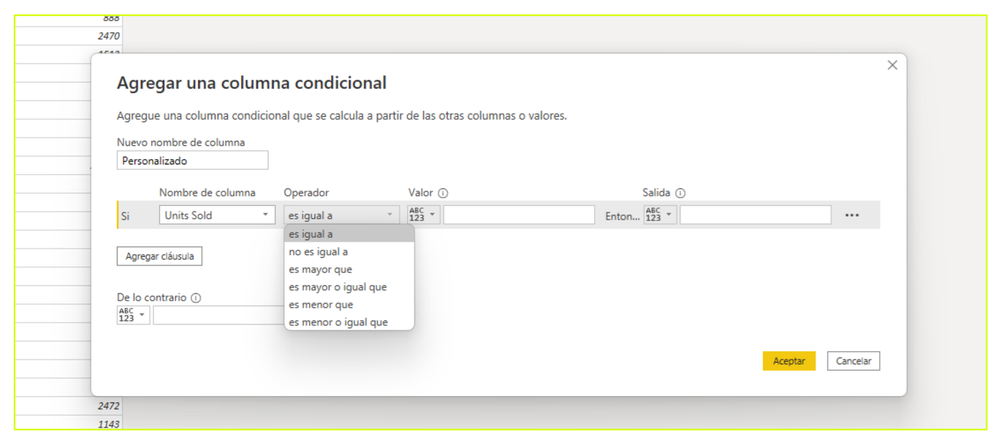

#### Ejemplo de columnas Condicionales

Por ejemplo, en la tabla de la imagen, podemos agregar una columna condicional para revisar los datos correspondientes a menos de 1.000 unidades vendidas. Si el dato es superior, no revisaremos esos casos.  

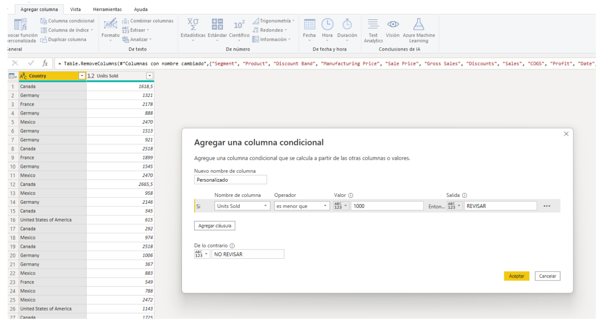

El resultado obtenido es una nueva columna agregada en el que se identifican los datos que cumplen las condiciones seleccionadas.  

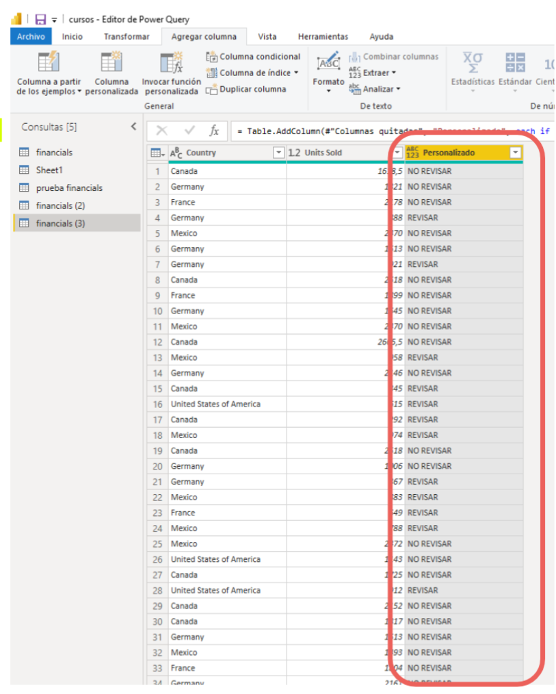

---

### Dependencias de las consultas

Cuando trabajamos con una gran cantidad de consultas en Power Query, podemos encontrarnos, por ejemplo, con **errores en una consulta que no somos capaces de identificar su origen, ya que pueden venir de consultas anteriores**.  

En estos casos resulta muy útil la herramienta **Dependencias de la consulta**, funcionalidad que nos facilita la visualización gráfica de las dependencias.  

En Power Query, podemos obtener una representación gráfica de las operaciones realizadas accediendo a ella desde:    
1. Ficha **Vista** > 
2. Grupo **Dependencias** > 
3. Botón **Dependencias de la consulta**, situado en el entorno de Power Query.

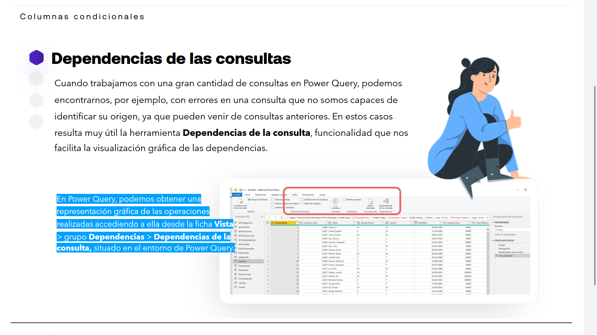

---

- Esta herramienta nos ofrece un **mapa completo de orígenes, relaciones y dependencias de todas las consultas** existentes en nuestro libro de trabajo.

- Además **permite la traza de dependientes y precedentes de principio a fin** marcando en el mapa cualquiera de las consultas, marcándolas en verde:**

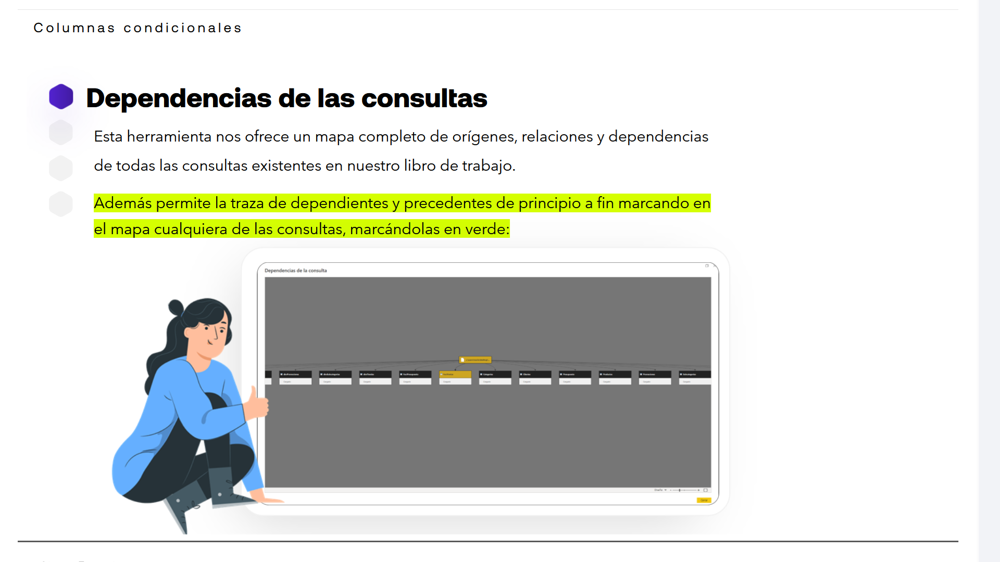

- Una posibilidad interesante es la que nos permite cambiar el aspecto de la vista del diseño del mapa con el desplegable de abajo 'Diseño' con varias opciones:
	* **De arriba abajo**
	* **De abajo arriba**
	* **De izquierda a derecha**
	* **De derecha a izquierda**

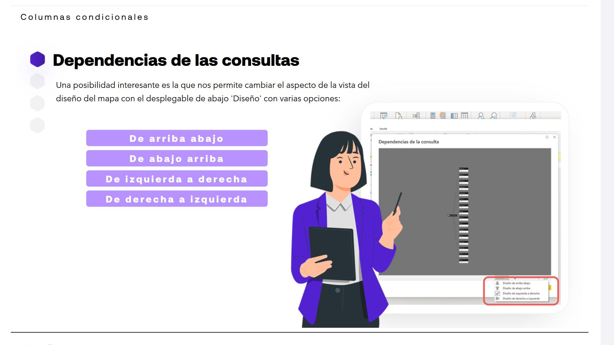

---

### Aplicar las transformaciones

Todas las transformaciones realizadas en Power Query no serán aplicadas a nuestro archivo de Power BI, ya que continuamos en el entorno de Query.  

Para llevar los cambios a Power BI debemos volver a este programa. Para ello:

1. En el editor Query debemos clicar en **Inicio** > 
2. **Cerrar y aplicar**. 

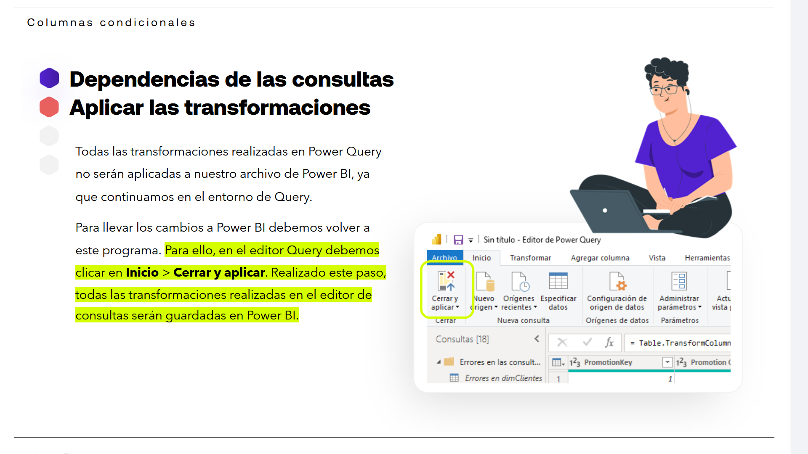

3. Realizado este paso, todas las transformaciones realizadas en el editor de consultas serán guardadas en Power BI.

---

### Visualizar la tabla ya transformada

**Una vez cerrado el Editor de consultas, podemos visualizar nuestras tablas ya transformadas en la vista de datos.**  

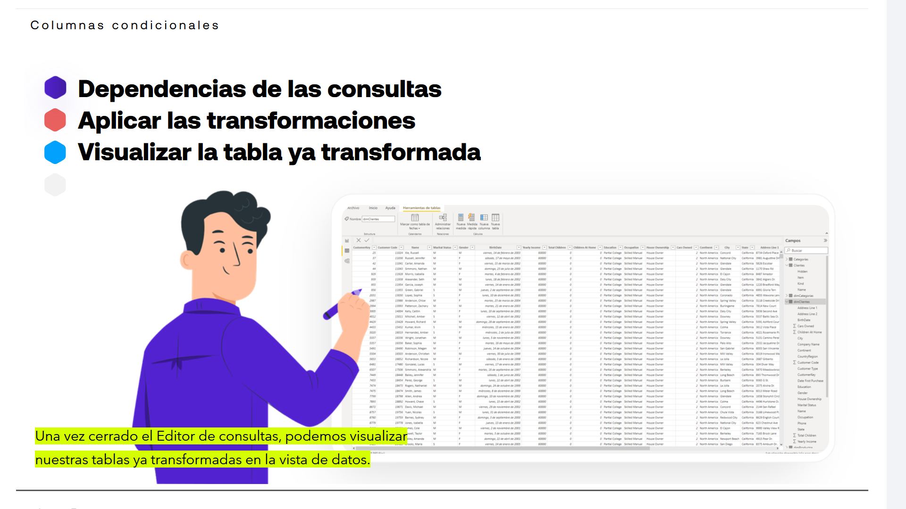

---

### Guardar la tabla ya transformada

Finalmente, debemos guardar los cambios realizados en las tablas, en un archivo Power BI en nuestro equipo.  

Para ello, seguimos el procedimiento habitual: **Archivo > Guardar, seleccionado su ubicación y dándole nombre al archivo.**  

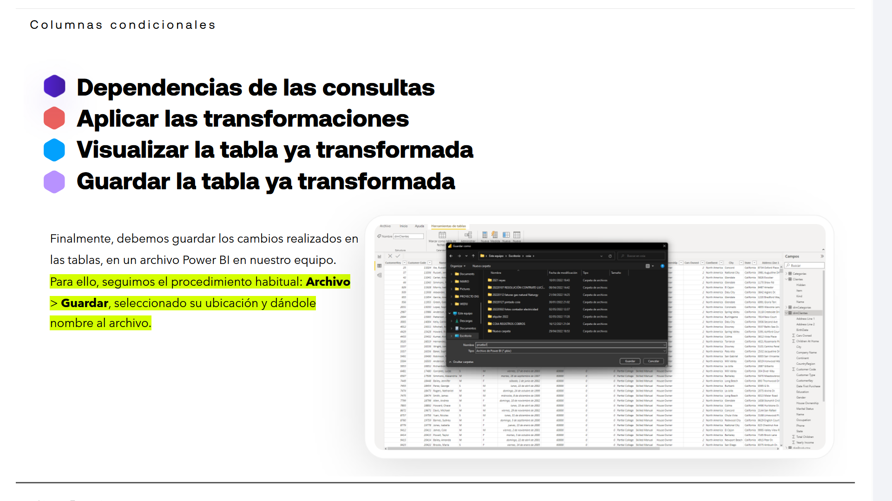

---

## RESUMEN

### Factores a considerar para escoger el objeto visual

> [!IMPORTANT]
La visualización de datos puede ayudar a construir una historia sólida. La clave para diseñar un buen informe de Business Intelligence es asegurarnos de utilizar los objetos visuales correctos para mostrar los datos.

**¿Cómo podemos saber cuáles son las visualizaciones más adecuadas para usar en nuestros informes?**

Probablemente necesitemos realizar múltiples pruebas y modificaciones hasta encontrar el diseño certero, pero estaremos más cerca de él si tenemos en cuenta tres claves:

- 	**Las características de los datos:** Debemos prever la cantidad de variables que serán mostradas, los datos que se seleccionarán para cada variable, la escala de tiempo de esos datos, el uso individual de estos datos o de forma agregada, etc.

-	**La historia que debemos contar:** Nos ofrecerá información relevante sobre los tipos de visualizaciones que se podrán usar.

-  **La audiencia y receptores del informe:** Según sean los usuarios del informe, la selección de objeto visuales y la forma de contar la historia serán diferentes.

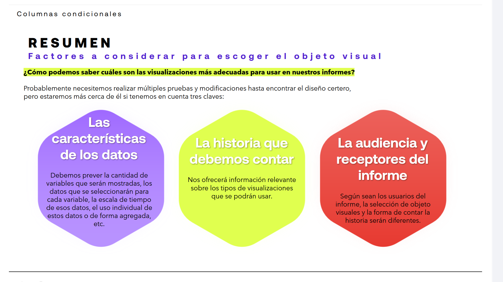