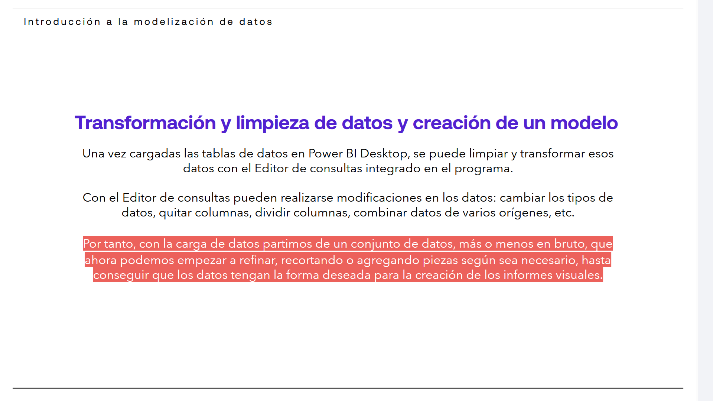
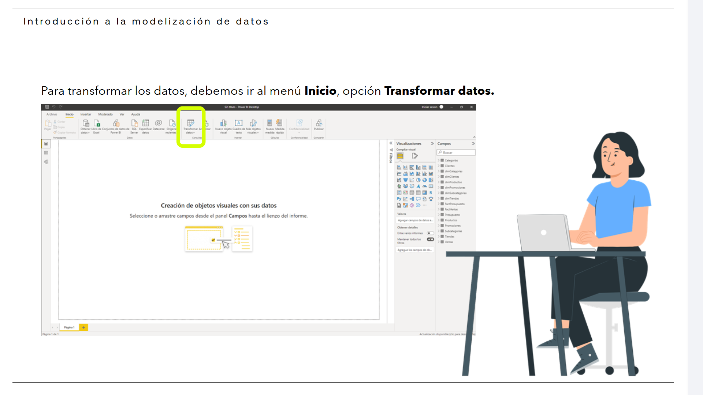
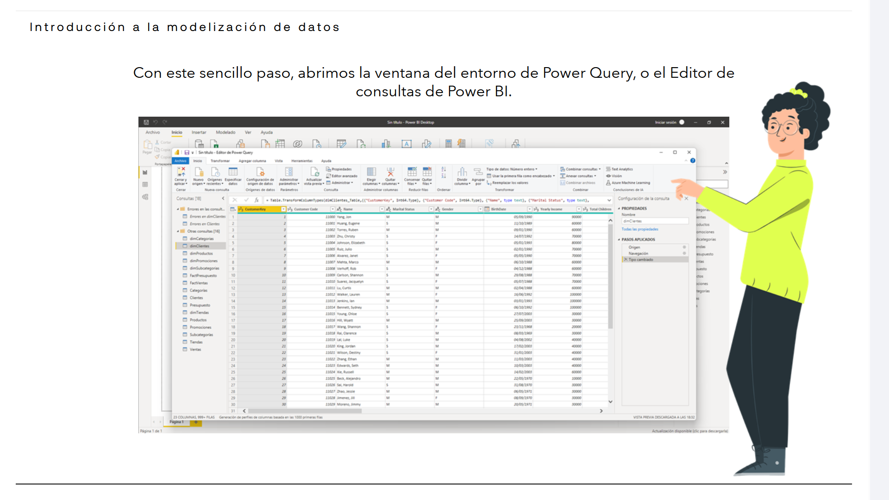
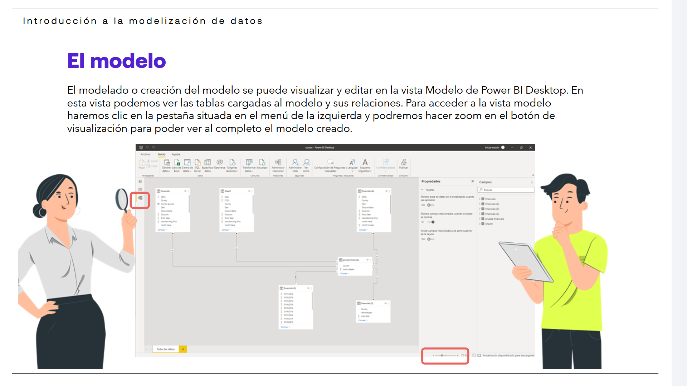
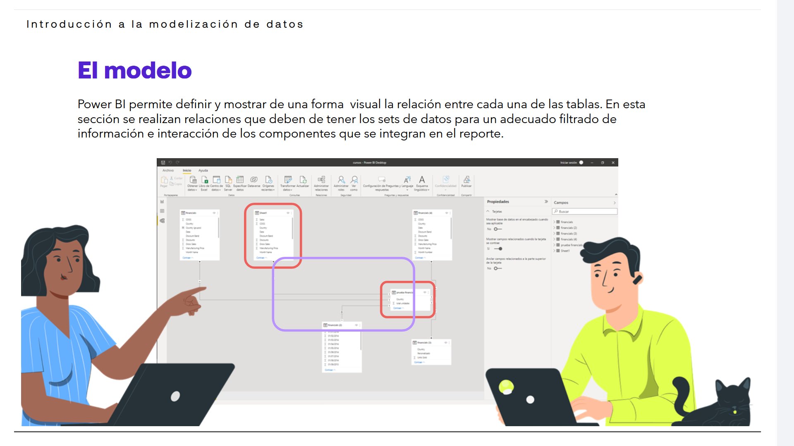
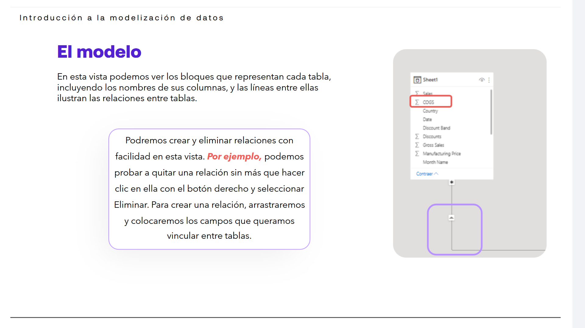

# 04-001:	Introducción a la modelización de datos

## ETL - Transformación y limpieza de datos y creación de un modelo

> [!IMPORTANT]
> El proceso de ETL (Extract, Transform, Load data) es el proceso completo que un ingeniero de datos, o un especialista en IA, llevan a cabo para poner a disposición los datos ya homogeneizados y ajustados para su uso.
>  
> Si anteriormente hemos visto el minado, la **E**xtracción, la preparación de orígenes de datos, aquí vemos la **T**ransformación.

Una vez cargadas las tablas de datos en Power BI Desktop, se puede limpiar y transformar esos datos con el Editor de consultas integrado en el programa.  

Con el **Editor de consultas** pueden realizarse modificaciones en los datos, como:
- Cambiar los tipos de datos
- Quitar columnas
- Dividir columnas
- Combinar datos de varios orígenes

Por tanto, con la carga de datos:

1. Partimos de un conjunto de datos, más o menos en bruto...
2. Que ahora podemos empezar a refinar, recortando o agregando piezas según sea necesario...
3. Hasta conseguir que los datos tengan la forma deseada para la creación de los informes visuales.

4. Para transformar los datos, debemos ir al menú **Inicio**, opción **Transformar datos**
5. Con este sencillo paso, abrimos la ventana del entorno de Power Query, o el Editor de consultas de Power BI.

> [!NOTE]
> El editor de Power Query es la mejor herramienta para un proceso de ETL muy limpio y depurado.

6. Cada paso realizado para transformar los datos se registrará en el **Editor de consultas** y, cada vez que esta consulta se conecta al origen de datos, dichos pasos **se vuelven a aplicar para que los datos siempre muestren la forma** que especificamos.

7. En la imagen siguiente se muestra el panel Configuración de la consulta para una consulta que se ha formado y se ha convertido en un modelo.

8. Una vez que los datos tienen la forma deseada, se podrán crear los objetos visuales deseados].

	
---

## Relaciones del Modelo

> [!IMPORTANT]
> Una de las principales ventajas de Power BI reside es que no es necesario integrar todos los datos del proyecto en una tabla, ya que **podemos emplear diversas tablas procedentes de distintos orígenes**, **definiendo las relaciones que las interconecten entre ellas**.

- Además, Power BI permite, a partir del modelado de los datos, la **creación de cálculos personalizados y establecer métricas para el análisis de segmentos particulares** de los datos integrados al proyecto.  

- Todas esta medidas y métricas podrán dar origen a las posteriores visualizaciones de los datos por medio de los objetos visuales creados.

### Visualizar y Editar el modelo

> [!IMPORTANT]
> El modelado o creación del modelo se puede visualizar y editar en la **vista de Modelo** de Power BI Desktop.  

En esta vista podemos ver las tablas cargadas al modelo y sus relaciones. Para acceder a la vista modelo:

1. Click en la pestaña situada en el menú de la izquierda >
2. Botón Vista de Modelo >
2. Dentro de panel de vista de modelo, podemos hacer zoom en el botón de visualización para poder ver al completo el modelo creado.

> [!IMPORTANT]
> Aquí, Power BI permite definir y mostrar de una forma visual la relación entre cada una de las tablas.  

En esta sección se realizan relaciones que deben de tener los sets de datos para un adecuado filtrado de información e interacción de los componentes que se integran en el reporte.  

Dentro de esta vista podemos ver los bloques que representan cada tabla, incluyendo los nombres de sus columnas, y las líneas entre ellas ilustran las relaciones entre tablas.  

Podremos crear y eliminar relaciones con facilidad en esta vista, por ejemplo:
- Quitar una relación sin más que hacer clic en ella con el botón derecho y seleccionar Eliminar. 
- Para crear una relación, arrastraremos y colocaremos los campos que queramos vincular entre tablas.

---

## Tipos de Modelado

1. Modelado Relacional
2. Modelado en Estrella

### Modelado relacional

> [!IMPORTANT]
> Como un **estándar de las bases de datos**, las relaciones que se establecen entre las tablas de datos deben obedecer a un modelo relacional, donde las claves de cada uno de los sets de datos deben corresponderse de acuerdo con el negocio que se desea representar en el manejo de la información.  

- Tipo de relación (Rol):	**1-a-1**  

Por ello, se debe **organizar la información de una forma optimizada** para que a la hora de presentar los datos en PowerBI se dé una fácil interacción entre los componentes y el resultado que se desea obtener con la visualización de los datos.

> [!NOTE]
> En este sentido, es importante que la información tenga un flujo de acuerdo con la jerarquía de cada uno de set de datos.

---

### Modelado en estrella

> [!IMPORTANT]
> Este modelo se basa en una **tabla o set central** de datos, denominada **de hechos**, a la que **se conectan otras tablas satélite** denominadas **de dimensiones**.

- Tipo de relación (Rol):	**1-a-todos**  

* Power BI funciona mejor con modelos tabulares diseñados con esquema en forma de estrella.   

* Todas ellas se conectan por las claves que le da la relación y que permiten que el análisis se de forma independiente por cada set de datos o tabla, conformando la forma, de estrella, que da nombre a este tipo de modelado.

---

