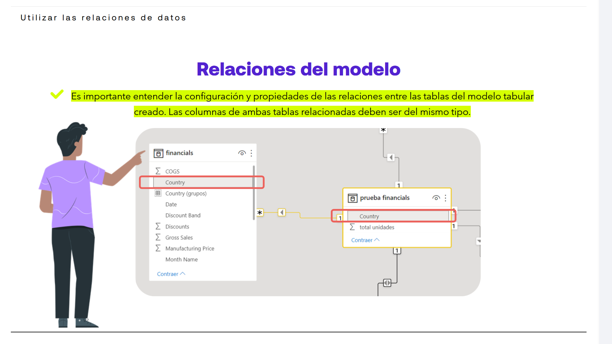
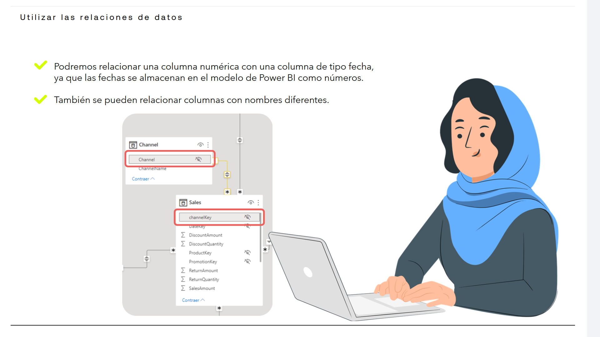
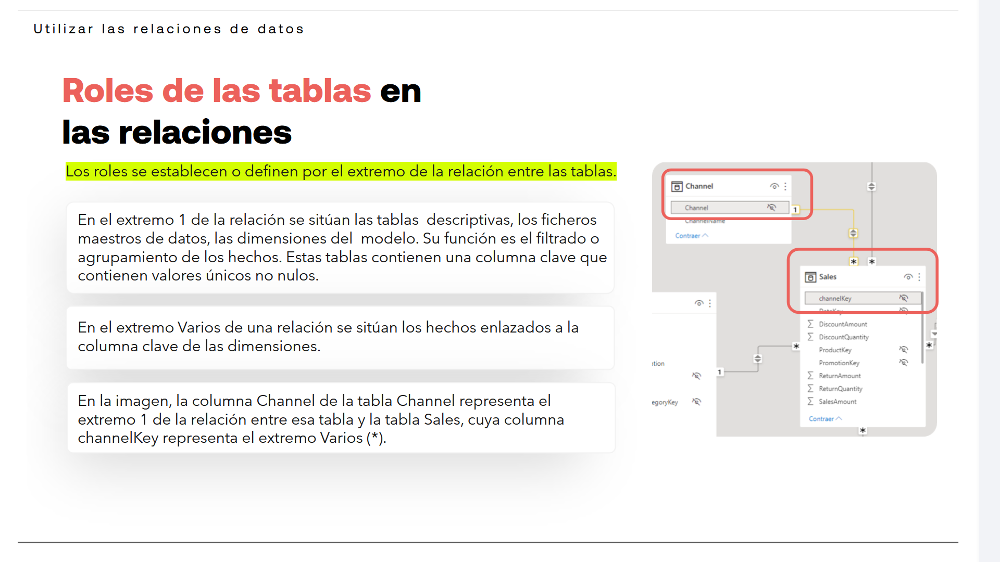
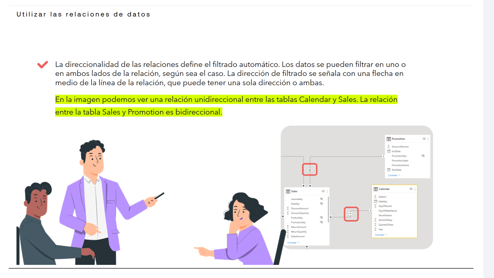

# 04-002:	Utilizar las relaciones de datos

## Relaciones del modelo

> [!IMPORTANT]
> Es importante entender la configuración y propiedades de las relaciones entre las tablas del modelo tabular creado. Las columnas de ambas tablas relacionadas deben ser del mismo tipo.

- Por ejemplo, podríamos relacionar una columna numérica con una columna de tipo fecha, ya que las fechas se almacenan en el modelo de Power BI como números.

- También se pueden relacionar columnas con nombres diferentes.

---

## Roles de las tablas en las relaciones

### Tipos de Relación (Rol, CARDINALIDAD)

> [!IMPORTANT]
> Los roles (**CARDINALIDAD**, su **DIRECCIONALIDAD** y la **NAVEGABILIDAD** de los datos resultante) se establecen o definen por el extremo de la relación entre las tablas.

- En el extremo `1 `de la relación se sitúan las **tablas descriptivas**, los **ficheros maestros de datos**, las **dimensiones del modelo**. 
- Su función es el **filtrado o agrupamiento de los hechos**. 
- Estas tablas contienen una columna clave que contienen valores únicos no nulos.

- En el extremo `Varios` de una relación se sitúan los hechos enlazados a la columna clave de las dimensiones.

En la imagen, la columna Channel de la tabla Channel representa el extremo `1` de la relación entre esa tabla y la tabla Sales, cuya columna channelKey representa el extremo `Varios (*)`.  

### Direccionalidad (y navegabilidad ímplicita) 

> [!IMPORTANT]
> La direccionalidad de las relaciones **definirá después el filtrado automático**.

- **Única**, `->`, unidireccional.
- **Ambas** `<->`, bidireccional.

- Los datos se pueden filtrar en uno o en ambos lados de la relación, según sea el caso.  

- La dirección de filtrado se señala con una flecha en medio de la línea de la relación, que puede tener una sola dirección o ambas.

En la imagen podemos ver una relación unidireccional entre las tablas Calendar y Sales. La relación entre la tabla Sales y Promotion es bidireccional.  

