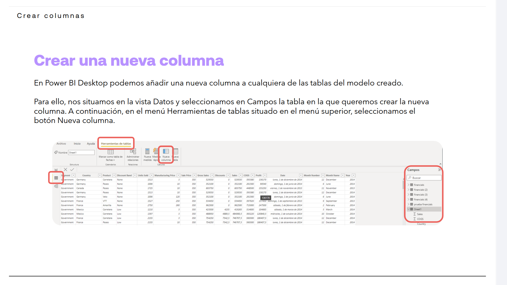
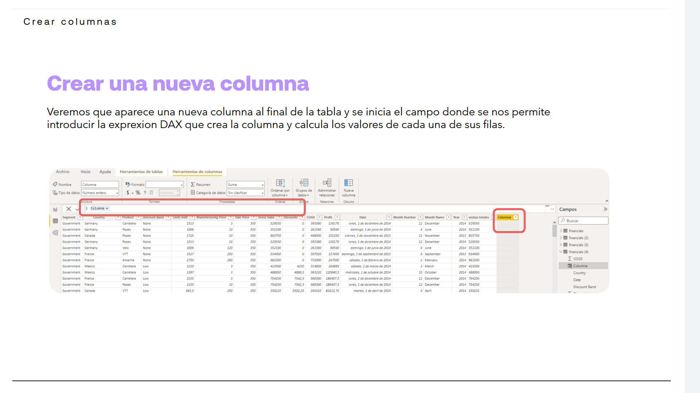
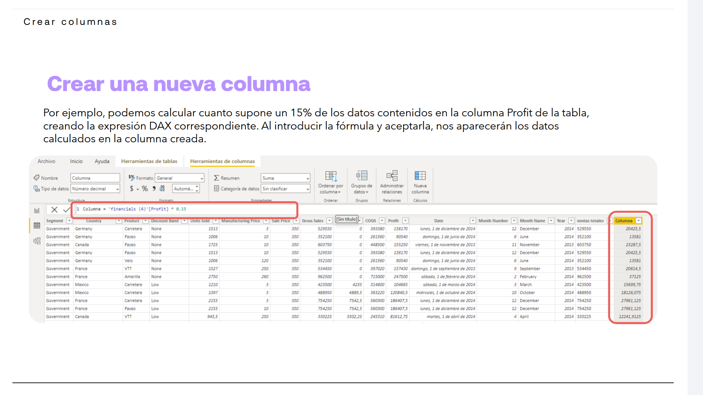
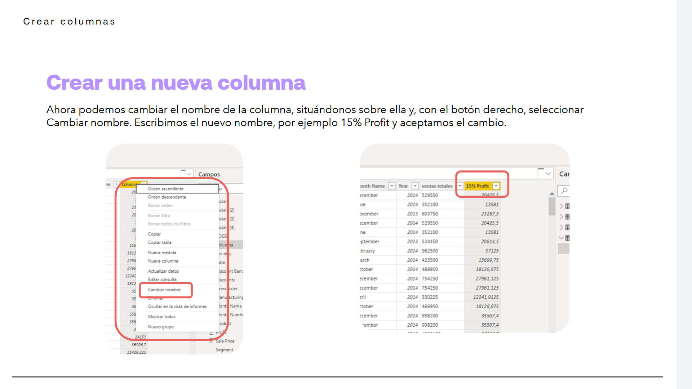

# 04-003:	Creación de Columnas

## Crear una nueva columna

En Power BI Desktop podemos añadir una nueva columna a cualquiera de las tablas del modelo creado. Para ello:  

1.	Nos situamos en la vista Datos >
2.	Seleccionamos en **Campos** la tabla en la que queremos crear la nueva columna.   
3.	En el menú **Herramientas de tablas** situado en el menú superior, seleccionamos el **botón Nueva columna**.  

4.	Veremos que aparece una nueva columna al final de la tabla.
5.	Se inicia el campo donde **se nos permite introducir la expresion DAX** que crea la columna y calcula los valores de cada una de sus filas.  

6.	Por ejemplo, podemos calcular cuanto supone un 15% de los datos contenidos en la columna Profit de la tabla, creando la expresión DAX correspondiente.  

7.	Al introducir la fórmula y aceptarla, nos aparecerán los datos calculados en la columna creada.  

8.	Ahora podemos cambiar el nombre de la columna, situándonos sobre ella y, con el botón derecho, seleccionar **Cambiar nombre**.  

9.	Escribimos el nuevo nombre, por ejemplo `15% Profit` y aceptamos el cambio.  

