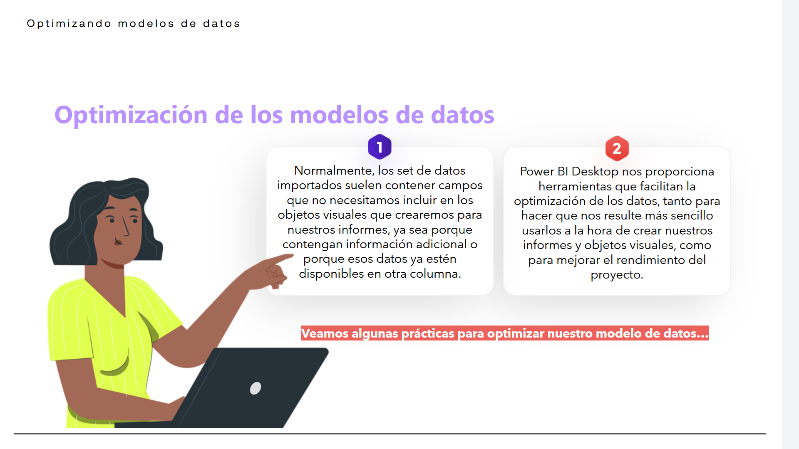
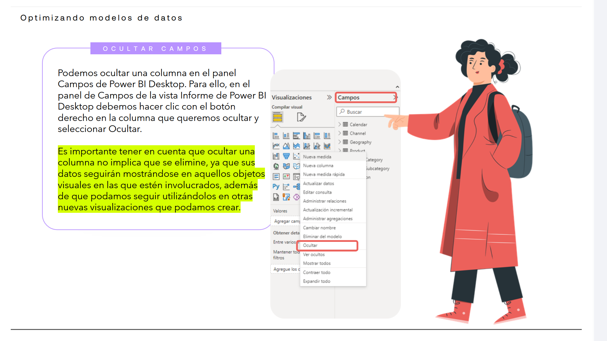
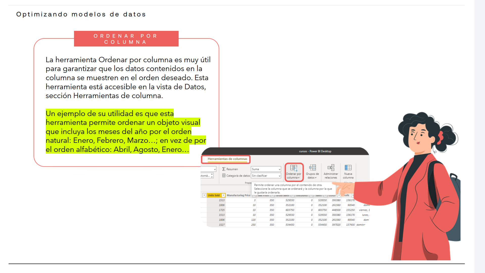
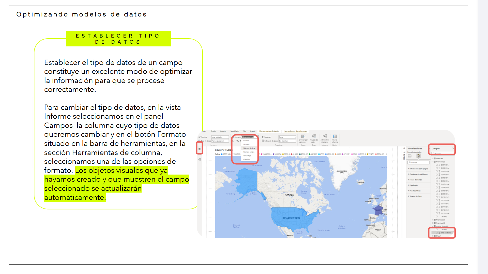

# 04-004:	Optimizando modelos de datos

Normalmente, **los set de datos importados suelen contener campos que no necesitamos** incluir, o **que están sucios**, en los objetos visuales que crearemos para nuestros informes, ya sea porque contengan información adicional o porque esos datos ya estén disponibles en otra columna.  

> [!IMPORTANT]
> Power BI Desktop nos proporciona herramientas que facilitan la optimización de los datos, tanto para hacer que nos resulte más sencillo usarlos a la hora de crear nuestros informes y objetos visuales, como para mejorar el rendimiento del proyecto.  

---

### OCULTAR CAMPOS

> [!WARNING]
> Es importante tener en cuenta que ocultar una columna no implica que se elimine, ya que sus datos seguirán mostrándose en aquellos objetos visuales en las que estén involucrados, además de que podamos seguir utilizándolos en otras nuevas visualizaciones que podamos crear.

Podemos ocultar una columna en el panel Campos de Power BI Deskto, para ello:

1.  Dentro de la Vista de Informe >
2.  Panel de **Campos de la vista Informe** >
3.	Click on el botón derecho en la columna que queremos ocultar y seleccionar Ocultar.  

---

### ORDENAR POR COLUMNA

> [!IMPORTANT]
> Permite ordenar un objeto visual, por ejemplo, que incluya los meses del año por el orden natural: Enero, Febrero, Marzo...; en vez de por el orden alfabético: Abril, Agosto, Enero...

La herramienta Ordenar por columna es muy útil para garantizar que los datos contenidos en la columna se muestren en el orden deseado.  

Esta herramienta está accesible en la **Vista de Datos** >  Sección **Herramientas de columna**.  

---

### ESTABLECER EL TIPO DE DATOS

Establecer el tipo de datos de un campo constituye un excelente modo de optimizar la información para que se procese correctamente.  

Para cambiar el tipo de datos:  

1. En la **Vista de Informe** 
2. Seleccionamos en el panel **Campos** la columna cuyo tipo de datos queremos cambiar.
3. En la sección **Herramientas de columna** > 
4. En el **botón Formato** situado en la barra de herramientas >
5. Seleccionamos una de las opciones de formato.  

> [!NOTE]
> Los objetos visuales que ya hayamos creado y que muestren el campo seleccionado se actualizaráN automáticamente.
