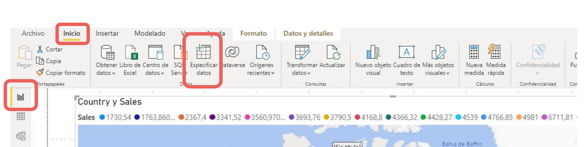
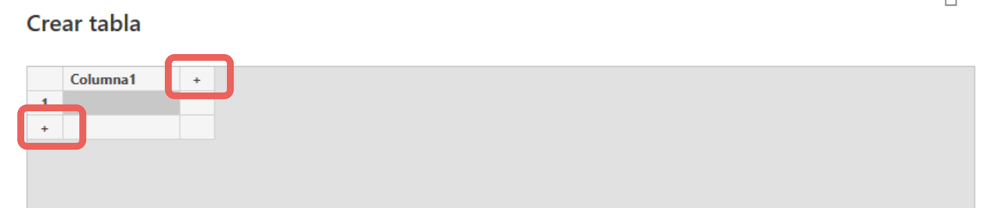
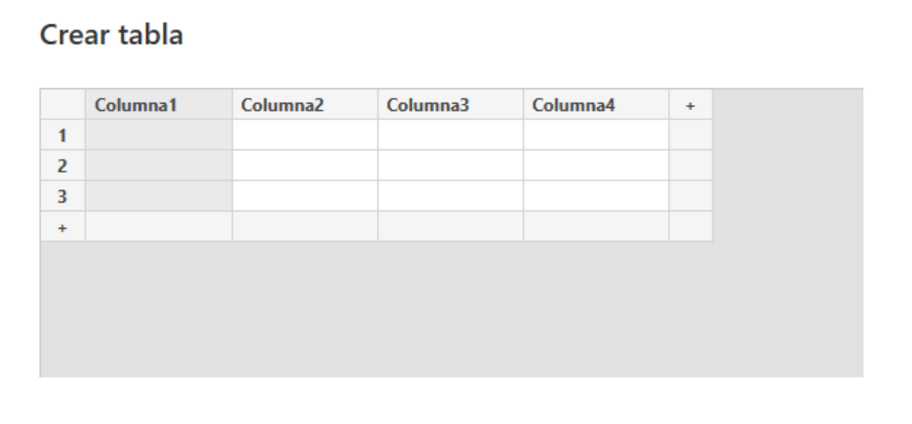
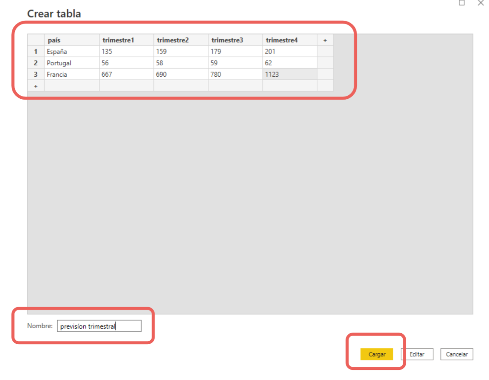
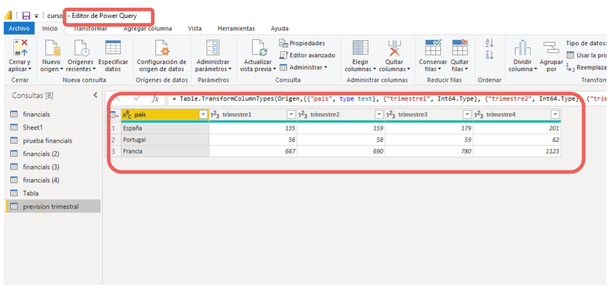
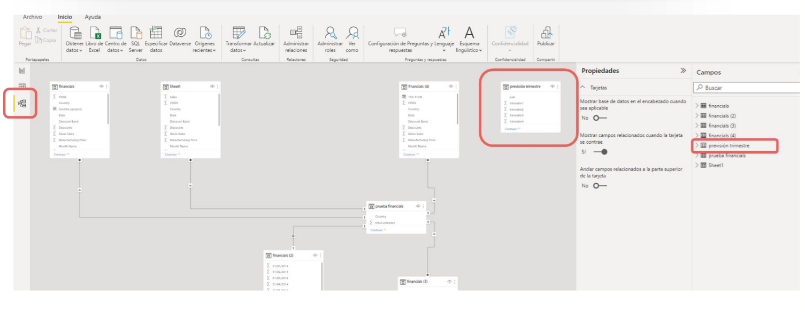
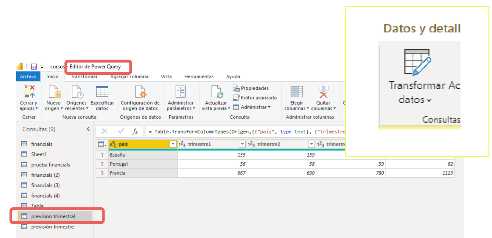
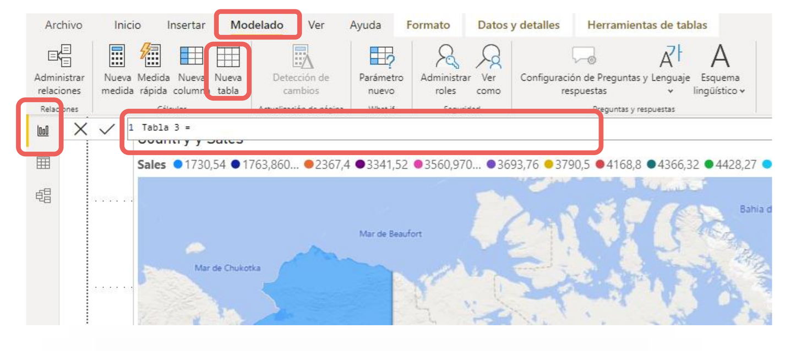

# 04-005:	Crear Tablas

[Lectura](./04-005-01_Lectura_Crear_Tablas.pdf)

En Power BI también podemos crear una nueva tabla y rellenarla con datos.

Normalmente las tablas se conectan a Power BI desde una fuente externa de datos, ya sea una hoja de Excel propia o un data set externo. 

Sin embargo, en ocasiones podríamos necesitar crear una nueva tabla dentro del propio Power BI.

Normalmente, las razones para hacerlo es que nos hemos dado cuenta que necesitamos una pequeña tabla, con un número pequeño de datos, que prevemos no van a cambiar, y basándonos en los datos que hemos conectado previamente.

> [!IMPORTANT]
> Por esta razón, podemos optar por esta rápida solución y crear directamente la tabla desde el programa, en vez de importarla en orígenes de datos.

---

### CREAR UNA TABLA

1.	Nos situamos en la **Vista de Informe** y, en la pestaña de **Inicio** >  seleccionamos el **botón Especificar datos**.

2. Nos aparecerá la ventana **Crear tabla**, sencilla, en la que podremos introducir los
datos necesarios o, directamente, pegarlos de otro archivo.

3. Con los botones de **+** situados **en fila y columna**, podremos ir añadiendo tantas filas
y columnas como necesitemos.

4. **Haciendo doble click** en la casilla del nombre de cada columna podremos cambiarlos e **introducir los datos en cada una de las casillas** de la tabla creada.

5. Una vez completada, podremos añadirle un nombre a la tabla en el campo inferior
izquierdo.

6. Si hacemos clic en el botón Editar, podremos ver la tabla creada en el editor Power Query, donde podremos editarla cuando queramos, para aplicarle nuevas transformaciones.  

7. Podemos comprobar que la tabla se ha creado, sin más que acudir a la vista Modelo. Veremos que la tabla aparece en solitario, sin relación con otras tablas, que podremos crear de forma manual.

> [!NOTE]
> También aparecerá en el panel Campos.

---

### EDITAR UNA tabla

Si queremos modificar la nueva tabla:

1. En el **Editor de Power Query**  > 
2. Sección **Consultas** >
3. Botón **Transformar datos**, donde podremos seleccionarla y editar transformaciones.  

---

### CREAR UNA TABLA DE DATOS CON DAX

> [!NOTE]
> Para aplicar este método, conviente conocer en detalle DAX.  
>
> Sintáxis DAX habitual: 	`Nombre de Tabla = <Función de Tabla>( <Tabla de Origen> o <Columna(s)>, [Argumentos/Filtros], [<Anidado de Funciones>] )`

Otra forma de crear una tabla en Power BI es haciendo clic en el botón Especificar datos, situado en el menú Modelado de la vista Informe.  

Este botón sin embargo, nos sirve para crear tablas utilizando funciones de DAX.   

Estas tablas normalmente son un resumen de otras tablas que ya tenemos conectadas a nuestro proyecto de Power BI.

---

> [!IMPORTANT]
> Este método solamente debe usarse si necesitamos añadir o pegar una tabla con pocos datos, aunque **es un método perfecto para nuevas tablas como las de Dimensiones, o Hechos, a partir de consolidados, o, al contrario, crear consolidados, mapas globales completos, con todos los datos.

- **Power BI no está diseñado para trabajar de esta forma, creando tablas internamente en el propio programa, sino que está diseñado para conectarse a tablas en otros programas, como por ejemplo, Excel, etc**.

- Si queremos añadir una tabla existente con una gran cantidad de datos es mejor conectar la tabla a Power BI con el método visto para importar datos.  

- Si creamos nosotros la tabla y hacemos un "copia y pega" de los datos de la tabla, podremos comprobar que Power BI Desktop detectará que la primera fila es parte de un encabezado. 

