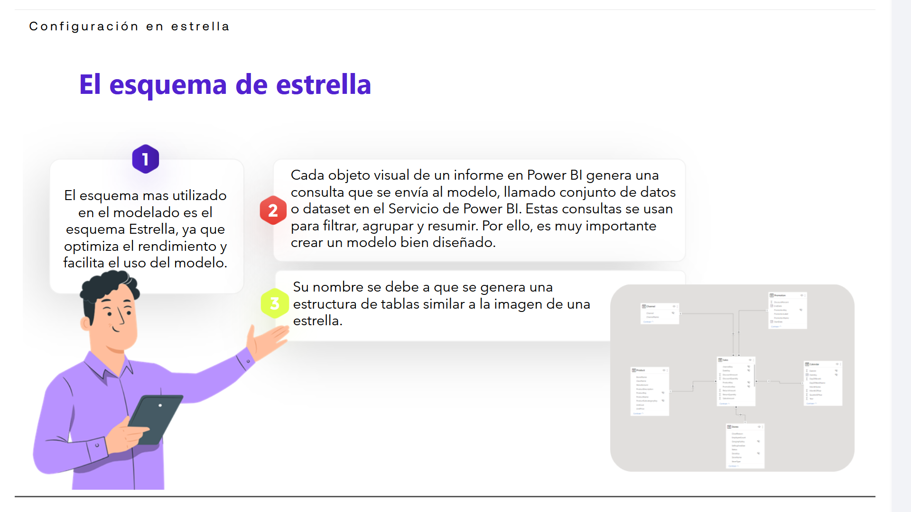
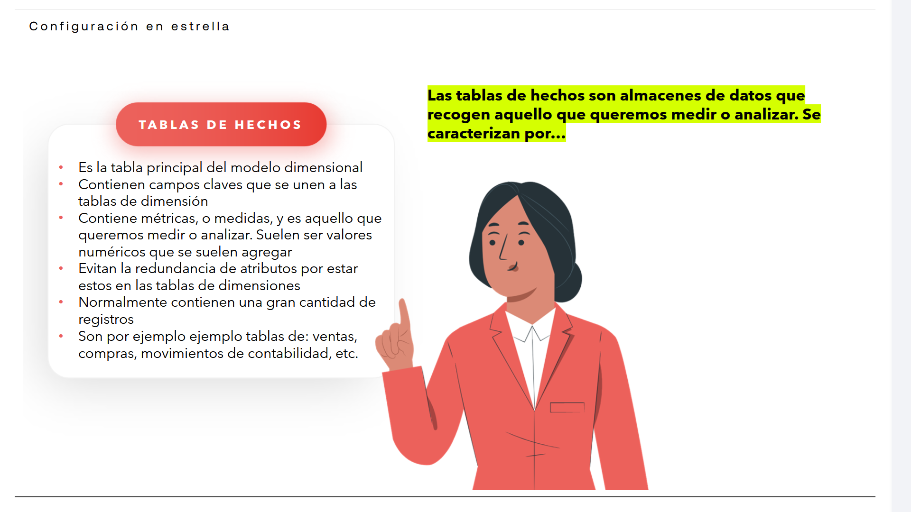
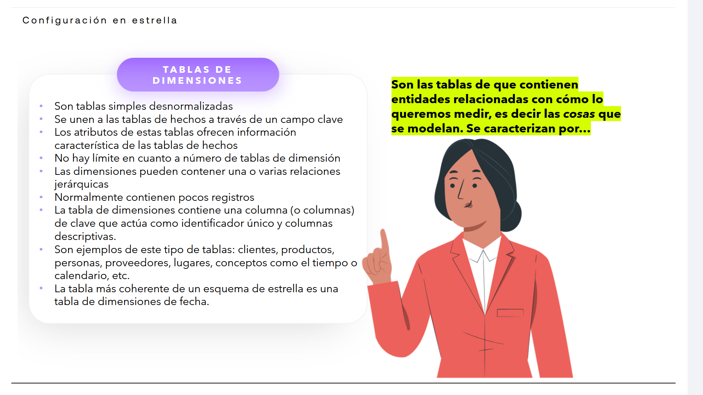
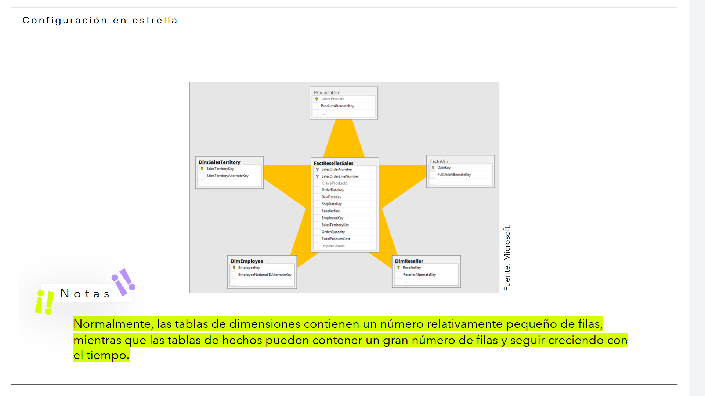
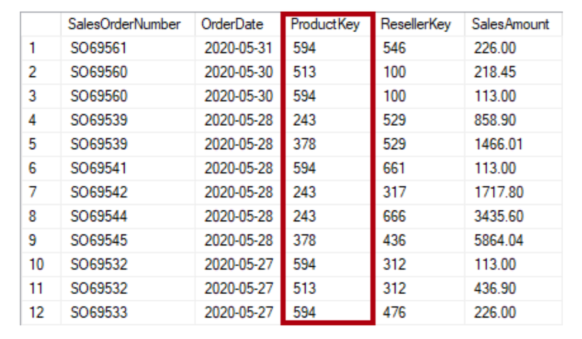
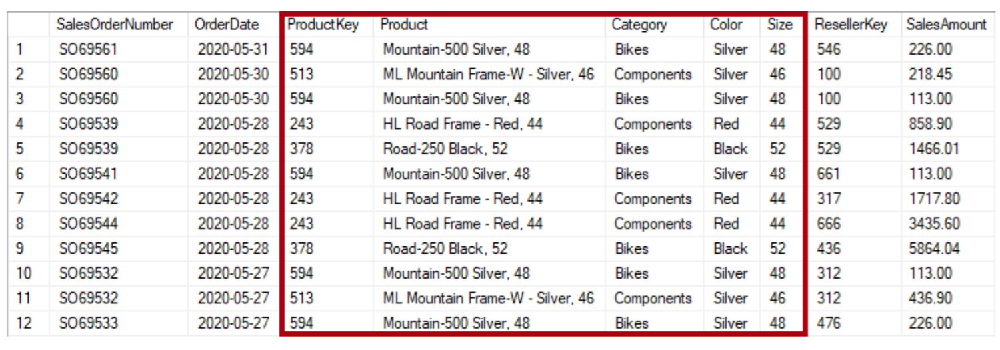
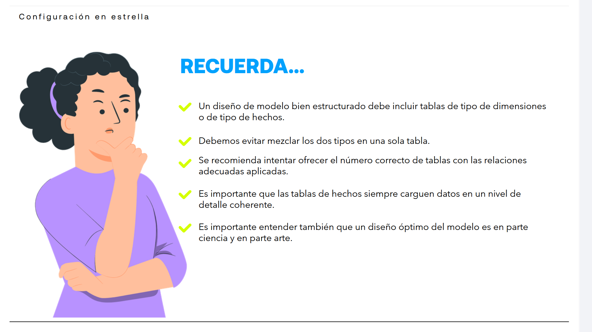

# 04-006:	Configuración en Estrella

## El esquema de estrella

1.	El **esquema más utilizado** en el modelado es el esquema Estrella, ya que **optimiza el rendimiento y facilita el uso del modelo**.

2.	Cada objeto visual de un informe en Power BI genera una consulta que se envía al modelo, llamado conjunto de datos o dataset en el Servicio de Power BI.  
Estas consultas se usan para filtrar, agrupar y resumir.  
**Por ello, es muy importante crear un modelo bien diseñado.** 

3.	Su nombre se debe a que se **genera una estructura de tablas similar a la imagen de una estrella**.

4.	Dicha figura de estrella, viene representada por:
	- **Una tabla en el centro** de la estrella, denominada **TABLA DE HECHOS**
	- Un conjunto de **tablas a su alrededor** y relacionadas con la tabla central, que representan los picos de la estrella, denominadas **TABLAS DE DIMENSIONES**.

5.	Dichas denominaciones, hechos y dimensiones, deben ser establecidos por el modelador del proyecto, previo análisis y clasificación.

### TABLAS DE HECHOS

> [!IMPORTANT]
> Las tablas de hechos son almacenes de datos que recogen aquello que queremos medir o analizar. Son los datos en sí mismos. 

* Es la tabla principal del modelo dimensional
* Contienen campos claves que se unen a las tablas de dimensión
* Contiene métricas, o medidas, y es aquello que queremos medir o analizar. Suelen ser valores numéricos que se suelen agregar
* Evitan la redundancia de atributos por estar estos en las tablas de dimensiones
* Normalmente contienen una gran cantidad de registros
* Son por ejemplo ejemplo tablas de: ventas, compras, movimientos de contabilidad, etc.

### TABLAS DE DIMENSIONES

> [!IMPORTANT]
> Son las tablas de que contienen entidades relacionadas con cómo lo queremos medir, es decir las cosas que se modelan.  
> 
> Por ejemplo, cada propiedad único del tipo de dato, del valor (`%`, `Tasa por 1000 habitantes`, `Unidades`, `€`, ...).
>
> O, también, cada categoría (Un listado de municipios, los grupos de edad, ...).

* Son tablas simples desnormalizadas
* Se unen a las tablas de hechos a través de un campo clave
* Los atributos de estas tablas ofrecen información característica de las tablas de hechos
* No hay límite en cuanto a número de tablas de dimensión
* Las dimensiones pueden contener una o varias relaciones jerárquicas
* Normalmente contienen pocos registros
* La tabla de dimensiones contiene una columna (o columnas) de clave que actúa como identificador único y columnas descriptivas.
* Son ejemplos de este tipo de tablas: clientes, productos, personas, proveedores, lugares, conceptos como el tiempo o calendario, etc.
* La tabla más coherente de un esquema de estrella es una tabla de dimensiones de fecha.

> [!NOTE] 
Las tablas de dimensiones contienen un número relativamente pequeño de filas, mientras que las tablas de hechos pueden contener un gran número de filas y seguir creciendo con el tiempo.

---

## NORMALIZAR vs DESNORMALIZAR (Pivotar, unpivotar, Dinamizar, Desdinamizar, ...)

[Lectura](./04-006-01_Lectura_Normalizar_vs_Desnormalizar.pdf)

> [!IMPORTANT]
> Para comprender algunos conceptos de los esquemas de estrella es importante conocer los conceptos de normalización y desnormalización.

### NORMALIZACIÓN

> [!IMPORTANT]
> Es el término que se usa para **describir los datos almacenados en una tabla de una manera que se reducen los datos repetitivos**.

Supongamos una tabla de productos que tiene una columna de valor de clave única, como la clave de producto, y columnas adicionales que describen características de los productos, incluidos el nombre, la categoría, el color y el tamaño.  

Una tabla de ventas se considera normalizada cuando almacena solo claves, como la clave de producto.  

### DESNORMALIZACIÓN

> [!IMPORTANT]
> Si la tabla de ventas almacena detalles de los productos más allá de la clave, se considera desnormalizada.

Por ejemplo, en la siguiente tabla, vemos que la columna ProductKey y otras columnas registran datos relacionados con los productos.  

### Lo que significa frente a Relacionales VS Estrella

> [!IMPORTANT]
En la medida de lo posible, debemos intentar desarrollar siempre modelos de datos optimizados, con tablas que representen hechos normalizados y datos de dimensiones.

Cuando se exportan conjuntos de datos a Power BI es probable que nos encontremos con tablas que presentan un conjunto de datos desnormalizado.  

En este caso, usaremos Power Query para transformar y dar forma a los datos de origen, para convertirlos en tablas normalizadas.  

---

> [!IMPORTANT]
> 

- Un diseño de modelo bien estructurado debe incluir tablas de tipo de dimensiones o de tipo de hechos.  
 
- Debemos evitar mezclar los dos tipos en una sola tabla.  
 
- Se recomienda intentar ofrecer el número correcto de tablas con las relaciones adecuadas aplicadas.  

- Es importante que las tablas de hechos siempre carguen datos en un nivel de detalle coherente.  
 
- Es importante entender también que un diseño óptimo del modelo es en parte ciencia y en parte arte.  

