# 05-001:	Introducción a las relaciones entre tablas

> [!IMPORTANT]
> Las relaciones entre tablas del modelo es una de las claves de PowerBI. Son la forma inteligente y optimizada de conectar toda la información contenida en las diferentes tablas con las que trabajamos en nuestro proyecto, ya que por medio de ellas podemos conectar fácilmente de cada tabla con las demás.

- Cuando trabajamos con los datos en Excel disponemos de la **fórmula BUSCAR** para sacar información de una tabla a otra. En Power BI veremos que es muy simple crear esta conexión entre las tablas a través de las relaciones.

- Construir las relaciones entre las tablas es una de las características más importantes de Power BI Desktop **ya que es a partir de esas relaciones lo que permite que todo funcione como por arte de magia**

- Tareas como el filtrado automático dentro de los objetos visuales e informes, la facilidad con la que pueden crear mediciones utilizando funciones DAX o la capacidad para conectar rápidamente diferentes fuentes de datos, son posibles y sencillas **gracias a las relaciones adecuadamente construidas en el modelo de datos**.

## Todo comienza en la Vista de modelo

> [!IMPORTANT]
> Para acceder, visualizar, crear y editar estas relaciones entre tablas, debemos dirigirnos aquí.

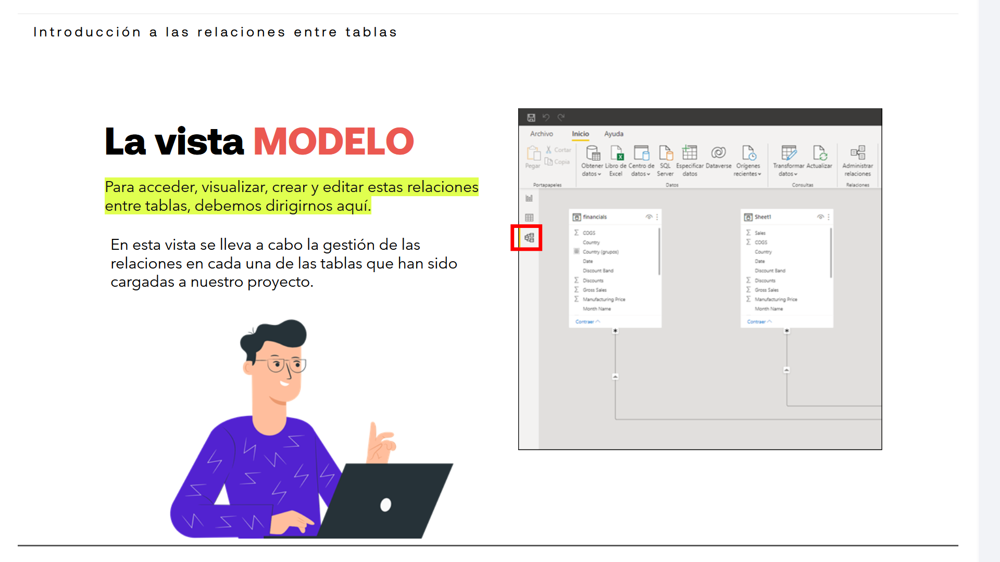

En esta vista se lleva a cabo la gestión de las relaciones en cada una de las tablas que han sido cargadas a nuestro proyecto.  

En la siguiente imagen de la vista MODELO podemos visualizar varias tablas de un dataset y las relaciones entre ellas:  
- La vista Modelo muestra todas las tablas, columnas y relaciones en el modelo, lo cual puede resultar especialmente útil cuando el modelo tiene relaciones complejas entre muchas tablas.

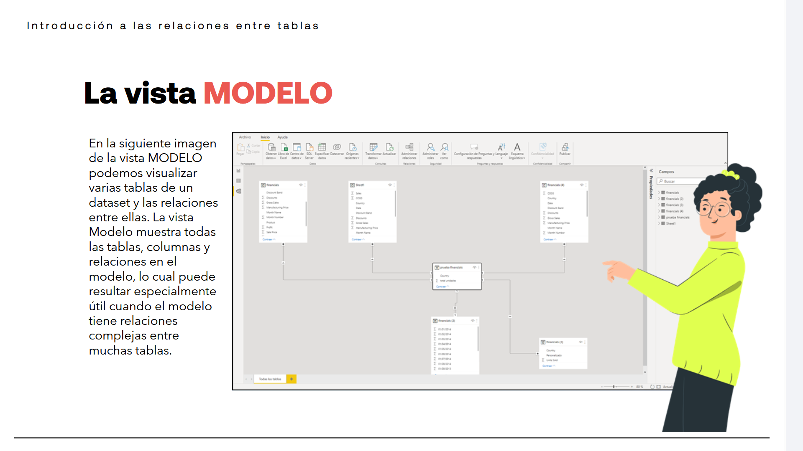

---

### Diagramas Independientes, subconjuntos de diagramas (Nuevas páginas de Vista Modelo)

> [!IMPORTANT]
> En la vista de modelo, podremos crear diagramas de nuestro modelo que contengan solo un subconjunto de las tablas del modelo, lo que puede ayudar a** proporcionar una visión más clara de las tablas con las que necesitamos trabajar** y facilitar el trabajo con conjuntos de datos complejos. 

Para ello:  

1.	Click en el signo **+** junto a la pestaña **Todas las tablas** situada en la parte inferior de la ventana.

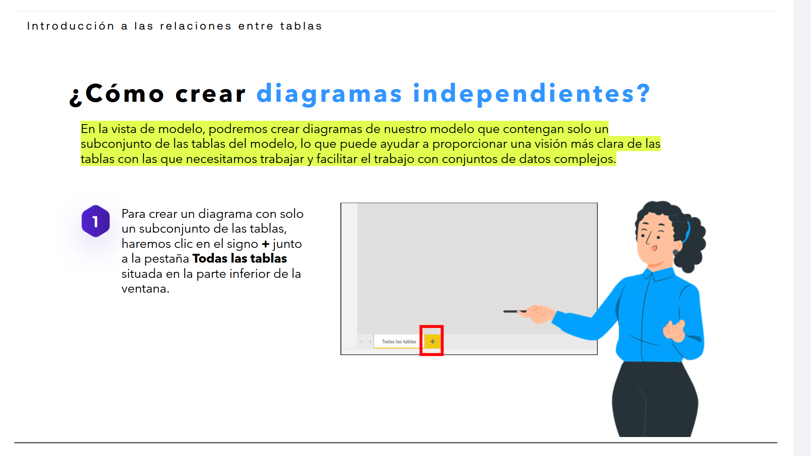

2.	Una vez creado el nuevo diagrama independiente, para añadir una tabla y aquellas con las que se relaciona podemos arrastrar desde la lista **Campos** y haciendo click en el botón de los tres puntos, seleccionar **Agregar tablas relacionadas** en el menú desplegado.

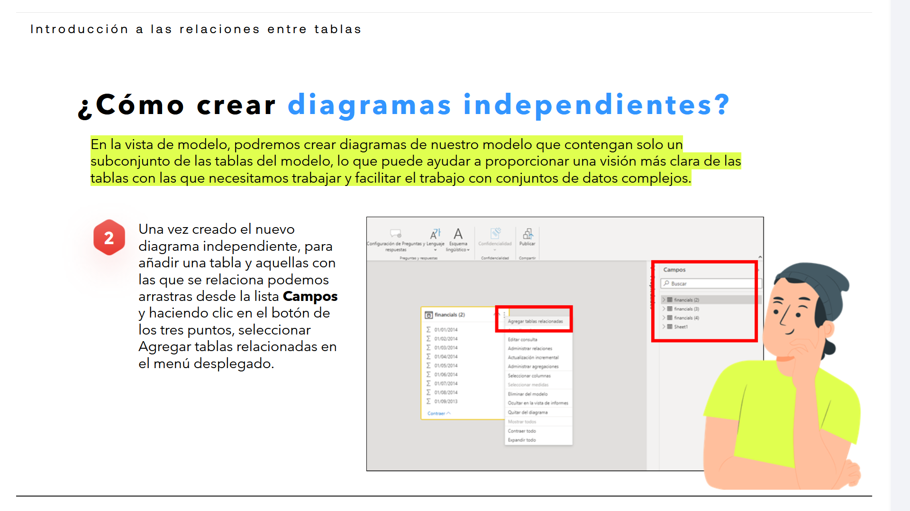

**3.** Al hacerlo, las tablas que están relacionadas con la tabla original **se muestran en el nuevo diagrama.**

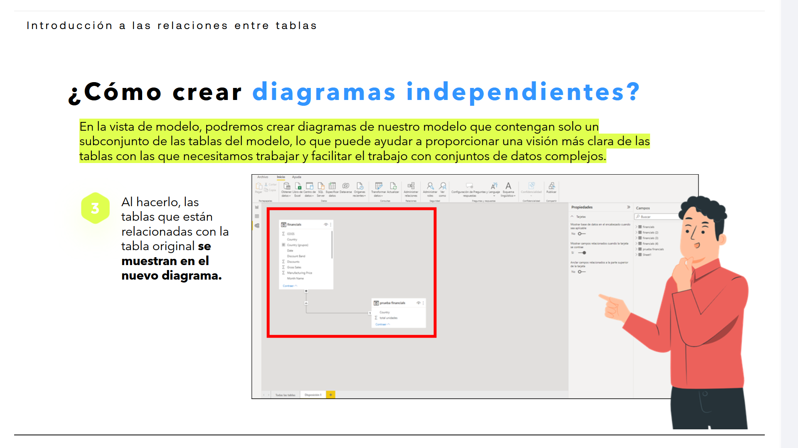

---

## Detección automática de relaciones

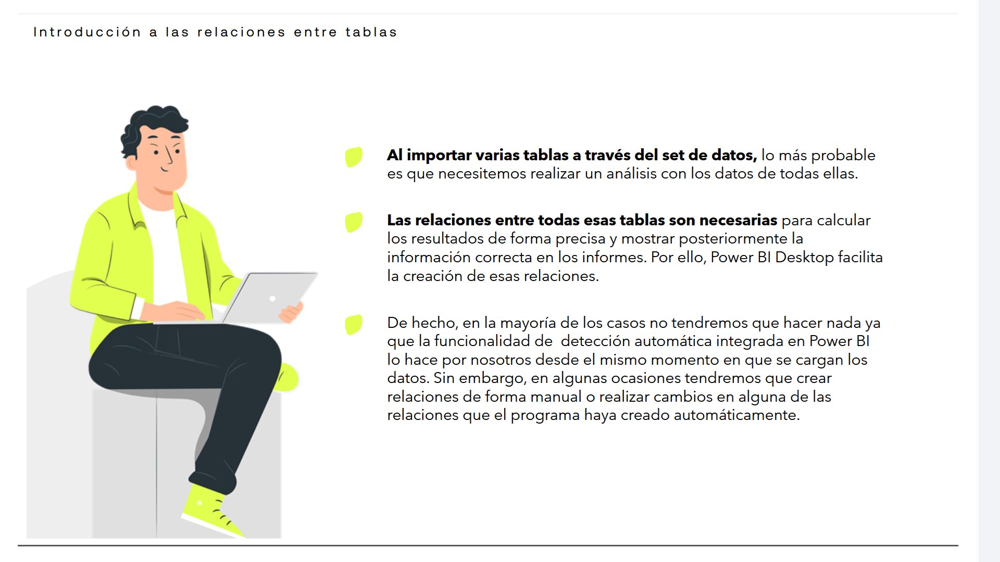

**Al importar varias tablas a través del set de datos,** lo más probable es que necesitemos realizar un análisis con los datos de todas ellas.  

**Las relaciones entre todas esas tablas son necesarias** para calcular los resultados de forma precisa y mostrar posteriormente la información correcta en los informes. Por ello, Power BI Desktop facilita la creación de esas relaciones.

De hecho, en la mayoría de los casos no tendremos que hacer nada ya que la funcionalidad de **detección automática** integrada en Power BI lo hace por nosotros desde el mismo momento en que se cargan los datos. Sin embargo, en algunas ocasiones tendremos que crear relaciones de forma manual o realizar cambios en alguna de las relaciones que el programa haya creado automáticamente.

---

## Finalidad de las relaciones

> [!IMPORTANT]
> Las relaciones creadas en el modelo son el elemento que propaga los filtros aplicados en la columna de una tabla de modelos a otra tabla de modelos con la que se relaciona.  

Los filtros se propagarán siempre que haya una ruta de relación entre ellas, por lo que pueden propagarse a varias tablas si existen las relaciones que las conectan.  

Es importante comprender que las rutas de relación son deterministas, es decir,** los filtros siempre se propagan de la misma manera y sin variación aleatoria**. Sin embargo, las relaciones pueden deshabilitarse o el contexto del filtro puede modificarse mediante adaptaciones establecidas en las funciones DAX concretas.  

---

## Propiedades de las relaciones

Una relación dentro del modelo relaciona una columna de una tabla con una columna de otra tabla.  

- Si las relaciones se crean automáticamente, Power BI analizará las columnas de cada tabla y comprobará si existe algún columna común en las dos tablas. Si es así, las usará para crear la relación para conectar ambas tablas.

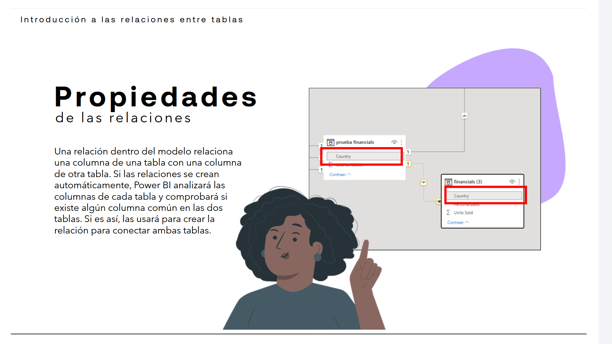

> [!NOTE]
> Después de crearse una relación entre dos tablas, podemos situar el ratón sobre la línea que las conecta. De esta forma Power BI resalta las columnas que las conectan.

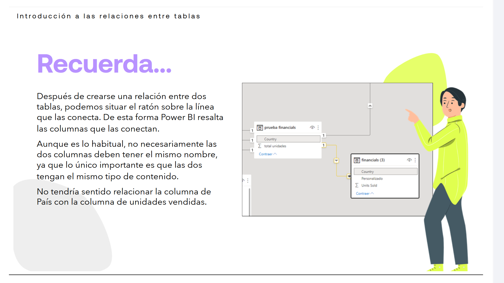

Aunque es lo habitual, **no necesariamente las dos columnas deben tener el mismo nombre**, ya que **lo único importante es que las dos tengan el mismo tipo de contenido**.  

No tendría sentido relacionar la columna de País con la columna de unidades vendidas.  

---

## Editar las relaciones generadas

### Relaciones erróneas

Si detectamos una relación que se ha creado erróneamente, podemos deshacer esa relación de una forma sencilla. Para ello:

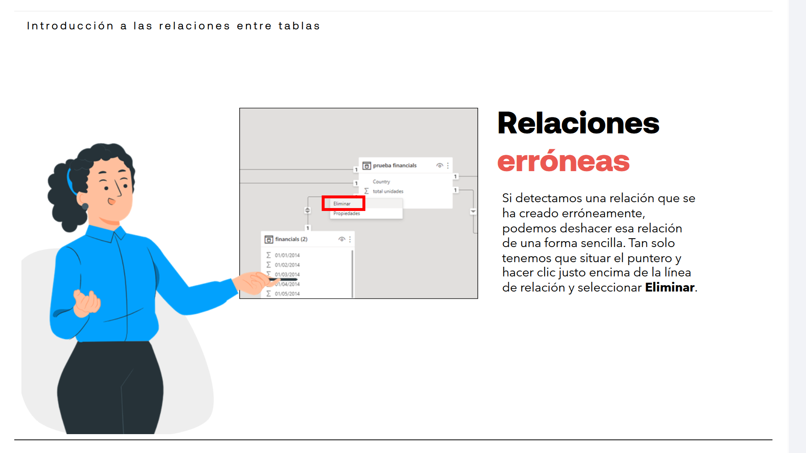

1. Situar el puntero y hacer clic justo encima de la línea de relación.
2. Seleccionar **Eliminar** en el contextual.

---

### Existencia de varias relaciones entre dos tablas

> [!IMPORTANT]
> SÍ es posible crear más de una relación entre dos tablas, si ambas tablas contienen columnas con mismos tipos de datos, como varias columnas con fechas.

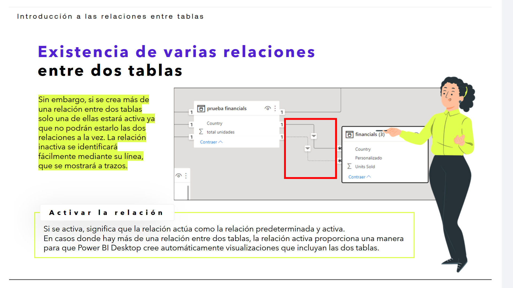

> [!WARNING] 
En cambio, si se crea más de una relación entre dos tablas **solo una de ellas estará activa** ya que no podrán estarlo las dos relaciones a la vez.  
>  
> La relación inactiva se identificará fácilmente mediante su línea, que se mostrará a trazos.

#### Activar la relación

Si se activa, significa que **la relación actúa como la relación predeterminada y activa**.  

- En casos donde hay más de una relación entre dos tablas, la relación activa proporciona una manera para que Power BI Desktop cree automáticamente visualizaciones que incluyan las dos tablas.

---

## Cardinalidad en las relaciones

> [!IMPORTANT]
> Cada relación dentro del modelo está definida por un tipo de cardinalidad.

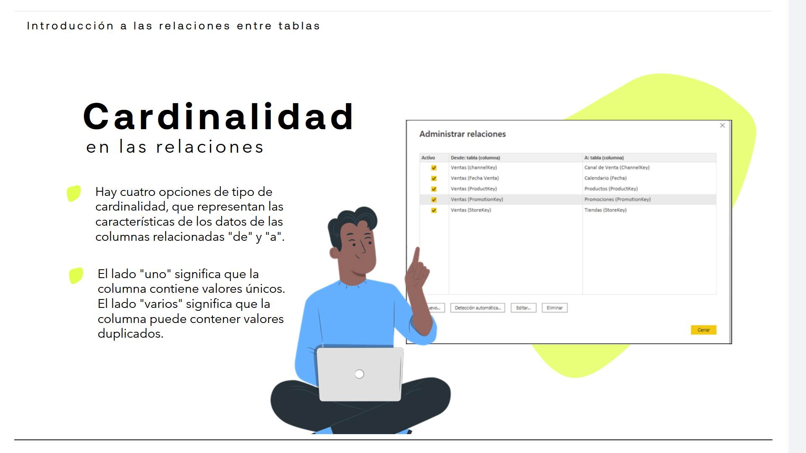

* Hay **cuatro opciones de tipo de cardinalidad**, que representan las características de los datos de las columnas relacionadas "de" y "a":
	- El lado "uno" significa que la columna contiene valores únicos.
	- El lado "varios" significa que la columna puede contener valores duplicados.

> [!IMPORTANT]
> La cardinalidad define el grado de relación entre dos tablas. En Power BI, la cardinalidad se muestra con los símbolos 1 y *.

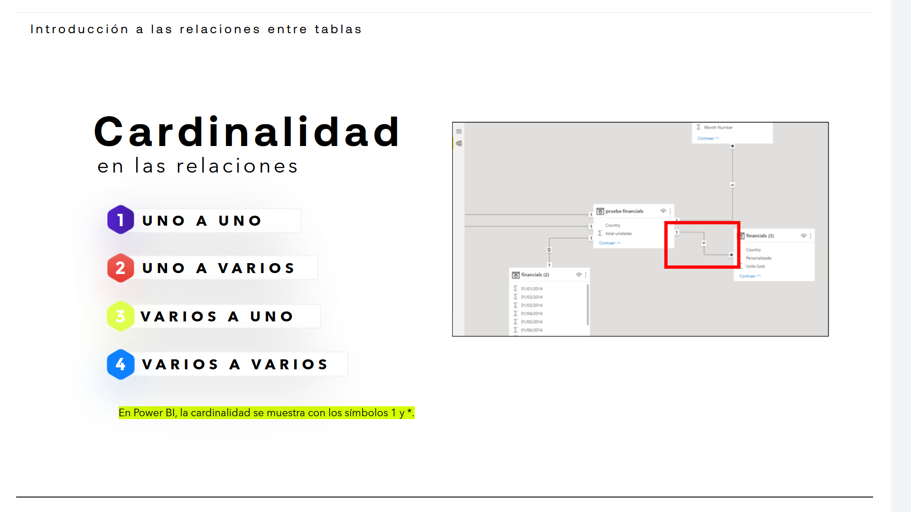

Las opciones de cardinalidad pueden ser:  

1. **UNO A UNO** (`1-a-1`, `1:1`)
2. **UNO A VARIOS** (`1-a-*`, `1:*`) 
3. **VARIOS A UNO** (`*-a-*`, `*:*`)
4. **VARIOS A VARIOS** (`*-a-1`, `*:1`)

### 1. 	UNO A UNO (1:1)

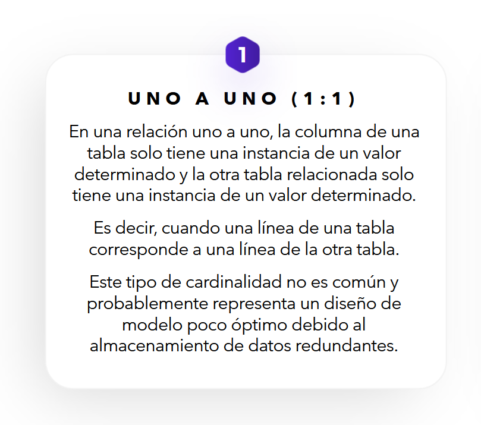

En una relación uno a uno...:  

- La columna de una tabla solo tiene una instancia de un valor determinado.
- La otra tabla relacionada solo tiene una instancia de un valor determinado.

Es decir: **Una línea de una tabla corresponde a una línea de la otra tabla**.  

Este tipo de cardinalidad no es común y **probablemente representa un diseño de modelo poco óptimo debido al almacenamiento de datos redundantes**.  

### 2. UNO A VARIOS (1:*)

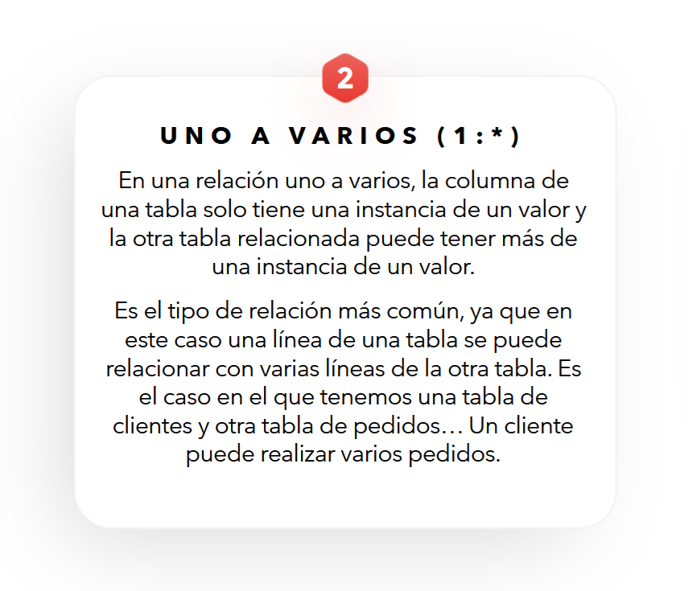

En una relación uno a varios...:  

- La columna de una tabla solo tiene una instancia de un valor.
- La otra tabla relacionada puede tener más de una instancia de un valor.

Es decir, **una línea de una tabla se puede relacionar con varias líneas de la otra tabla**.

Es **el tipo de relación más común**, y se puede ejemplificar así:  

- Tenemos una tabla de clientes y otra tabla de pedidos... 
- Y un cliente puede realizar varios pedidos.

### 3. VARIOS A UNO (*:1)

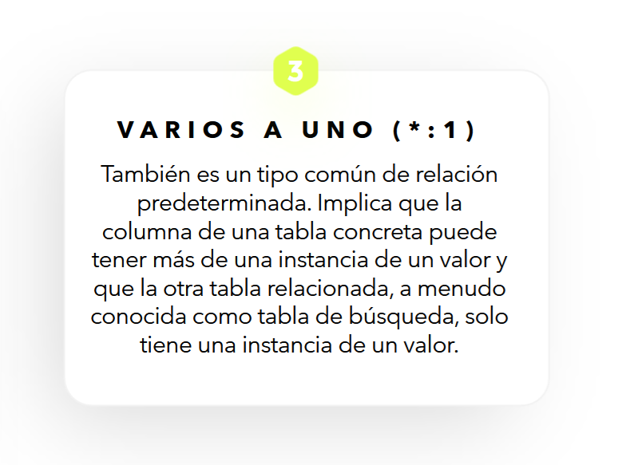

En un tipo de relación de varios a uno...:

- La columna de una tabla concreta puede tener más de una instancia de un valor.
- La otra tabla relacionada, a menudo conocida como tabla de búsqueda, solo tiene una instancia de un valor.

**También es un tipo común de relación predeterminada.**  

- `1:*`y `*:1` son esencialmente iguales (una es la inversa de otra) y son también las más comunes.

- A la hora de configurar una relación de uno a varios o de varios a uno, debemos **elegir la que coincida con el orden en el que relacionaron las columnas**, por ejemplo:
	- Tenemos una tabla Producto, donde se recogen los datos de productos comercializados, y otra tabla Ventas, donde se recogen los datos de las ventas realizadas, **ambas pueden relacionarse mediante la columna IDProducto (el código del producto) que aparecen en cada una de las dos tablas**.
	- Entonces, para configurar la relación desde la tabla Producto a la tabla Ventas, el tipo de cardinalidad sería de uno a varios, ya que la columna IDProducto de la tabla Producto contiene valores únicos. 
	- Si relacionamos las tablas en la dirección inversa, Ventas a Producto, entonces la cardinalidad sería de varios a uno.

### 4. VARIOS A VARIOS (*:*)

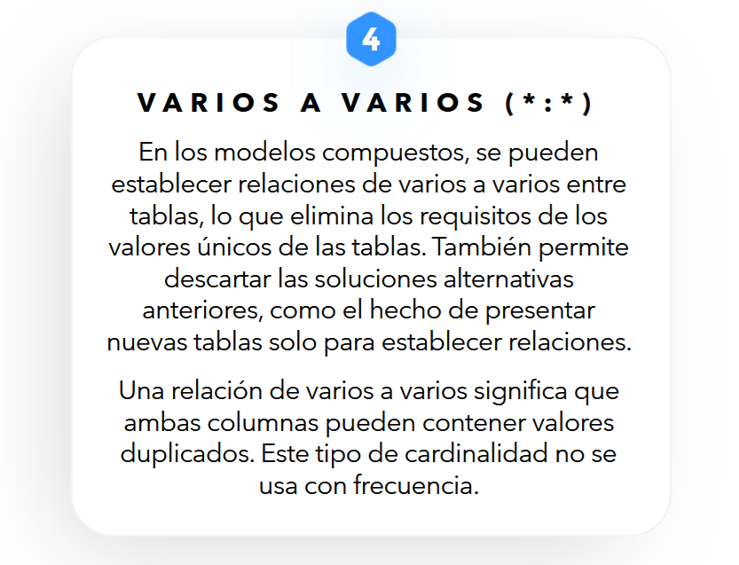

En una relación relación de varios....:  

	- Ambas columnas pueden contener valores duplicados.

Este tipo de cardinalidad no se usa con frecuencia.  

- En los modelos compuestos, se pueden establecer relaciones de varios a varios entre tablas, lo que elimina los requisitos de los valores únicos de las tablas.  

- También permite descartar las soluciones alternativas anteriores, como el hecho de presentar nuevas tablas solo para establecer relaciones.

---

> [!NOTE]
> En la vista de Modelo de Power BI Desktop, podemos interpretar el tipo de cardinalidad de una relación si examinamos los indicadores (`1`, o `*`) en cualquiera de los lados de la línea de relación

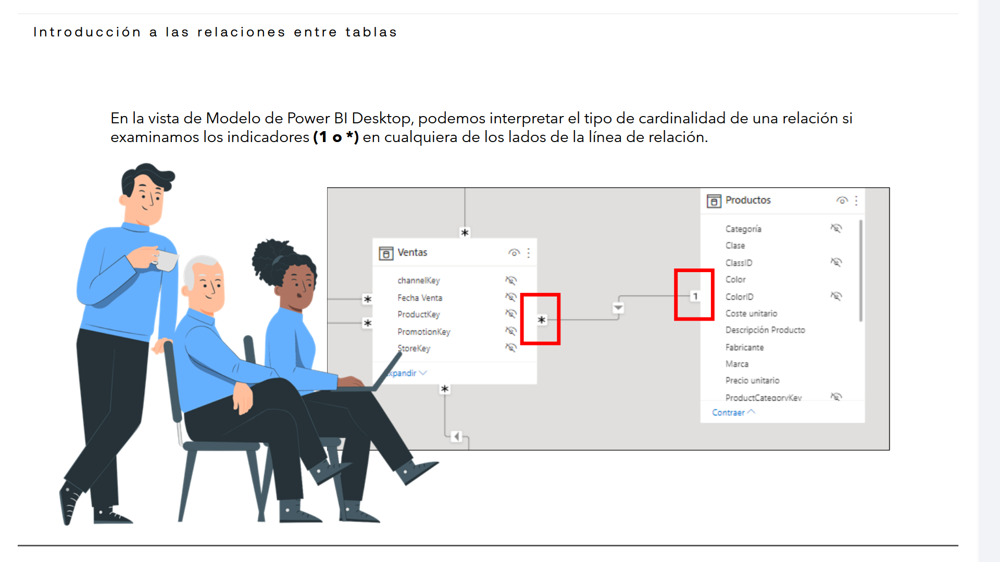

---

## Dirección de filtro cruzado (DIRECCIONALIDAD)

> [!IMPORTANT]
> Cada relación creada en el modelo estará definida con una dirección de filtro cruzado.  
>   
> Esta es la propiedad de direccionalidad habitual en las bases de datos.
>  
> El valor dirección determina en qué direcciones se propagarán (**navegabilidad**) los filtros que se aplicarán en las visualizaciones.  

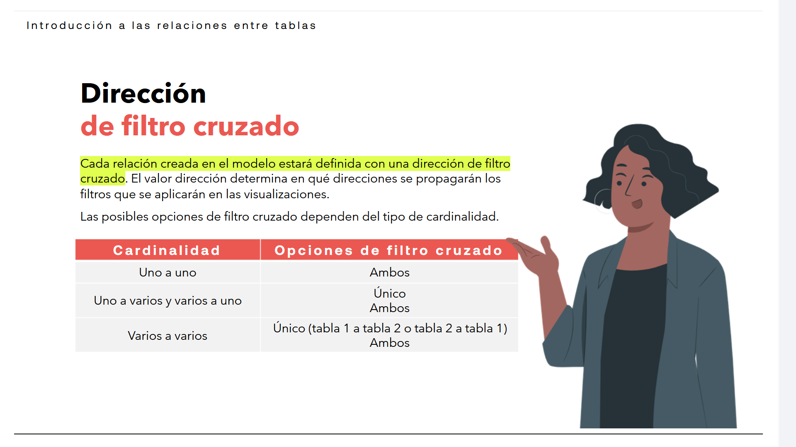

Las posibles opciones de filtro cruzado dependen del tipo de cardinalidad pueden ser:

| Cardinalidad | Direccionalidad (y navegabilidad) |
| :--- | :--- |
| **Uno a uno** | Ambos |
| **Uno a varios y varios a uno** | Único Ambos |
| **Varios a varios** | Único (`tabla 1` a `tabla 2` o `tabla 2` a `tabla 1`) Ambos |

### Dirección de filtro cruzado AMBOS

Indica que, a efectos de filtrado, **ambas tablas se tratan como si fueran una sola tabla**.  

La opción **Ambos** funciona bien con una única tabla que tenga muchas tablas de búsqueda a su alrededor.  
- Esta configuración suele denominarse configuración de esquema de Estrella (una tabla central con varias tablas de búsqueda).  

### Dirección de filtro cruzado ÚNICO

Es la dirección predeterminada más común, que significa que **las opciones de filtrado en tablas conectadas trabajan sobre la tabla donde se agregan los valores**.  

---

> [!NOTE]
> La dirección del filtro cruzado Único significa **"dirección única"** y Ambos se aplica a **"ambas direcciones"**.  
>  
> Una relación que filtra en ambas direcciones se describe normalmente como **bidireccional**.  

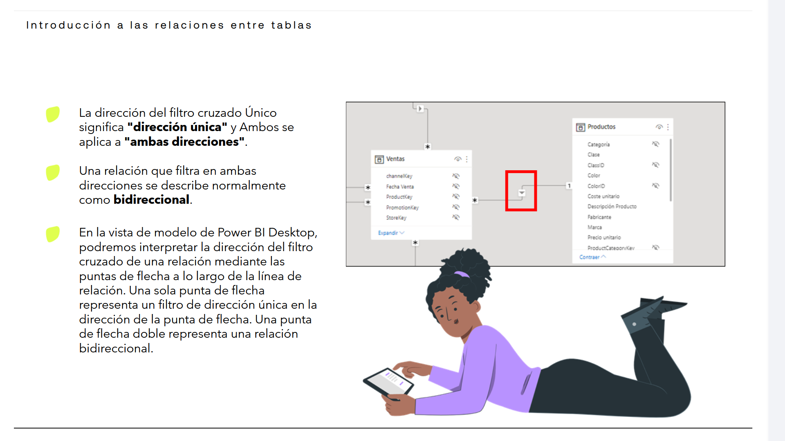

- En la vista de modelo de Power BI Desktop, podremos interpretar la dirección del filtro cruzado de una relación mediante las puntas de flecha a lo largo de la línea de relación:  
	
	- Una sola punta de flecha representa un filtro de dirección única en la dirección de la punta de flecha.
	- Una punta de flecha doble representa una relación bidireccional.  

> [!IMPORTANT]
> Solo puede haber una relación activa entre dos tablas. Pero puede haber un número ilimitado de relaciones inactivas entre esas tablas.  
>  
> Las relaciones solo pueden ser creadas en una única columna, no en varias columnas.  
>  
> Solo puede haber una ruta de propagación de filtros activa entre dos tablas del modelo.  
> Sin embargo, se pueden introducir rutas de relación adicionales, pero estas relaciones deben establecerse como inactivas.

