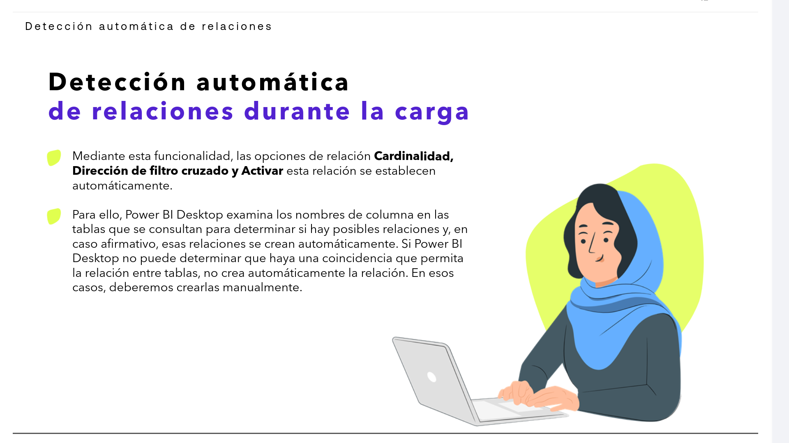
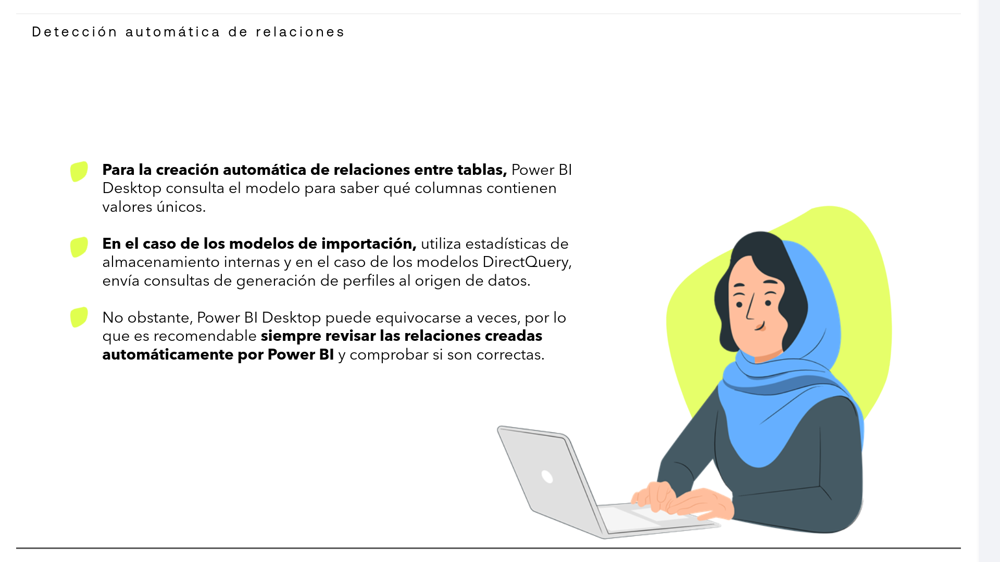
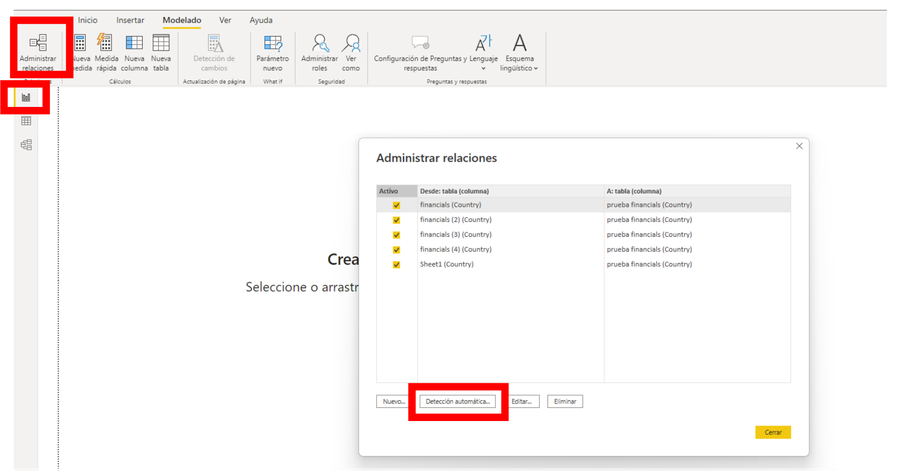
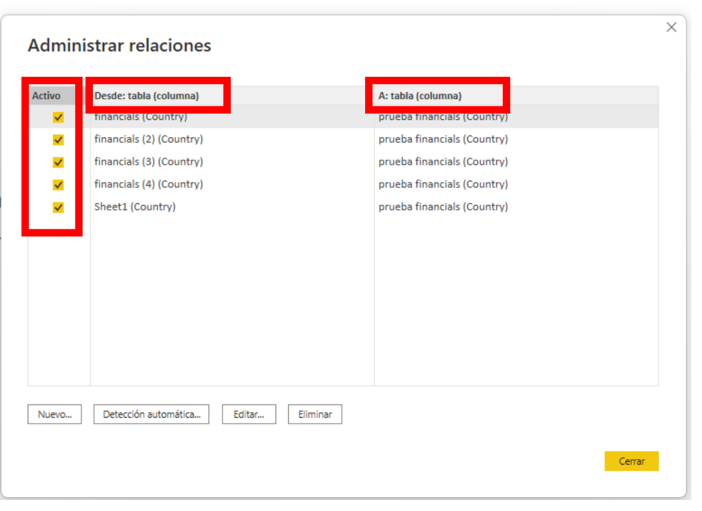
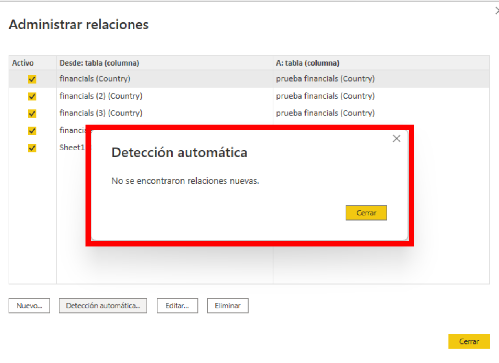
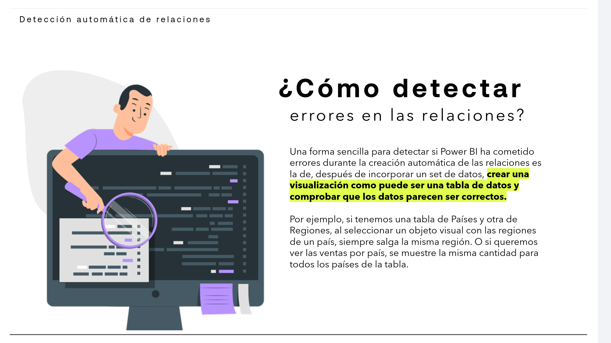
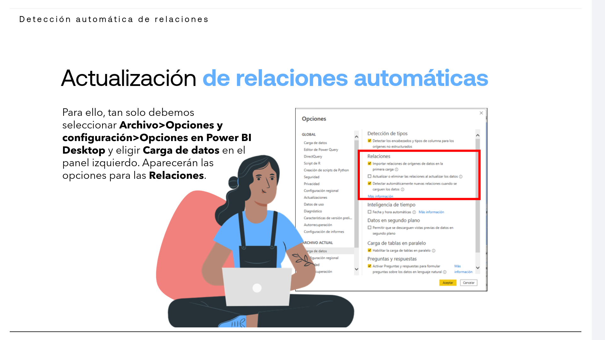
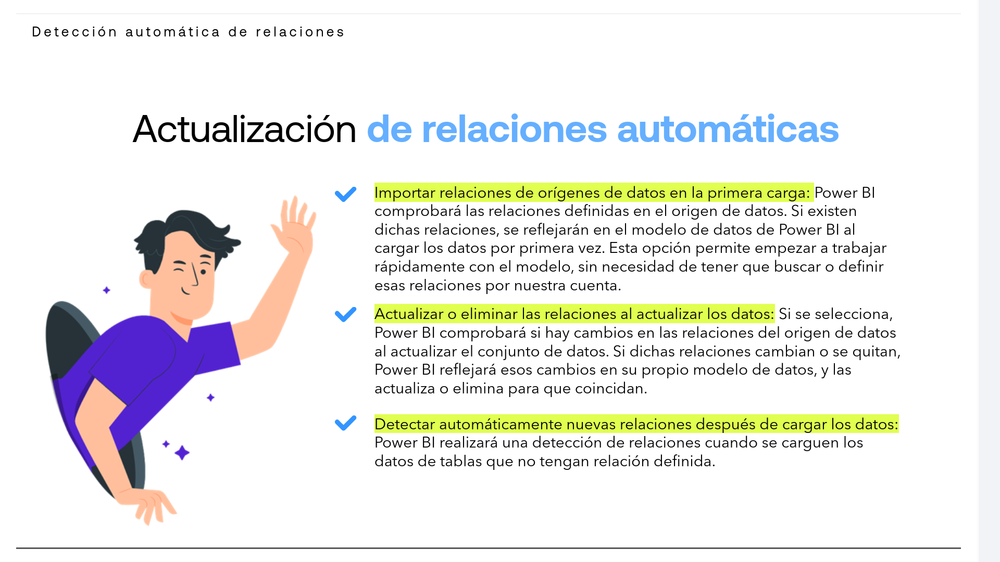

# 05-002:   Detección automática de relaciones

## Detección automática de relaciones durante la carga

*   Mediante esta funcionalidad, las opciones de relación **Cardinalidad**, **Dirección de filtro cruzado**  y **Activar esta relación** se establecen automáticamente.  

* Para ello, Power BI Desktop examina los nombres de columna en las tablas que se consultan para determinar si hay posibles relaciones y, en caso afirmativo, esas relaciones se crean automáticamente.  

* Si Power BI Desktop no puede determinar que haya una coincidencia que permita la relación entre tablas, no crea automáticamente la relación. En esos casos, deberemos crearlas manualmente.  

* **Para la creación automática de relaciones entre tablas**, Power BI Desktop consulta el modelo para saber qué columnas contienen valores únicos.

* **En el caso de los modelos de importación**, utiliza estadísticas de almacenamiento internas 

* **En el caso de los modelos DirectQuery**, envía consultas de generación de perfiles al origen de datos.

> [!WARNING]
> No obstante, Power BI Desktop puede equivocarse a veces, por lo que es recomendable **siempre revisar las relaciones creadas automáticamente por Power BI** y comprobar si son correctas.

[Lectura](./05-002-01_Lectura_Creacion_de_una_relacion_con_deteccion_automatica.pdf)

Si hemos cargado varias tablas en nuestro proyecto y queremos que Power BI realice una creación automática de las relaciones entre ellas, la opción para ello consiste en:  

1. Desplazarse a la **Vista de Informe** >
2. En la **pestaña Modelado** situada en la barra de herramientas >
3. Click en **Administrar relaciones** *>* **Detección automática**.

4. Podemos ver que cada relación se presenta por sus tablas en las columnas **DESDE** y **A**, situando entre paréntesis, al lado del nombre de la tabla, el nombre de la columna usada para crear la relación. 

5. En la columna Activo se muestra si esa relación está activa o no.

6. Completado el proceso, Power BI nos informará sobre las relaciones nuevas detectadas y creadas.

---

## Detectar ERRORES en las relaciones

> [!IMPORTANT]
> Una forma sencilla para detectar si Power BI ha cometido errores durante la creación automática de las relaciones es la de, después de incorporar un set de datos, **crear una visualización como puede ser una tabla de datos** y **comprobar que los datos parecen ser correctos**.  

- Por ejemplo, si tenemos una tabla de Países y otra de Regiones, al seleccionar un objeto visual con las regiones de un país, siempre salga la misma región.  

- O si queremos ver las ventas por país, se muestre la misma cantidad para todos los países de la tabla.

---

## ACTUALIZAR las relaciones automáticas

1. **Archivo > Opciones y configuración > Opciones** en Power BI Desktop
2. Elegir **Carga de datos** en el panel izquierdo. 
3. Aparecerán las opciones para las **Relaciones**, con TRES opciones para habilitar:

* **Importar relaciones de orígenes de datos en la primera carga:**  
    -   Power BI comprobará las relaciones definidas en el origen de datos.  
    - Si existen dichas relaciones, se reflejarán en el modelo de datos de Power BI al cargar los datos por primera vez.  
    - Esta opción permite empezar a trabajar rápidamente con el modelo, sin necesidad de tener que buscar o definir esas relaciones por nuestra cuenta.  

* **Actualizar o eliminar las relaciones al actualizar los datos:**   
    - Si se selecciona, Power BI comprobará si hay cambios en las relaciones del origen de datos al actualizar el conjunto de datos.  
    - Si dichas relaciones cambian o se quitan, Power BI reflejará esos cambios en su propio modelo de datos, y las actualiza o elimina para que coincidan.

* **Detectar automáticamente nuevas relaciones después de cargar los datos:**  
    - Power BI realizará una detección de relaciones cuando se carguen los datos de tablas que no tengan relación definida.

