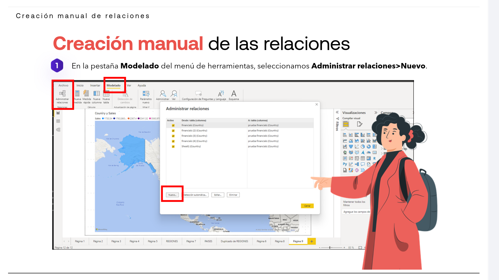
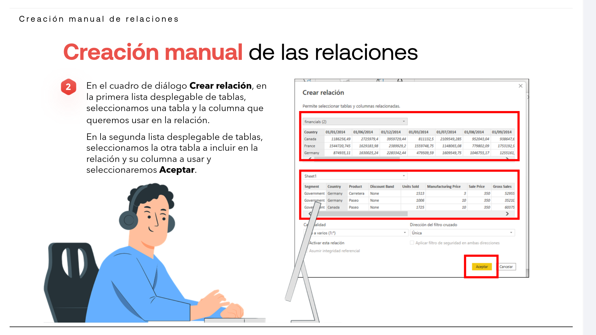
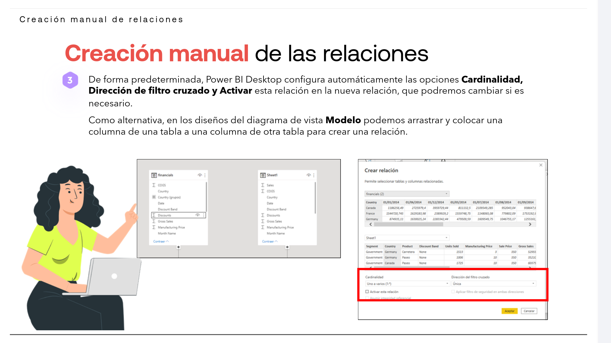

# 05-003:   Creación de relaciones manualmente

## Creación manual de las relaciones

* Una vez que Power BI haya conectado automáticamente dos tablas con una relación, **podremos trabajar con los datos de ambas tablas como si fueran una sola tabla**, lo que nos evita tener que preocuparnos sobre los detalles de la relación o de tener que acoplar esas tablas en una sola tabla antes de importarlas.  

> [!WARNING]
> **Pero en ciertas ocasiones, Power BI Desktop no puede determinar con un grado suficiente de certeza** que deba existir una relación entre esas dos tablas, por lo que no creará la relación automáticamente.   

En ese caso, deberemos crear esa relación de forma manual:  

1. En la pestaña **Modelado** del menú de herramientas
2. Seleccionamos **Administrar relaciones > Nuevo**.  

3. En el cuadro de diálogo **Crear relación**, en la primera lista desplegable de tablas, seleccionamos una tabla y la columna que queremos usar en la relación.  

4. En la segunda lista desplegable de tablas, seleccionamos la otra tabla a incluir en la relación y su columna a usar y seleccionaremos **Aceptar**.  

5. De forma predeterminada, Power BI Desktop configura automáticamente las opciones **Cardinalidad, Dirección de filtro cruzado y Activar** esta relación en la nueva relación, que podremos cambiar si es necesario.  

6. Como alternativa, en los diseños del diagrama de vista **Modelo** podemos arrastrar y colocar una columna de una tabla a una columna de otra tabla para crear una relación.  

