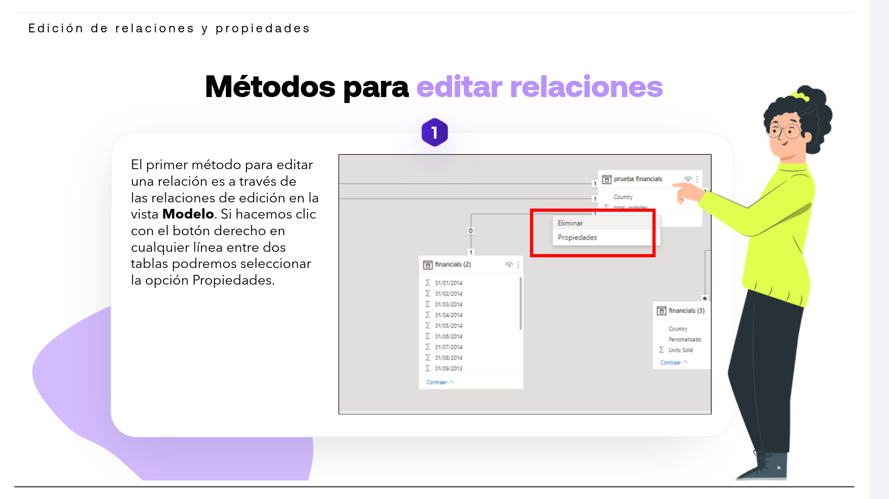
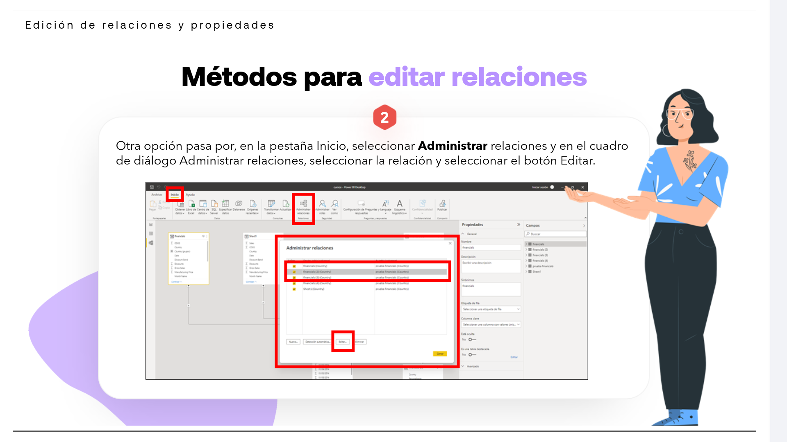
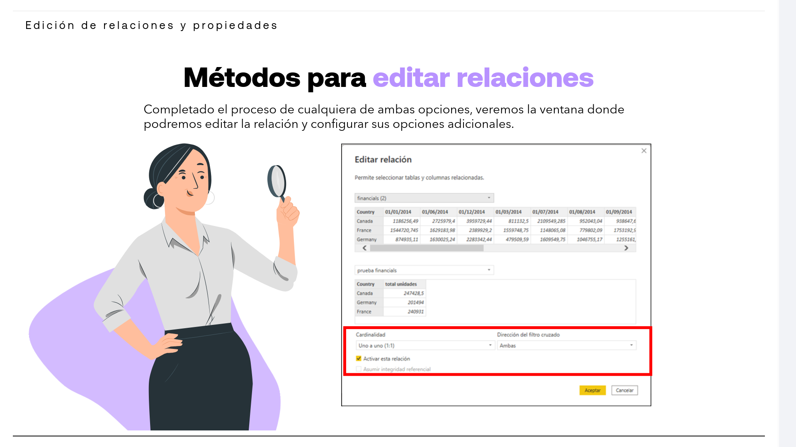

# 05-004:   Edición de relaciones y propiedades

> [!IMPORTANT]
> Hay varios métodos para editar las relaciones y sus propiedades, ambos llevan a la misma ventana de Editar Relación

### Clickando en las propias relaciones visuales

1. El primer método para editar una relación es a través de las relaciones de edición en la **Vista de Modelo**.  

2. Si hacemos clic con el botón derecho en cualquier línea entre dos tablas podremos seleccionar la opción **Propiedades**.  

### Desde menús

1. Otra opción pasa por, en la pestaña **Inicio** > 
2. Seleccionar **Administrar relaciones** > 
3. En el cuadro de diálogo Administrar relaciones, seleccionar la relación y seleccionar el botón **Editar**.  

---

- Completado el proceso de cualquiera de ambas opciones, veremos la ventana donde podremos editar la relación y configurar sus opciones adicionales.  

