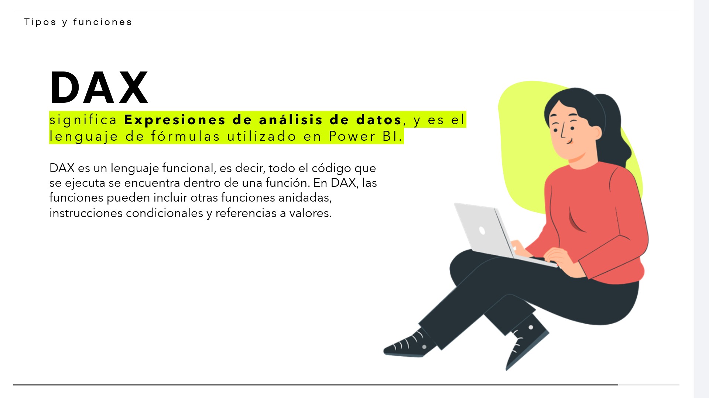
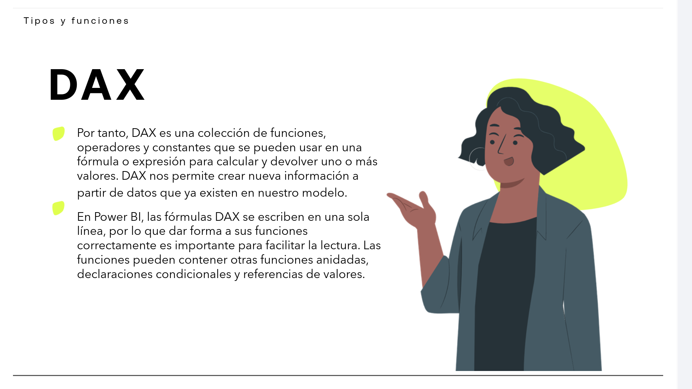
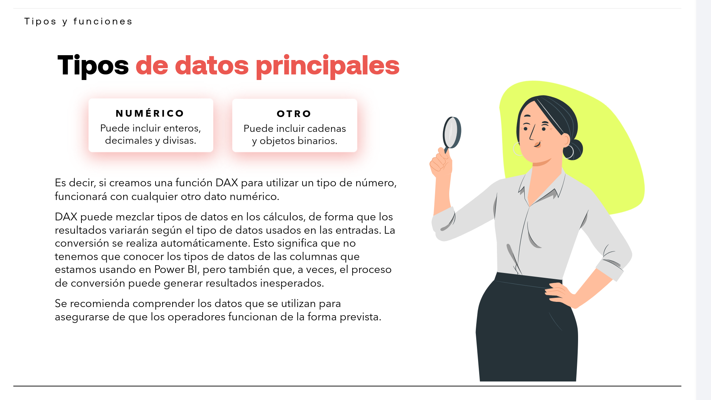
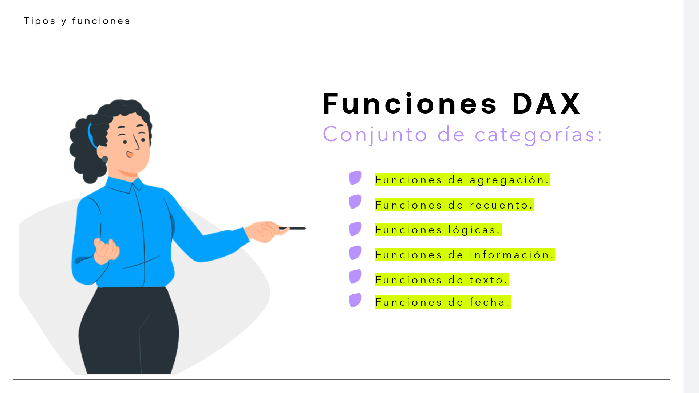
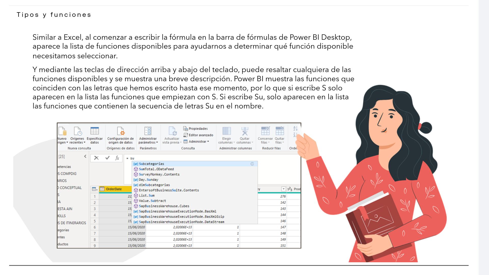
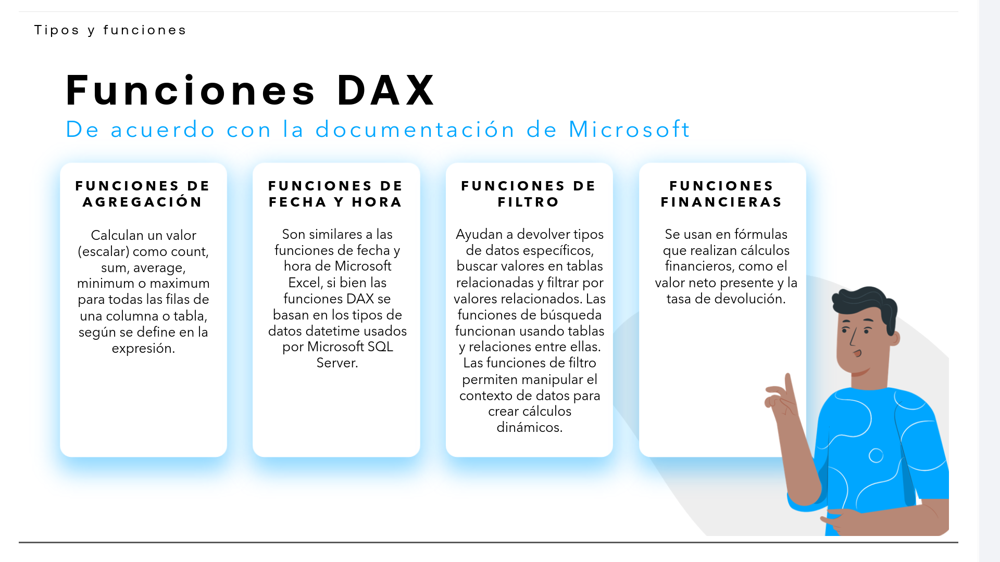
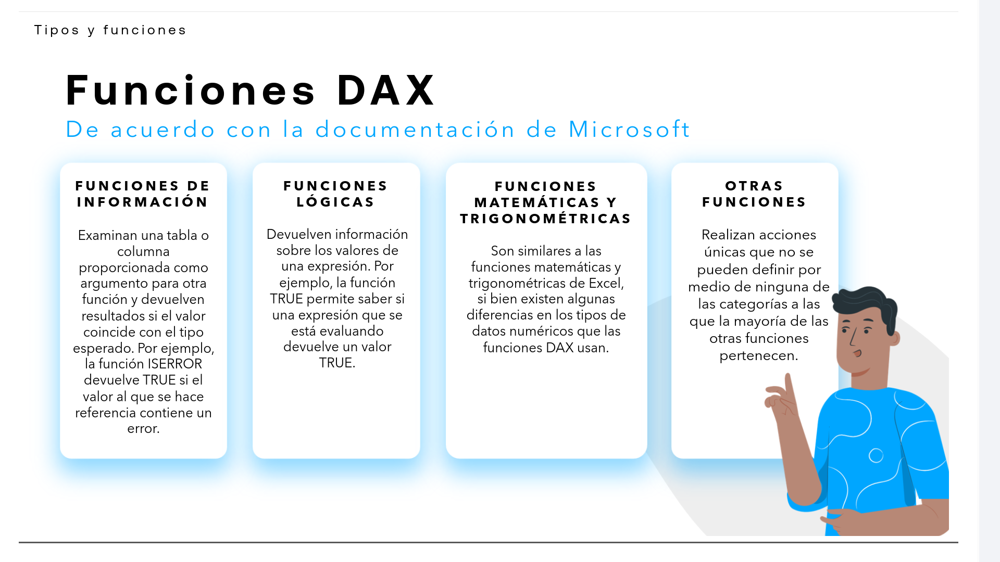
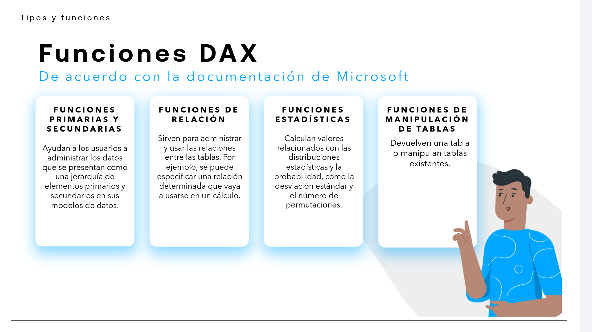
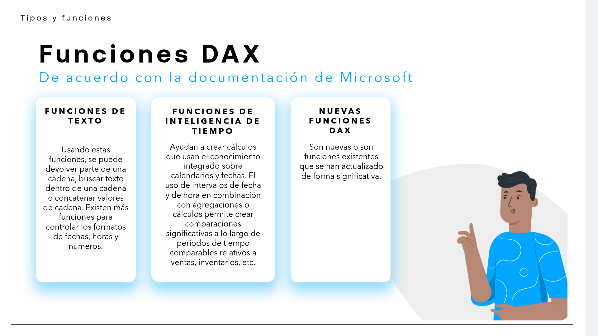

# 06-001:   Tipos y Funciones
Tipos y funciones

# DAX

> ![!IMPORTANT] 
> **DAX** significa **Expresiones de análisis de datos**, y es el lenguaje de fórmulas utilizado en Power BI.  




DAX es un **lenguaje funcional**, es decir, todo el código que se ejecuta se encuentra dentro de una función.  

En DAX, las funciones pueden incluir otras funciones anidadas, instrucciones condicionales y referencias a valores.  

* Por tanto, DAX es una colección de funciones, operadores y constantes que se pueden usar en una fórmula o expresión para calcular y devolver uno o más valores.   

* DAX nos permite crear nueva información a partir de datos que ya existen en nuestro modelo.  

* En Power BI, las fórmulas DAX se escriben en una sola línea, por lo que dar forma a sus funciones correctamente es importante para facilitar la lectura.  

* Las funciones pueden contener otras funciones anidadas, declaraciones condicionales y referencias de valores.  

---

## Tipos de datos principales

> ![!IMPORTANT]
> DAX está **diseñado para usar tablas**, por lo que tiene dos tipos de data types:  
>  
>  * Numérico
>  * Otro


| NUMÉRICO | OTRO |
| :--- | :--- |
| Puede incluir **enteros**, **decimales** y divisas.   | Puede incluir **cadenas** y **objetos binarios**.   |


> [!IMPORTANT]
> DAX puede mezclar tipos de datos en los cálculos, de forma que los resultados variarán según el tipo de datos usados en las entradas.  



- Es decir, si creamos una función DAX para utilizar un tipo de número, funcionará con cualquier otro dato numérico.  

- La conversión se realiza automáticamente.   Esto significa que no tenemos que conocer los tipos de datos de las columnas que estamos usando en Power BI, pero también que, a veces, el proceso de conversión puede generar resultados inesperados.  

> [!NOTE]
> Se recomienda comprender los datos que se utilizan para asegurarse de que los operadores funcionan de la forma prevista.  


---


## Conjunto de categorías de funciones DAX





* Funciones de **agregación**.  
* Funciones de **recuento**.  
* Funciones **lógicas**.  
* Funciones de **información**.  
* Funciones de **texto**.  
* Funciones de **fecha**.  



- Similar a Excel, al comenzar a escribir la fórmula en la barra de fórmulas de Power BI Desktop, aparece la lista de funciones disponibles para ayudarnos a determinar qué función disponible necesitamos seleccionar.  

- Mediante las teclas de dirección arriba y abajo del teclado, puede resaltar cualquiera de las funciones disponibles y se muestra una breve descripción.  
    * Power BI muestra las funciones que coinciden con las letras que hemos escrito hasta ese momento, por lo que si escribe S solo aparecen en la lista las funciones que empiezan con S. Si escribe Su, solo aparecen en la lista las funciones que contienen la secuencia de letras Su en el nombre.  


---

## Tipos de funciones DAX

| FUNCIÓN                                   |                                                        |
| :---------------------------------------- | :----------------------------------------------------- |
| Funciones de **AGREGACIÓN**               | Calculan valores como suma, promedio, mínimo o máximo. |
| Funciones de **FECHA y HORA**             | Trabajan con fechas y horas.                           |
| Funciones de **FILTRO**                   | Filtran datos y modifican el contexto.                 |
| Funciones **FINANCIERAS**                 | Realizan cálculos financieros.                         |
| Funciones de **INFORMACIÓN**              | Comprueban información y tipos de valores.             |
| Funciones **LÓGICAS**                     | Evalúan expresiones lógicas.                           |
| Funciones **MATEMÁTICAS/TRIGONOMÉTRICAS** | Realizan cálculos matemáticos y trigonométricos.       |
| **OTRAS FUNCIONES ESPECÍFICAS**           | Realizan acciones específicas.                         |
| Funciones **PRIMARIAS Y SECUNDARIAS**     | Gestionan jerarquías de elementos.                     |
| Funciones de **RELACIÓN**                 | Gestionan relaciones entre tablas.                     |
| Funciones **ESTADÍSTICAS**                | Calculan valores estadísticos y probabilísticos.       |
| Funciones de **MANIPULACIÓN DE TABLAS**   | Devuelven o manipulan tablas.                          |
| Funciones de **TEXTO (STR)**              | Manipulan y buscan texto.                              |
| Funciones de **INTELIGENCIA DE TIEMPO**   | Realizan cálculos sobre períodos de tiempo.            |
| **NUEVAS FUNCIONES DAX**                  | Incluyen funciones nuevas o actualizadas.              |







[Lectura Rápida: Funciones DAX básicas](./06-001-01_Lectura_Funciones_DAX_basicas.pdf)

---

## Detalle avanzado de funciones

### Funciones de **AGREGACIÓN**

Calculan un valor (escalar) como `count`, `sum`, `average`, `minimum` o `maximum` para todas las filas de una columna o tabla, según se define en la expresión.  

```DAX
Total Ventas = SUM(Ventas[Importe])
```

Las principales funciones de agregación incluyen:  

* `SUM`: Suma todos los valores de una columna.
* `SUMX`: Suma el resultado de una expresión evaluada fila por fila.
* `AVERAGE`: Calcula el promedio de los valores de una columna.
* `AVERAGEX`: Calcula el promedio de una expresión evaluada fila por fila.
* `COUNT`: Cuenta los valores no vacíos de una columna.
* `COUNTA`: Cuenta los valores no vacíos, incluidos los valores de texto.
* `COUNTBLANK`: Cuenta las celdas en blanco.
* `COUNTROWS`: Cuenta las filas de una tabla.
* `COUNTX`: Cuenta los valores de una expresión evaluada fila por fila.
* `DISTINCTCOUNT`: Cuenta los valores distintos de una columna.
* `DISTINCTCOUNTNOBLANK`: Cuenta los valores distintos excluyendo los valores en blanco.
* `MAX`: Devuelve el valor máximo de una columna o expresión.
* `MAXX`: Devuelve el valor máximo de una expresión evaluada fila por fila.
* `MIN`: Devuelve el valor mínimo de una columna o expresión.
* `MINX`: Devuelve el valor mínimo de una expresión evaluada fila por fila.
* `PRODUCT`: Multiplica los valores de una columna.
* `PRODUCTX`: Multiplica los resultados de una expresión evaluada fila por fila.

---

### Funciones de **FECHA Y HORA**

Son similares a las funciones de fecha y hora de Microsoft Excel, si bien las funciones DAX se basan en los tipos de datos datetime usados por Microsoft SQL Server.  

```DAX
Anyo = YEAR(Ventas[Fecha])
```

Ayudan a crear cálculos basados en fechas y horas. Muchas de las funciones de DAX son similares a las funciones de fecha y hora de Excel. Sin embargo, las funciones de DAX usan un tipo de datos datetime y pueden tomar valores de una columna como argumento.  

Las principales funciones de fecha y hora incluyen las siguientes:  

* `DATE`: Devuelve la fecha especificada en formato de fecha y hora.
* `DATEVALUE`: Convierte una fecha representada como texto en un valor datetime.
* `DAY`: Devuelve el día del mes.
* `MONTH`: Devuelve el número del mes.
* `YEAR`: Devuelve el año de una fecha.
* `HOUR`: Devuelve la hora como un número entre 0 y 23.
* `MINUTE`: Devuelve los minutos de una hora.
* `SECOND`: Devuelve los segundos de una hora.
* `TIME`: Convierte horas, minutos y segundos en un valor datetime.
* `TIMEVALUE`: Convierte una hora representada como texto en un valor datetime.
* `NOW`: Devuelve la fecha y la hora actuales.
* `TODAY`: Devuelve la fecha actual.
* `EOMONTH`: Devuelve el último día del mes antes o después de un número de meses especificado.
* `EDATE`: Devuelve una fecha desplazada un número determinado de meses.
* `WEEKDAY`: Devuelve un número que identifica el día de la semana.
* `WEEKNUM`: Devuelve el número de semana del año.

Aunque estas funciones son útiles para calcular y extraer información de los valores de fecha, no se aplican a la inteligencia de tiempo, que usa una tabla de fechas.  

---

### Funciones de **FILTRO**

> [!IMPORTANT]
> Las funciones de filtro **permiten manipular el contexto de datos para crear cálculos dinámicos**.

Ayudan a devolver tipos de datos específicos, buscar valores en tablas relacionadas y filtrar por valores relacionados.  

Las funciones de búsqueda funcionan usando tablas y relaciones entre ellas.  

```DAX
Ventas Altas = CALCULATE(
    [Total Ventas],
    Ventas[Importe] > 1000
)
```

Las principales funciones de filtro incluyen:  

* `CALCULATE`: Evalúa una expresión en un contexto de filtro modificado.
* `CALCULATETABLE`: Evalúa una expresión de tabla en un contexto de filtro modificado.
* `FILTER`: Devuelve una tabla que contiene únicamente las filas que cumplen una condición.
* `ALL`: Ignora los filtros aplicados a una tabla o columna.
* `ALLCROSSFILTERED`: Borra todos los filtros aplicados a una tabla.
* `ALLEXCEPT`: Elimina todos los filtros excepto los especificados.
* `ALLNOBLANKROW`: Devuelve todos los valores excepto la fila en blanco relacionada.
* `REMOVEFILTERS`: Elimina los filtros de las tablas o columnas especificadas.
* `KEEPFILTERS`: Mantiene los filtros existentes al aplicar nuevos filtros.
* `SELECTEDVALUE`: Devuelve el valor cuando una columna tiene un único valor distinto en el contexto.
* `VALUES`: Devuelve los valores distintos de una columna o las filas de una tabla.
* `DISTINCT`: Devuelve los valores distintos de una columna o tabla.
* `HASONEVALUE`: Comprueba si existe un único valor en el contexto de filtro.
* `HASONEFILTER`: Comprueba si una columna tiene exactamente un filtro directo.
* `ISFILTERED`: Comprueba si una tabla o columna está siendo filtrada directamente.
* `ISCROSSFILTERED`: Comprueba si una tabla o columna está siendo filtrada directa o indirectamente.
* `LOOKUPVALUE`: Busca un valor en una tabla utilizando condiciones de búsqueda.

---

### Funciones **FINANCIERAS**
  
Se usan en fórmulas que realizan cálculos financieros, como el valor neto presente y la tasa de devolución.  

```DAX
Intereses = FV(0.05, 10, -100)
```

Las principales funciones financieras incluyen:  

* `FV`: Calcula el valor futuro de una inversión.
* `PV`: Calcula el valor actual de una inversión.
* `NPV`: Calcula el valor neto presente de una inversión.
* `XNPV`: Calcula el valor neto presente utilizando fechas de flujo de caja.
* `IRR`: Calcula la tasa interna de retorno.
* `XIRR`: Calcula la tasa interna de retorno utilizando fechas.
* `PMT`: Calcula el pago periódico de un préstamo.
* `IPMT`: Calcula el pago de intereses de un período.
* `PPMT`: Calcula el pago del principal de un período.
* `RATE`: Calcula la tasa de interés por período.
* `EFFECT`: Calcula la tasa de interés efectiva anual.
* `NOMINAL`: Calcula la tasa de interés nominal anual.

---

### Funciones de **INFORMACIÓN**

Examinan una tabla o columna proporcionada como argumento para otra función y devuelven resultados si el valor coincide con el tipo esperado.  

Por ejemplo, la función `ISERROR` devuelve `TRUE` si el valor al que se hace referencia contiene un error.  

```DAX
Tiene Error = ISERROR([Total Ventas])
```

Las funciones de información de DAX examinan la celda o fila que se proporciona como argumento e indican si el valor coincide con el tipo esperado.  

Las principales funciones de información de DAX incluyen:  

* `ISBLANK`: Comprueba si un valor está en blanco y devuelve TRUE o FALSE.
* `ISNUMBER`: Comprueba si un valor es un número y devuelve TRUE o FALSE.
* `ISTEXT`: Comprueba si un valor es texto y devuelve TRUE o FALSE.
* `ISNONTEXT`: Comprueba si un valor no es de texto y devuelve TRUE o FALSE.
* `ISERROR`: Comprueba si un valor es un error y devuelve TRUE o FALSE.
* `ISERR`: Comprueba si un valor produce un error distinto de `#N/A`.
* `ISEMPTY`: Comprueba si una tabla está vacía.
* `ISLOGICAL`: Comprueba si un valor es lógico.
* `ISNUMERIC`: Comprueba si un valor es numérico.
* `ISDECIMAL`: Comprueba si un valor es decimal.
* `ISCURRENCY`: Comprueba si un valor es de tipo moneda.
* `ISDATETIME`: Comprueba si un valor es de fecha y hora.
* `CONTAINS`: Comprueba si existen valores determinados en una tabla.
* `CONTAINSROW`: Comprueba si una tabla contiene una fila determinada.
* `CONTAINSSTRING`: Comprueba si una cadena contiene otra cadena.
* `CONTAINSSTRINGEXACT`: Comprueba si una cadena contiene exactamente otra cadena.
* `HASONEVALUE`: Comprueba si existe un único valor distinto.
* `HASONEFILTER`: Comprueba si existe un único filtro directo.
* `SELECTEDVALUE`: Devuelve el valor seleccionado cuando existe uno solo.

---

### Funciones **LÓGICAS**

Devuelven información sobre los valores de una expresión.  

Por ejemplo, la función `TRUE` permite saber si una expresión que se está evaluando devuelve un valor TRUE.  

```DAX
Estado = IF([Total Ventas] > 1000, "Alto", "Bajo")
```

La colección de principales funciones lógicas de DAX incluye:  

* `AND`: Comprueba si los dos argumentos son TRUE y devuelve TRUE si ambos lo son.
* `OR`: Devuelve TRUE si al menos uno de los argumentos es TRUE.
* `NOT`: Cambia FALSE por TRUE o TRUE por FALSE.
* `IF`: Comprueba una condición y devuelve un valor si es TRUE y otro si es FALSE.
* `IF.EAGER`: Evalúa las ramas TRUE y FALSE antes de devolver el resultado.
* `SWITCH`: Evalúa una expresión y devuelve un resultado asociado al primer valor coincidente.
* `TRUE`: Devuelve el valor lógico TRUE.
* `FALSE`: Devuelve el valor lógico FALSE.
* `IFERROR`: Devuelve un valor alternativo cuando una expresión produce un error.
* `COALESCE`: Devuelve la primera expresión que no sea BLANK.

---

### Funciones **MATEMÁTICAS Y TRIGONOMÉTRICAS**

Son similares a las funciones matemáticas y trigonométricas de Excel, si bien existen algunas diferencias en los tipos de datos numéricos que las funciones DAX usan.  

```DAX
Redondeo = ROUND([Total Ventas], 2)
```

Las principales funciones matemáticas y trigonométricas incluyen:  

* `ABS`: Devuelve el valor absoluto de un número.
* `CEILING`: Redondea un número hacia arriba hasta un múltiplo determinado.
* `FLOOR`: Redondea un número hacia abajo hasta un múltiplo determinado.
* `ROUND`: Redondea un número al número de decimales especificado.
* `ROUNDUP`: Redondea un número alejándolo de cero.
* `ROUNDDOWN`: Redondea un número hacia cero.
* `MROUND`: Redondea un número al múltiplo especificado.
* `INT`: Redondea un número hacia abajo hasta el entero más próximo.
* `TRUNC`: Trunca un número eliminando los decimales.
* `MOD`: Devuelve el resto de una división.
* `QUOTIENT`: Devuelve la parte entera de una división.
* `POWER`: Eleva un número a una potencia.
* `SQRT`: Devuelve la raíz cuadrada.
* `EXP`: Devuelve `e` elevado a una potencia.
* `LN`: Devuelve el logaritmo natural.
* `LOG`: Devuelve el logaritmo de un número.
* `LOG10`: Devuelve el logaritmo en base 10.
* `PI`: Devuelve el valor de π.
* `SIGN`: Devuelve el signo de un número.
* `RAND`: Genera un número aleatorio.
* `RANDBETWEEN`: Genera un número entero aleatorio entre dos valores.
* `DIVIDE`: Realiza una división y permite especificar un resultado alternativo cuando el divisor es cero.
* `PRODUCT`: Multiplica los valores de una columna.
* `PRODUCTX`: Multiplica los resultados de una expresión fila por fila.

---

### **OTRAS** funciones

Realizan acciones únicas que no se pueden definir por medio de ninguna de las categorías a las que la mayoría de las otras funciones pertenecen.  

```DAX
Resultado = BLANK()
```

Algunas funciones incluidas en esta categoría son:  

* `BLANK`: Devuelve un valor en blanco.
* `ERROR`: Genera un error definido por el usuario.
* `EVALUATEANDLOG`: Evalúa una expresión y registra información de diagnóstico.
* `TOCSV`: Convierte una tabla en una representación CSV.
* `TOJSON`: Convierte una tabla o valor en JSON.
* `BITLSHIFT`: Desplaza bits hacia la izquierda.
* `BITRSHIFT`: Desplaza bits hacia la derecha.
* `BITAND`: Realiza una operación AND bit a bit.
* `BITOR`: Realiza una operación OR bit a bit.
* `BITXOR`: Realiza una operación XOR bit a bit.
* `BITNOT`: Invierte los bits de un valor.

---

### Funciones **PRIMARIAS Y SECUNDARIAS**

Ayudan a los usuarios a administrar los datos que se presentan como una jerarquía de elementos primarios y secundarios en sus modelos de datos.  

```DAX
Ruta = PATH(Empleados[ID], Empleados[IDPadre])
```

Las principales funciones de jerarquías primarias y secundarias incluyen:  

* `PATH`: Devuelve una cadena que identifica la ruta jerárquica desde un elemento hasta su elemento raíz.
* `PATHITEM`: Devuelve un elemento concreto de una ruta jerárquica.
* `PATHITEMREVERSE`: Devuelve un elemento de una ruta contando desde el final.
* `PATHLENGTH`: Devuelve el número de elementos de una ruta.
* `PATHCONTAINS`: Comprueba si un identificador existe dentro de una ruta.

---

### Funciones de **RELACIÓN**

Sirven para administrar y usar las relaciones entre las tablas.  

Por ejemplo, se puede especificar una relación determinada que vaya a usarse en un cálculo.  

```DAX
Producto = RELATED(Productos[Nombre])
```

Las principales funciones de relación incluyen:  

* `RELATED`: Devuelve un valor relacionado procedente de otra tabla.
* `RELATEDTABLE`: Devuelve las filas relacionadas de otra tabla.
* `USERELATIONSHIP`: Especifica la relación que debe utilizarse durante un cálculo.
* `CROSSFILTER`: Modifica la dirección o deshabilita el filtrado cruzado de una relación.
* `TREATAS`: Aplica los valores de una tabla como filtros sobre columnas de otra tabla.

---

### Funciones **ESTADÍSTICAS**

Calculan valores relacionados con las distribuciones estadísticas y la probabilidad, como la desviación estándar y el número de permutaciones.  

```DAX
Promedio = AVERAGE(Ventas[Importe])
```

Las principales funciones estadísticas incluyen:  

* `AVERAGE`: Calcula el promedio.
* `AVERAGEA`: Calcula el promedio incluyendo valores no numéricos.
* `MEDIAN`: Devuelve la mediana de una columna.
* `MEDIANX`: Calcula la mediana de una expresión evaluada fila por fila.
* `MAX`: Devuelve el valor máximo.
* `MAXX`: Devuelve el máximo de una expresión.
* `MIN`: Devuelve el valor mínimo.
* `MINX`: Devuelve el mínimo de una expresión.
* `STDEV.P`: Calcula la desviación estándar de una población.
* `STDEV.S`: Calcula la desviación estándar de una muestra.
* `VAR.P`: Calcula la varianza de una población.
* `VAR.S`: Calcula la varianza de una muestra.
* `PERCENTILE.INC`: Devuelve un percentil incluyendo los extremos.
* `PERCENTILE.EXC`: Devuelve un percentil excluyendo los extremos.
* `PERCENTILEX.INC`: Calcula un percentil sobre una expresión.
* `PERCENTILEX.EXC`: Calcula un percentil excluyendo los extremos sobre una expresión.
* `RANK.EQ`: Devuelve la posición de un valor dentro de una lista.
* `GEOMEAN`: Calcula la media geométrica.
* `GEOMEANX`: Calcula la media geométrica de una expresión.
* `PRODUCT`: Calcula el producto de los valores.

---

### Funciones de **MANIPULACIÓN DE TABLAS**

Devuelven una tabla o manipulan tablas existentes.  

```DAX
Tabla Filtrada = FILTER(
    Ventas,
    Ventas[Importe] > 1000
)
```

Las principales funciones de manipulación de tablas incluyen:  

* `ADDCOLUMNS`: Agrega columnas calculadas a una tabla.
* `SELECTCOLUMNS`: Devuelve una tabla con las columnas seleccionadas.
* `FILTER`: Devuelve las filas que cumplen una condición.
* `SUMMARIZE`: Crea una tabla de resumen agrupando filas.
* `SUMMARIZECOLUMNS`: Crea una tabla de resumen optimizada para consultas.
* `GROUPBY`: Agrupa filas y permite realizar cálculos sobre los grupos.
* `CROSSJOIN`: Genera todas las combinaciones entre las filas de varias tablas.
* `UNION`: Combina las filas de varias tablas.
* `INTERSECT`: Devuelve las filas comunes a dos tablas.
* `EXCEPT`: Devuelve las filas de la primera tabla que no están en la segunda.
* `GENERATE`: Genera una tabla combinando cada fila de una tabla con otra tabla.
* `GENERATEALL`: Similar a `GENERATE`, conservando también filas sin coincidencia.
* `NATURALINNERJOIN`: Realiza una combinación interna utilizando columnas comunes.
* `NATURALLEFTOUTERJOIN`: Realiza una combinación izquierda utilizando columnas comunes.
* `SELECTCOLUMNS`: Crea una tabla seleccionando y renombrando columnas.
* `TOPN`: Devuelve las primeras N filas según un criterio.
* `DISTINCT`: Devuelve una tabla con valores distintos.
* `VALUES`: Devuelve los valores distintos de una columna o las filas de una tabla.
* `ROW`: Devuelve una tabla con una única fila.
* `DATATABLE`: Define una tabla mediante valores especificados explícitamente.

---

### Funciones de **TEXTO**

Usando estas funciones, se puede devolver parte de una cadena, buscar texto dentro de una cadena o concatenar valores de cadena.  

Existen más funciones para controlar los formatos de fechas, horas y números.  

```DAX
Nombre Completo = Clientes[Nombre] & " " & Clientes[Apellidos]
```

> [!IMPORTANT]
> Están basadas en la biblioteca de funciones de cadena de Excel, pero se han modificado para trabajar con tablas y columnas en modelos tabulares.  

Las principales funciones de texto usadas en DAX incluyen las siguientes:  

* `CONCATENATE`: Combina dos cadenas de texto en una sola.
* `CONCATENATEX`: Concatena el resultado de una expresión para cada fila de una tabla.
* `COMBINEVALUES`: Combina dos o más cadenas utilizando un delimitador.
* `REPLACE`: Reemplaza una parte de una cadena según la posición y número de caracteres.
* `SUBSTITUTE`: Reemplaza texto existente por otro texto.
* `SEARCH`: Busca una cadena dentro de otra y devuelve su posición.
* `FIND`: Busca una cadena dentro de otra distinguiendo mayúsculas y minúsculas.
* `CONTAINSSTRING`: Comprueba si una cadena contiene otra cadena.
* `CONTAINSSTRINGEXACT`: Comprueba si una cadena contiene exactamente otra cadena.
* `LEFT`: Devuelve los caracteres situados al principio de una cadena.
* `RIGHT`: Devuelve los caracteres situados al final de una cadena.
* `MID`: Devuelve una parte de una cadena desde una posición determinada.
* `LEN`: Devuelve la longitud de una cadena.
* `UPPER`: Convierte una cadena de texto a letras mayúsculas.
* `LOWER`: Convierte una cadena de texto a letras minúsculas.
* `TRIM`: Elimina los espacios adicionales de una cadena.
* `FORMAT`: Convierte un valor en texto con un formato especificado.
* `FIXED`: Redondea un número y devuelve el resultado como texto.
* `EXACT`: Compara dos cadenas de texto.
* `UNICHAR`: Devuelve el carácter correspondiente a un código Unicode.
* `UNICODE`: Devuelve el código Unicode del primer carácter.
* `REPT`: Repite una cadena un número determinado de veces.

---

### Funciones de **INTELIGENCIA DE TIEMPO**

Ayudan a crear cálculos que usan el conocimiento integrado sobre calendarios y fechas.  

El uso de intervalos de fecha y de hora en combinación con agregaciones o cálculos permite crear comparaciones significativas a lo largo de períodos de tiempo comparables relativos a ventas, inventarios, etc.  

```DAX
Ventas Año Anterior =
CALCULATE(
    [Total Ventas],
    SAMEPERIODLASTYEAR(Calendario[Fecha])
)
```

Las principales funciones de inteligencia de tiempo incluyen:  

* `DATEADD`: Desplaza las fechas de un período hacia adelante o atrás.
* `DATESBETWEEN`: Devuelve las fechas comprendidas entre dos fechas.
* `DATESINPERIOD`: Devuelve las fechas de un período determinado.
* `DATESMTD`: Devuelve las fechas del mes hasta la fecha actual.
* `DATESQTD`: Devuelve las fechas del trimestre hasta la fecha actual.
* `DATESYTD`: Devuelve las fechas del año hasta la fecha actual.
* `TOTALMTD`: Evalúa una expresión acumulada durante el mes.
* `TOTALQTD`: Evalúa una expresión acumulada durante el trimestre.
* `TOTALYTD`: Evalúa una expresión acumulada durante el año.
* `SAMEPERIODLASTYEAR`: Devuelve el período equivalente del año anterior.
* `PREVIOUSDAY`: Devuelve las fechas del día anterior.
* `PREVIOUSMONTH`: Devuelve las fechas del mes anterior.
* `PREVIOUSQUARTER`: Devuelve las fechas del trimestre anterior.
* `PREVIOUSYEAR`: Devuelve las fechas del año anterior.
* `NEXTDAY`: Devuelve las fechas del día siguiente.
* `NEXTMONTH`: Devuelve las fechas del mes siguiente.
* `NEXTQUARTER`: Devuelve las fechas del trimestre siguiente.
* `NEXTYEAR`: Devuelve las fechas del año siguiente.
* `FIRSTDATE`: Devuelve la primera fecha del contexto actual.
* `LASTDATE`: Devuelve la última fecha del contexto actual.
* `FIRSTNONBLANK`: Devuelve el primer valor no vacío.
* `LASTNONBLANK`: Devuelve el último valor no vacío.
* `OPENINGBALANCEMONTH`: Calcula el saldo inicial del mes.
* `CLOSINGBALANCEMONTH`: Calcula el saldo final del mes.
* `OPENINGBALANCEQUARTER`: Calcula el saldo inicial del trimestre.
* `CLOSINGBALANCEQUARTER`: Calcula el saldo final del trimestre.
* `OPENINGBALANCEYEAR`: Calcula el saldo inicial del año.
* `CLOSINGBALANCEYEAR`: Calcula el saldo final del año.

---

### Nuevas funciones **DAX**

Son nuevas o son funciones existentes que se han actualizado de forma significativa.  

```DAX
Resultado = COALESCE([Total Ventas], 0)
```

Esta categoría se actualiza con nuevas funciones y con funciones existentes que reciben cambios importantes.  

> [!NOTE]
> Microsoft mantiene esta clasificación separada en su referencia de funciones DAX.  

---

### Funciones de **RECUENTO**

Estas funciones cuentan elementos diferentes, como valores distintos, valores no vacíos y filas de tabla.  

Las funciones de recuento usadas habitualmente en DAX incluyen las siguientes:  

* `COUNT`: cuenta el número de celdas de una columna que contienen valores que no están en blanco.
* `COUNTA`: cuenta el número de celdas de una columna que no están vacías.
* `COUNTBLANK`: cuenta el número de celdas en blanco de una columna.
* `COUNTROWS`: cuenta el número de filas de la tabla especificada o de una tabla definida por una expresión.
* `DISTINCTCOUNT`: cuenta el número de valores distintos de una columna.
* `DISTINCTCOUNTNOBLANK`: cuenta los valores distintos excluyendo los valores en blanco.
* `COUNTX`: cuenta los valores resultantes de una expresión evaluada fila por fila.
* `COUNTAX`: cuenta los valores no vacíos de una expresión evaluada fila por fila.

```DAX
Clientes = DISTINCTCOUNT(Ventas[ClienteID])
```

---

### Funciones de **INFO**

Las funciones `INFO` devuelven metadatos sobre el modelo semántico, como tablas, columnas, relaciones y fórmulas DAX. Pueden utilizarse para comprender y documentar el modelo.   

```DAX
Tablas = INFO.VIEW.TABLES()
```

Algunas de las funciones `INFO` permiten consultar información sobre:  

* Tablas del modelo.
* Columnas.
* Medidas.
* Relaciones.
* Particiones.
* Expresiones DAX.
* Propiedades del modelo.
* Elementos del modelo semántico.

> [!NOTE]
> Estas funciones están orientadas principalmente a la consulta y documentación de los metadatos del modelo.

---

### Funciones **DEFINIDAS POR EL USUARIO**

Las funciones definidas por el usuario permiten encapsular lógica DAX reutilizable mediante parámetros, de forma similar a las funciones de otros lenguajes de programación.  

```DAX
FUNCTION MiFuncion =
    (Valor) =>
        Valor * 2
```

Permiten:  

* Reutilizar lógica DAX.
* Utilizar parámetros.
* Evitar repetir expresiones.
* Facilitar el mantenimiento del código.
* Utilizar funciones personalizadas desde otras expresiones DAX.

---

