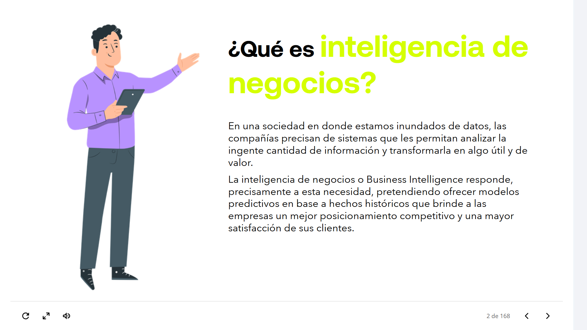
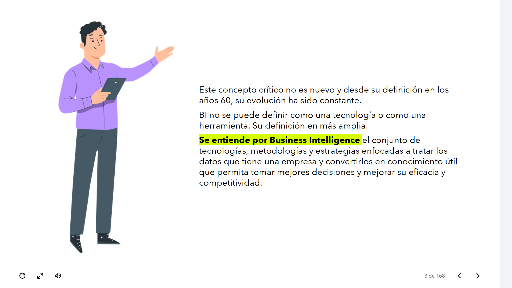

## 01-001: ¿Qué es BI - Inteligencia de Negocios?

En una sociedad en donde estamos inundados de datos, las compañías precisan de sistemas que les permitan analizar la ingente cantidad de información y transformarla en algo útil y de valor.

La inteligencia de negocios o Business Intelligence responde, precisamente a esta necesidad, pretendiendo ofrecer modelos predictivos en base a hechos históricos que brinde a las empresas un mejor posicionamiento competitivo y una mayor satisfacción de sus clientes.

---

Este concepto crítico no es nuevo y desde su definición en los años 60, su evolución ha sido constante.

BI no se puede definir como una tecnología o como una herramienta. Su definición es más amplia.

> **Se entiende por Business Intelligence** el conjunto de tecnologías, metodologías y estrategias enfocadas a tratar los datos que tiene una empresa y convertirlos en conocimiento útil que permita tomar mejores decisiones y mejorar su eficacia y competitividad.
