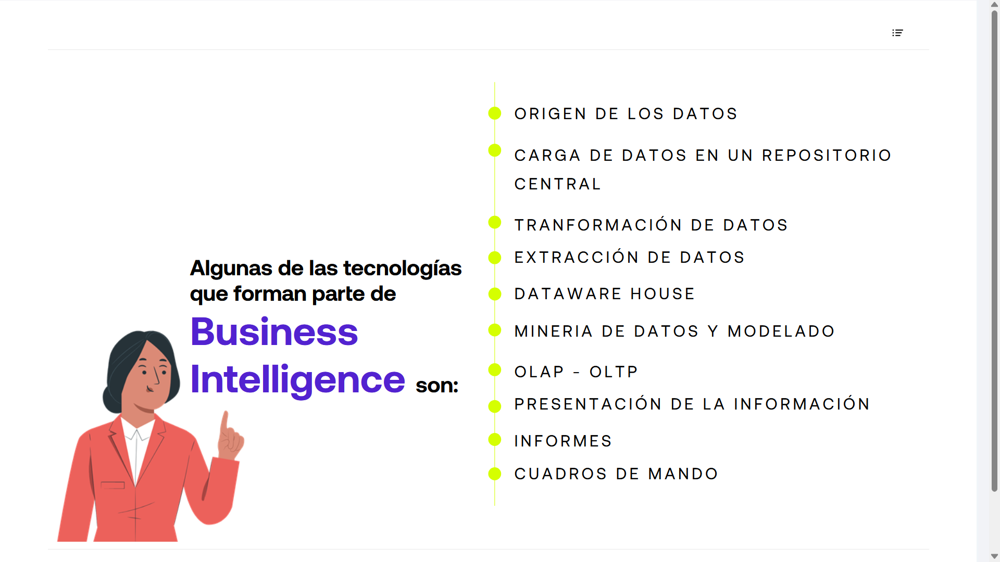

# 01-002:	Tecnologías que Forman Parte de Business Intelligence

* Origen de los datos
* Carga de datos en un repositorio central
* Transformación de datos
* Extracción de datos
* Data Warehouse
* Minería de datos y modelado
* OLAP - OLTP
* Presentación de la información
* Informes
* Cuadros de mando

***

