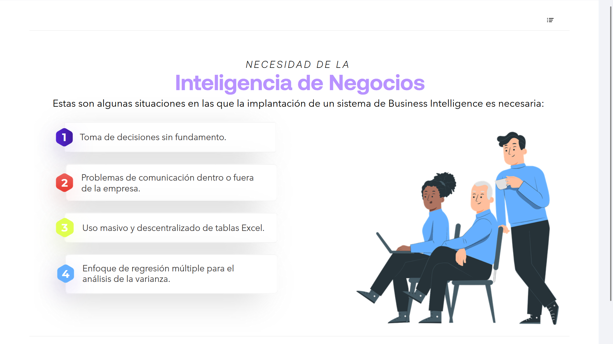
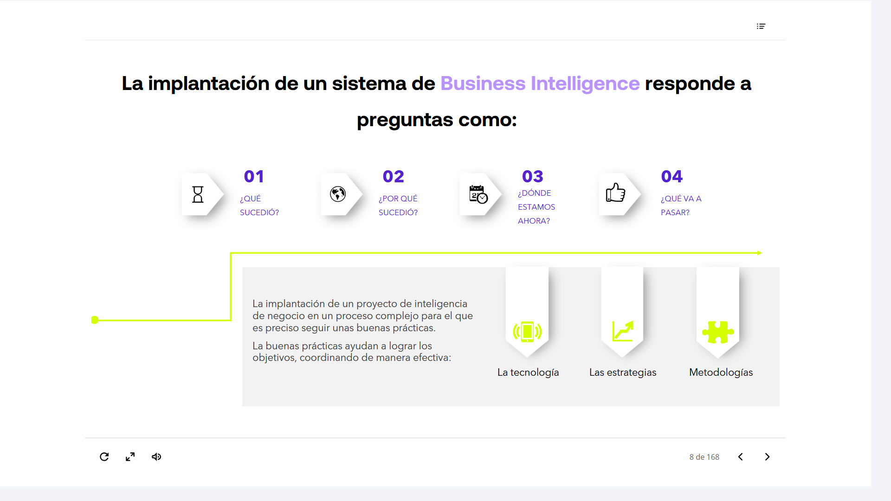
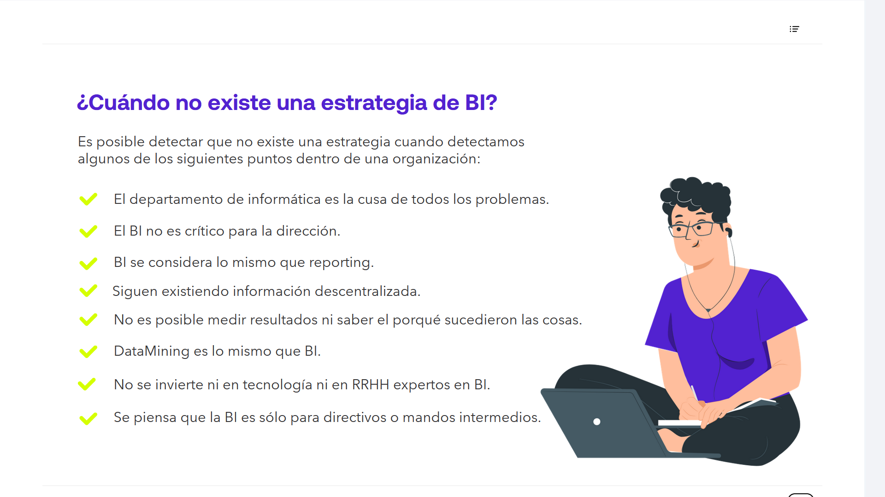
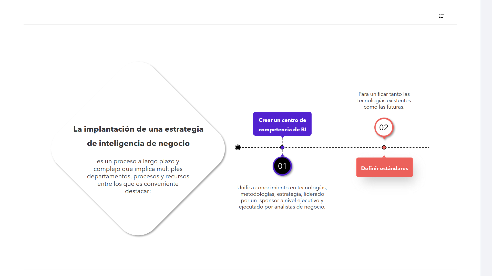
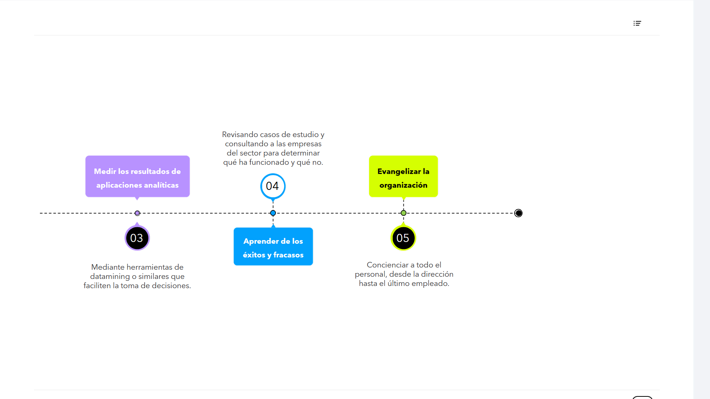

# 01-003:  Implementando un sistema BI
---
## Necesidad de implementación de un sistema BI

Estas son algunas situaciones en las que la implantación de un sistema de Business Intelligence es necesaria:

1. Toma de decisiones sin fundamento
2. Problemas de comunicación dentro o fuera de la empresa
3. Uso masivo y descentralizado de tablas Excel
4. Enfoque de regresión múltiple para el análisis de la varianza
5. La información no fluye entre departamentos o llega duplicada
6. Hay silos de información
7. Tareas de ventas y marketing ineficientes
8. Volumen excesivo de información que la hace inmanejable
9. Procesos manuales

---

## Implantación de un Sistema de Business Intelligence

La implantación de un sistema BI ayuda a responder preguntas como ...  

### **01** | ¿Qué sucedió? 
### **02** | ¿Por qué sucedió?
### **03** | ¿Dónde estamos ahora?
### **04** | ¿Qué va a pasar?

---

La implantación de un proyecto de inteligencia de negocio es un proceso complejo para el que es preciso seguir unas buenas prácticas.

Las buenas prácticas ayudan a lograr los objetivos, coordinando de manera efectiva:

* La tecnología
* Las estrategias
* Las metodologías

---

###  ¿Cuándo no Existe una Estrategia de BI?

Es posible detectar que no existe una estrategia cuando detectamos algunos de los siguientes puntos dentro de una organización:

* El departamento de informática es la causa de todos los problemas
* El BI no es crítico para la dirección
* BI se considera lo mismo que reporting
* Siguen existiendo información descentralizada
* No es posible medir resultados ni saber el porqué sucedieron las cosas
* Data Mining es lo mismo que BI
* No se invierte ni en tecnología ni en RRHH expertos en BI
* Se piensa que la BI es sólo para directivos o mandos intermedios

---

###	Implantación de una Estrategia de Inteligencia de Negocio

Es un proceso a largo plazo y complejo que implica múltiples departamentos, procesos y recursos entre los que es conveniente destacar:

####	01. Crear un Centro de Competencia de BI

> Unifica conocimiento en tecnologías, metodologías, estrategia, liderado por un sponsor a nivel ejecutivo y ejecutado por analistas de negocio.

####	02. Definir Estándares

> Para unificar tanto las tecnologías existentes como las futuras.

####	03. Medir los Resultados de Aplicaciones Analíticas

> Mediante herramientas de data mining o similares que faciliten la toma de decisiones.

####	04. Aprender de los Éxitos y Fracasos

> Revisando casos de estudio y consultando a las empresas del sector para determinar qué ha funcionado y qué no.

####	05. "Evangelizar" la Organización

> Concienciar a todo el personal, desde la dirección hasta el último empleado.

---

> Este tipo de proyectos suponen una transformación cultural de toda la organización en donde es necesario tener respuesta a alguna de las siguientes preguntas:

* ¿Qué problemas o necesidades de negocio se busca resolver?
* ¿A qué en particular se debe dar respuesta y con qué prioridad?
* ¿De qué manera obtenemos respuesta actualmente?
* ¿Qué fuentes de datos y desde qué departamentos son necesarias? (marketing, operaciones, recursos humanos, etc.)
* ¿Cómo es la calidad de los datos?
* ¿Qué cantidad de datos debe ser guardada como histórico?
* ¿Con qué frecuencia deben estar actualizados los datos?

***
