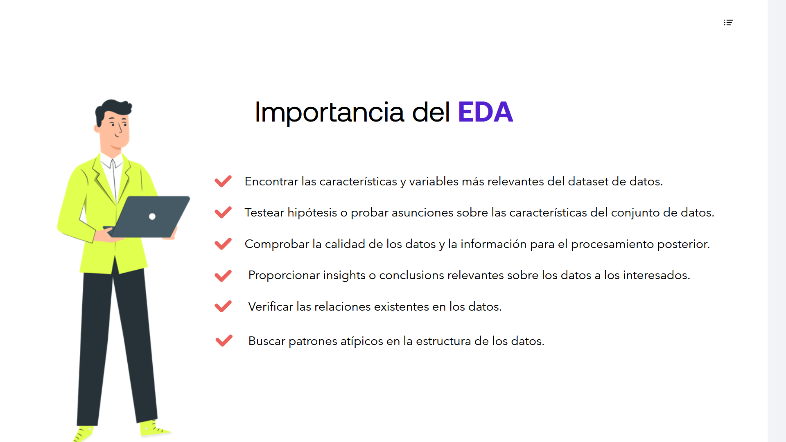
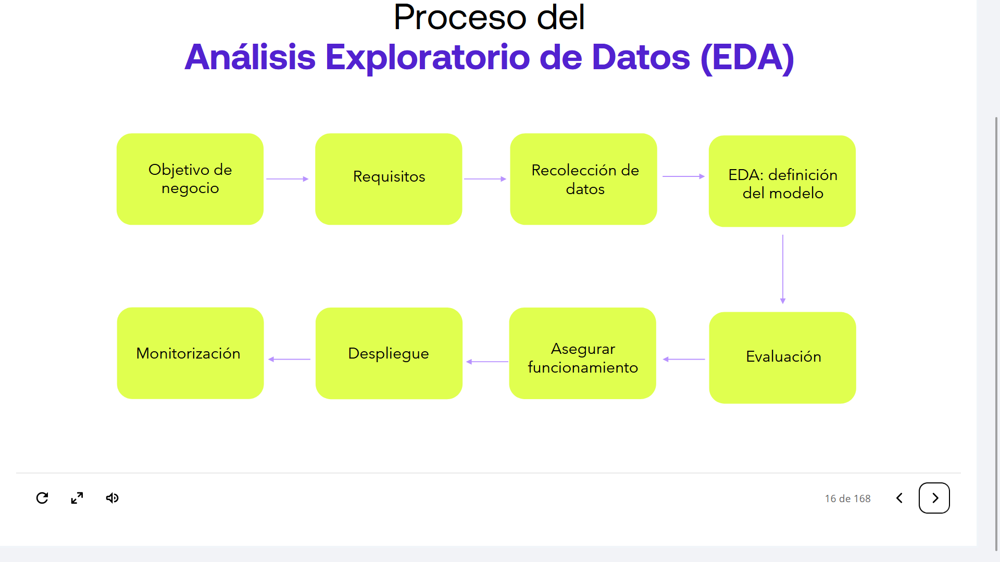

## 01-004:	 EDA - Análisis Exploratorio de Datos

### ¿Qué es el EDA?

El **análisis exploratorio de datos** es un enfoque de análisis de datos para revelar las características importantes de un conjunto de datos, principalmente a través de la visualización.

Hay que conocer bien los datos:

* Distribuciones (simétrica, normal, sesgada)
* Problemas de calidad de los datos
* Valores atípicos
* Correlaciones e interrelaciones
* Relaciones funcionales
* Atributos derivados, claves primarias, claves foráneas, etc.
* Atributos estáticos, atributos dinámicos, etc.

---

## Introducción al Análisis Exploratorio de Datos (EDA)

### 1

> El análisis exploratorio de datos se refiere al proceso de realizar investigaciones iniciales sobre la naturaleza de los datos para identificar patrones, interceptar anomalías, evaluar hipótesis y chequear asunciones con la ayuda de estadísticos y herramientas de representación gráfica.

### 2

> Es una práctica muy recomendada para comprender la naturaleza de los datos y tratar de extraer tanta información como se pueda de inicio.

---

## Importancia del EDA

* Encontrar las características y variables más relevantes del dataset de datos
* Testear hipótesis o probar asunciones sobre las características del conjunto de datos
* Comprobar la calidad de los datos y la información para el procesamiento posterior
* Proporcionar insights o conclusiones relevantes sobre los datos a los interesados
* Verificar las relaciones existentes en los datos
* Buscar patrones atípicos en la estructura de los datos

---

## Proceso del Análisis Exploratorio de Datos (EDA)

### 1. Objetivo de Negocio

> Definir qué se desea conseguir.

**Ejemplo:** Empresa de Agricultura → Conocer las tendencias de mercado, para poder actuar con ventaja ante la competencia.

### 2. Requisitos

> Para ello, deben formularse una serie de requisitos de datos a analizar.

**Ejemplo:** Histórico de ventas junto con datos contextualizados.

### 3. Recolección de Datos

> En base a los requisitos formulados.

### 4. EDA: Definición del Modelo

> Se utiliza para dar respuesta al modelo del esquema de inferencia que se persigue.

### 5. Evaluación
### 6. Asegurar Funcionamiento
### 7. Despliegue

> Todo ello da lugar al despliegue.

### 8. Monitorización

> Finalmente, se realiza una monitorización del rendimiento, para asegurar la correcta respuesta. Este paso da lugar a una nueva iteración, que permite añadir datos, redefinir el modelo, o incluso modificar los objetivos de negocio.
