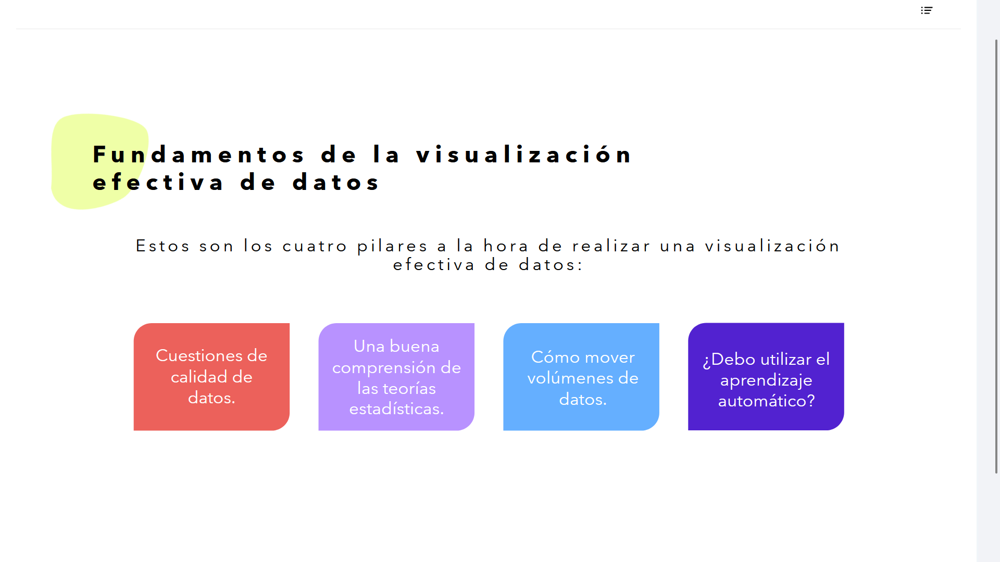
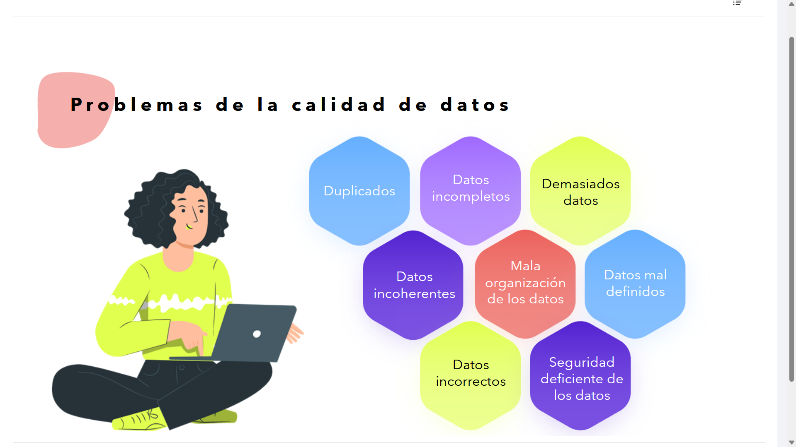

# 01-005:	Fundamentos de la visualización efectiva de datos

## Dos Tipologías de Datos

* **Datos estructurados:** archivo CSV, archivo Excel, base de datos, etc.
* **Datos no estructurados:** vídeo, imagen, sonido, etc.

---

## Consejos Importantes a la Hora de Analizar Datos Preliminares

### Obtén una Idea General de los Datos

#### 1

> Asegúrate de que tu primera visualización esté basada en datos (sin modelos).

#### 2

> Piensa en lo interactivo y lo visual:
> * **Los humanos son los mejores reconocedores de patrones**
> * Utiliza tantas dimensiones como le permitan tus datos (2, 3, x, y, z, espacio, color, tiempo, etc.)

#### 3

> La visualización es útil en las primeras etapas de la minería de datos:
> * Detectar valores atípicos (por ejemplo, evaluar la calidad de los datos)
> * Comprobar los supuestos (por ejemplo, ¿distribuciones normales o sesgadas?)
> * Identificar datos brutos útiles y transformaciones (por ejemplo, log(x))

#### Conclusión

¡Siempre merece la pena examinar los datos!

---

## Fundamentos de la visualización efectiva de datos

Estos son los cuatro pilares a la hora de realizar una visualización efectiva de datos:

* Cuestiones de calidad de datos.
* Una buena comprensión de las teorías estadísticas.
* Cómo mover volúmenes de datos.
* ¿Debo utilizar el aprendizaje automático?

---

## **Problemas de la calidad de datos**

Se ha de tener en cuenta los potenciales problemas de calidad de los datos:
* **Duplicados**:
	Habrá que deduplicarlos
* **Datos incompletos**
	Si tenemos data con variables faltantes, hay que recurrir a métodos que permitan evitar el problema
* **Demasiados datos**
	Si hay demasiados datos, el procesamiento global EDA puede ser una pesadilla, impracticable. **Harbá que reducir**.
* **Datos incoherentes**
	Si existe incoherencia en los datos, habrá de entenderse la causa
* **Mala organización de los datos** + **Datos mal definidos** + **Datos incorrectos**
	Si los datos son falsos, los resultados serán incorrectos, sesgados o de nulo valor, por mucho que implantemos el mejor sistema EDA.  
	Por ejemplo, si contamos con datos numéricos, pero no conocemos las médidas de estos, se genera este problema.
* **Seguridad deficiente de los datos**
	Si estamos manejando datos que no respetan leyes como la RGPD, no es correcto.
	
