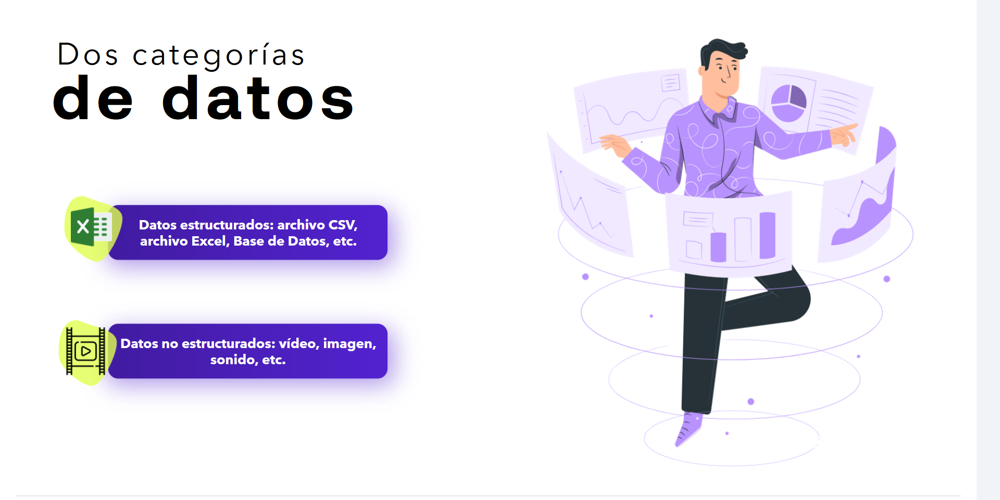
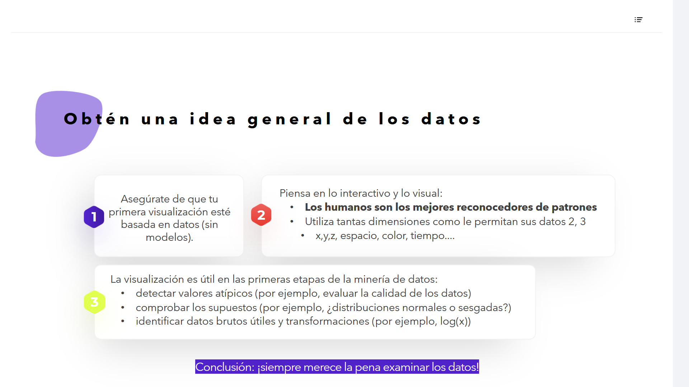

# 01-005:	Fundamentos de la visualización efectiva de datos

## Dos Tipologías de Datos

* **Datos estructurados:** archivo CSV, archivo Excel, base de datos, etc.
* **Datos no estructurados:** vídeo, imagen, sonido, etc.

---

## Consejos Importantes a la Hora de Analizar Datos Preliminares

### Obtén una Idea General de los Datos

#### 1

> Asegúrate de que tu primera visualización esté basada en datos (sin modelos).

#### 2

> Piensa en lo interactivo y lo visual:
> * **Los humanos son los mejores reconocedores de patrones**
> * Utiliza tantas dimensiones como le permitan tus datos (2, 3, x, y, z, espacio, color, tiempo, etc.)

#### 3

> La visualización es útil en las primeras etapas de la minería de datos:
> * Detectar valores atípicos (por ejemplo, evaluar la calidad de los datos)
> * Comprobar los supuestos (por ejemplo, ¿distribuciones normales o sesgadas?)
> * Identificar datos brutos útiles y transformaciones (por ejemplo, log(x))

#### Conclusión

¡Siempre merece la pena examinar los datos!

---
