# 01-006:	Data Mining, Casos Prácticos
---

# **Casos prácticos en Compras y ventas**

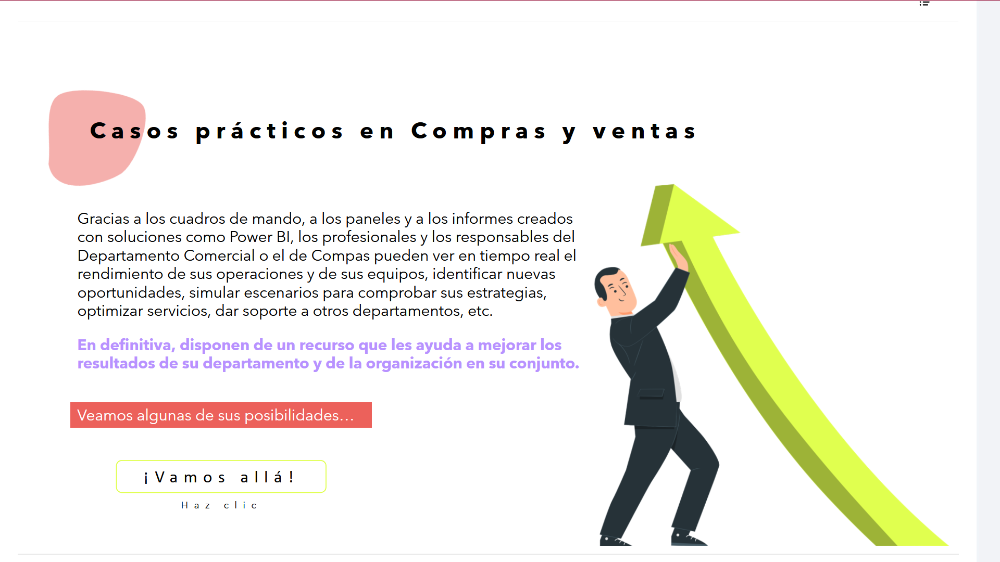
Gracias a los cuadros de mando, a los paneles y a los informes creados con soluciones como Power BI, los profesionales y los responsables del Departamento Comercial o el de Compras pueden ver en tiempo real el rendimiento de sus operaciones y de sus equipos, identificar nuevas oportunidades, simular escenarios para comprobar sus estrategias, optimizar servicios, dar soporte a otros departamentos, etc.

**En definitiva, disponen de un recurso que les ayuda a mejorar los resultados de su departamento y de la organización en su conjunto.**

---

## **Segmentar el mercado**
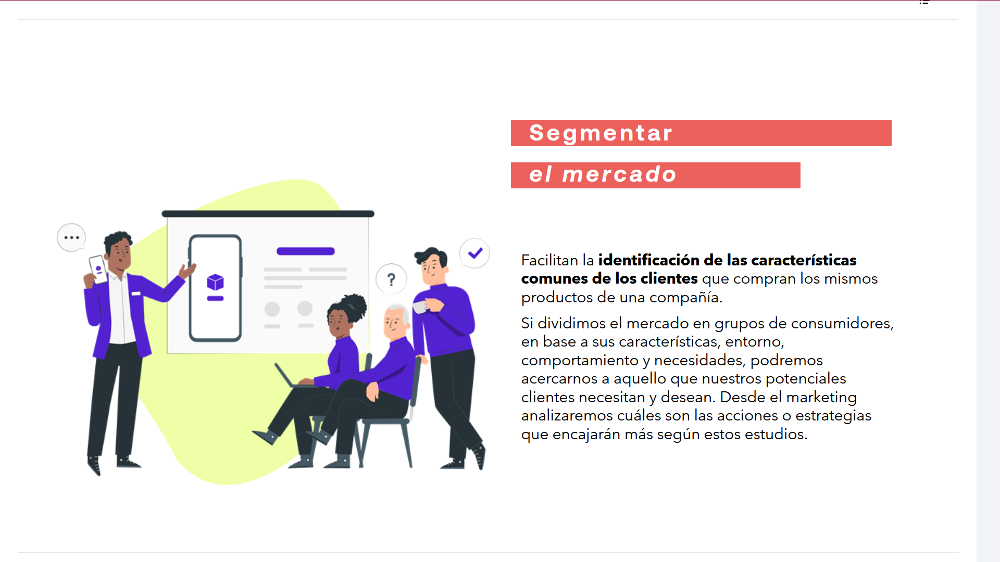

Facilitan la **identificación de las características comunes de los clientes** que compran los mismos productos de una compañía.

Si dividimos el mercado en grupos de consumidores, en base a sus características, entorno, comportamiento y necesidades, podremos acercarnos a aquello que nuestros potenciales clientes necesitan y desean.  

Desde el marketing, se analizan cuáles son las acciones o estrategias que encajarán más según estos estudios.

---

### **Una empresa necesita investigar por las siguientes razones:**
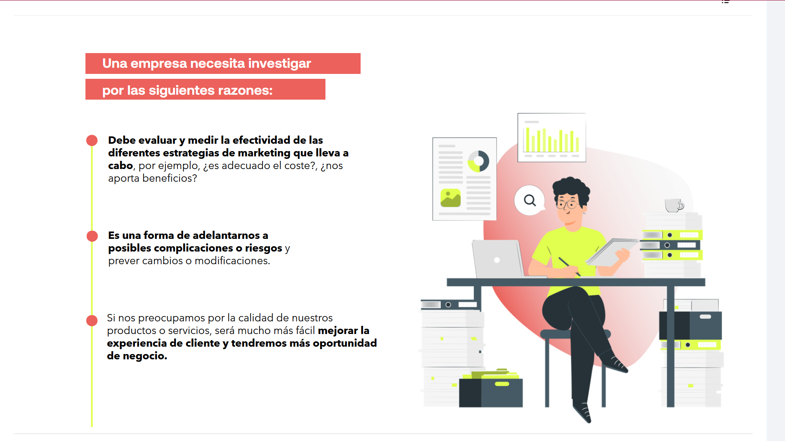

* **Debe evaluar y medir la efectividad de las diferentes estrategias de marketing que lleva a cabo**, por ejemplo, *¿es adecuado el coste?, ¿nos aporta beneficios?*
* **Es una forma de adelantarnos a posibles complicaciones o riesgos** y prever cambios o modificaciones.
* Si nos preocupamos por la calidad de nuestros productos o servicios, será mucho más fácil **mejorar la experiencia de cliente y tendremos más oportunidad de negocio.**

---

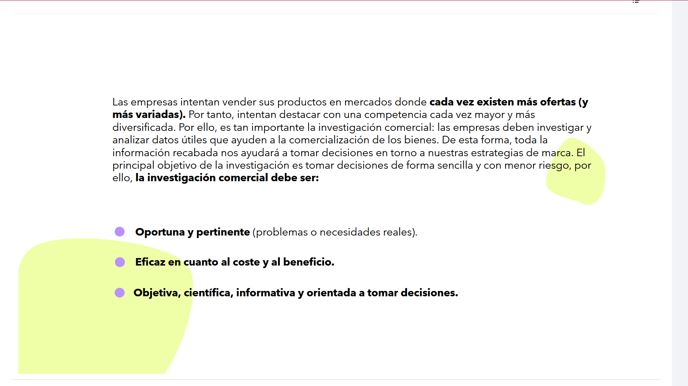

Las empresas intentan vender sus productos en mercados donde **cada vez existen más ofertas (y más variadas)**. Por tanto, intentan destacar con una competencia cada vez mayor y más diversificada.  

Por ello, es tan importante la investigación comercial: 

> Las empresas deben investigar y analizar datos útiles que ayuden a la comercialización de los bienes. 

De esta forma, toda la información recabada nos ayudará a tomar decisiones en torno a nuestras estrategias de marca.  

El principal objetivo de la investigación es tomar decisiones de forma sencilla y con menor riesgo, por ello, **la investigación comercial debe ser:**

* **Oportuna y pertinente** (problemas o necesidades reales).
* **Eficaz en cuanto al coste y al beneficio.**
* **Objetiva, científica, informativa y orientada a tomar decisiones.**

---

### **Una segmentación elaborada a la hora de lanzar campañas, es esencial para el buen marketing**
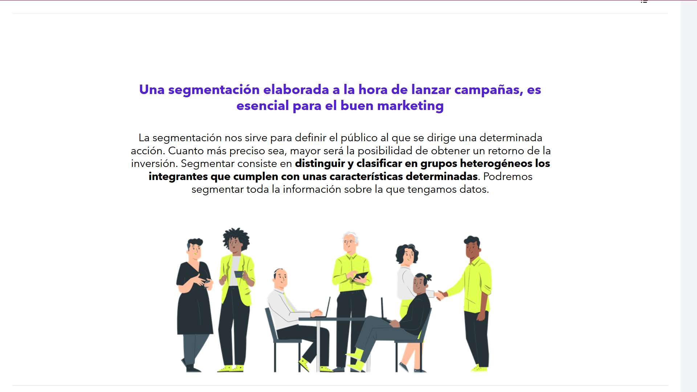

Si no se conoce el segmento de los clientes, no sería posible personalizar y adecuar las estrategias de marketing y ventas.

La segmentación nos sirve para definir el público al que se dirige una determinada acción. Cuanto más preciso sea, mayor será la posibilidad de obtener un retorno de la inversión. Segmentar consiste en **distinguir y clasificar en grupos heterogéneos los integrantes que cumplen con unas características determinadas**. Podremos segmentar toda la información sobre la que tengamos datos.

---

## **Principales criterios de segmentación**
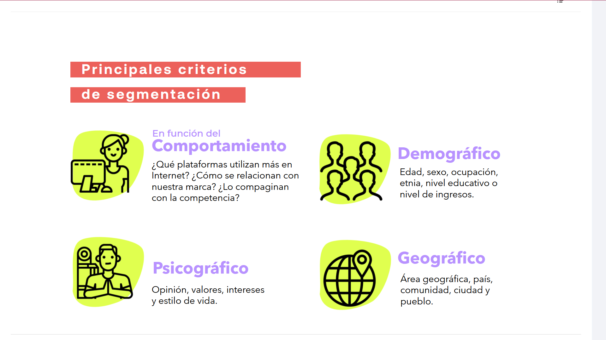
---

### En función del **Comportamiento**
> ¿Qué plataformas utilizan más en Internet? ¿Cómo se relacionan con nuestra marca? ¿Lo compaginan con la competencia?

### **Demográfico**
> Edad, sexo, ocupación, etnia, nivel educativo o nivel de ingresos.

### **Psicográfico**
> Opinión, valores, intereses y estilo de vida.

### **Geográfico** 
! (El más utilizado o el que mejores resultados da, según [informes](https://www.ontsi.es/sites/ontsi/files/2023-02/Br%C3%BAjula_IA_Big_data_2023.pdf) )
> Área geográfica, país, comunidad, ciudad y pueblo.

---

# **Si no segmentamos, no habrá una comunicación personalizada**
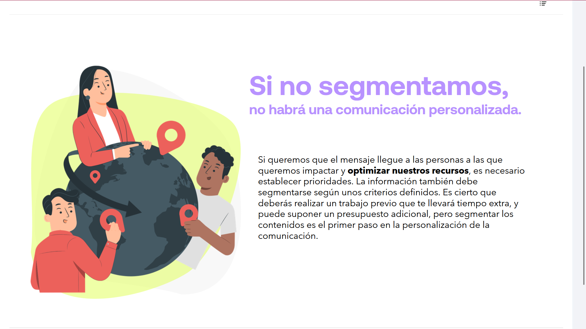

Si queremos que el mensaje llegue a las personas a las que queremos impactar y **optimizar nuestros recursos**, es necesario establecer prioridades.  

La información también debe segmentarse según unos criterios definidos.  

Es cierto que se deberá realizar un trabajo previo que llevará tiempo extra, y puede suponer un presupuesto adicional, pero segmentar los contenidos es el primer paso en la personalización de la comunicación.

---
## DATA MINING

### **Data mining y las ventas**
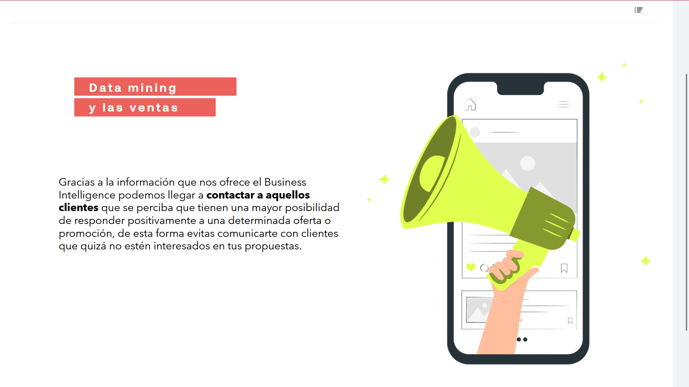

Gracias a la información que ofrece el Business Intelligence podemos llegar a **contactar a aquellos clientes** que se perciba que tienen una mayor posibilidad de responder positivamente a una determinada oferta o promoción, de esta forma evitas comunicarte con clientes que quizá no estén interesados en tus propuestas.

---

### **El valor práctico del producto**
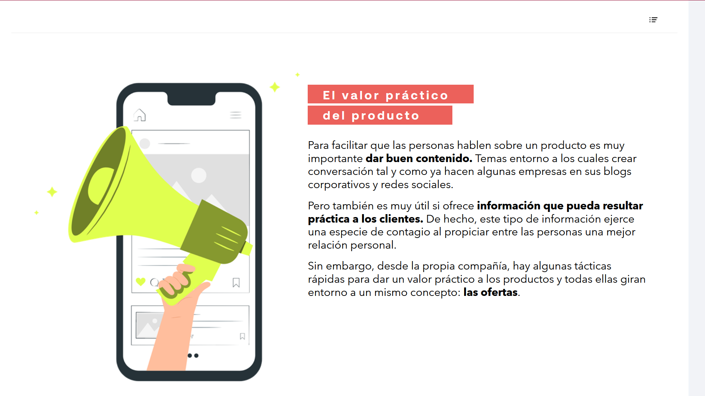

Para facilitar que las personas hablen sobre un producto es muy importante **dar buen contenido**. Temas entorno a los cuales crear conversación tal y como ya hacen algunas empresas en sus blogs corporativos y redes sociales.

Pero también es muy útil si ofrece **información que pueda resultar práctica a los clientes**. De hecho, este tipo de información ejerce una especie de contagio al propiciar entre las personas una mejor relación personal.

Sin embargo, desde la propia compañía, hay algunas tácticas rápidas para dar un valor práctico a los productos y todas ellas giran entorno a un mismo concepto: **las ofertas**.

---

### **Fidelizar clientes**

Las empresas intentan paliar la fuga de clientes utilizando técnicas de Data Mining, Machine Learning u BI que ayudan a reducir los esfuerzos comerciales de las compañías y a mejorar la relación con sus clientes, **detectando de forma anticipada los problemas reportados sobre sus servicios**.

---
### **Patrones de FUga**
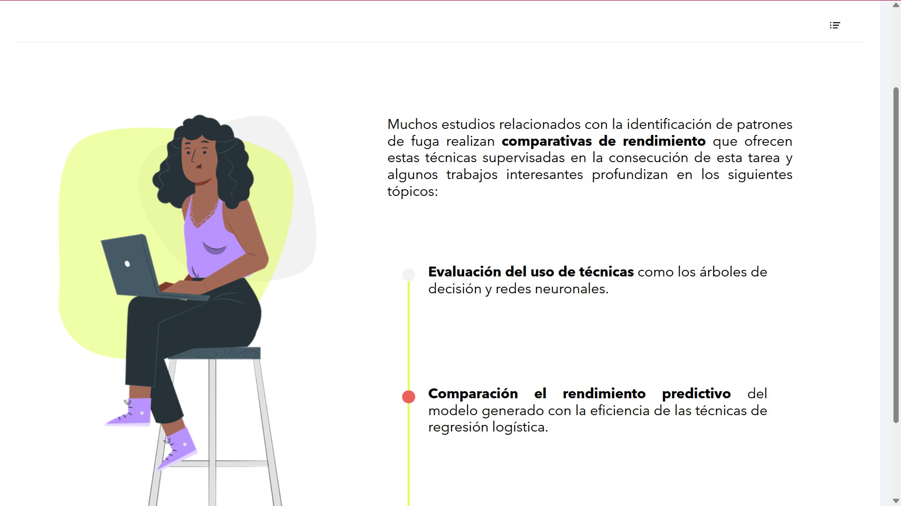
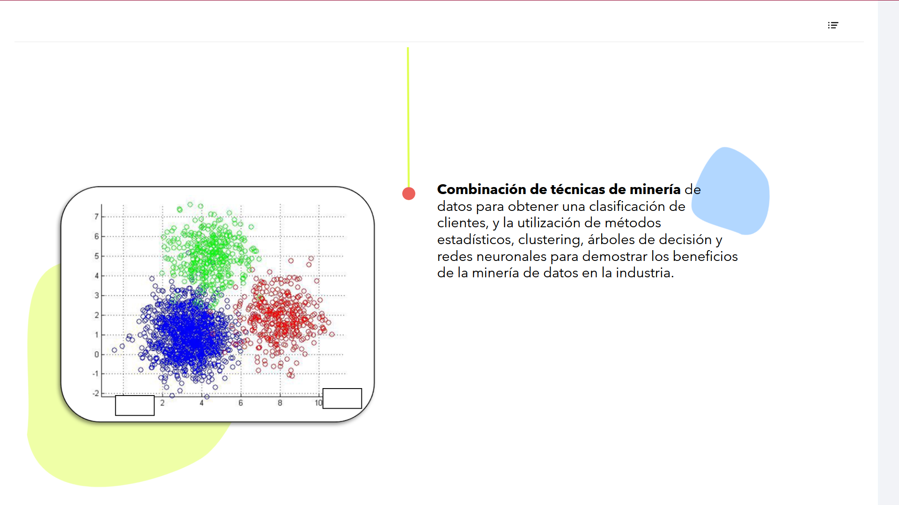
Muchos estudios relacionados con la identificación de patrones de fuga realizan **comparativas de rendimiento** que ofrecen estas técnicas supervisadas en la consecución de esta tarea y algunos trabajos interesantes profundizan en los siguientes tópicos:

> * **Evaluación del uso de técnicas** como los árboles de decisión y redes neuronales.
> * **Comparación el rendimiento predictivo** del modelo generado con la eficiencia de las técnicas de regresión logística.

> **Combinación de técnicas de minería** de datos para obtener una clasificación de clientes, y la utilización de métodos estadísticos, clustering, árboles de decisión y redes neuronales para demostrar los beneficios de la minería de datos en la industria.

Categorizar o clasificar los tipos de clientes (segmentar) permite focalizar los esfuerzos y recursos.

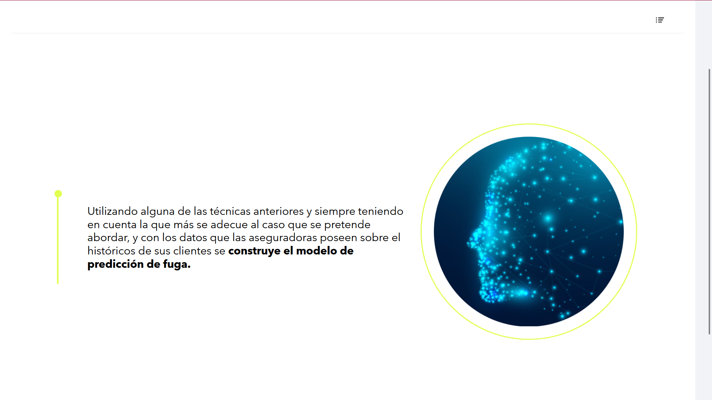
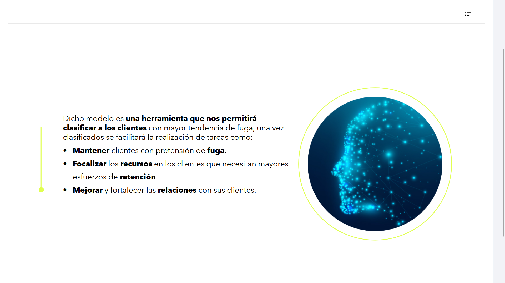

Utilizando alguna de las técnicas anteriores y siempre teniendo en cuenta la que más se adecue al caso que se pretende abordar, y con los datos que las aseguradoras poseen sobre el históricos de sus clientes se **construye el modelo de predicción de fuga.**

Dicho modelo es **una herramienta que nos permitirá clasificar a los clientes** con mayor tendencia de fuga, una vez clasificados se facilitará la realización de tareas como:

* **Mantener** clientes con pretensión de **fuga**.
* **Focalizar** los **recursos** en los clientes que necesitan mayores esfuerzos de **retención**.
* **Mejorar** y fortalecer las **relaciones** con sus clientes.

---
# **Descubrimiento automatizado de modelos previamente desconocidos.**
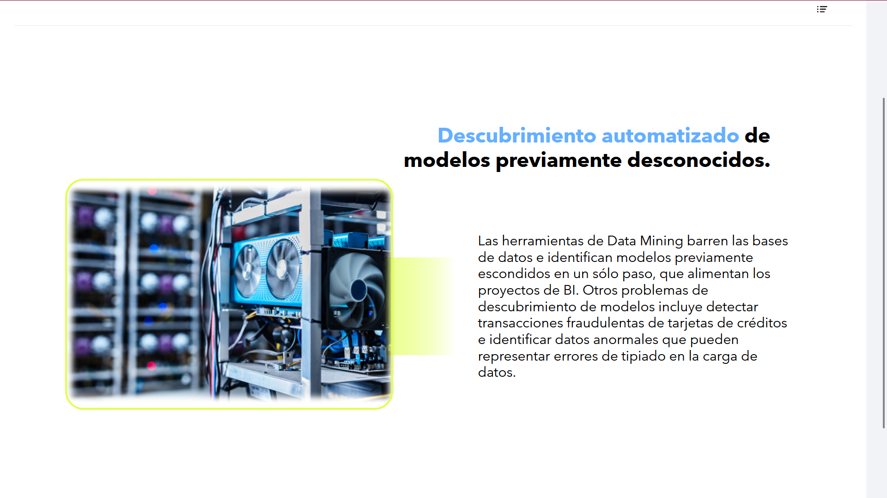

Las herramientas de Data Mining barren las bases de datos e identifican modelos previamente escondidos en un sólo paso, que alimentan los proyectos de BI.  

Otros problemas de descubrimiento de modelos incluye detectar transacciones fraudulentas de tarjetas de créditos e identificar datos anormales que pueden representar errores de tipiado en la carga de datos.

> Una adecuada recogida de datos y estrategia de visualización redunda en una mejora de las operaciones de la empresa.

---

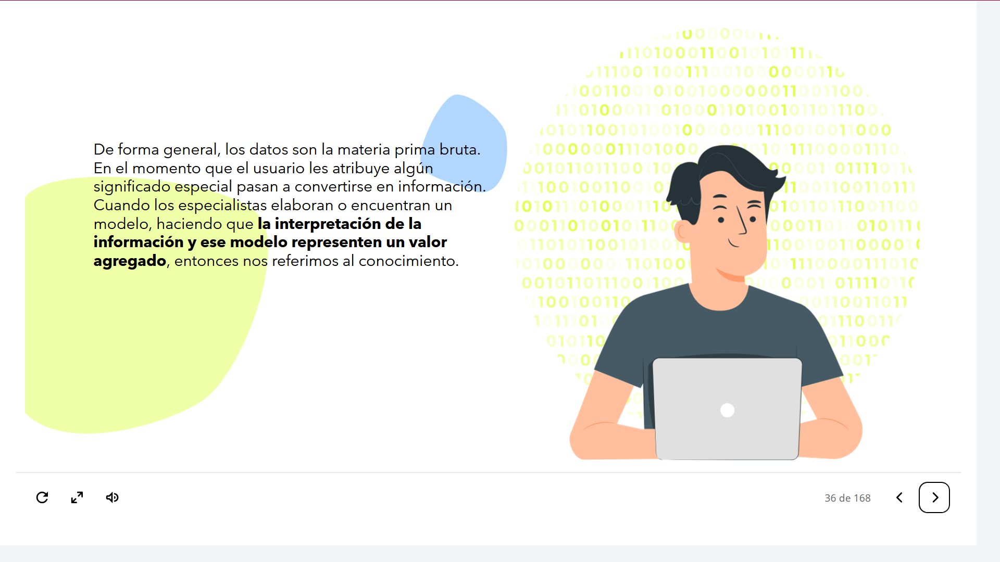
De forma general, los datos son la materia prima bruta. En el momento que el usuario les atribuye algún significado especial pasan a convertirse en información.  

Cuando los especialistas elaboran o encuentran un modelo, haciendo que **la interpretación de la información y ese modelo representen un valor agregado**, entonces nos referimos al conocimiento.

> Se debe ayudar a los profesionales a interpretar las visualizaciones recogidas en **paneles** e **informes**.

---

## KDD - Descubrimiento del conocimiento en BBDD
### KDD, Knowledge Discovery from Databases
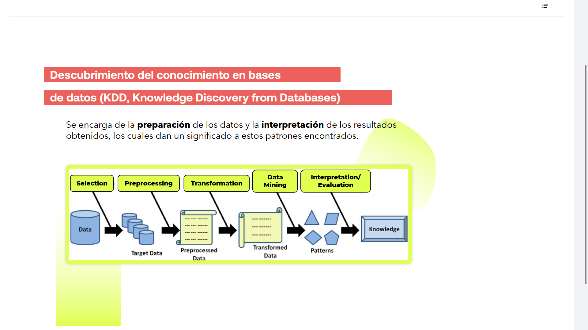

Se encarga de la **preparación** de los datos y la **interpretación** de los resultados obtenidos, los cuales dan un significado a estos patrones encontrados.

---

### **Proceso de extracción y descubrimiento de conocimiento (KDD)**
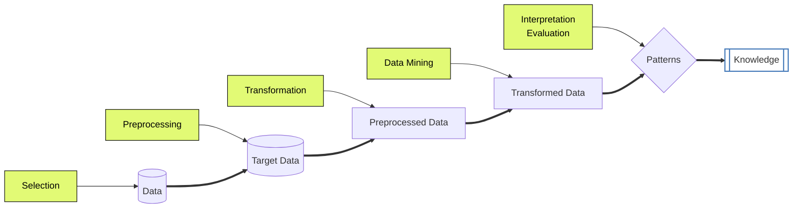
