# 01-008:	IoT - Conceptos Clave
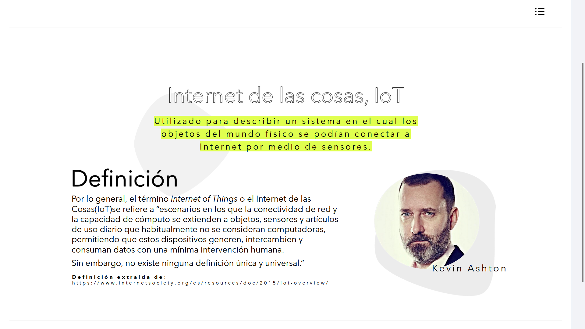

> Utilizado para describir un sistema en el cual los objetos del mundo físico se podían conectar a Internet por medio de sensores.

El término "Internet de las cosas" fue empleado por primera vez en 1999, por el pionero británico Kevin Ashton para edscribir un sistema en el cual, los "objetos del mundo físico se podían conectar a internet por medio de sensores".

## **Definición**

Por lo general, el término *Internet of Things* o el Internet de las Cosas (IoT) se refiere a "escenarios en los que la conectividad de red y la capacidad de cómputo se extienden a objetos, sensores y artículos de uso diario que habitualmente no se consideran computadoras, permitiendo que estos dispositivos generen, intercambien y consuman datos con una mínima intervención humana.

Sin embargo, no existe ninguna definición única y universal."

---

## Puntos Fundamentales para explorar oportunidades (**Conceptos clave IoT**)
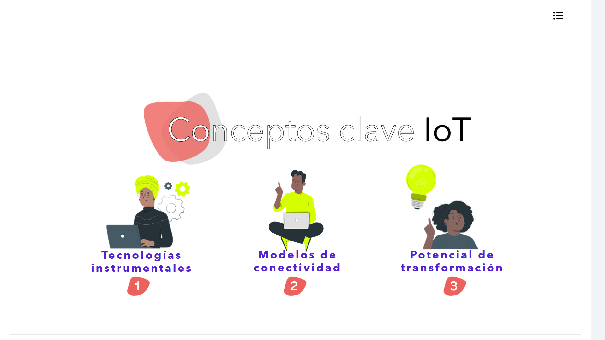

### **1. Tecnologías instrumentales**
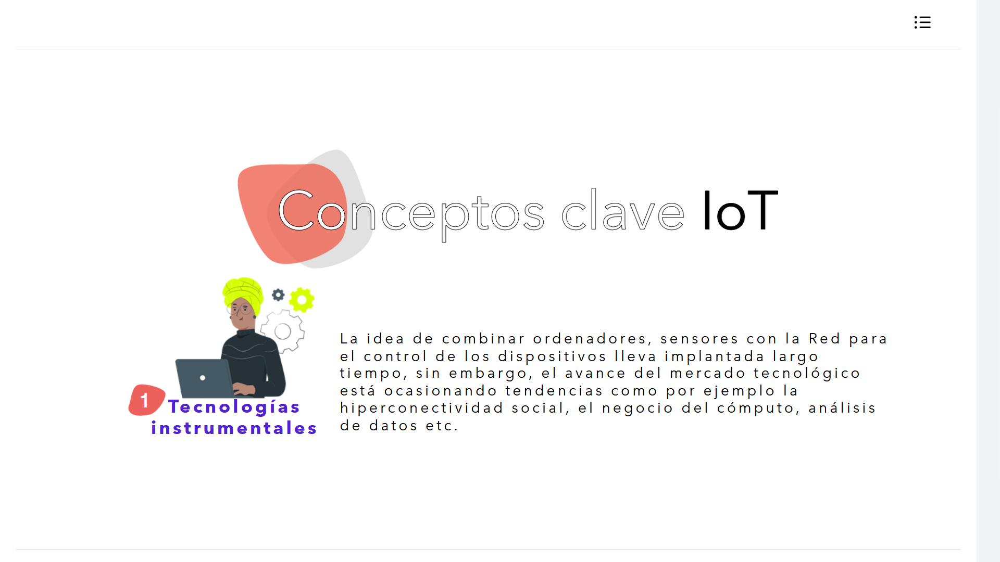
La idea de combinar ordenadores, sensores con la Red para el control de los dispositivos lleva implantada largo tiempo, sin embargo, el avance del mercado tecnológico está ocasionando tendencias como por ejemplo la hiperconectividad social, el negocio del cómputo, análisis de datos etc.

### **2. Modelos de conectividad**
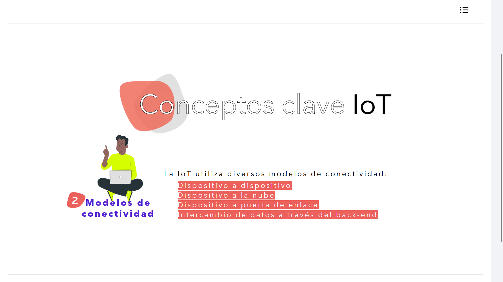

La IoT utiliza diversos modelos de conectividad:
* Dispositivo a dispositivo
* Dispositivo a la nube
* Dispositivo a puerta de enlace
* Intercambio de datos a través del back-end

### **3. Potencial de transformación**

Si las tendencias que se están proyectando se confirman, podemos estar presenciando un cambio de paradigma, la interacción más frecuente en internet será pasiva a través de objetos conectados dejando de lado una interacción activa con el contenido.

---

## **Entornos para aplicaciones de la IoT**
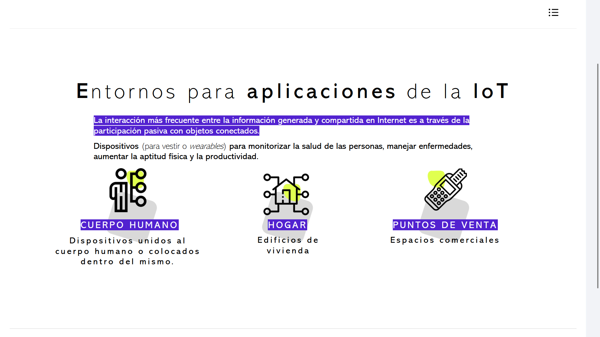

Actualmente, está cambiando el paradigma de internet. Ya no se trata exclusivamente de la búsqueda activa de contenidos por parte del usuario.  

> La interacción más frecuente entre la información y compartida en Internet es a través de la participación pasiva con objetos conectados.

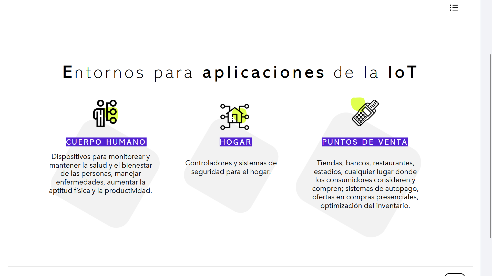
### **01. CUERPO HUMANO**
* **Definición:** Dispositivos unidos al cuerpo humano o colocados dentro del mismo (dispositivos para vestir o *wearables*).
* **Aplicaciones:** Monitorear la salud y el bienestar de las personas, manejar enfermedades, aumentar la aptitud física y la productividad.

### **02. HOGAR**
* **Definición:** Edificios de vivienda.
* **Aplicaciones:** Controladores y sistemas de seguridad para el hogar.

### **03. PUNTOS DE VENTA**
* **Definición:** Espacios comerciales.
* **Aplicaciones:** Tiendas, bancos, restaurantes, estadios o cualquier lugar donde los consumidores consideren y compren; incluye sistemas de autopago, ofertas en compras presenciales y optimización del inventario.

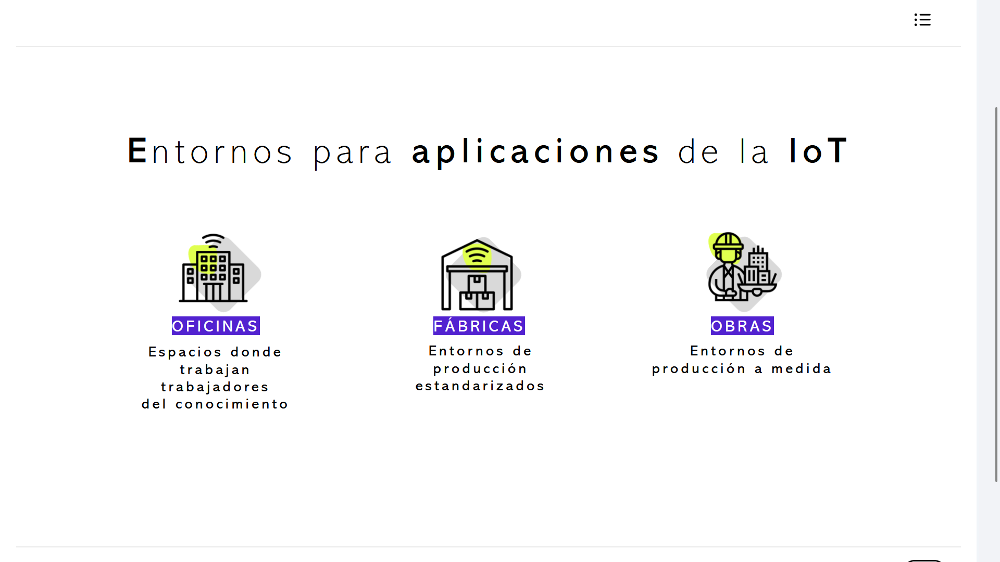
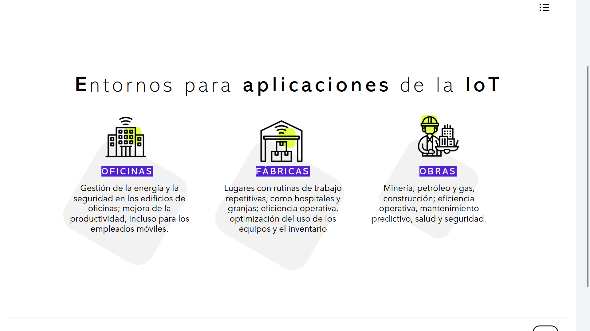

### **04. OFICINAS**
* **Definición:** Espacios donde trabajan trabajadores del conocimiento.
* **Aplicaciones:** Gestión de la energía y la seguridad en los edificios de oficinas; mejora de la productividad, incluso para los empleados móviles.

### **05. FÁBRICAS**
* **Definición:** Entornos de producción estandarizados.
* **Aplicaciones:** Lugares con rutinas de trabajo repetitivas, como hospitales y granjas; eficiencia operativa, optimización del uso de los equipos y el inventario.

### **06. OBRAS**
* **Definición:** Entornos de producción a medida.
* **Aplicaciones:** Minería, petróleo y gas, construcción; eficiencia operativa, mantenimiento predictivo, salud y seguridad.

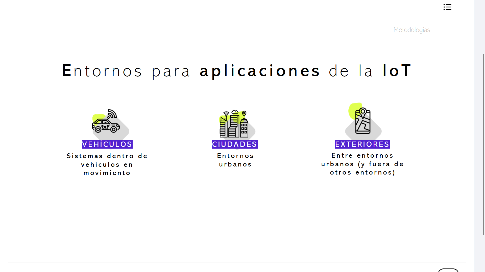
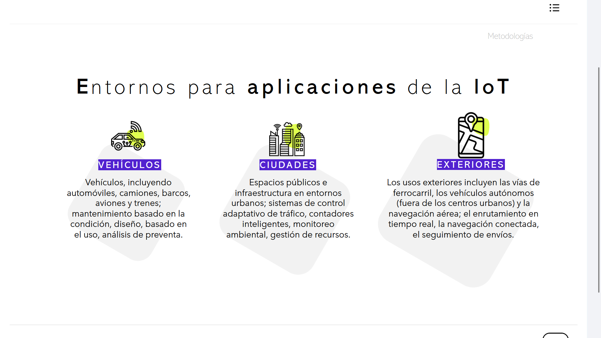

### **07. VEHÍCULOS**
* **Definición:** Sistemas dentro de vehículos en movimiento.
* **Aplicaciones:** Vehículos, incluyendo automóviles, camiones, barcos, aviones y trenes; mantenimiento basado en la condición, diseño basado en el uso y análisis de preventa.

### **08. CIUDADES**
* **Definición:** Entornos urbanos.
* **Aplicaciones:** Espacios públicos e infraestructura en entornos urbanos; sistemas de control adaptativo de tráfico, contadores inteligentes, monitoreo ambiental y gestión de recursos.

### **09. EXTERIORES**
* **Definición:** Entre entornos urbanos (y fuera de otros entornos).
* **Aplicaciones:** Los usos exteriores incluyen las vías de ferrocarril, los vehículos autónomos (fuera de los centros urbanos) y la navegación aérea; el enrutamiento en tiempo real, la navegación conectada y el seguimiento de envíos.

---

## Casos de uso de Big Data y visualización de datos en las Fábricas 4.0
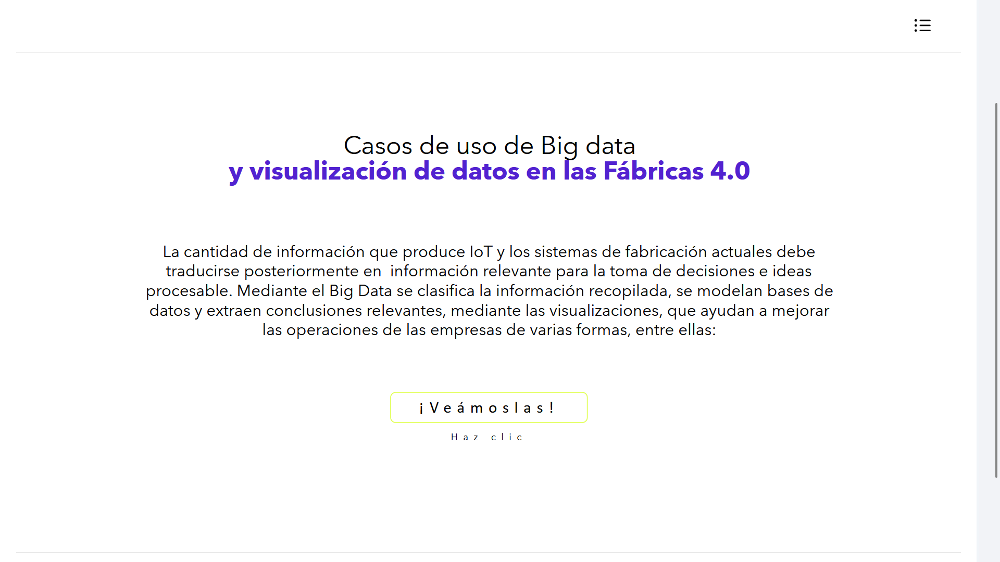

La cantidad de información producida por IoT y los sistemas de fabricación actuales se traduce en información relevante para la toma de decisiones y la generación de ideas procesables.  

 Mediante el Big Data se clasifica la información recopilada, se modelan bases de datos y se extraen conclusiones que, apoyadas en visualizaciones, mejoran las operaciones de las empresas de las siguientes formas:

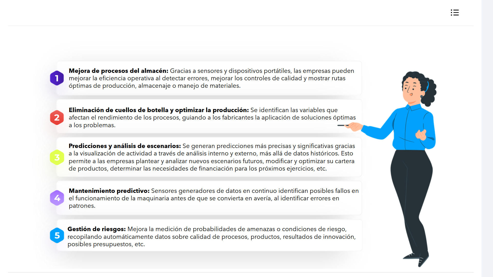
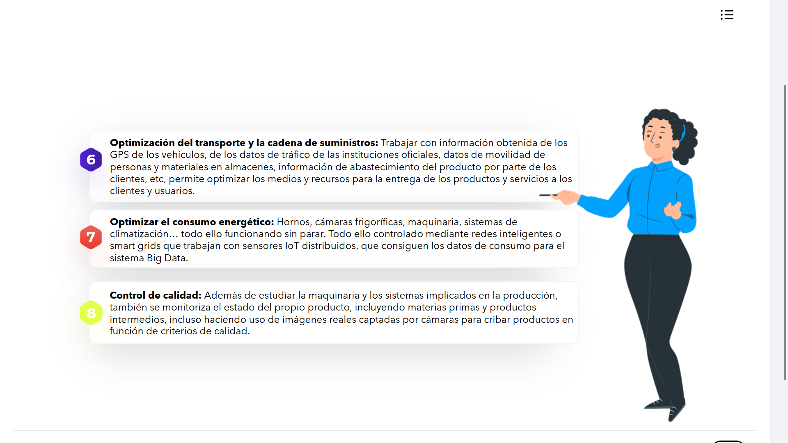

### 1. Mejora de procesos del almacén
> Gracias a sensores y dispositivos portátiles, las empresas pueden mejorar la eficiencia operativa al detectar errores, mejorar los controles de calidad y mostrar rutas óptimas de producción, almacenaje o manejo de materiales.
* **Funcionamiento:** Uso de sensores y dispositivos portátiles.
* **Impacto:** Permite detectar errores, optimizar los controles de calidad y trazar rutas óptimas de producción, almacenaje o manejo de materiales.

### 2. Eliminación de cuellos de botella y optimización de la producción
> Se identifican las variables que afectan el rendimiento de los procesos, guiando a los fabricantes la aplicación de soluciones óptimas a los problemas.

* **Funcionamiento:** Identificación de las variables críticas que afectan al rendimiento de los procesos.
* **Impacto:** Guía a los fabricantes en la aplicación de soluciones óptimas para resolver problemas en la línea de producción.

### 3. Predicciones y análisis de escenarios
> Se generan predicciones más precisas y significativas gracias a la visualización de actividad a través de análisis interno y externo, más allá de datos históricos. Esto permite a las empresas plantear y analizar nuevos escenarios futuros, modificar y optimizar su cartera de productos, determinar las necesidades de financiación para los próximos ejercicios, etc.

* **Funcionamiento:** Generación de predicciones precisas mediante la visualización de la actividad basada en análisis internos y externos, yendo más allá del histórico de datos.
* **Impacto:** Ayuda a plantear y analizar escenarios futuros, modificar y optimizar la cartera de productos y determinar necesidades de financiación para próximos ejercicios.

### 4. Mantenimiento predictivo
> Sensores generadores de datos en continuo identifican posibles fallos en el funcionamiento de la maquinaria antes de que se convierta en avería, al identificar errores en patrones.

* **Funcionamiento:** Sensores generadores de datos monitorizan la maquinaria en continuo.
* **Impacto:** Identificación de posibles fallos y errores en patrones antes de que se conviertan en averías reales.

### 5. Gestión de riesgos
> Mejora la medición de probabilidades de amenazas o condiciones de riesgo, recopilando automáticamente datos sobre calidad de procesos, productos, resultados de innovación, posibles presupuestos, etc.

* **Funcionamiento:** Recopilación automática de datos sobre calidad de procesos, productos, resultados de innovación y presupuestos.
* **Impacto:** Mejora la medición de probabilidades ante amenazas o condiciones de riesgo.

### 6. Optimización del transporte y la cadena de suministros
> Trabajar con información obtenida de los GPS de los vehículos, de los datos de tráfico de las instituciones oficiales, datos de movilidad de personas y materiales en almacenes, información de abastecimiento del producto por parte de los clientes, etc, permite optimizar los medios y recursos para la entrega de los productos y servicios a los clientes y usuarios.

* **Funcionamiento:** Integración de información de GPS de vehículos, datos de tráfico de instituciones oficiales, movilidad de personas y materiales en almacenes, y datos de abastecimiento de clientes.
* **Impacto:** Optimiza los medios y recursos empleados para la entrega de productos y servicios a clientes y usuarios.

### 7. Optimizar el consumo energético
> Hornos, cámaras frigoríficas, maquinaria, sistemas de climatización... todo ello funcionando sin parar. Todo ello controlado mediante redes inteligentes o smart grids que trabajan con sensores IoT distribuidos, que consiguen los datos de consumo para el sistema Big Data.

* **Funcionamiento:** Control de hornos, cámaras frigoríficas, maquinaria y sistemas de climatización mediante redes inteligentes (*smart grids*) equipadas con sensores IoT distribuidos.
* **Impacto:** Captura datos de consumo continuo para que el sistema Big Data optimice el gasto energético de equipos en funcionamiento ininterrumpido.

### 8. Control de calidad
> Además de estudiar la maquinaria y los sistemas implicados en la producción, también se monitoriza el estado del propio producto, incluyendo materias primas y productos intermedios, incluso haciendo uso de imágenes reales captadas por cámaras para cribar productos en función de criterios de calidad.

* **Funcionamiento:** Monitorización del estado del producto (materias primas y productos intermedios) e inspección mediante imágenes reales captadas por cámaras.
* **Impacto:** Complementa el estudio de la maquinaria y los sistemas de producción, permitiendo cribar productos en función de criterios estrictos de calidad.

---

## Gestión de proyectos de Data Science para desplegar el big data y la visualización de datos en el sector industrial
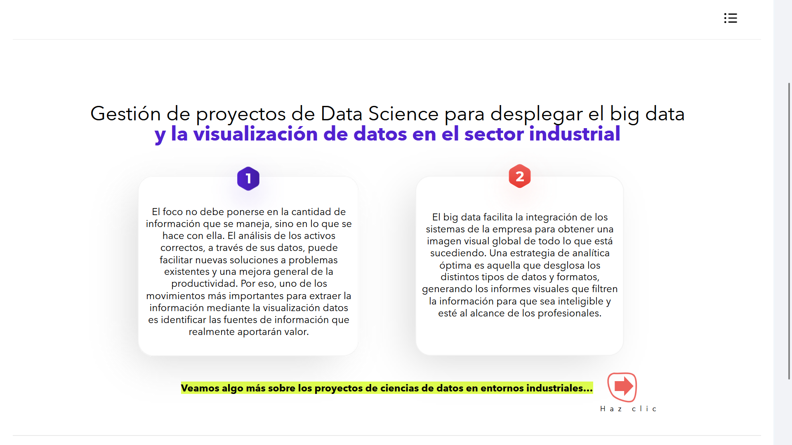

### 1
El foco no debe ponerse en la cantidad de información que se maneja, sino en lo que se hace con ella. El análisis de los activos correctos, a través de sus datos, puede facilitar nuevas soluciones a problemas existentes y una mejora general de la productividad. Por eso, uno de los movimientos más importantes para extraer la información mediante la visualización datos es identificar las fuentes de información que realmente aportarán valor.

### 2
El big data facilita la integración de los sistemas de la empresa para obtener una imagen visual global de todo lo que está sucediendo. Una estrategia de analítica óptima es aquella que desglosa los distintos tipos de datos y formatos, generando los informes visuales que filtren la información para que sea inteligible y esté al alcance de los profesionales.

---

## Gestión de Proyectos Data Science

[Video Apoyo Ud.](https://vimeo.com/697272538/ded37ce398)

> La gestión de proyectos en Data Science es un componente esencial para transformar iniciativas complejas y de alto riesgo en proyectos exitosos. La combinación de equipos multidisciplinares, participación de la dirección, planificación rigurosa y control continuo permite reducir la incertidumbre inherente a estos proyectos.

> Aunque una gran parte de los proyectos de Big Data fracasan, una gestión adecuada puede mejorar considerablemente las probabilidades de éxito, convirtiendo los datos en una fuente real de valor para la organización.

La gestión de proyectos proporciona una metodología estructurada para organizar el trabajo, reducir la incertidumbre y ofrecer un camino predecible hacia el éxito. En el ámbito de la Ciencia de Datos (Data Science), esta disciplina adquiere una importancia aún mayor debido a la complejidad técnica, organizativa y estratégica de los proyectos.

Los proyectos de Data Science suelen desarrollarse en entornos dinámicos, con grandes volúmenes de información, múltiples áreas implicadas y una elevada incertidumbre respecto a los resultados. Por ello, una adecuada gestión del proyecto es un factor determinante para alcanzar los objetivos propuestos.

### Importancia de la Gestión de Proyectos en Data Science

A diferencia de otros proyectos tecnológicos tradicionales, los proyectos de Ciencia de Datos presentan características particulares:

- Trabajan con grandes cantidades de datos.
- Requieren la participación de perfiles muy diversos.
- Tienen una fuerte orientación al negocio.
- Implican procesos experimentales donde no siempre se conocen los resultados finales.
- Presentan riesgos elevados tanto técnicos como organizativos.

En este contexto, la gestión de proyectos deja de ser una tarea administrativa para convertirse en un elemento estratégico que coordina personas, procesos, recursos y expectativas.

### Equipos Multifuncionales

Los proyectos de Data Science rara vez son desarrollados por un único departamento. Habitualmente intervienen profesionales de distintas áreas:

- Científicos de datos (*Data Scientists*).
- Ingenieros de datos (*Data Engineers*).
- Analistas de negocio.
- Expertos de dominio.
- Arquitectos de sistemas.
- Responsables de seguridad y cumplimiento normativo.
- Directivos y responsables de la toma de decisiones.

Esta naturaleza multidisciplinar exige una coordinación constante para garantizar que todos los participantes trabajen alineados hacia un objetivo común.

	
### Participación de la Alta Dirección

Los proyectos de Ciencia de Datos suelen tener un impacto directo en la estrategia empresarial. Por este motivo, es frecuente la participación de la alta dirección, incluyendo:

- Directores generales (CEO).
- Directores de tecnología (CTO).
- Directores de datos (CDO).
- Directores de operaciones (COO).

La implicación de la dirección permite:

- Asegurar la disponibilidad de recursos.
- Priorizar iniciativas estratégicas.
- Facilitar la adopción de los resultados.
- Eliminar barreras organizativas.

Cuando la dirección apoya activamente un proyecto, aumentan significativamente las probabilidades de éxito.

## Gestión de proyectos Data Science

### Proyectos de Alta Prioridad

Las organizaciones invierten cada vez más recursos en iniciativas relacionadas con Big Data, Inteligencia Artificial y Analítica Avanzada.

Estas iniciativas suelen recibir tratamiento de alta prioridad porque permiten:

- Mejorar la toma de decisiones.
- Incrementar la eficiencia operativa.
- Detectar nuevas oportunidades de negocio.
- Reducir costes.
- Mejorar la experiencia del cliente.
- Obtener ventajas competitivas.

Debido a su relevancia estratégica, la gestión del proyecto debe garantizar que los objetivos empresariales permanezcan siempre alineados con los desarrollos técnicos.

### Riesgos en los Proyectos de Data Science

Los proyectos de Ciencia de Datos presentan numerosos factores de riesgo.

#### Riesgos Técnicos

- Datos incompletos o de baja calidad.
- Falta de infraestructura adecuada.
- Modelos con bajo rendimiento.
- Problemas de integración con sistemas existentes.

#### Riesgos Organizativos

- Falta de comunicación entre departamentos.
- Expectativas poco realistas.
- Cambios continuos en los requisitos.
- Resistencia al cambio.

#### Riesgos Estratégicos

- Objetivos de negocio mal definidos.
- Ausencia de patrocinio ejecutivo.
- Escasa adopción de los resultados obtenidos.

Una gestión eficaz permite identificar estos riesgos de forma temprana y establecer planes de mitigación.

### Alta Tasa de Fracaso de los Proyectos Big Data

Diversos estudios indican que aproximadamente el **85% de los proyectos de Big Data no alcanzan plenamente sus objetivos**.

Las causas más frecuentes son:

- Definición incorrecta del problema.
- Falta de alineación con las necesidades del negocio.
- Datos insuficientes o deficientes.
- Escasez de personal especializado.
- Mala planificación.
- Falta de seguimiento y control.
- Ausencia de métricas de éxito claramente definidas.

Este elevado porcentaje demuestra que disponer de tecnología avanzada no garantiza el éxito de una iniciativa de Data Science.

---

### Claves para el Éxito

Para aumentar las probabilidades de éxito es necesario aplicar una gestión inteligente del proyecto basada en cuatro pilares fundamentales.

#### Planificación

Definir claramente:

- Objetivos.
- Alcance.
- Recursos.
- Plazos.
- Indicadores de éxito.

#### Ejecución

Coordinar adecuadamente:

- Equipos.
- Procesos.
- Herramientas.
- Flujos de trabajo.

#### Seguimiento

Monitorizar continuamente:

- Avance del proyecto.
- Calidad de los datos.
- Rendimiento de los modelos.
- Cumplimiento de los objetivos.

#### Comunicación

Mantener informadas a todas las partes interesadas mediante:

- Reuniones periódicas.
- Informes de progreso.
- Presentación de resultados.

---

## Metodología SMART
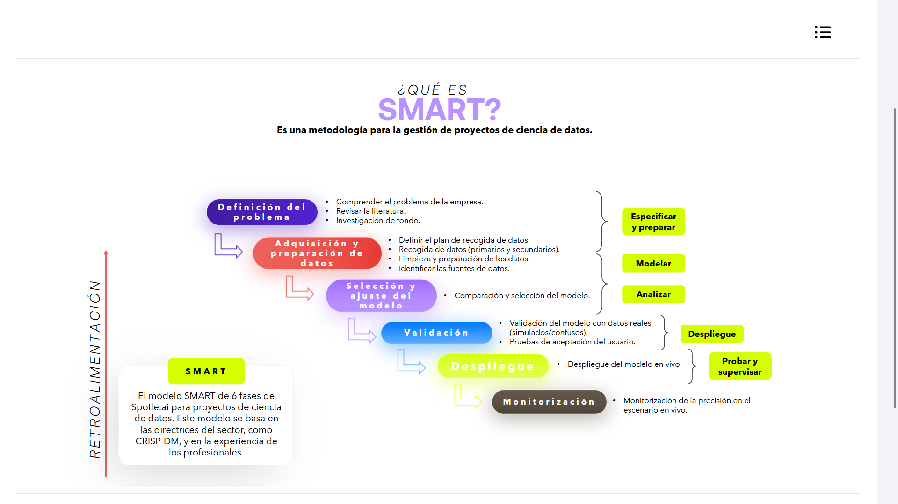
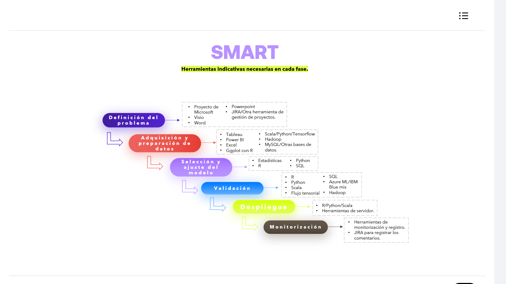
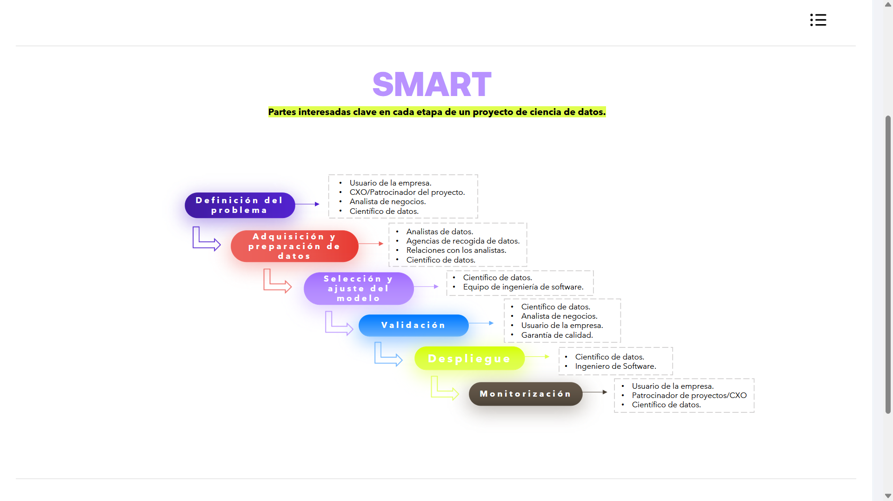

El modelo **SMART** de **6 fases** de Spotle.ai para proyectos de ciencia de datos se basa en las directrices del sector, como `CRISP-DM`, y en la experiencia de los profesionales.

## 1. Definición del problema

### Acciones

- Comprender el problema de la empresa.
- Revisar la literatura.
- Investigación de fondo.

### Herramientas indicativas

- Proyecto de Microsoft / Visio / Word / Powerpoint
- JIRA
- Herramientas de gestión de proyectos

### Partes interesadas clave / Roles

- Usuario de la empresa
- CXO/Patrocinador del proyecto
- Analista de negocios
- Científico de datos

---

## 2. Adquisición y preparación de datos

### Acciones

- Definir el plan de recogida de datos.
- Recogida de datos (primarios y secundarios).
- Limpieza y preparación de los datos.
- Identificar las fuentes de datos.

### Herramientas indicativas

- Tableau
- Power BI
- Excel
- Ggplot con R
- Scala/Python/Tensorflow
- Hadoop
- MySQL/Otras bases de datos

### Partes interesadas clave / Roles

- Analistas de datos
- Agencias de recogida de datos
- Relaciones con los analistas
- Científico de datos

---

## 3. Selección y ajuste del modelo

### Acciones

- Comparación y selección del modelo.

### Herramientas indicativas

- Estadísticas
- R
- Python
- SQL

### Partes interesadas clave / Roles

- Científico de datos
- Equipo de ingeniería de software

---

## 4. Validación

### Acciones

- Validación del modelo con datos reales (simulados/confusos).
- Pruebas de aceptación del usuario.

### Herramientas indicativas

- R
- Python
- Scala
- Flujo tensorial
- SQL
- Azure ML/IBM Blue mix
- Hadoop

### Partes interesadas clave / Roles

- Científico de datos
- Analista de negocios
- Usuario de la empresa
- Garantía de calidad

---

## 5. Despliegue

### Acciones

- Despliegue del modelo en vivo.

### Herramientas indicativas

- R/Python/Scala
- Herramientas de servidor

### Partes interesadas clave / Roles

- Científico de datos
- Ingeniero de Software

---

## 6. Monitorización

### Acciones

- Monitorización de la precisión en el escenario en vivo.

### Herramientas indicativas

- Herramientas de monitorización y registro
- JIRA para registrar los comentarios

### Partes interesadas clave / Roles

- Usuario de la empresa
- Patrocinador de proyectos/CXO
- Científico de datos

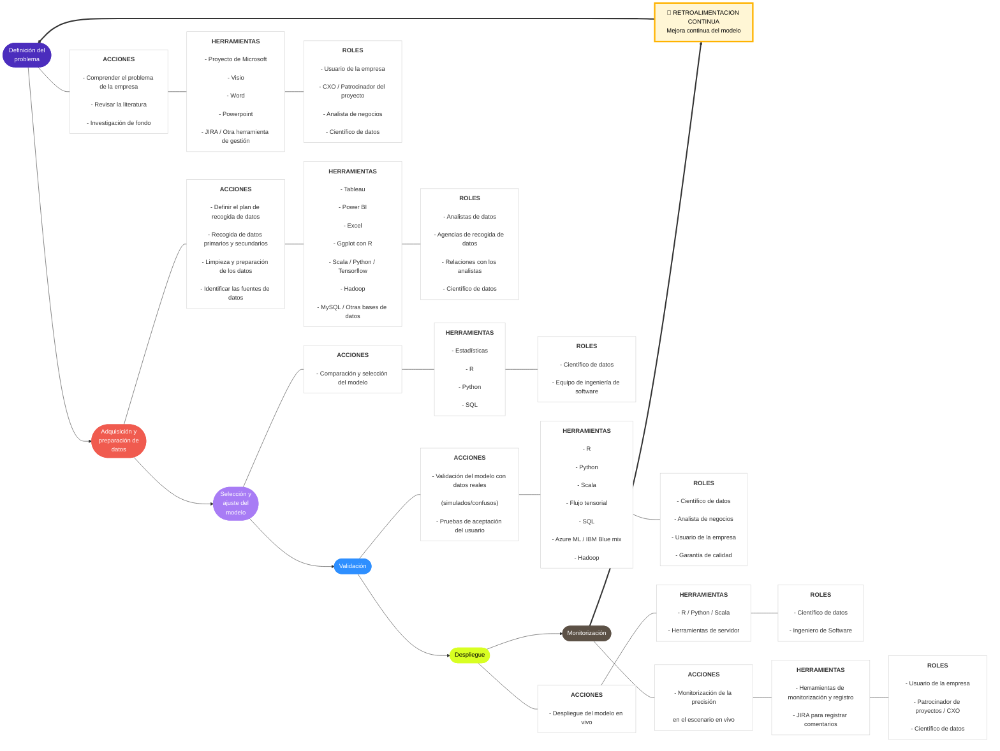
```mermaid
flowchart LR

classDef fase1 fill:#4B2DBD,color:#fff,stroke:#4B2DBD,stroke-width:2px;
classDef fase2 fill:#F05B4F,color:#fff,stroke:#F05B4F,stroke-width:2px;
classDef fase3 fill:#A87CF5,color:#fff,stroke:#A87CF5,stroke-width:2px;
classDef fase4 fill:#2E8FFF,color:#fff,stroke:#2E8FFF,stroke-width:2px;
classDef fase5 fill:#D8FF22,color:#000,stroke:#D8FF22,stroke-width:2px;
classDef fase6 fill:#5C5146,color:#fff,stroke:#5C5146,stroke-width:2px;

classDef detalle fill:#FFFFFF,color:#333,stroke:#CFCFCF,stroke-width:1px;
classDef feedback fill:#FFF6D5,color:#000,stroke:#FFB300,stroke-width:4px;


F1([Definición del<br/>problema])
F2([Adquisición y<br/>preparación de<br/>datos])
F3([Selección y<br/>ajuste del<br/>modelo])
F4([Validación])
F5([Despliegue])
F6([Monitorización])

F1 --> F2
F2 --> F3
F3 --> F4
F4 --> F5
F5 --> F6


FB["🔄 RETROALIMENTACION CONTINUA<br/>Mejora continua del modelo"]
F6 ==> FB
FB ==> F1


%% DETALLES FASE 1
D1["<b>ACCIONES</b><br/>
- Comprender el problema de la empresa<br/>
- Revisar la literatura<br/>
- Investigación de fondo"]

H1["<b>HERRAMIENTAS</b><br/>
- Proyecto de Microsoft<br/>
- Visio<br/>
- Word<br/>
- Powerpoint<br/>
- JIRA / Otra herramienta de gestión"]

R1["<b>ROLES</b><br/>
- Usuario de la empresa<br/>
- CXO / Patrocinador del proyecto<br/>
- Analista de negocios<br/>
- Científico de datos"]

F1 --- D1
D1 --- H1
H1 --- R1


%% DETALLES FASE 2
D2["<b>ACCIONES</b><br/>
- Definir el plan de recogida de datos<br/>
- Recogida de datos primarios y secundarios<br/>
- Limpieza y preparación de los datos<br/>
- Identificar las fuentes de datos"]

H2["<b>HERRAMIENTAS</b><br/>
- Tableau<br/>
- Power BI<br/>
- Excel<br/>
- Ggplot con R<br/>
- Scala / Python / Tensorflow<br/>
- Hadoop<br/>
- MySQL / Otras bases de datos"]

R2["<b>ROLES</b><br/>
- Analistas de datos<br/>
- Agencias de recogida de datos<br/>
- Relaciones con los analistas<br/>
- Científico de datos"]

F2 --- D2
D2 --- H2
H2 --- R2


%% DETALLES FASE 3
D3["<b>ACCIONES</b><br/>
- Comparación y selección del modelo"]

H3["<b>HERRAMIENTAS</b><br/>
- Estadísticas<br/>
- R<br/>
- Python<br/>
- SQL"]

R3["<b>ROLES</b><br/>
- Científico de datos<br/>
- Equipo de ingeniería de software"]

F3 --- D3
D3 --- H3
H3 --- R3


%% DETALLES FASE 4
D4["<b>ACCIONES</b><br/>
- Validación del modelo con datos reales<br/>
(simulados/confusos)<br/>
- Pruebas de aceptación del usuario"]

H4["<b>HERRAMIENTAS</b><br/>
- R<br/>
- Python<br/>
- Scala<br/>
- Flujo tensorial<br/>
- SQL<br/>
- Azure ML / IBM Blue mix<br/>
- Hadoop"]

R4["<b>ROLES</b><br/>
- Científico de datos<br/>
- Analista de negocios<br/>
- Usuario de la empresa<br/>
- Garantía de calidad"]

F4 --- D4
D4 --- H4
H4 --- R4


%% DETALLES FASE 5
D5["<b>ACCIONES</b><br/>
- Despliegue del modelo en vivo"]

H5["<b>HERRAMIENTAS</b><br/>
- R / Python / Scala<br/>
- Herramientas de servidor"]

R5["<b>ROLES</b><br/>
- Científico de datos<br/>
- Ingeniero de Software"]

F5 --- D5
D5 --- H5
H5 --- R5


%% DETALLES FASE 6
D6["<b>ACCIONES</b><br/>
- Monitorización de la precisión<br/>
en el escenario en vivo"]

H6["<b>HERRAMIENTAS</b><br/>
- Herramientas de monitorización y registro<br/>
- JIRA para registrar comentarios"]

R6["<b>ROLES</b><br/>
- Usuario de la empresa<br/>
- Patrocinador de proyectos / CXO<br/>
- Científico de datos"]

F6 --- D6
D6 --- H6
H6 --- R6


class F1 fase1
class F2 fase2
class F3 fase3
class F4 fase4
class F5 fase5
class F6 fase6

class D1,H1,R1,D2,H2,R2,D3,H3,R3,D4,H4,R4,D5,H5,R5,D6,H6,R6 detalle
class FB feedback
```

---

[PENDING]
