# 01-009:	Metodología CRISP

## METODOLOGÍA CRISP PARA LA GESTIÓN DE PROYECTOS DE CIENCIA DE DATOS
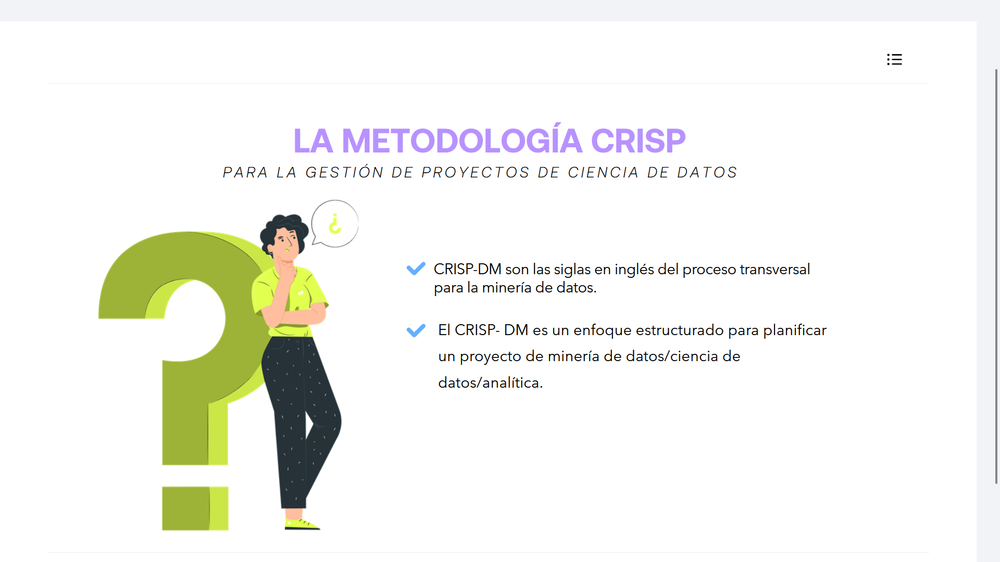
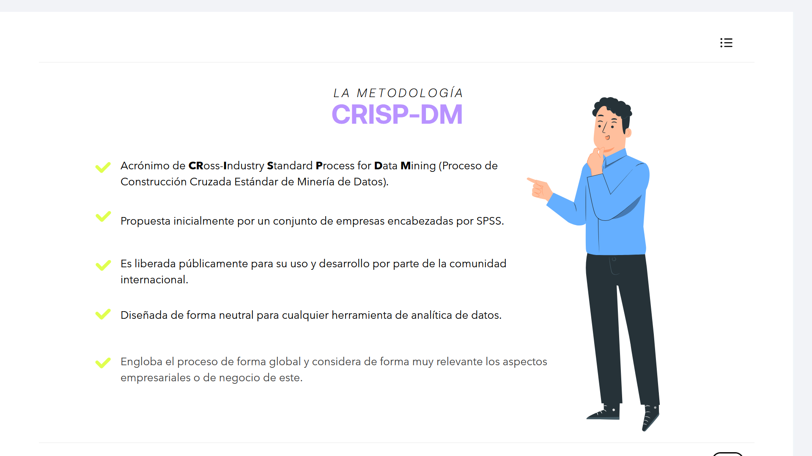

* `CRISP-DM` son las siglas en inglés del proceso transversal para la minería de datos.
* El `CRISP-DM` es un enfoque estructurado para planificar un proyecto de minería de datos/ciencia de datos/analítica.

---

### CRISP-DM = Proceso de Construcción Cruzada Estándar

* Acrónimo de **C**ross-**I**ndustry **S**tandard **P**rocess for **D**ata **M**ining (Proceso de Construcción Cruzada Estándar de Minería de Datos).
* Propuesta inicialmente por un conjunto de empresas encabezadas por SPSS.
* Es liberada públicamente para su uso y desarrollo por parte de la comunidad internacional.
* Diseñada de forma **neutral** para **cualquier herramienta de analítica de datos**.
* Engloba el proceso de forma global y considera de forma muy relevante los aspectos empresariales o de negocio de este.

---

## ETAPAS y PROPUESTAS por CRISP-DMç

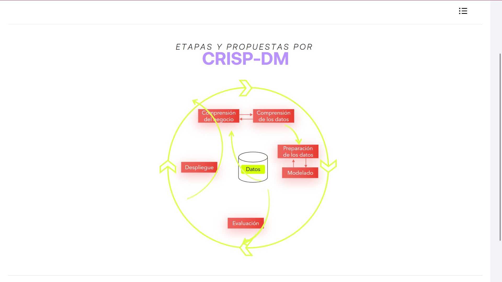

### Introducción CRISP-DM
[Video de Apoyo, introducción CRISP](https://vimeo.com/697272566/f9f457fac7)

### 1a. Comprensión del Negocio

La fase inicial está orientada a comprender los objetivos y necesidades del proyecto desde una perspectiva de negocio. Su propósito es definir el problema de minería de datos y elaborar un plan preliminar para alcanzar los objetivos establecidos.

### 1b. Comprensión de los Datos

Esta etapa comienza con la recopilación de los datos iniciales y continúa con actividades destinadas a familiarizarse con ellos. Se evalúa su calidad, se exploran patrones preliminares y se identifican posibles relaciones o subconjuntos de interés que permitan formular hipótesis.

### 2a. Preparación de los Datos

La preparación de datos engloba todas las tareas necesarias para construir el conjunto de datos final que será utilizado durante el modelado. Incluye la selección de registros y atributos, así como la limpieza, integración y transformación de los datos. Estas actividades suelen realizarse de forma iterativa y sin un orden estrictamente definido.

### 2b. Modelado

En esta fase se seleccionan y aplican diferentes técnicas de modelado. Los parámetros de los modelos son ajustados y optimizados para obtener los mejores resultados posibles. Con frecuencia es necesario volver a la fase de preparación de datos para adaptar la información a los requisitos de los algoritmos seleccionados.

### 3. Evaluación

Una vez construidos los modelos, se procede a su evaluación para comprobar si cumplen los objetivos del negocio. Además de analizar el rendimiento de los modelos, se revisa todo el proceso realizado para identificar posibles aspectos relevantes que no hayan sido considerados adecuadamente. Al finalizar esta etapa se decide si los resultados obtenidos son aptos para su utilización.

### 4. Despliegue

La fase de despliegue consiste en poner en práctica los resultados obtenidos. Puede limitarse a la elaboración de un informe o implicar la integración completa del proceso de minería de datos dentro de la organización. Aunque en muchos casos el despliegue es responsabilidad del cliente, la colaboración entre este y el analista de datos facilita la correcta aplicación de los modelos desarrollados.

---

## ETAPAS

### 1a. Comprensión del Negocio
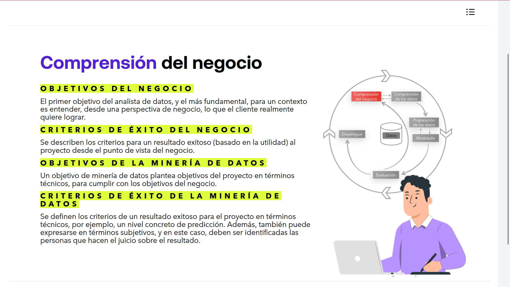
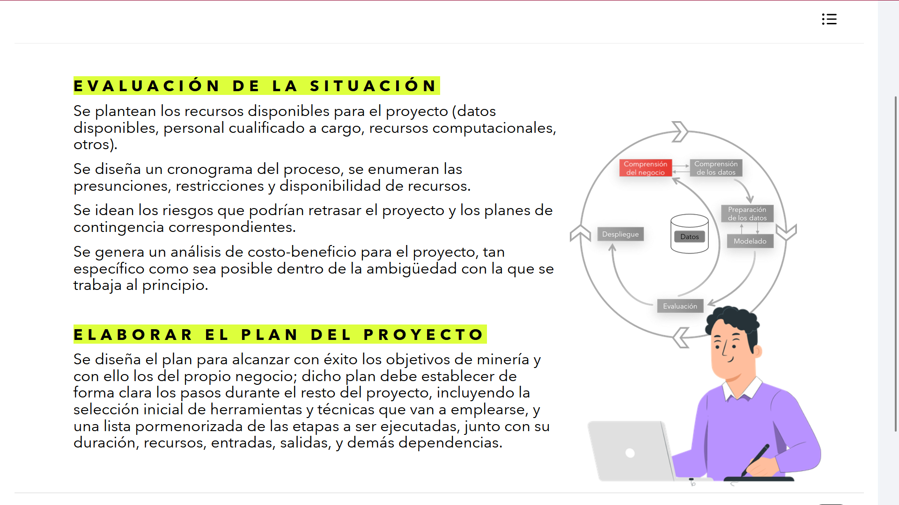

#### OBJETIVOS DEL NEGOCIO
El primer objetivo del analista de datos, y el más fundamental, para un contexto es entender, desde una perspectiva de negocio, lo que el cliente realmente quiere lograr.

#### CRITERIOS DE ÉXITO DEL NEGOCIO
Se describen los criterios para un resultado exitoso (basado en la utilidad) al proyecto desde el punto de vista del negocio.

#### OBJETIVOS DE LA MINERÍA DE DATOS
Un objetivo de minería de datos plantea objetivos del proyecto en términos técnicos, para cumplir con los objetivos del negocio.

#### CRITERIOS DE ÉXITO DE LA MINERÍA DE DATOS
Se definen los criterios de un resultado exitoso para el proyecto en términos técnicos, por ejemplo, un nivel concreto de predicción. Además, también puede expresarse en términos subjetivos, y en este caso, deben ser identificadas las personas que hacen el juicio sobre el resultado.

#### EVALUACIÓN DE LA SITUACIÓN
Se plantean los recursos disponibles para el proyecto (datos disponibles, personal cualificado a cargo, recursos computacionales, otros).

Se diseña un cronograma del proceso, se enumeran las presunciones, restricciones y disponibilidad de recursos.

Se idean los riesgos que podrían retrasar el proyecto y los planes de contingencia correspondientes.

Se genera un análisis de costo-beneficio para el proyecto, tan específico como sea posible dentro de la ambigüedad con la que se trabaja al principio.

#### ELABORAR EL PLAN DEL PROYECTO
Se diseña el plan para alcanzar con éxito los objetivos de minería y con ello los del propio negocio; dicho plan debe establecer de forma clara los pasos durante el resto del proyecto, incluyendo la selección inicial de herramientas y técnicas que van a emplearse, y una lista pormenorizada de las etapas a ser ejecutadas, junto con su duración, recursos, entradas, salidas, y demás dependencias.

---

### 1b. Comprensión de los DATOS

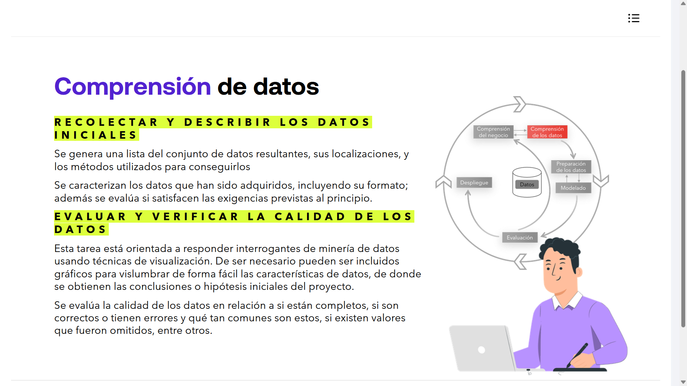

#### RECOLECTAR Y DESCRIBIR LOS DATOS INICIALES
Se genera una lista del conjunto de datos resultantes, sus localizaciones, y los métodos utilizados para conseguirlos.

Se caracterizan los datos que han sido adquiridos, incluyendo su formato; además se evalúa si satisfacen las exigencias previstas al principio.

#### EVALUAR Y VERIFICAR LA CALIDAD DE LOS DATOS
Esta tarea está orientada a responder interrogantes de minería de datos usando técnicas de visualización. De ser necesario pueden ser incluidos gráficos para vislumbrar de forma fácil las características de datos, de donde se obtienen las conclusiones o hipótesis iniciales del proyecto.

Se evalúa la calidad de los datos en relación a si están completos, si son correctos o tienen errores y qué tan comunes son estos, si existen valores que fueron omitidos, entre otros.

---

### 2a.	Preparación de los datos
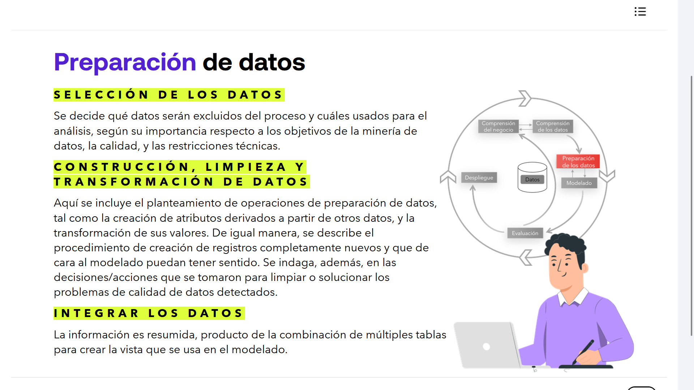

#### SELECCIONAR DATOS
A partir de los datos iniciales, se decide cuáles serán utilizados, justificando los motivos de la inclusión o exclusión de estos.

#### LIMPIAR DATOS
Se realiza una limpieza profunda a los datos seleccionados, elevando la calidad hasta el nivel que requieren las técnicas de análisis seleccionadas.

#### ESTRUCTURAR, INTEGRAR Y FORMATEAR DATOS
Consiste en operaciones de transformación a los datos, como la creación de nuevos atributos o registros, o la transformación de valores para variables ya existentes.

Se combinan diferentes tablas o fuentes de datos para crear estructuras nuevas orientadas a responder a las necesidades del proyecto.

Se realizan modificaciones en la sintaxis o estructura de los datos, sin cambiar su significado, para permitir el uso de herramientas específicas.

---

### 2b. 	Modelado
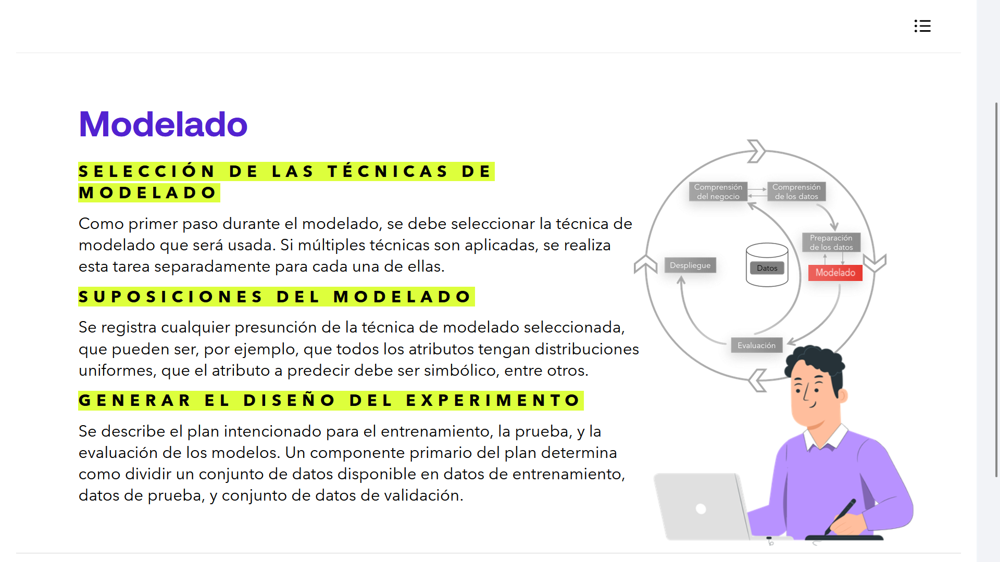
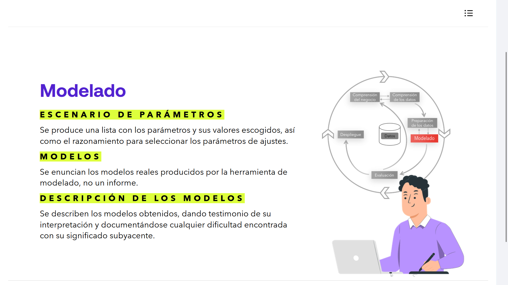

#### SELECCIÓN DE LAS TÉCNICAS DE MODELADO
Como primer paso durante el modelado, se debe seleccionar la técnica de modelado que será usada. Si múltiples técnicas son aplicadas, se realiza esta tarea separadamente para cada una de ellas.

#### SUPOSICIONES DEL MODELADO
Se registra cualquier presunción de la técnica de modelado seleccionada, que pueden ser, por ejemplo, que todos los atributos tengan distribuciones uniformes, que el atributo a predecir debe ser simbólico, entre otros.

#### GENERAR EL DISEÑO DEL EXPERIMENTO
Se describe el plan intencionado para el entrenamiento, la prueba, y la evaluación de los modelos. Un componente primario del plan determina como dividir un conjunto de datos disponible en datos de entrenamiento, datos de prueba, y conjunto de datos de validación.

#### ESCENARIO DE PARÁMETROS
Se produce una lista con los parámetros y sus valores escogidos, así como el razonamiento para seleccionar los parámetros de ajustes.

#### MODELOS
Se enuncian los modelos reales producidos por la herramienta de modelado, no un informe.

#### DESCRIPCIÓN DE LOS MODELOS
Se describen los modelos obtenidos, dando testimonio de su interpretación y documentándose cualquier dificultad encontrada con su significado subyacente.

---

### 3.		Evaluación
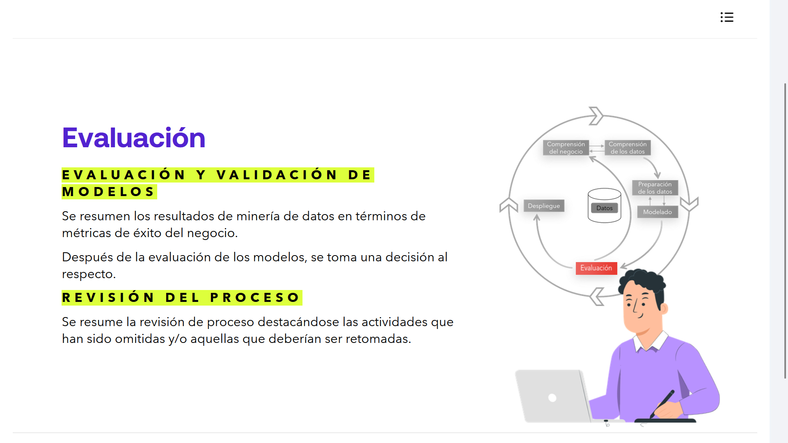

#### EVALUACIÓN Y VALIDACIÓN DE MODELOS
Se resumen los resultados de minería de datos en términos de métricas de éxito del negocio.

Después de la evaluación de los modelos, se toma una decisión al respecto.

#### REVISIÓN DEL PROCESO
Se resume la revisión de proceso destacándose las actividades que han sido omitidas y/o aquellas que deberían ser retomadas.
---

### 4.		Despliegue
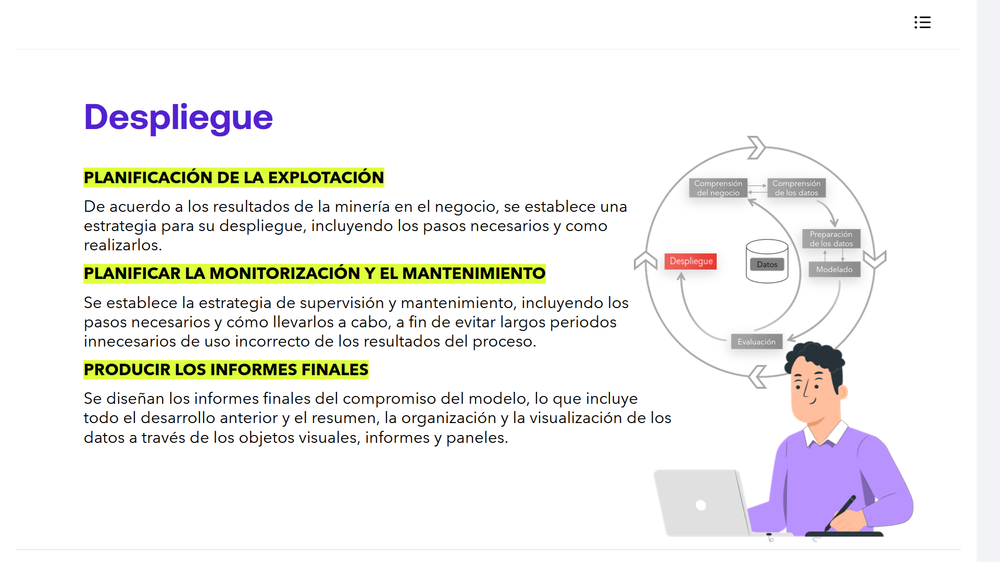

#### PLANIFICACIÓN DE LA EXPLOTACIÓN
De acuerdo a los resultados de la minería en el negocio, se establece una estrategia para su despliegue, incluyendo los pasos necesarios y como realizarlos.

#### PLANIFICAR LA MONITORIZACIÓN Y EL MANTENIMIENTO
Se establece la estrategia de supervisión y mantenimiento, incluyendo los pasos necesarios y cómo llevarlos a cabo, a fin de evitar largos periodos innecesarios de uso incorrecto de los resultados del proceso.

#### PRODUCIR LOS INFORMES FINALES
Se diseñan los informes finales del compromiso del modelo, lo que incluye todo el desarrollo anterior y el resumen, la organización y la visualización de los datos a través de los objetos visuales, informes y paneles.

---

## ¿Por qué fracasan los proyectos de ciencia de datos?
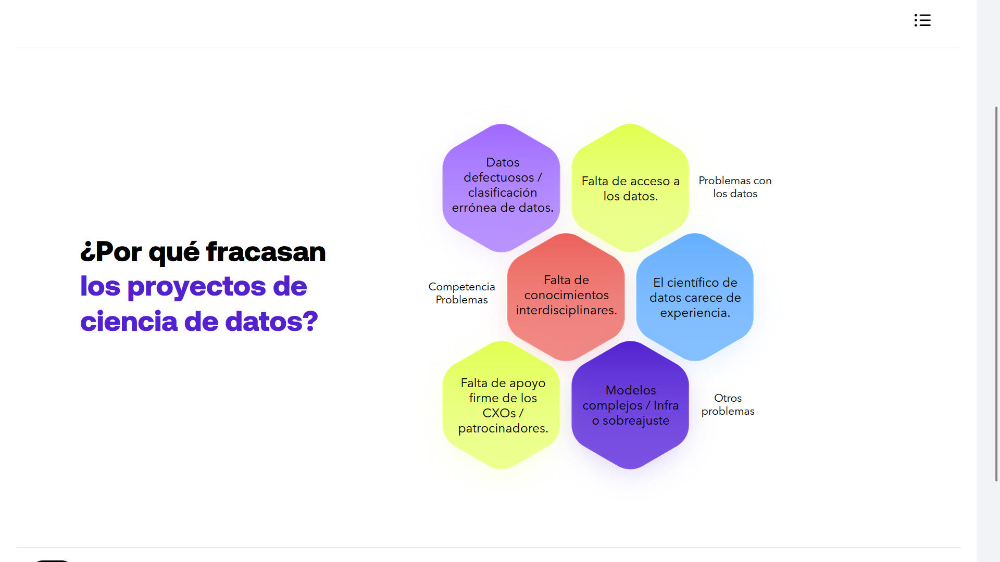

En este punto, es interesante saber por qué fracasan estos proyectos:

* Datos defectuosos / clasificación errónea de datos.
* Falta de acceso a los datos.
* Problemas con los datos
* Competencia Problemas
* Falta de conocimientos interdisciplinares.
* El científico de datos carece de experiencia.
* Falta de apoyo firme de los CXOs / patrocinadores.
* Modelos complejos / Infra o sobreajuste
* Otros problemas

---

## Características/Habilidades de un Gestor de Proyectos
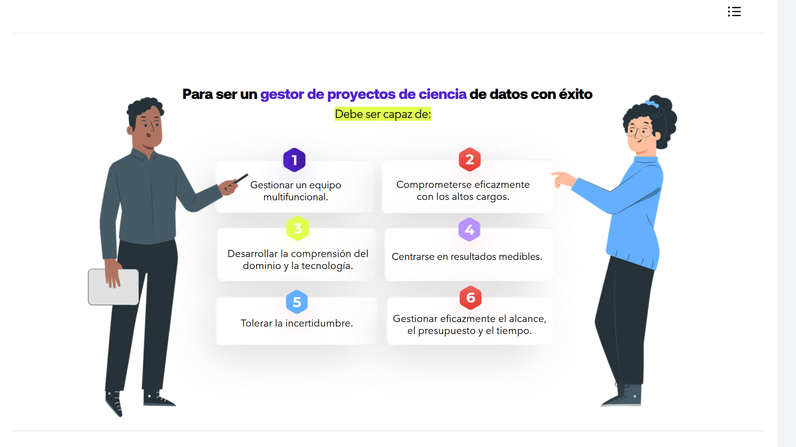

> Para ser un gestor de proyectos de ciencia de datos con éxito debe ser capaz de:

1. Gestionar un equipo multifuncional.
2. Comprometerse eficazmente con los altos cargos.
3. Desarrollar la comprensión del dominio y la tecnología.
4. Centrarse en resultados medibles.
5. Tolerar la incertidumbre.
6. Gestionar eficazmente el alcance, el presupuesto y el tiempo.

---

## Casos prácticos en Contabilidad/Gestión empresariales
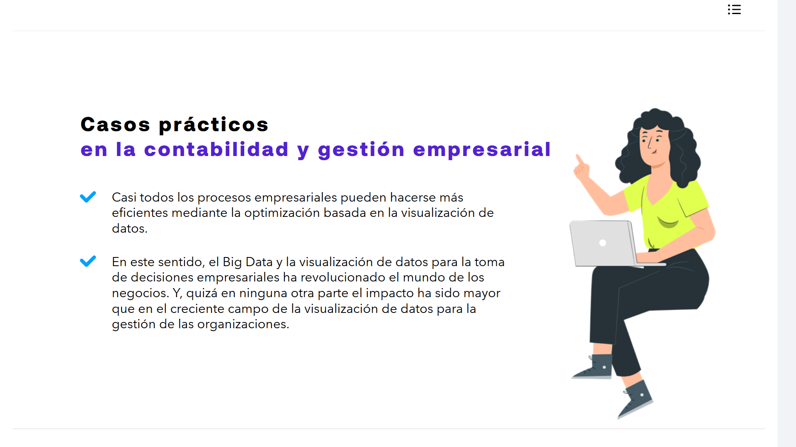

* Casi todos los procesos empresariales pueden hacerse más eficientes mediante la optimización basada en la visualización de datos.  

* En este sentido, el Big Data y la visualización de datos para la toma de decisiones empresariales ha revolucionado el mundo de los negocios. Y, quizá en ninguna otra parte el impacto ha sido mayor que en el creciente campo de la visualización de datos para la gestión de las organizaciones.

> Se estima que, anualmente, se generan más de 100 PB (petabytes) de datos pero sólo el aprox. 5% son analizados.

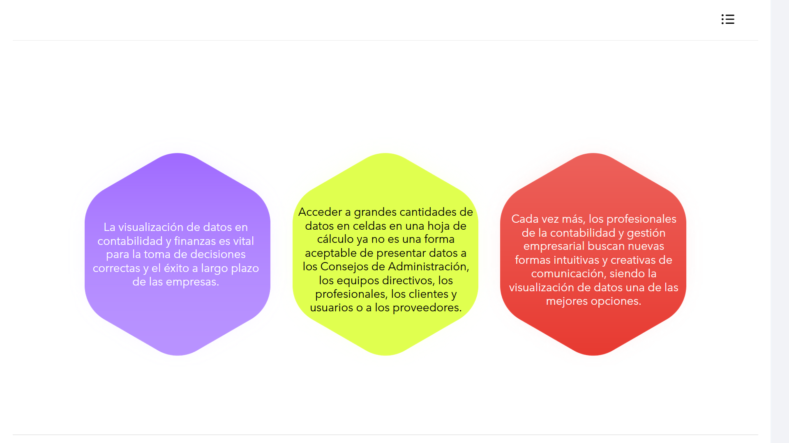

* La visualización de datos en contabilidad y finanzas es vital para la toma de decisiones correctas y el éxito a largo plazo de las empresas.  

* Acceder a grandes cantidades de datos en celdas en una hoja de cálculo ya no es una forma aceptable de presentar datos a los Consejos de Administración, los equipos directivos, los profesionales, los clientes y usuarios o a los proveedores.  

* Cada vez más, los profesionales de la contabilidad y gestión empresarial buscan nuevas formas intuitivas y creativas de comunicación, siendo la visualización de datos una de las mejores opciones.

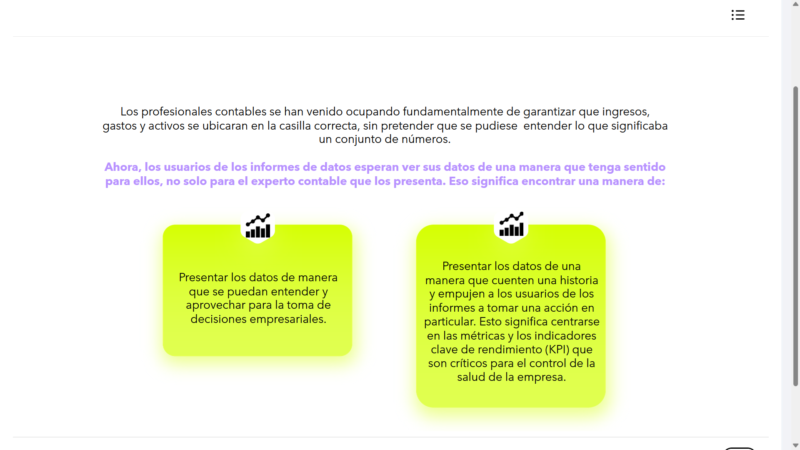

Los profesionales contables se han venido ocupando fundamentalmente de garantizar que ingresos, gastos y activos se ubicaran en la casilla correcta, sin pretender que se pudiese entender lo que significaba un conjunto de números.

**Ahora, los usuarios de los informes de datos esperan ver sus datos de una manera que tenga sentido para ellos, no solo para el experto contable que los presenta. Eso significa encontrar una manera de:**

*   **Presentar los datos de manera** que se puedan entender y aprovechar para la toma de decisiones empresariales.  

*   **Presentar los datos de una** manera que cuenten una historia y empujen a los usuarios de los informes a tomar una acción en particular. Esto significa centrarse en las métricas y los indicadores clave de rendimiento (KPI) que son críticos para el control de la salud de la empresa.

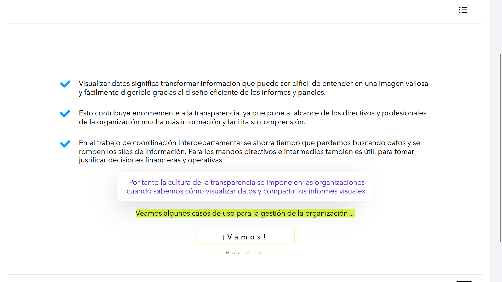
> La generación de grandes volúmenes de datos exige formas innovadoras de prácticas para procesar y analizar la información

> Visualizar datos significa transformar información que puede ser difícil de entender en una imagen valiosa y fácilmente digerible gracias al diseño eficiente de los informes y paneles.

> Esto contribuye enormemente a la transparencia, ya que pone al alcance de los directivos y profesionales de la organización mucha más información y facilita su comprensión.

> En el trabajo de coordinación interdepartamental se ahorra tiempo que perdemos buscando datos y se rompen los silos de información. Para los mandos directivos e intermedios también es útil, para tomar justificar decisiones financieras y operativas.

**Por tanto la cultura de la transparencia se impone en las organizaciones cuando sabemos cómo visualizar datos y compartir los informes visuales.**

---

## Análisis de datos - Self-Service
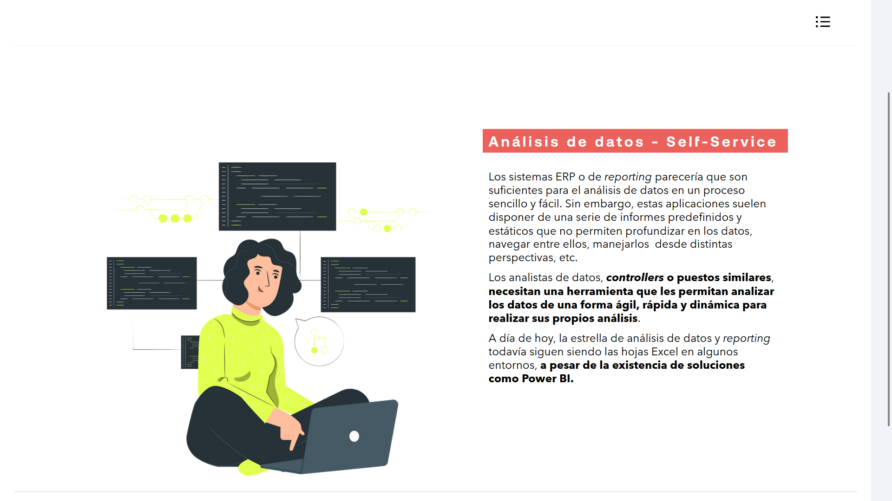
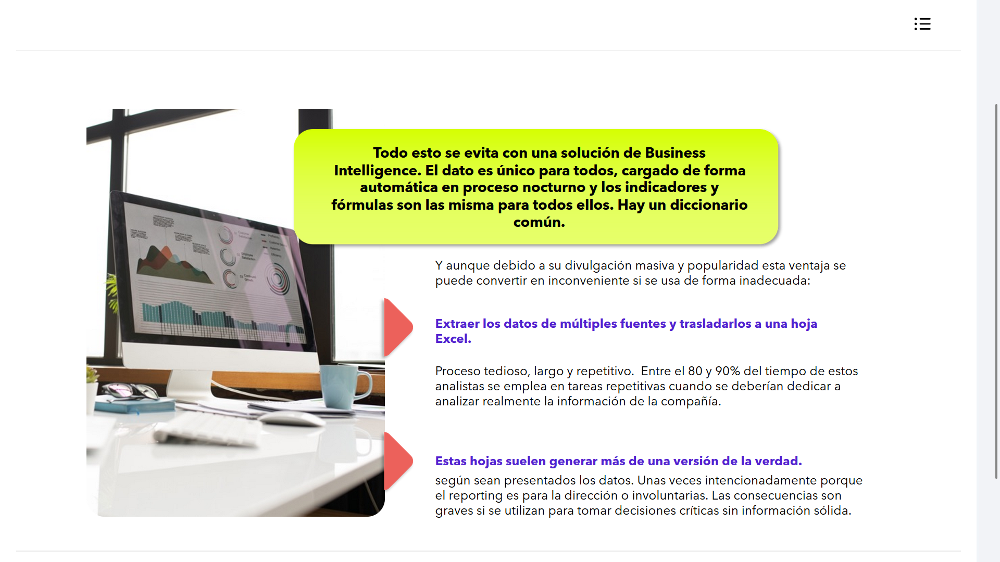

Los sistemas ERP o de *reporting* parecería que son suficientes para el análisis de datos en un proceso sencillo y fácil. Sin embargo, estas aplicaciones suelen disponer de una serie de informes predefinidos y estáticos que no permiten profundizar en los datos, navegar entre ellos, manejarlos desde distintas perspectivas, etc.

Los analistas de datos, ***controllers* o puestos similares, necesitan una herramienta que les permitan analizar los datos de una forma ágil, rápida y dinámica para realizar sus propios análisis.**

A día de hoy, la estrella de análisis de datos y *reporting* todavía siguen siendo las hojas Excel en algunos entornos, **a pesar de la existencia de soluciones como Power BI.**

**Todo esto se evita con una solución de Business Intelligence. El dato es único para todos, cargado de forma automática en proceso nocturno y los indicadores y fórmulas son las misma para todos ellos. Hay un diccionario común.**

Y aunque debido a su divulgación masiva y popularidad esta ventaja se puede convertir en inconveniente si se usa de forma inadecuada:

* **Extraer los datos de múltiples fuentes y trasladarlos a una hoja Excel.**
    Proceso tedioso, largo y repetitivo. Entre el 80 y 90% del tiempo de estos analistas se emplea en tareas repetitivas cuando se deberían dedicar a analizar realmente la información de la compañía.

* **Estas hojas suelen generar más de una versión de la verdad.**
    según sean presentados los datos. Unas veces intencionadamente porque el *reporting* es para la dirección o involuntarias. Las consecuencias son graves si se utilizan para tomar decisiones críticas sin información sólida.
	
	
---

## Características de los INFORMES
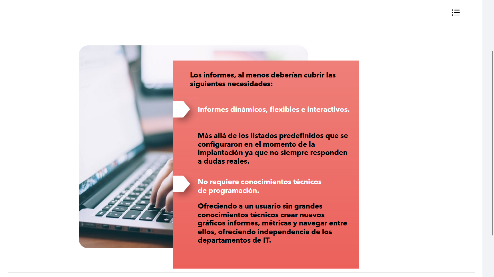

Los informes, al menos deberían cubrir las siguientes necesidades:

- 	Informes dinámicos, flexibles e interactivos.  
	Más allá de los listados predefinidos que se configuraron en el momento de la implantación ya que no siempre responden a dudas reales.

- 	No requiere conocimientos técnicos de programación. 
	Ofreciendo a un usuario sin grandes conocimientos técnicos crear nuevos gráficos informes, métricas y navegar entre ellos, ofreciendo independencia de los departamentos de IT.

---

## Cuadros de Mando

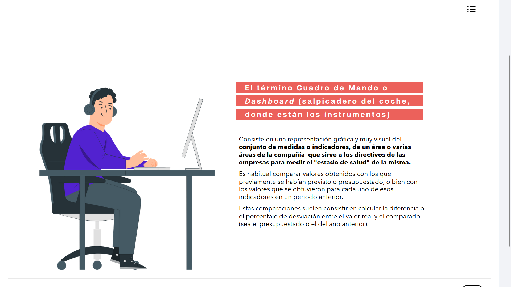
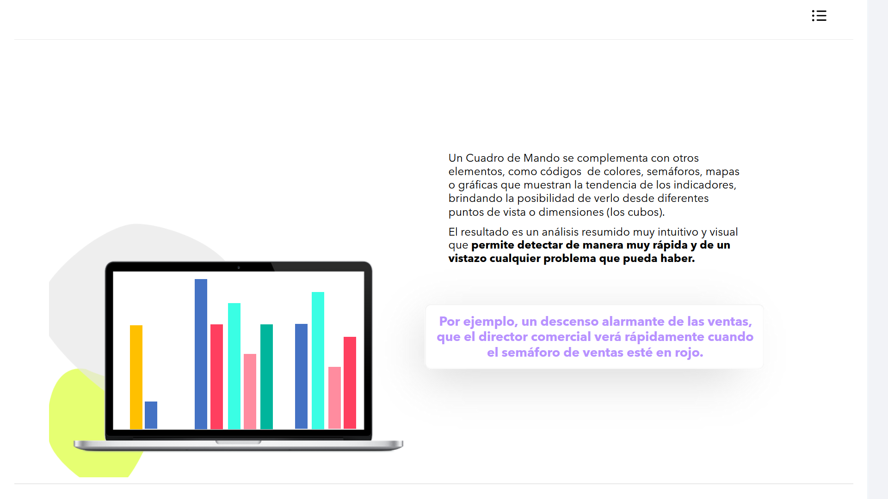
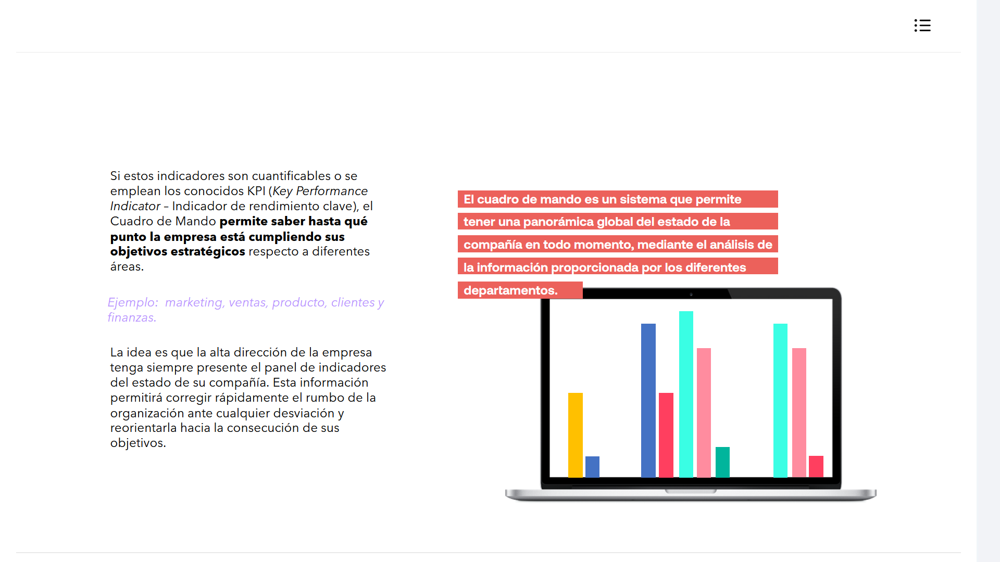

El propósito de estas herramientas cobra su sentido con la aplicación final que nos presente **de forma clara, visual, rápida y entendible** las **conclusiones del análisis** realizado con los datos.  
 A estas aplicaciones se las llama **cuadros de mando o *dashboards*.**
 
> El término Cuadro de Mando o *Dashboard* (salpicadero del coche, donde están los instrumentos)

Consiste en una representación gráfica y muy visual del **conjunto de medidas o indicadores, de un área o varias áreas de la compañía que sirve a los directivos de las empresas para medir el "estado de salud" de la misma.**  

Es habitual comparar valores obtenidos con los que previamente se habían previsto o presupuestado, o bien con los valores que se obtuvieron para cada uno de esos indicadores en un periodo anterior.  

Estas comparaciones suelen consistir en calcular la diferencia o el porcentaje de desviación entre el valor real y el comparado (sea el presupuestado o el del año anterior).  

Un Cuadro de Mando se complementa con otros elementos, como **códigos de colores, semáforos, mapas o gráficas** que muestran la tendencia de los indicadores, brindando la posibilidad de verlo desde diferentes puntos de vista o dimensiones (los cubos).

El resultado es un análisis resumido muy intuitivo y visual que **permite detectar de manera muy rápida y de un vistazo cualquier problema que pueda haber.**

> **Por ejemplo, un descenso alarmante de las ventas, que el director comercial verá rápidamente cuando el semáforo de ventas esté en rojo.**

> El cuadro de mando es un sistema que permite tener una panorámica global del estado de la compañía en todo momento, mediante el análisis de la información proporcionada por los diferentes departamentos.

Si estos indicadores son cuantificables o se emplean los conocidos KPI (*Key Performance Indicator* – Indicador de rendimiento clave), el Cuadro de Mando **permite saber hasta qué punto la empresa está cumpliendo sus objetivos estratégicos** respecto a diferentes áreas.

*Ejemplo: marketing, ventas, producto, clientes y finanzas.*

La idea es que la alta dirección de la empresa tenga siempre presente el panel de indicadores del estado de su compañía. Esta información permitirá corregir rápidamente el rumbo de la organización ante cualquier desviación y reorientarla hacia la consecución de sus objetivos.

---

## Dashboards - Paneles de control

> A menudo vemos dashboards con muchos indicadores sin tener en cuenta al usuario; éste tiene que conformarse con toda esta información que puede no ser de su interés, **lo cual es un error**.

### Uso de los *dashboards* o paneles de control

Los *dashboards* o paneles de control son elementos de primera necesidad, cuya configuración determinará en gran medida la usabilidad y maniobrabilidad de las herramientas de análisis de datos e informaciones implementadas en nuestro entorno BI, la correcta gestión de los mismos y, consiguientemente, la mayor o menor capacitación para una toma de decisiones adecuada y eficaz.

### El papel de las herramientas para la visualización de datos en el panel de control o *dashboard* es...
**Ddeterminante y fundamental:**

**01. Traducen datos e informaciones relevantes** en conocimiento de un modo gráfico y simple.
**02. Permiten comparar** resultados de métricas y reportes personalizados.
**03. Ofrecen una visión integral** del desempeño de actividades y procesos clave para la consecución de los objetivos estratégicos fijados.
**04. Facilitan la toma de decisiones *ad hoc*,** minimizando los riesgos y detectando oportunidades de negocio con un solo vistazo.

### CARACTERÍSTICAS DEL DASHBOARD 

> Antes de empezar a trabajar en el documento, es importante entender cuáles son los requisitos que debe cumplir un dashboard para que resulte realmente útil a la hora de medir el éxito de cualquier campaña integrada con la estrategia de la empresa.

Para que un panel de control sea verdaderamente útil y efectivo a la hora de gestionar las finanzas y otras áreas de una empresa, debe cumplir con un conjunto determinado de características, que podemos resumir del siguiente modo:

#### 01a.	 Sencillez
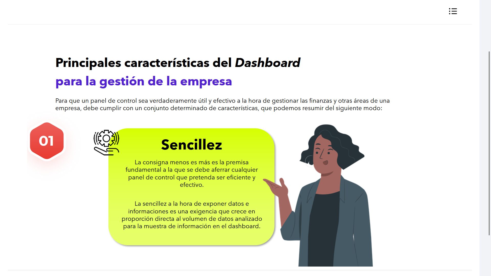
La consigna menos es más es la premisa fundamental a la que se debe aferrar cualquier panel de control que pretenda ser eficiente y efectivo.

La sencillez a la hora de exponer datos e informaciones es una exigencia que crece en proporción directa al volumen de datos analizado para la muestra de información en el dashboard.

#### 01b.	Utilidad
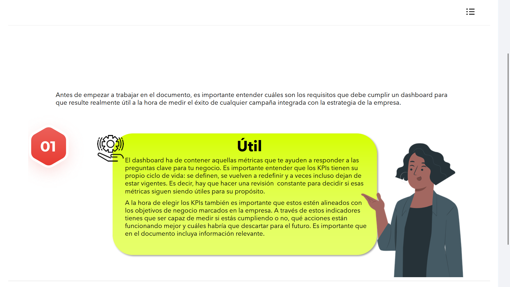

El dashboard ha de contener aquellas métricas que te ayuden a responder a las preguntas clave para tu negocio. Es importante entender que los KPIs tienen su propio ciclo de vida: se definen, se vuelven a redefinir y a veces incluso dejan de estar vigentes. Es decir, hay que hacer una revisión constante para decidir si esas métricas siguen siendo útiles para su propósito.

A la hora de elegir los KPIs también es importante que estos estén alineados con los objetivos de negocio marcados en la empresa.   
A través de estos indicadores tienes que ser capaz de medir si estás cumpliendo o no, qué acciones están funcionando mejor y cuáles habría que descartar para el futuro. Es importante que en el documento incluya información relevante.

#### 02. 	Visual
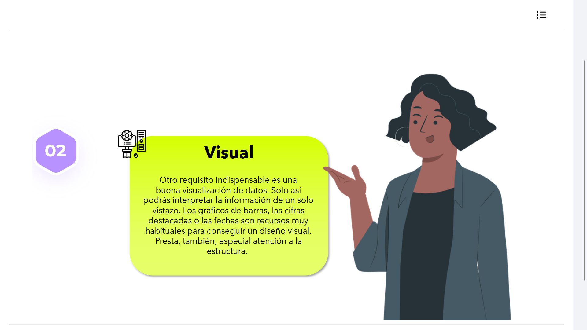

Otro requisito indispensable es una buena visualización de datos. Solo así podrás interpretar la información de un solo vistazo.   

Los gráficos de barras, las cifras destacadas o las fechas son recursos muy habituales para conseguir un diseño visual. Presta, también, especial atención a la estructura.

#### 03. 	Comprensibilidad
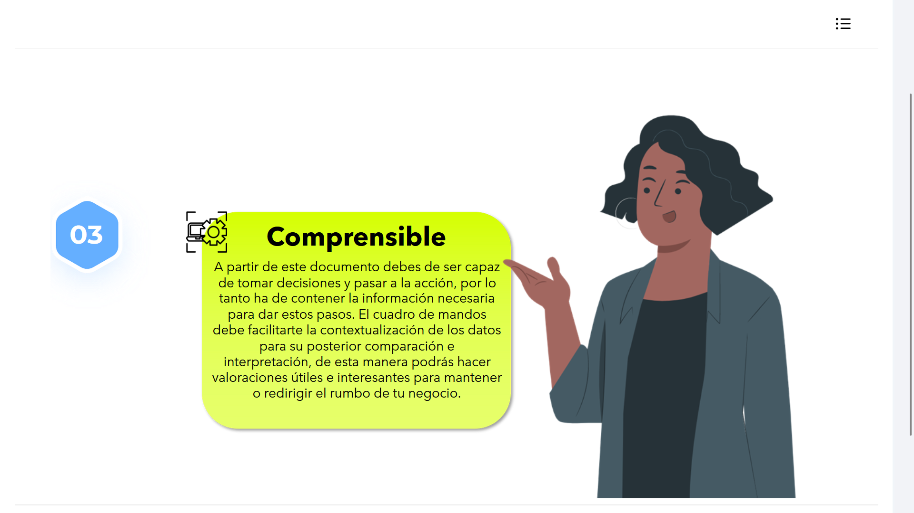

A partir de este documento debes de ser capaz de tomar decisiones y pasar a la acción, por lo tanto ha de contener la información necesaria para dar estos pasos.   

El cuadro de mandos debe facilitarte la contextualización de los datos para su posterior comparación e interpretación, de esta manera podrás hacer valoraciones útiles e interesantes para mantener o redirigir el rumbo de tu negocio.

#### 04. 	Actual
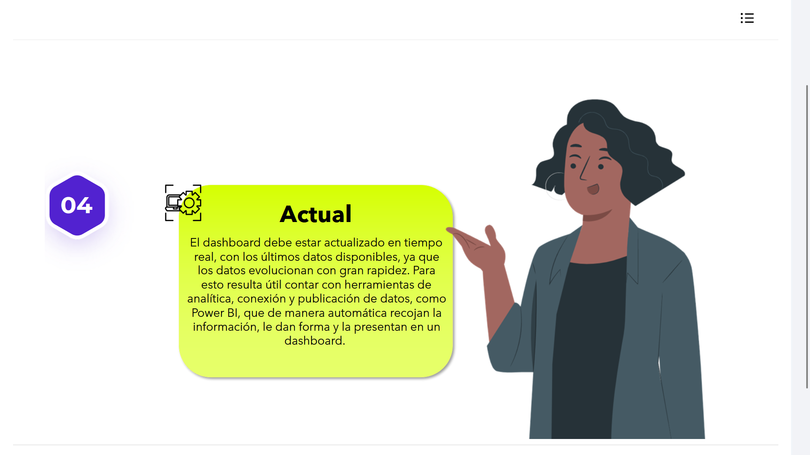
El dashboard **debe estar actualizado en tiempo real, con los últimos datos disponibles, ya que los datos evolucionan con gran rapidez**. Para esto resulta útil contar con herramientas de analítica, conexión y publicación de datos, como Power BI, que de manera automática recojan la información, le dan forma y la presentan en un dashboard.

#### 05. 	Potencia
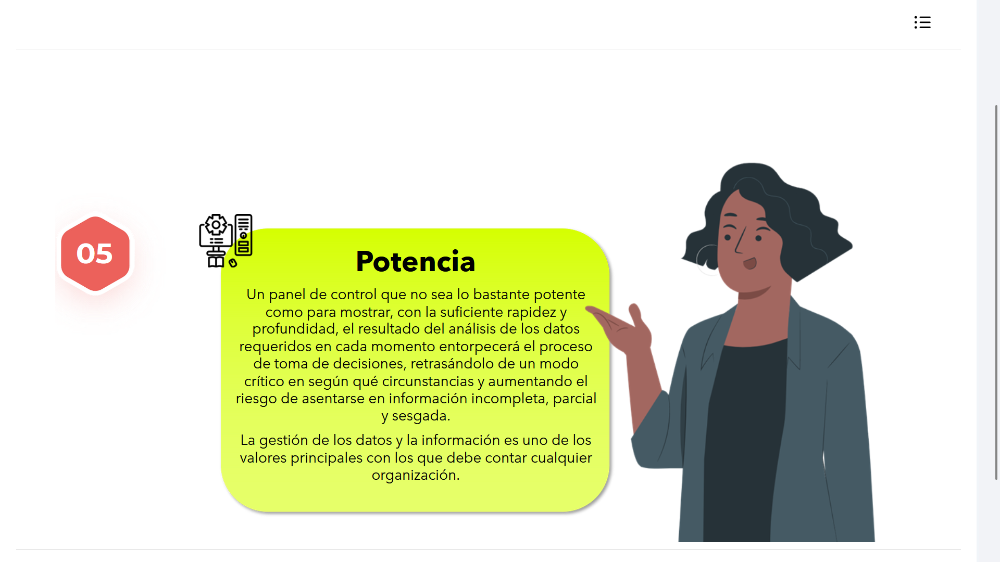
Un panel de control que no sea lo bastante potente como para mostrar, con la suficiente rapidez y profundidad, el resultado del análisis de los datos requeridos en cada momento entorpecerá el proceso de toma de decisiones, retrasándolo de un modo crítico en según qué circunstancias y aumentando el riesgo de asentarse en información incompleta, parcial y sesgada.

La gestión de los datos yNormally I can help with things like this, but I don't seem to have access to that content. You can try again or ask me for something else.

#### 06. 	Personalización
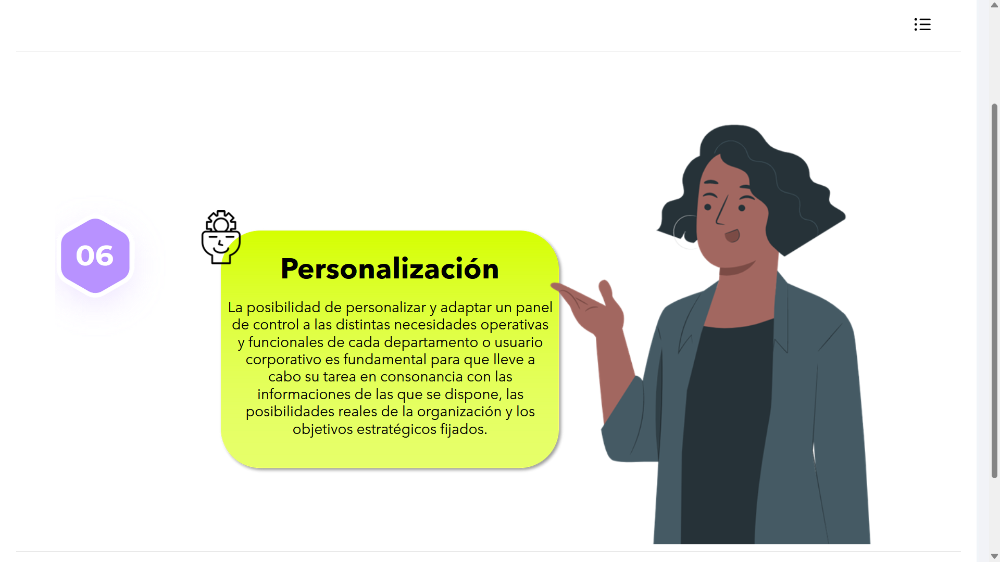
La posibilidad de personalizar y adaptar un panel de control a las distintas necesidades operativas y funcionales de cada departamento o usuario corporativo es fundamental para que lleve a cabo su tarea en consonancia con las informaciones de las que se dispone, las posibilidades reales de la organización y los objetivos estratégicos fijados.

---

### Datos en TIEMPO REAL
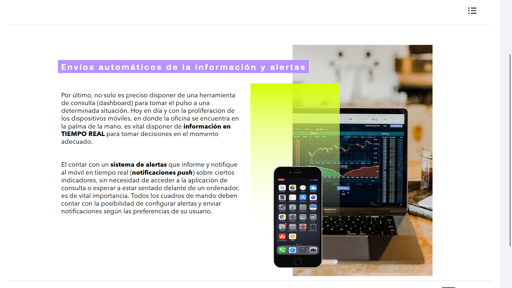

#### Envíos automáticos de la información y alertas

Por último, no solo es preciso disponer de una herramienta de consulta (dashboard) para tomar el pulso a una determinada situación. Hoy en día y con la proliferación de los dispositivos móviles, en donde la oficina se encuentra en la palma de la mano, es vital disponer de **información en TIEMPO REAL para tomar decisiones en el momento adecuado**.

El contar con un **sistema de alertas** que informe y notifique al móvil en tiempo real (**notificaciones _push_ **) sobre ciertos indicadores, sin necesidad de acceder a la aplicación de consulta o esperar a estar sentado delante de un ordenador, es de vital importancia.  

Todos los cuadros de mando deben contar con la posibilidad de configurar alertas y enviar notificaciones según las preferencias de su usuario.

---

## Dashboard de Negocios

### Utilidad - ¿Para qué sirve?
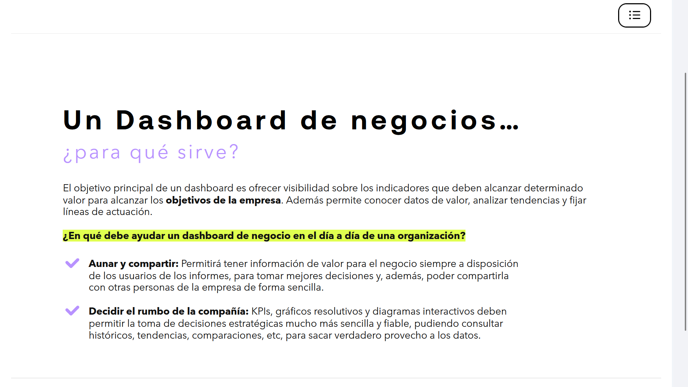

El objetivo principal de un dashboard es ...

> **Ofrecer visibilidad sobre los indicadores que deben alcanzar determinado valor para alcanzar los objetivos de la empresa.** 

Además permite conocer datos de valor, analizar tendencias y fijar líneas de actuación.

### ¿En qué debe ayudar un dashboard de negocio en el día a día de una organización?

* **Aunar y compartir:** Permitirá tener información de valor para el negocio siempre a disposición de los usuarios de los informes, para tomar mejores decisiones y, además, poder compartirla con otras personas de la empresa de forma sencilla.

* **Decidir el rumbo de la compañía:** KPIs, gráficos resolutivos y diagramas interactivos deben permitir la toma de decisiones estratégicas mucho más sencilla y fiable, pudiendo consultar históricos, tendencias, comparaciones, etc, para sacar verdadero provecho a los datos.

---

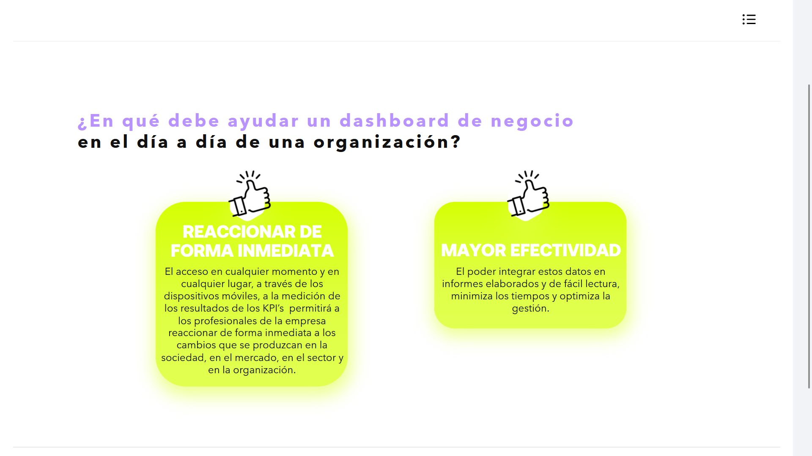

> ¿En qué debe ayudar un dashboard de negocio en el día a día de una organización?

#### REACCIONAR DE FORMA INMEDIATA
El acceso en cualquier momento y en cualquier lugar, a través de los dispositivos móviles, a la medición de los resultados de los KPI's permitirá a los profesionales de la empresa reaccionar de forma inmediata a los cambios que se produzcan en la sociedad, en el mercado, en el sector y en la organización.

#### MAYOR EFECTIVIDAD
El poder integrar estos datos en informes elaborados y de fácil lectura, minimiza los tiempos y optimiza la gestión.

---

### Ejemplo Visual de un Cuadro de Mando

- 	**Oracle BI**
	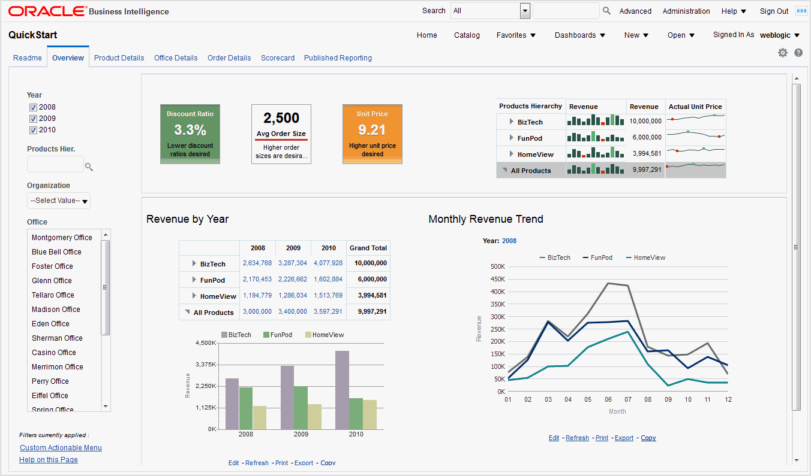
	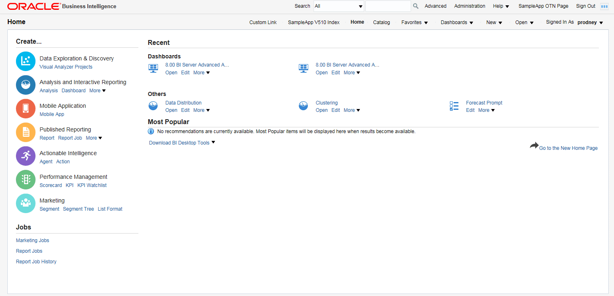

- 	**Ejemplo BI financiero**
	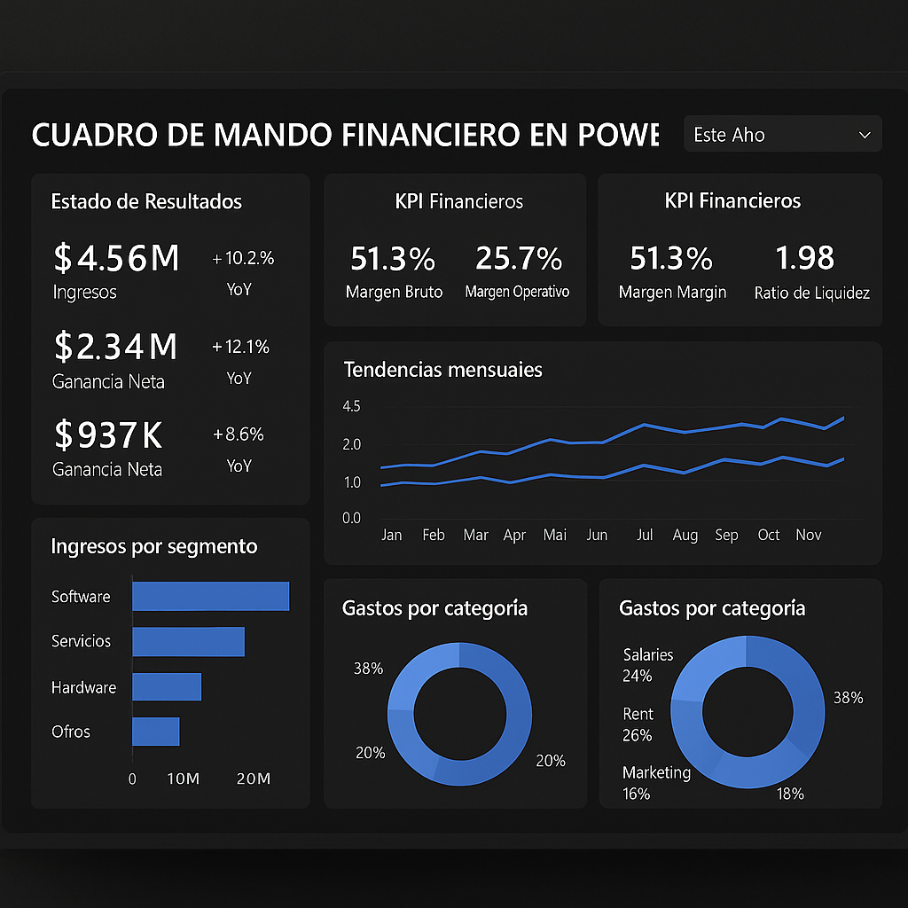

-	** Ejemplo Dashboard Ventas**
	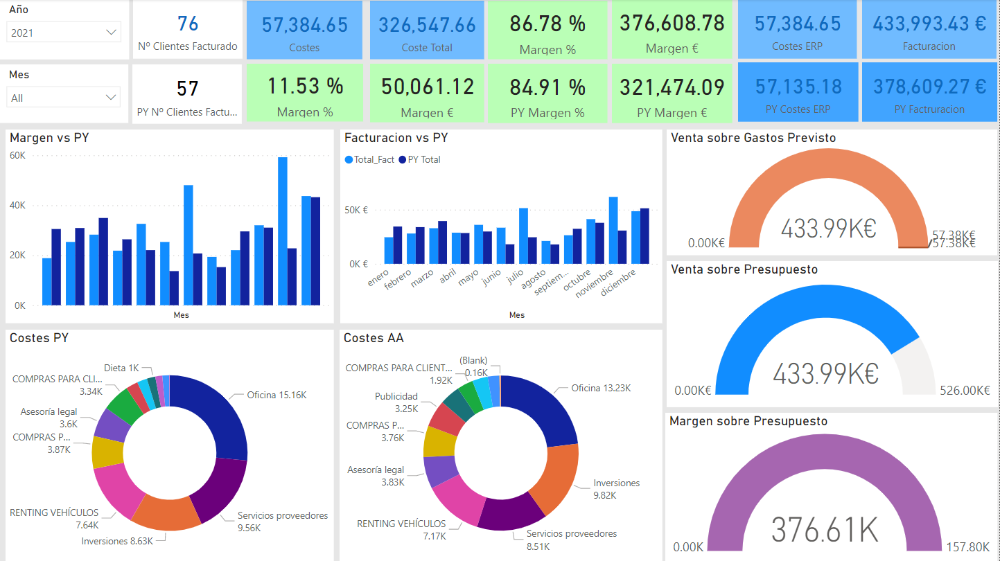

---

### Uso del Dashboard

Tenemos claros los pasos para la elaboración del dashboard, conocemos sus beneficios, y... ¿ahora?.  

Toca ponerlo en práctica. Para ello, antes tendremos que establecer una serie de acciones:

## 01. 	Decidir la frecuencia de actualización
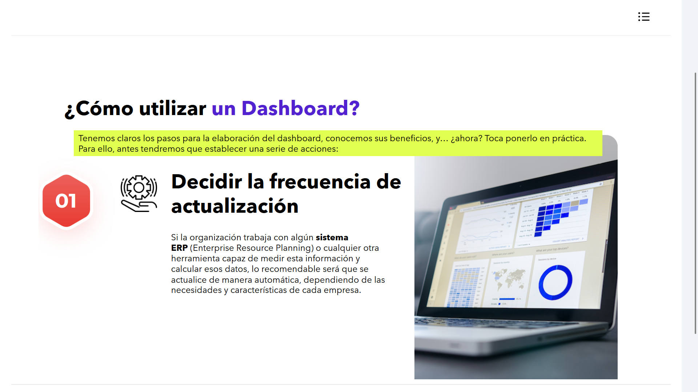

Si la organización trabaja con algún sistema ERP (Enterprise Resource Planning) o cualquier otra herramienta capaz de medir esta información y calcular esos datos, lo recomendable será que se actualice de manera automática, dependiendo de las necesidades y características de cada empresa.

## 02. Comparar y medir los indicadores
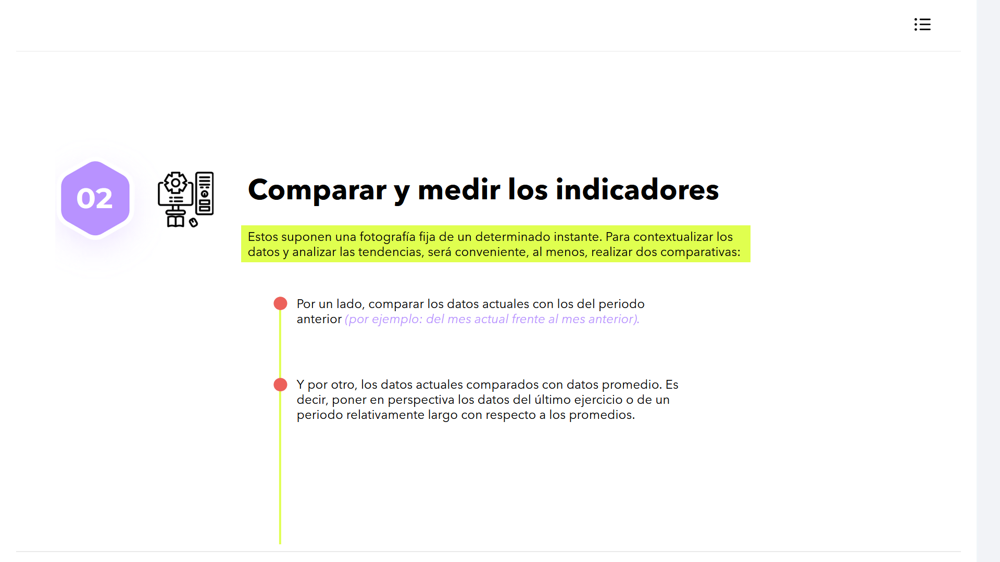
Estos suponen una fotografía fija de un determinado instante. Para contextualizar los datos y analizar las tendencias, será conveniente, al menos, realizar dos comparativas:

* Por un lado, comparar los datos actuales con los del periodo anterior (por ejemplo: del mes actual frente al mes anterior).
* Y por otro, los datos actuales comparados con datos promedio. Es decir, poner en perspectiva los datos del último ejercicio o de un periodo relativamente largo con respecto a los promedios.

## 03. Mejorar constantemente

Los resultados que se leen en un dashboard serán la mejor manera de comprobar si se está en la buena dirección empresarial para cumplir los objetivos finales y alineado con el plan estratégico. La mejor forma de interpretar los datos es mediante los gráficos a color.  

Por ejemplo, los datos en color rojo indican resultados negativos, los resultados neutros podrán ser en negro y aquellos resultados positivos se presentarán en color verde.

---

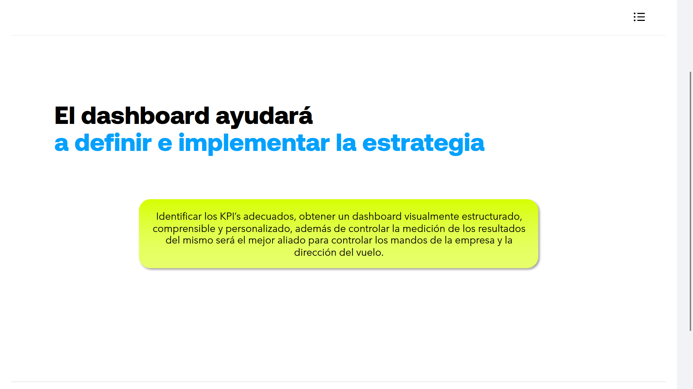

> El dashboard ayudará a definir e implementar la estrategia

Identificar los KPI's adecuados, obtener un dashboard visualmente estructurado, comprensible y personalizado, además de controlar la medición de los resultados del mismo será el mejor aliado para controlar los mandos de la empresa y la dirección del vuelo.

---

