# 01-010:	Herramientas ETL, Extract-Transform-Load

## Business Analytics

---

## ¿Qué es Business analytics?
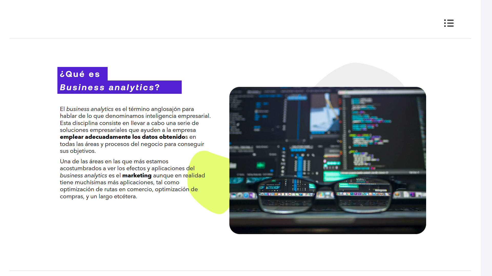

El *business analytics* es el término anglosajón para hablar de lo que denominamos inteligencia empresarial. Esta disciplina consiste en llevar a cabo una serie de soluciones empresariales que ayuden a la empresa **emplear adecuadamente los datos obtenidos** en todas las áreas y procesos del negocio para conseguir sus objetivos.

Una de las áreas en las que más estamos acostumbrados a ver los efectos y aplicaciones del *business analytics* es el **marketing** aunque en realidad tiene muchísimas más aplicaciones, tal como optimización de rutas en comercio, optimización de compras, y un largo etcétera.

---

## Business Analytics VS Business Inteligence

> Business analytics y business intelligence **NO son sinónimos**
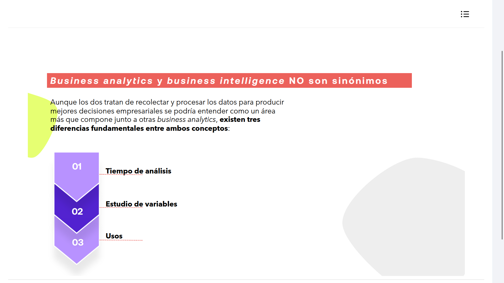

Aunque los dos tratan de recolectar y procesar los datos para producir mejores decisiones empresariales, se podría entender como un área más que compone junto a otras *business analytics*, **existen tres diferencias fundamentales entre ambos conceptos**:

* **01** Tiempo de análisis
* **02** Estudio de variables
* **03** Usos

### 01. 	Tiempo de análisis
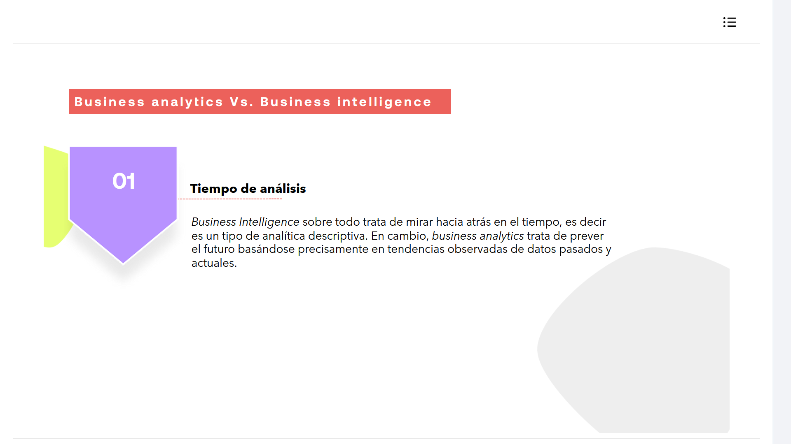

*Business Intelligence* sobre todo trata de mirar hacia atrás en el tiempo, es decir es un tipo de analítica descriptiva. En cambio, *business analytics* trata de prever el futuro basándose precisamente en tendencias observadas de datos pasados y actuales.

### 02. 	Estudio de variables
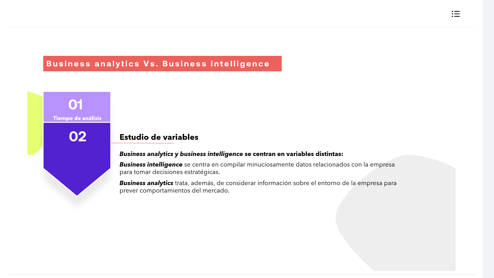

**Business analytics y business intelligence se centran en variables distintas:**

***Business intelligence*** se centra en compilar minuciosamente datos relacionados con la empresa para tomar decisiones estratégicas.

***Business analytics*** trata, además, de considerar información sobre el entorno de la empresa para prever comportamientos del mercado.

### 03. 	Usos
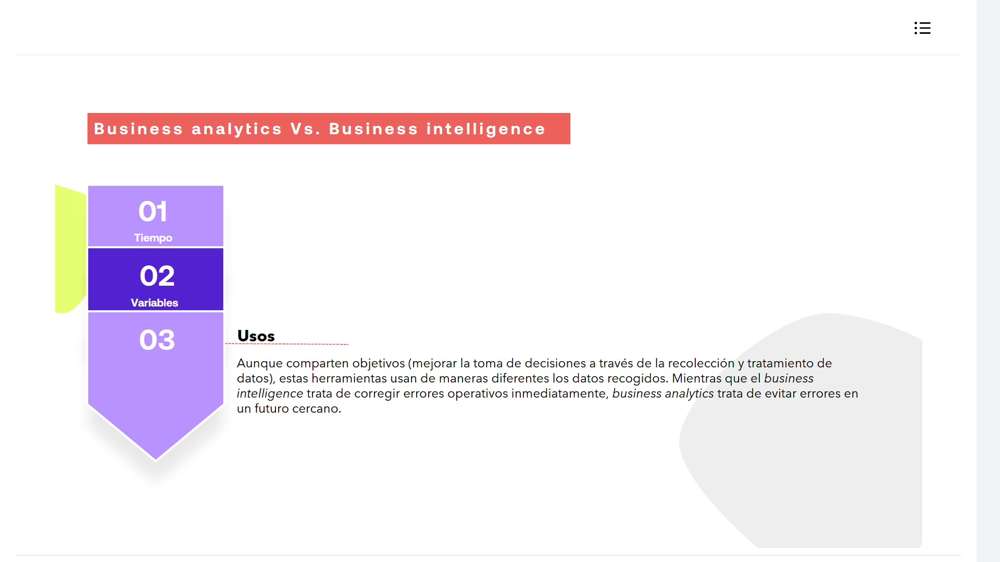

Aunque comparten objetivos (mejorar la toma de decisiones a través de la recolección y tratamiento de datos), estas herramientas usan de maneras diferentes los datos recogidos. Mientras que el *business intelligence* trata de corregir errores operativos inmediatamente, *business analytics* trata de evitar errores en un futuro cercano.

---

## Tipos de Business Inteligence

Podemos hablar de tres áreas de analítica en el negocio:

1.	Analítica **Descriptiva** - **Descriptive analytics***
2.	Analítica **Predictiva** - **Predictive analytics** 
2.	Analítica **Prescriptiva** - **Prescriptive analytics** 

### 01.	Analítica DESCRIPTIVA o *DESCRIPTIVE analytics*
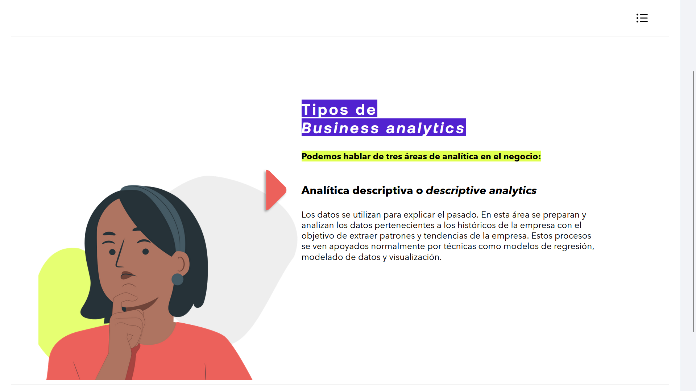

Los datos se utilizan para **explicar el pasado**. En esta área se preparan y analizan los datos pertenecientes a los históricos de la empresa con el objetivo de extraer patrones y tendencias de la empresa.  

Estos procesos se ven apoyados normalmente por técnicas como modelos de regresión, modelado de datos y visualización.

### 02.	Analítica PREDICTIVA o *PREDICTIVE analytics*
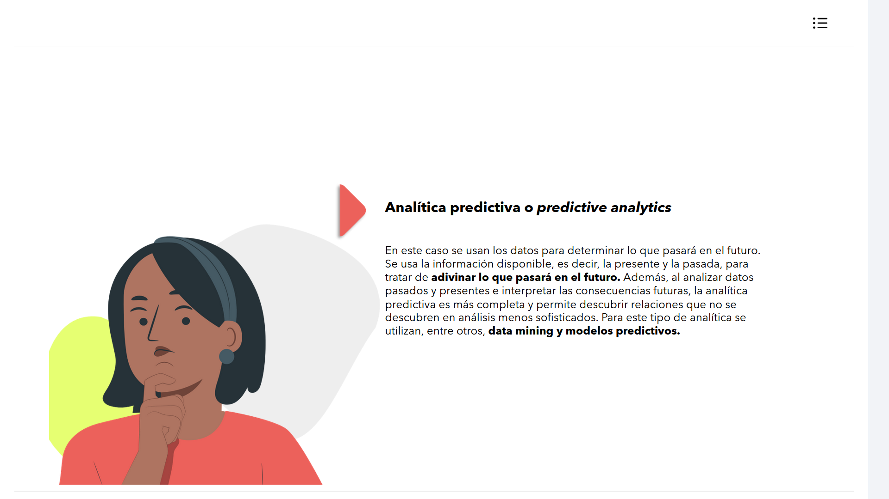

En este caso se usan los datos para **determinar lo que pasará en el futuro**. Se usa la información disponible, es decir, la presente y la pasada, para tratar de **adivinar lo que pasará en el futuro**.  

Además, al analizar datos pasados y presentes e interpretar las consecuencias futuras, la analítica predictiva es más completa y permite descubrir relaciones que no se descubren en análisis menos sofisticados. Para este tipo de analítica se utilizan, entre otros, **data mining y modelos predictivos**.

### 03	Analítica PRESCRIPTIVA o *PRESCRIPTIVE analytics*
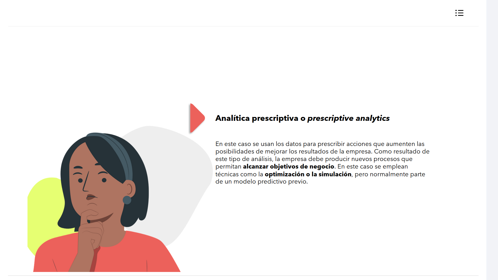

En este caso se usan los datos para **prescribir acciones que aumenten las posibilidades** de mejorar los resultados de la empresa. Como resultado de este tipo de análisis, la empresa debe producir nuevos procesos que permitan **alcanzar objetivos de negocio**.  

En este caso se emplean técnicas como la **optimización o la simulación**, pero normalmente parte de un modelo predictivo previo.

---

## Beneficios de usar Business analytics

### 01	 Para la dirección
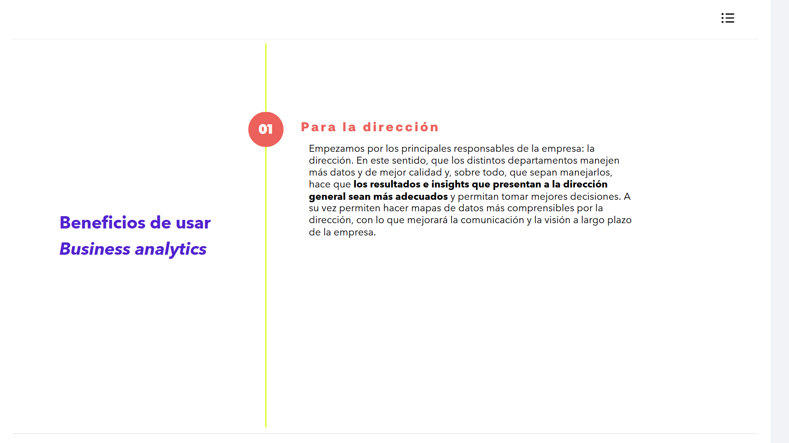

Empezamos por los principales responsables de la empresa: la dirección. En este sentido, que los distintos departamentos manejen más datos y de mejor calidad y, sobre todo, que sepan manejarlos, hace que **los resultados e insights que presentan a la dirección general sean más adecuados** y permitan tomar mejores decisiones.  
A su vez permiten hacer mapas de datos más comprensibles por la dirección, con lo que mejorará la comunicación y la visión a largo plazo de la empresa.

## 02 	Para el departamento de marketing
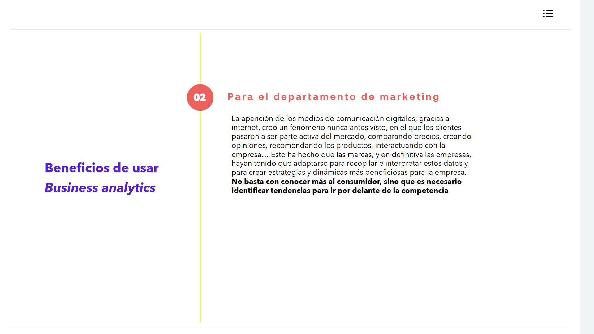

La aparición de los medios de comunicación digitales, gracias a internet, creó un fenómeno nunca antes visto, en el que los clientes pasaron a ser parte activa del mercado, comparando precios, creando opiniones, recomendando los productos, interactuando con la empresa...   

Esto ha hecho que las marcas, y en definitiva las empresas, hayan tenido que adaptarse para recopilar e interpretar estos datos y para crear estrategias y dinámicas más beneficiosas para la empresa. **No basta con conocer más al consumidor, sino que es necesario identificar tendencias para ir por delante de la competencia**

## 03 	Para el departamento de RRHH
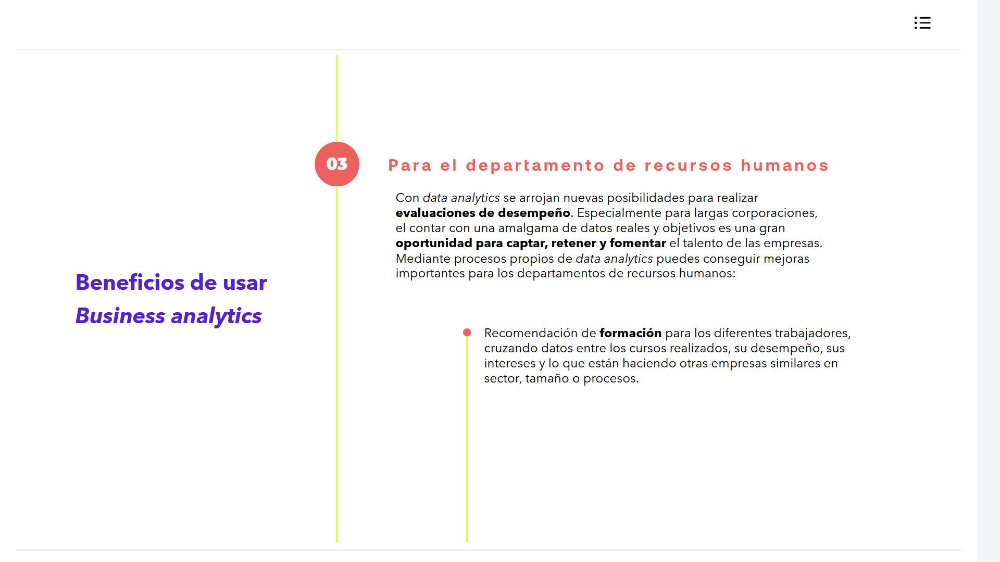
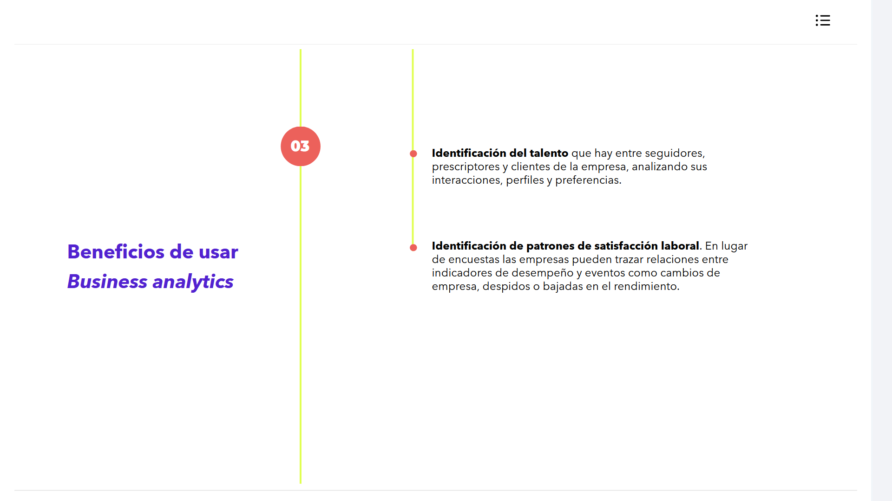

Con *data analytics* se arrojan nuevas posibilidades para realizar **evaluaciones de desempeño**. Especialmente para largas corporaciones, el contar con una amalgama de datos reales y objetivos es una gran **oportunidad para captar, retener y fomentar** el talento de las empresas. Mediante procesos propios de *data analytics* puedes conseguir mejoras importantes para los departamentos de recursos humanos:

* 	Recomendación de **formación** para los diferentes trabajadores, cruzando datos entre los cursos realizados, su desempeño, sus intereses y lo que están haciendo otras empresas similares en sector, tamaño o procesos.
* 	**Identificación del talento** que hay entre seguidores, prescriptores y clientes de la empresa, analizando sus interacciones, perfiles y preferencias.
* 	**Identificación de patrones de satisfacción laboral**. En lugar de encuestas las empresas pueden trazar relaciones entre indicadores de desempeño y eventos como cambios de empresa, despidos o bajadas en el rendimiento.

### 04 	Para el departamento financiero
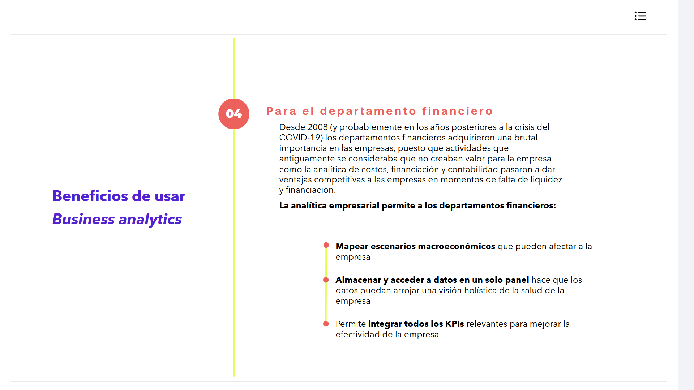

Desde 2008 (y probablemente en los años posteriores a la crisis del COVID-19) los departamentos financieros adquirieron una brutal importancia en las empresas, puesto que actividades que antiguamente se consideraba que no creaban valor para la empresa como la analítica de costes, financiación y contabilidad pasaron a dar ventajas competitivas a las empresas en momentos de falta de liquidez y financiación.

**La analítica empresarial permite a los departamentos financieros:**

* 	**Mapear escenarios macroeconómicos** que pueden afectar a la empresa
* 	**Almacenar y acceder a datos en un solo panel** hace que los datos puedan arrojar una visión holística de la salud de la empresa
* 	Permite **integrar todos los KPIs** relevantes para mejorar la efectividad de la empresa

---

## Casos prácticos en el sector servicios
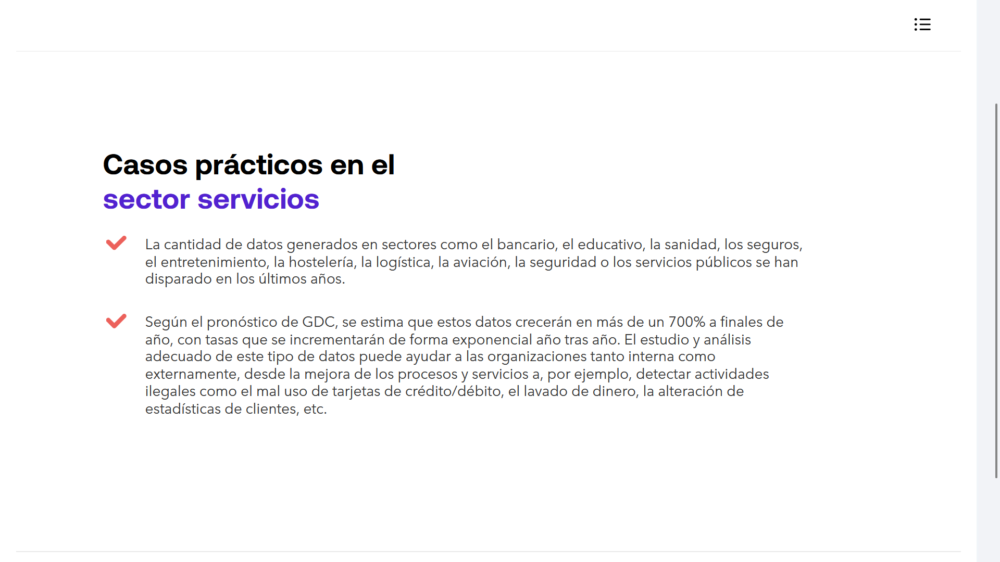
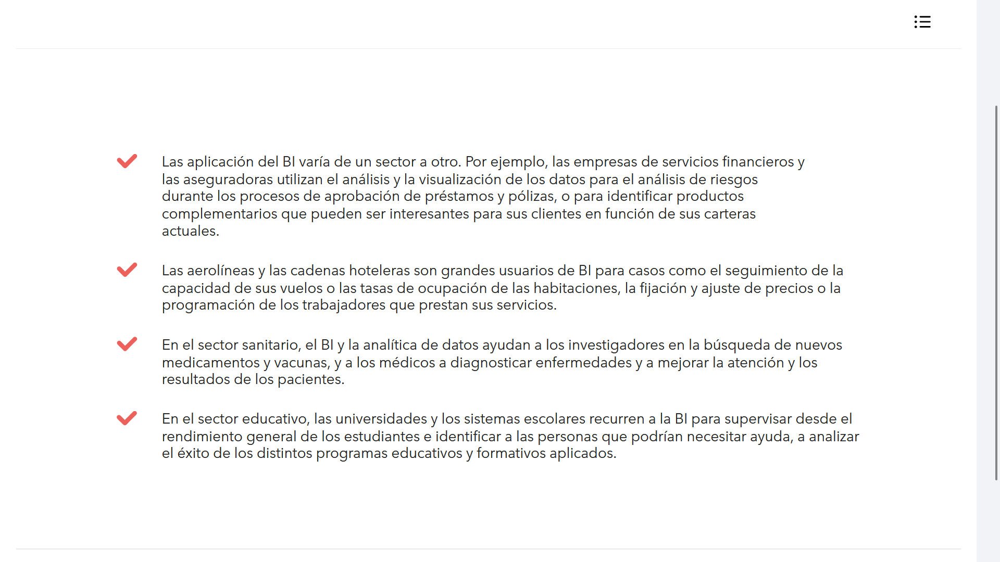

* La cantidad de datos generados en sectores como el bancario, el educativo, la sanidad, los seguros, el entretenimiento, la hostelería, la logística, la aviación, la seguridad o los servicios públicos se han disparado en los últimos años.

* Según el pronóstico de GDC, se estima que estos datos crecerán en más de un 700% a finales de año, con tasas que se incrementarán de forma exponencial año tras año. El estudio y análisis adecuado de este tipo de datos puede ayudar a las organizaciones tanto interna como externamente, desde la mejora de los procesos y servicios a, por ejemplo, detectar actividades ilegales como el mal uso de tarjetas de crédito/débito, el lavado de dinero, la alteración de estadísticas de clientes, etc.

* Las aplicación del BI varía de un sector a otro. Por ejemplo, las empresas de servicios financieros y las aseguradoras utilizan el análisis y la visualización de los datos para el análisis de riesgos durante los procesos de aprobación de préstamos y pólizas, o para identificar productos complementarios que pueden ser interesantes para sus clientes en función de sus carteras actuales.

* Las aerolíneas y las cadenas hoteleras son grandes usuarios de BI para casos como el seguimiento de la capacidad de sus vuelos o las tasas de ocupación de las habitaciones, la fijación y ajuste de precios o la programación de los trabajadores que prestan sus servicios.

* En el sector sanitario, el BI y la analítica de datos ayudan a los investigadores en la búsqueda de nuevos medicamentos y vacunas, y a los médicos a diagnosticar enfermedades y a mejorar la atención y los resultados de los pacientes.

* En el sector educativo, las universidades y los sistemas escolares recurren a la BI para supervisar desde el rendimiento general de los estudiantes e identificar a las personas que podrían necesitar ayuda, a analizar el éxito de los distintos programas educativos y formativos aplicados.

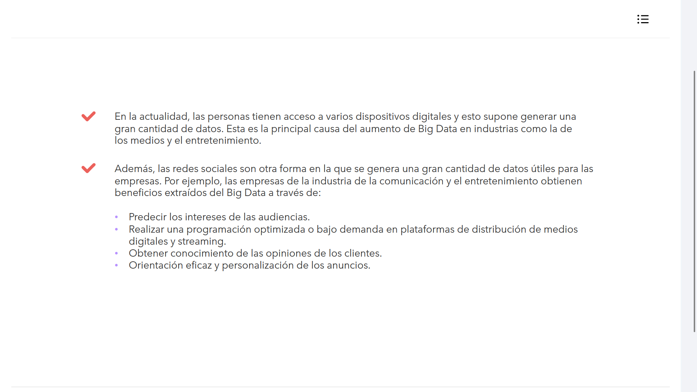
En la actualidad, las personas tienen acceso a varios dispositivos digitales y esto supone generar una gran cantidad de datos. Esta es la principal causa del aumento de Big Data en industrias como la de los medios y el entretenimiento.

Además, las redes sociales son otra forma en la que se genera una gran cantidad de datos útiles para las empresas. Por ejemplo, las empresas de la industria de la comunicación y el entretenimiento obtienen beneficios extraídos del Big Data a través de:

* Predecir los intereses de las audiencias.
* Realizar una programación optimizada o bajo demanda en plataformas de distribución de medios digitales y streaming.
* Obtener conocimiento de las opiniones de los clientes.
* Orientación eficaz y personalización de los anuncios.

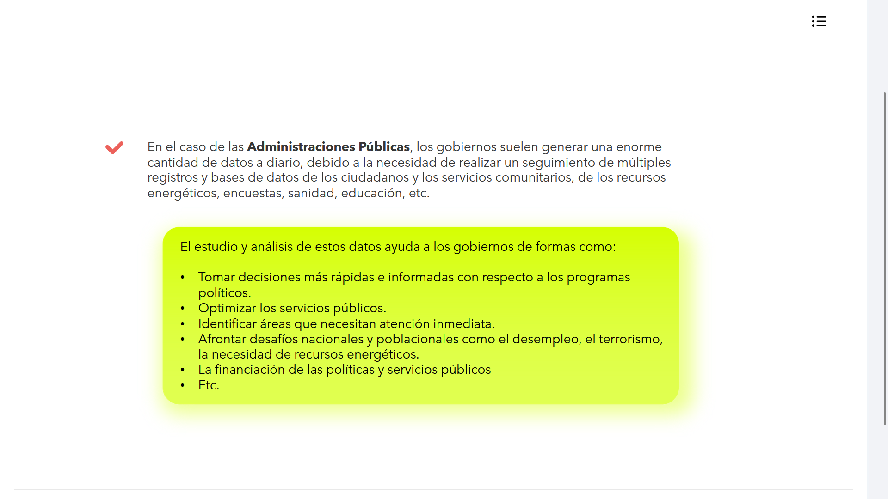
* En el caso de las **Administraciones Públicas**, los gobiernos suelen generar una enorme cantidad de datos a diario, debido a la necesidad de realizar un seguimiento de múltiples registros y bases de datos de los ciudadanos y los servicios comunitarios, de los recursos energéticos, encuestas, sanidad, educación, etc.

> El estudio y análisis de estos datos ayuda a los gobiernos de formas como:
> 
> * Tomar decisiones más rápidas e informadas con respecto a los programas políticos.
> * Optimizar los servicios públicos.
> * Identificar áreas que necesitan atención inmediata.
> * Afrontar desafíos nacionales y poblacionales como el desempleo, el terrorismo, la necesidad de recursos energéticos.
> * La financiación de las políticas y servicios públicos
> * Etc...

---

## Áreas de Aplicación de Data Mining y BI
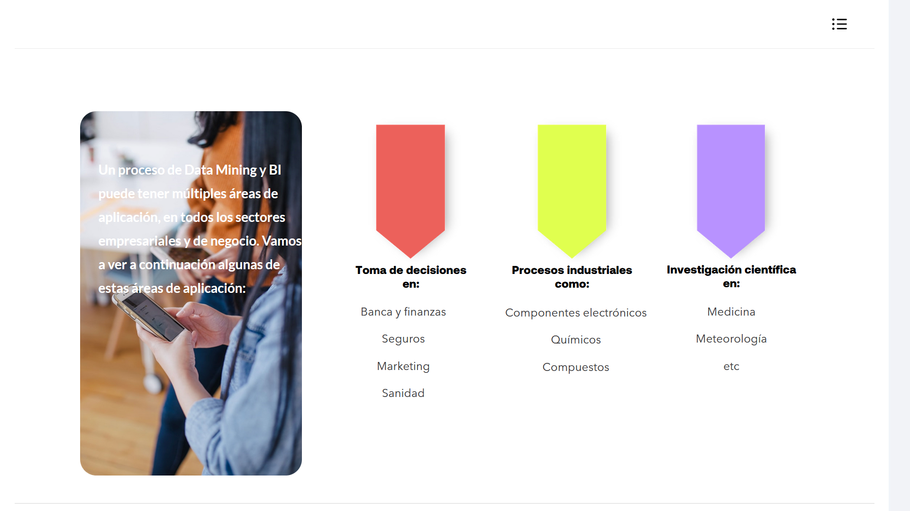

Un proceso de Data Mining y BI puede tener múltiples áreas de aplicación, en todos los sectores empresariales y de negocio. Vamos a ver a continuación algunas de estas áreas de aplicación:

* **Toma de decisiones en:**
    * Banca y finanzas
    * Seguros
    * Marketing
    * Sanidad
* **Procesos industriales como:**
    * Componentes electrónicos
    * Químicos
    * Compuestos
* **Investigación científica en:**
    * Medicina
    * Meteorología
    * etc

> La aplicación práctica en cada sector se adapta a sus propias necesidades:

### Aplicación al Sector financiero
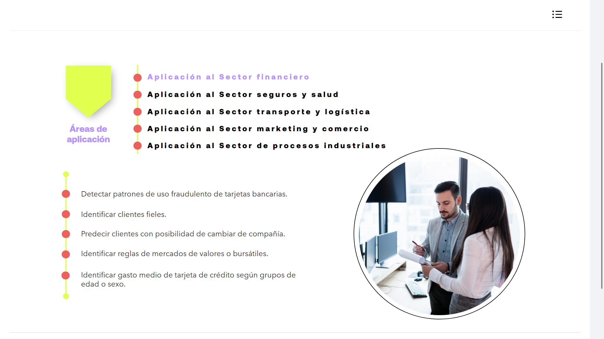
* Detectar patrones de uso fraudulento de tarjetas bancarias.
* Identificar clientes fieles.
* Predecir clientes con posibilidad de cambiar de compañía.
* Identificar reglas de mercados de valores o bursátiles.
* Identificar gasto medio de tarjeta de crédito según grupos de edad o sexo.

### Aplicación al Sector seguros y salud
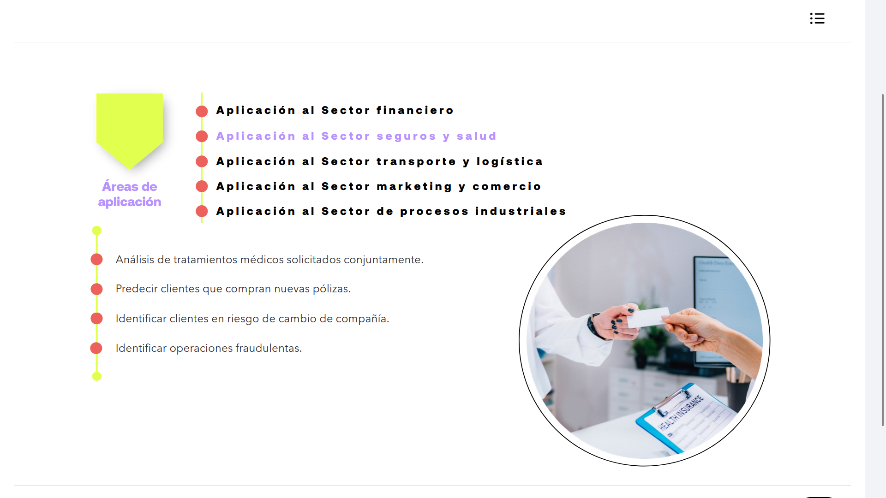

* Análisis de tratamientos médicos solicitados conjuntamente.
* Predecir clientes que compran nuevas pólizas.
* Identificar clientes en riesgo de cambio de compañía.
* Identificar operaciones fraudulentas.

### Aplicación al Sector medicina
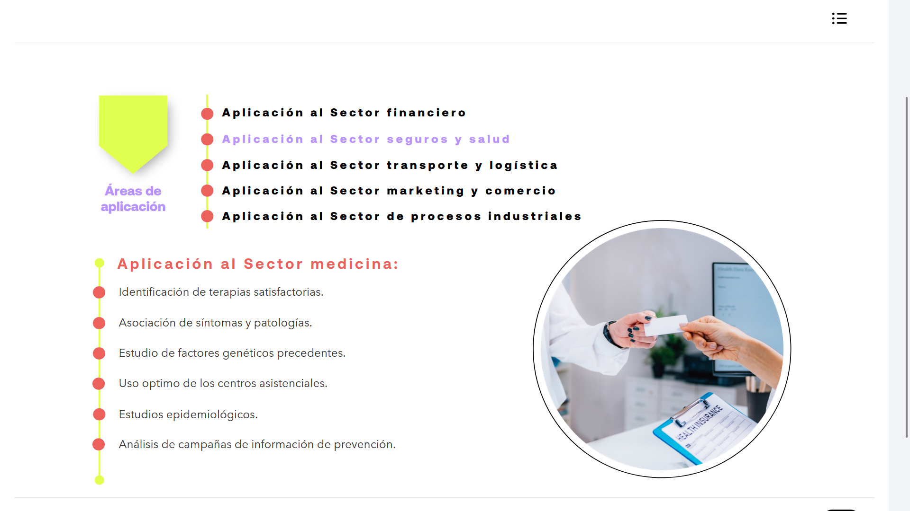

* Identificación de terapias satisfactorias.
* Asociación de síntomas y patologías.
* Estudio de factores genéticos precedentes.
* Uso optimo de los centros asistenciales.
* Estudios epidemiológicos.
* Análisis de campañas de información de prevención.

### Aplicación al Sector transporte y logística
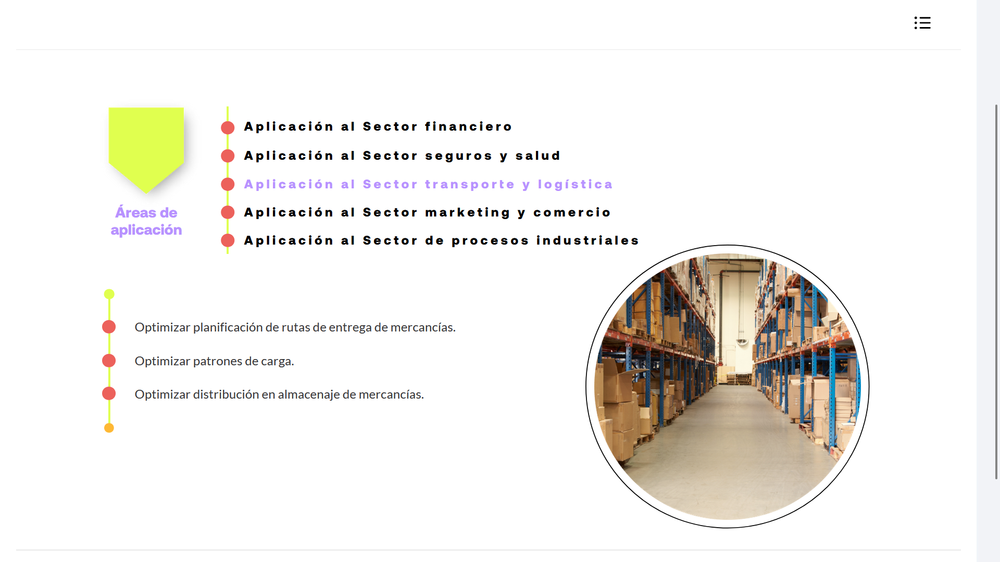
* Optimizar planificación de rutas de entrega de mercancías.
* Optimizar patrones de carga.
* Optimizar distribución en almacenaje de mercancías.

### Aplicación al Sector marketing y comercio
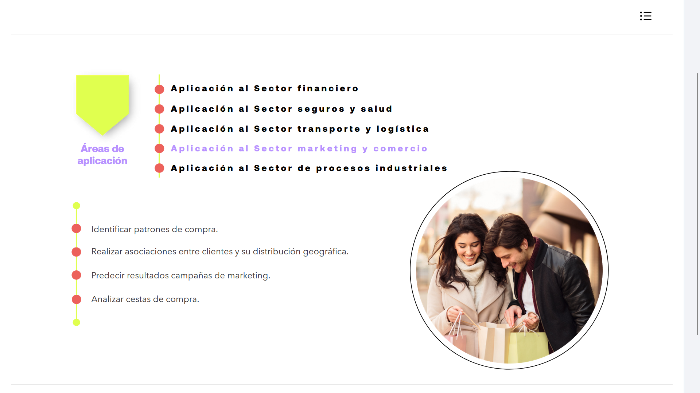

* Identificar patrones de compra.
* Realizar asociaciones entre clientes y su distribución geográfica.
* Predecir resultados campañas de marketing.
* Analizar cestas de compra.

### Aplicación al Sector de procesos industriales
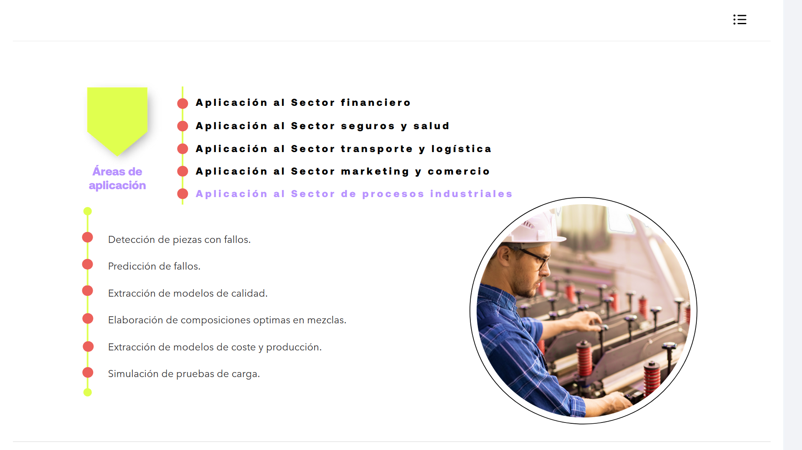

* Detección de piezas con fallos.
* Predicción de fallos.
* Extracción de modelos de calidad.
* Elaboración de composiciones optimas en mezclas.
* Extracción de modelos de coste y producción.
* Simulación de pruebas de carga.

---

## Casos de Uso 
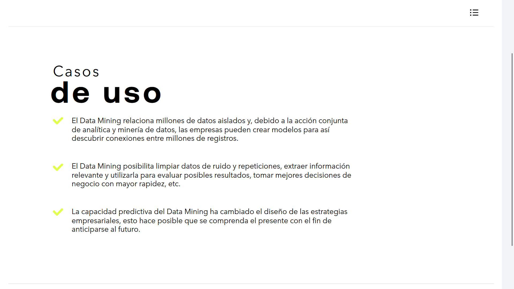

El Data Mining relaciona millones de datos aislados y, debido a la acción conjunta de analítica y minería de datos, las empresas pueden crear modelos para así descubrir conexiones entre millones de registros.

El Data Mining posibilita limpiar datos de ruido y repeticiones, extraer información relevante y utilizarla para evaluar posibles resultados, tomar mejores decisiones de negocio con mayor rapidez, etc.

La capacidad predictiva del Data Mining ha cambiado el diseño de las estrategias empresariales, esto hace posible que se comprenda el presente con el fin de anticiparse al futuro.

---

### Casos de uso Data Mining
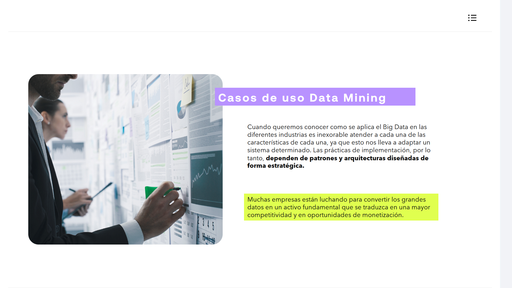

Cuando queremos conocer como se aplica el Big Data en las diferentes industrias es inexorable atender a cada una de las características de cada una, ya que esto nos lleva a adaptar un sistema determinado. Las prácticas de implementación, por lo tanto, **dependen de patrones y arquitecturas diseñadas de forma estratégica.**

Muchas empresas están luchando para convertir los grandes datos en un activo fundamental que se traduzca en una mayor competitividad y en oportunidades de monetización.

---

#### Big Data en la industria de telecomunicaciones
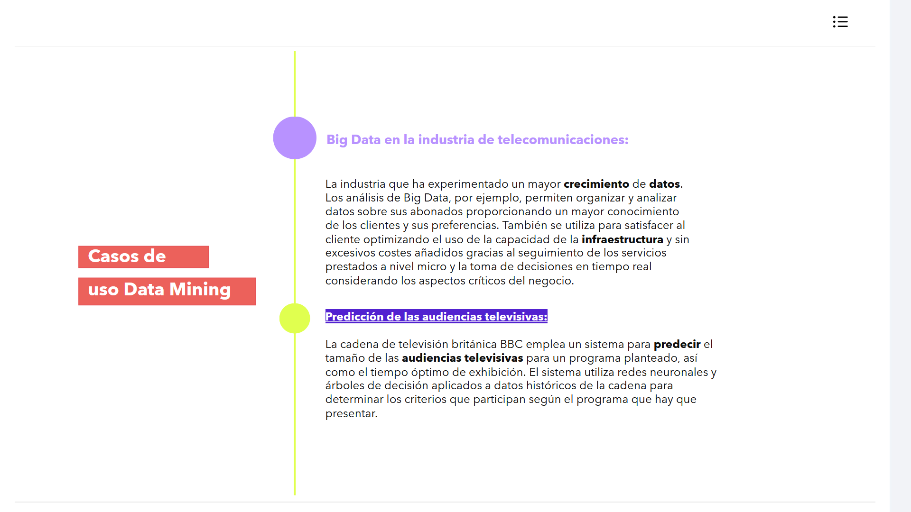

La industria que ha experimentado un mayor **crecimiento** de **datos**. Los análisis de Big Data, por ejemplo, permiten organizar y analizar datos sobre sus abonados proporcionando un mayor conocimiento de los clientes y sus preferencias.  

También se utiliza para satisfacer al cliente optimizando el uso de la capacidad de la **infraestructura** y sin excesivos costes añadidos gracias al seguimiento de los servicios prestados a nivel micro y la toma de decisiones en tiempo real considerando los aspectos críticos del negocio.

	##### Predicción de las audiencias televisivas
> La cadena de televisión británica BBC emplea un sistema para **predecir** el tamaño de las **audiencias televisivas** para un programa planteado, así como el tiempo óptimo de exhibición.  
> El sistema utiliza redes neuronales y árboles de decisión aplicados a datos históricos de la cadena para determinar los criterios que participan según el programa que hay que presentar.

---

##### Big Data en la banca
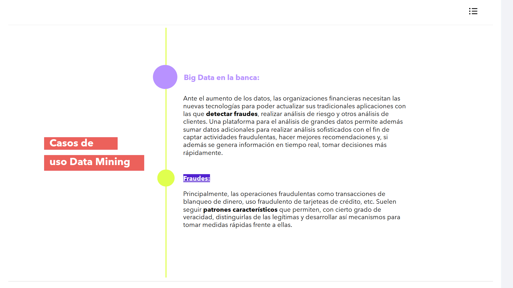

Ante el aumento de los datos, las organizaciones financieras necesitan las nuevas tecnologías para poder actualizar sus tradicionales aplicaciones con las que **detectar fraudes**, realizar análisis de riesgo y otros análisis de clientes. Una plataforma para el análisis de grandes datos permite además sumar datos adicionales para realizar análisis sofisticados con el fin de captar actividades fraudulentas, hacer mejores recomendaciones y, si además se genera información en tiempo real, tomar decisiones más rápidamente.

	###### Fraude
> Principalmente, las operaciones fraudulentas como transacciones de blanqueo de dinero, uso fraudulento de tarjeteas de crédito, etc. Suelen seguir **patrones característicos** que permiten, con cierto grado de veracidad, distinguirlas de las legítimas y desarrollar así mecanismos para tomar medidas rápidas frente a ellas.

---

#### Big Data en salud
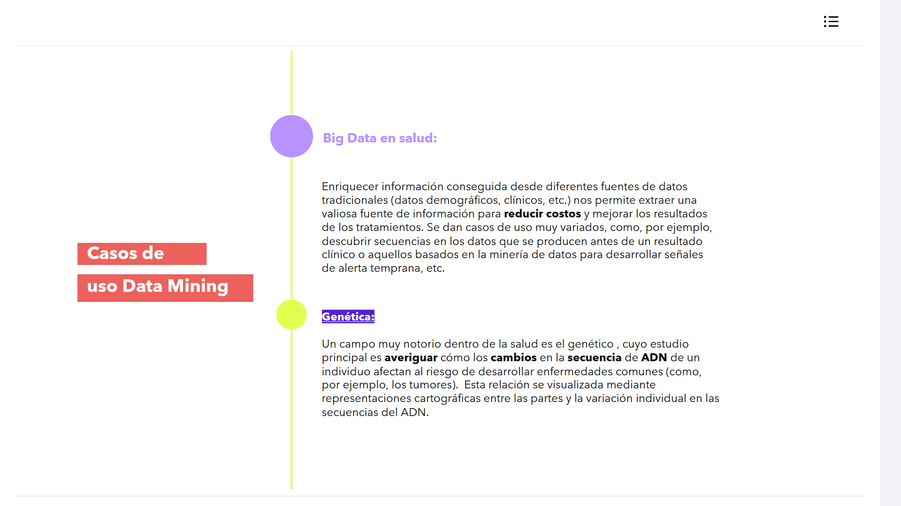
Enriquecer información conseguida desde diferentes fuentes de datos tradicionales (datos demográficos, clínicos, etc.) nos permite extraer una valiosa fuente de información para **reducir costos** y mejorar los resultados de los tratamientos. Se dan casos de uso muy variados, como, por ejemplo, descubrir secuencias en los datos que se producen antes de un resultado clínico o aquellos basados en la minería de datos para desarrollar señales de alerta temprana, etc.

	##### Genética
> Un campo muy notorio dentro de la salud es el genético, cuyo estudio principal es **averiguar** cómo los **cambios** en la **secuencia de ADN** de un individuo afectan al riesgo de desarrollar enfermedades comunes (como, por ejemplo, los tumores).  
> Esta relación se visualizada mediante representaciones cartográficas entre las partes y la variación individual en las secuencias del ADN.

---

#### Big Data en el sector seguros
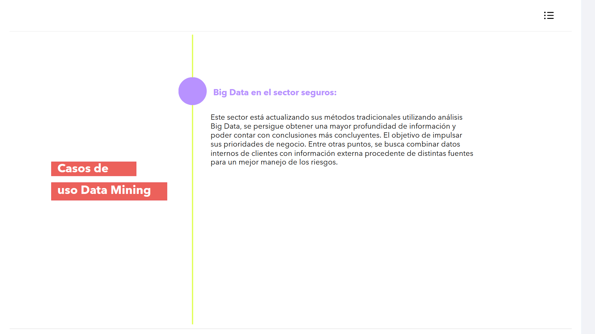
Este sector está actualizando sus métodos tradicionales utilizando análisis Big Data, se persigue obtener una mayor profundidad de información y poder contar con conclusiones más concluyentes.  

El objetivo de impulsar sus prioridades de negocio. Entre otros puntos, se busca combinar datos internos de clientes con información externa procedente de distintas fuentes para un mejor manejo de los riesgos.

---

#### Big Data en el sector Retail
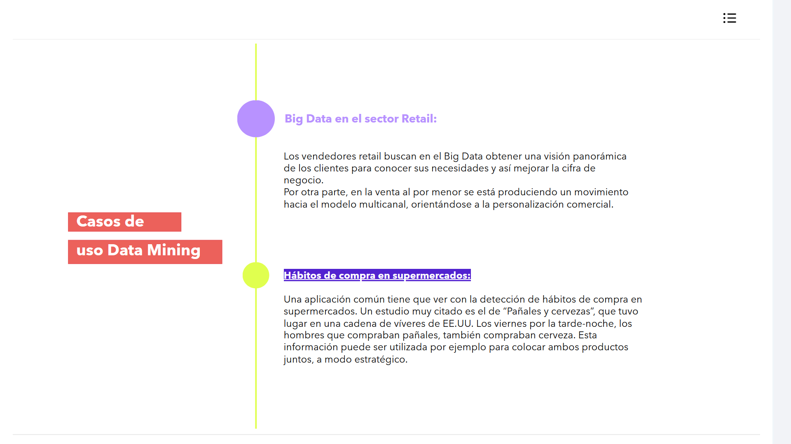

Los vendedores retail buscan en el Big Data obtener una visión panorámica de los clientes para conocer sus necesidades y así mejorar la cifra de negocio. Por otra parte, en la venta al por menor se está produciendo un movimiento hacia el modelo multicanal, orientándose a la personalización comercial.

	##### Hábitos de compra en supermercados
> Una aplicación común tiene que ver con la detección de hábitos de compra en supermercados. Un estudio muy citado es el de "Pañales y cervezas", que tuvo lugar en una cadena de víveres de EE.UU. :
> Los viernes por la tarde-noche, los hombres que compraban pañales, también compraban cerveza. Esta información puede ser utilizada por ejemplo para colocar ambos productos juntos, a modo estratégico.

---

#### Otros ejemplos
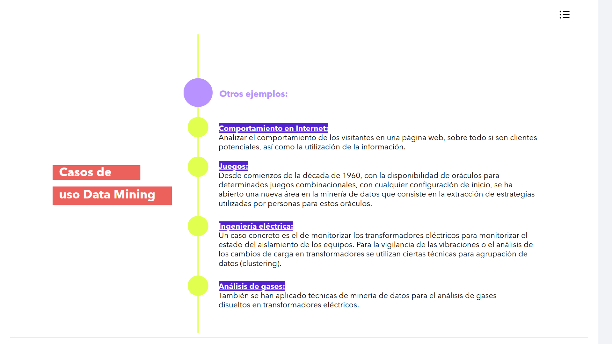

	##### Comportamiento en Internet
> Analizar el comportamiento de los visitantes en una página web, sobre todo si son clientes potenciales, así como la utilización de la información.

	##### Juegos
> Desde comienzos de la década de 1960, con la disponibilidad de oráculos para determinados juegos combinacionales, con cualquier configuración de inicio, se ha abierto una nueva área en la minería de datos que consiste en la extracción de estrategias utilizadas por personas para estos oráculos.

	##### Ingeniería eléctrica
> Un caso concreto es el de monitorizar los transformadores eléctricos para monitorizar el estado del aislamiento de los equipos. Para la vigilancia de las vibraciones o el análisis de los cambios de carga en transformadores se utilizan ciertas técnicas para agrupación de datos (clustering).

	##### Análisis de gases
> También se han aplicado técnicas de minería de datos para el análisis de gases disueltos en transformadores eléctricos.

---

## Errores de implementación
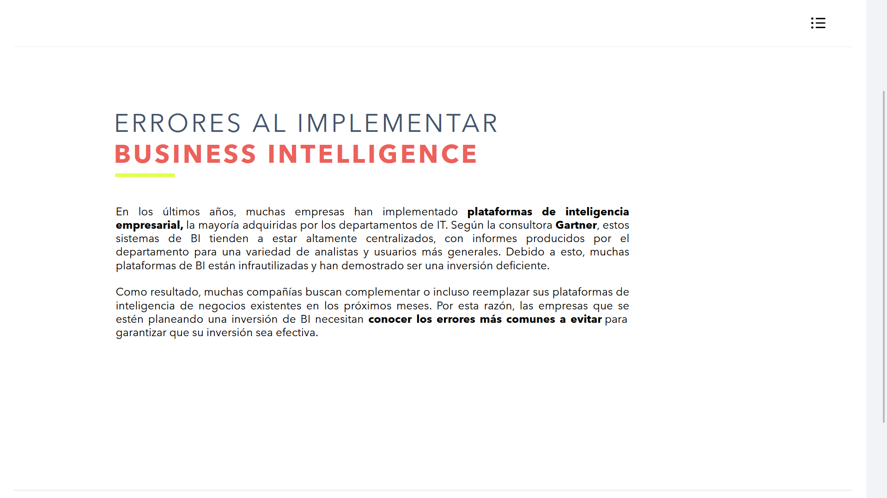

En los últimos años, muchas empresas han implementado **plataformas de inteligencia empresarial**, la mayoría adquiridas por los departamentos de IT.  

 Según la consultora **Gartner**, estos sistemas de BI tienden a estar altamente centralizados, con informes producidos por el departamento para una variedad de analistas y usuarios más generales. Debido a esto, muchas plataformas de BI están infrautilizadas y han demostrado ser una inversión deficiente.

Como resultado, muchas compañías buscan complementar o incluso reemplazar sus plataformas de inteligencia de negocios existentes en los próximos meses. Por esta razón, las empresas que se estén planeando una inversión de BI necesitan **conocer los errores más comunes a evitar** para garantizar que su inversión sea efectiva.

### Fallos del Proyecto Business Intelligence
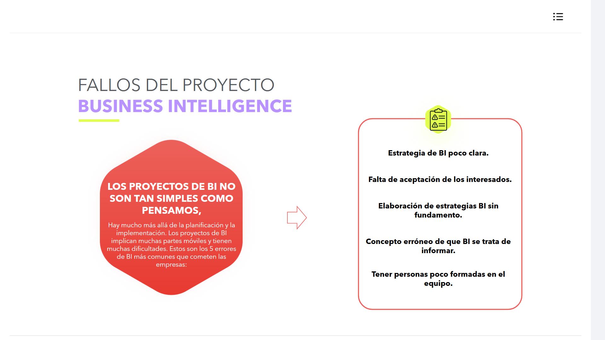

Los proyectos de BI no son tan simples como pensamos; hay mucho más allá de la planificación y la implementación. Implican muchas partes móviles y tienen muchas dificultades. Estos son los 5 errores de BI más comunes que cometen las empresas:

* **Estrategia de BI poco clara.**
* **Falta de aceptación de los interesados.**
* **Elaboración de estrategias BI sin fundamento.**
* **Concepto erróneo de que BI se trata de informar.**
* **Tener personas poco formadas en el equipo.**

#### 1. 	Estrategia de BI poco clara
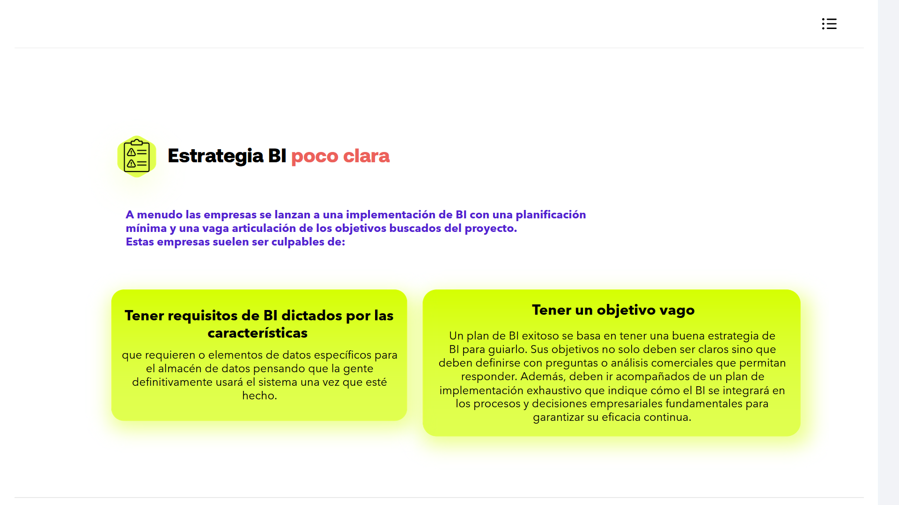

A menudo las empresas se lanzan a una implementación de BI con una planificación mínima y una vaga articulación de los objetivos buscados del proyecto. Estas empresas suelen ser culpables de:

* **Tener requisitos de BI dictados por las características:** que requieren o elementos de datos específicos para el almacén de datos pensando que la gente definitivamente usará el sistema una vez que esté hecho.

* **Tener un objetivo vago:** Un plan de BI exitoso se basa en tener una buena estrategia de BI para guiarlo. Sus objetivos no solo deben ser claros sino que deben definirse con preguntas o análisis comerciales que permitan responder. Además, deben ir acompañados de un plan de implementación exhaustivo que indique cómo el BI se integrará en los procesos y decisiones empresariales fundamentales para garantizar su eficacia continua.

> Antes de comenzar la ejecución, la empresa debe definir la estrategia y concretar los objetivos.

#### 2. 	Falta de aceptación
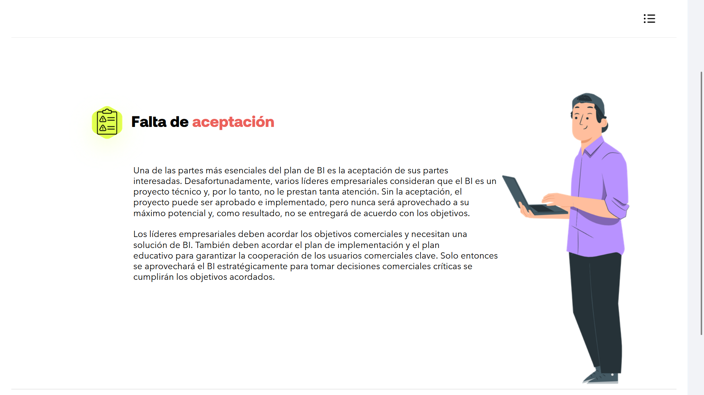

> Debe preverse la resistencia al cambio

Una de las partes más esenciales del plan de BI es la aceptación de sus partes interesadas. Desafortunadamente, varios líderes empresariales consideran que el BI es un proyecto técnico y, por lo tanto, no le prestan tanta atención. Sin la aceptación, el proyecto puede ser aprobado e implementado, pero nunca será aprovechado a su máximo potencial y, como resultado, no se entregará de acuerdo con los objetivos.

Los líderes empresariales deben acordar los objetivos comerciales y necesitan una solución de BI  También deben acordar el plan de implementación y el plan educativo para garantizar la cooperación de los usuarios comerciales clave. Solo entonces se aprovechará el BI estratégicamente para tomar decisiones comerciales críticas se cumplirán los objetivos acordados.

#### 3. Elaboración de estrategias BI sin fundamento
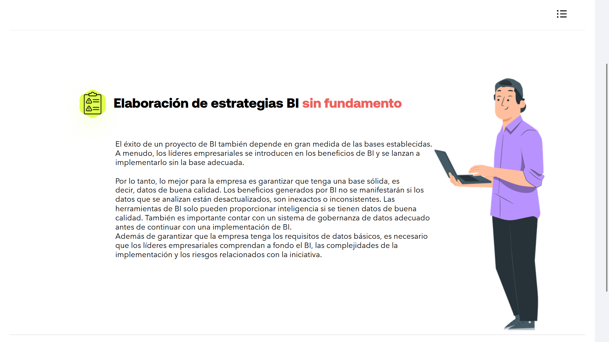

> La mera existencia de un proyecto BI en el negocio no significa que éste vaya a hacer magia y resolver todos los problemas si su definición es mediocre

El éxito de un proyecto de BI también depende en gran medida de las bases Cry establecida. A menudo, los líderes empresariales se introducen en los beneficios de BI y se lanzan a implementarlo sin la base adecuada.

Por lo tanto, lo mejor para la empresa es garantizar que tenga una base sólida, es decir, datos de buena calidad. Los beneficios generados por BI no se manifestarán si los datos que se analizan están desactualizados, son inexactos o inconsistentes. Las herramientas de BI solo pueden proporcionar inteligencia si se tienen datos de buena calidad. También es importante contar con un sistema de gobernanza de datos adecuado antes de continuar con una implementación de BI. Además de garantizar que la empresa tenga los requisitos de datos básicos, es necesario que los líderes empresariales comprendan a fondo el BI, las complejidades de la implementación y los riesgos relacionados con la iniciativa.

#### 4. 	Concepto erróneo de que BI se trata de informar
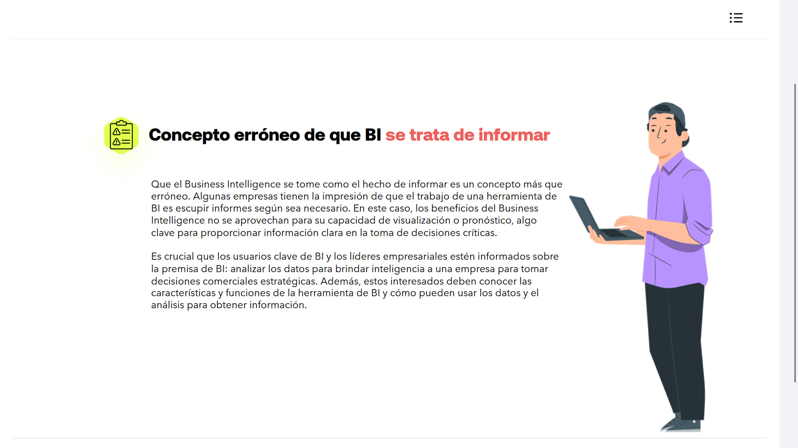

Que el Business Intelligence se tome como el hecho de informar es un concepto más que erróneo. Algunas empresas tienen la impresión de que el trabajo de una herramienta de BI es escupir informes según sea necesario. En este caso, los beneficios del Business Intelligence no se aprovechan para su capacidad de visualización o pronóstico, algo clave para proporcionar información clara en la toma de decisiones críticas.

Es crucial que los usuarios clave de BI y los líderes empresariales estén informados sobre la premisa de BI: analizar los datos para brindar inteligencia a una empresa para tomar decisiones comerciales estratégicas. Además, estos interesados deben conocer las características y funciones de la herramienta de BI y cómo pueden usar los datos y el análisis para obtener información.

#### 5. 	Tener personas poco formadas en el equipo
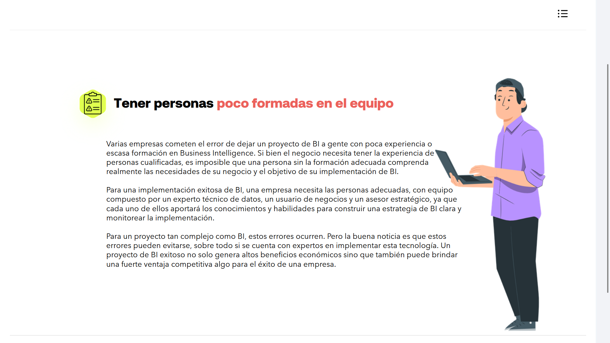

Varias empresas cometen el error de dejar un proyecto de BI a gente con poca experiencia o escasa formación en Business Intelligence. Si bien el negocio necesita tener la experiencia de personas cualificadas, es imposible que una persona sin la formación adecuada comprenda realmente las necesidades de su negocio y el objetivo de su implementación de BI.

Para una implementación exitosa de BI, una empresa necesita las personas adecuadas, con equipo compuesto por un experto técnico de datos, un usuario de negocios y un asesor estratégico, ya que cada uno de ellos aportará los conocimientos y habilidades para construir una estrategia de BI clara y monitorear la implementación.

Para un proyecto tan complejo como BI, estos errores ocurren. Pero la buena noticia es que estos errores pueden evitarse, sobre todo si se cuenta con expertos en implementar esta tecnología. Un proyecto de BI exitoso no solo genera altos beneficios económicos sino que también puede brindar una fuerte ventaja competitiva algo para el éxito de una empresa.
