# 02-001:	Big Data

---

## ¿Qué es Big Data? -->  Obtener insights
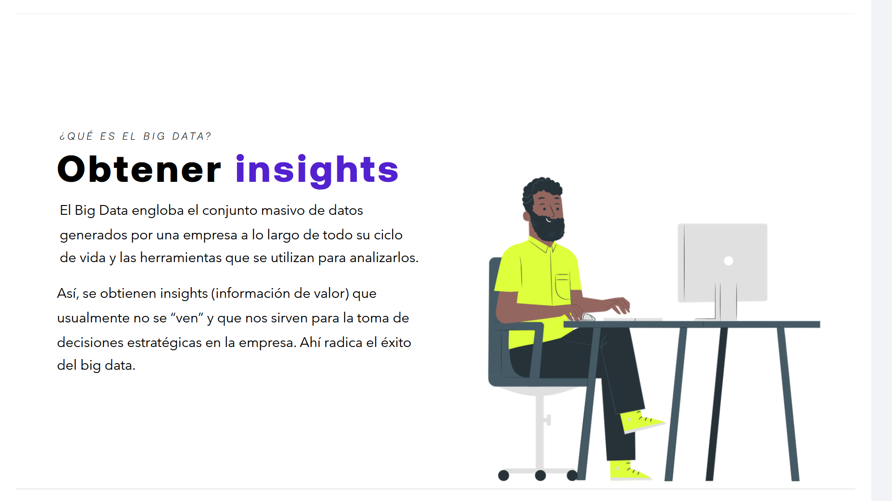

El Big Data engloba el conjunto masivo de datos generados por una empresa a lo largo de todo su ciclo de vida y las herramientas que se utilizan para analizarlos.

Así, se obtienen insights (información de valor) que usualmente no se "ven" y que nos sirven para la toma de decisiones estratégicas en la empresa. Ahí radica el éxito del big data.

---

## Pasos para construir Proyecto Big Data
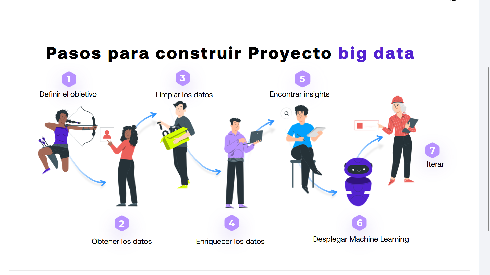

1. **Definir el objetivo**
2. **Obtener los datos**
3. **Limpiar los datos**
4. **Enriquecer los datos**
5. **Encontrar insights**
6. **Desplegar Machine Learning**
7. **Iterar**

### 1.	DEFINICIÓN DEL OBJETIVO
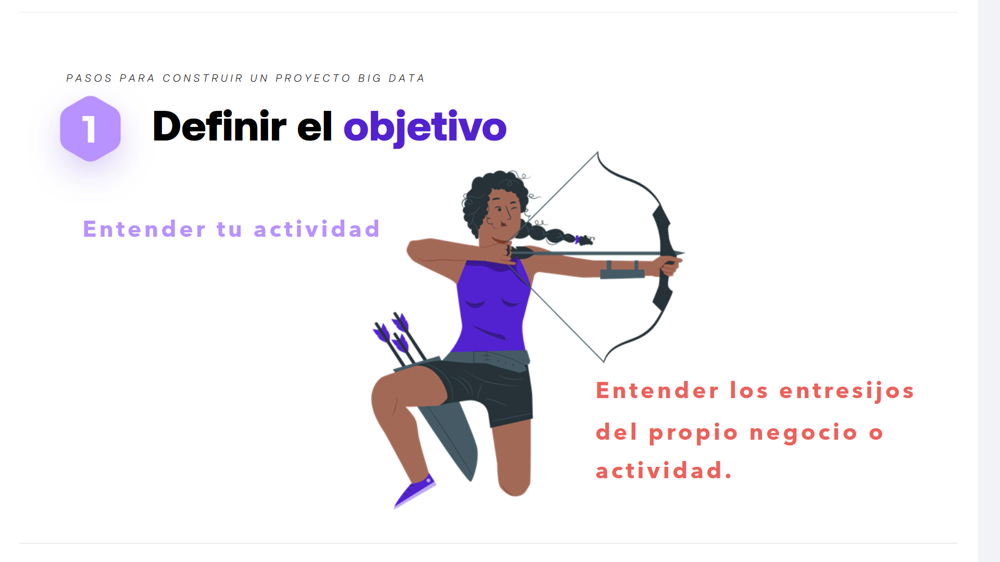

Para iniciar con éxito un proyecto de Big Data, es fundamental cumplir con las siguientes pautas de comprensión y medición:

#### Comprender el negocio
* **Entender tu actividad:** Tener una claridad absoluta sobre el funcionamiento de las operaciones actuales.

Es decir:  
>  **Entender los entresijos del propio negocio o actividad,** conociendo a fondo los detalles internos, desafíos y particularidades de la organización.

Para ello es fundamental **INFORMARSE BIEN DE TODA LA OPERATIVA**.

**_¿CÓMO?_**
> - Con los profesionales que están a su cargo.

Tras esto, toca sentarse y **PLANIFICAR**:
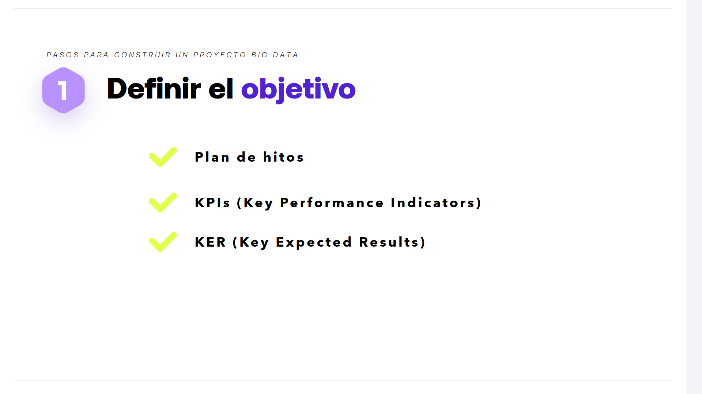

__Definición Estratégica y Métricas__:  
	- Para estructurar correctamente el alcance del objetivo, se deben establecer y medir de manera precisa los siguientes elementos:

		* **Plan de hitos:** Estructurar las fases y fechas clave del proyecto.
		* **KPIs (Key Performance Indicators):** Definir los indicadores clave de rendimiento para evaluar el éxito.
		* **KER (Key Expected Results):** Determinar con claridad los resultados clave que se esperan obtener.
		
		
---

### 2.	OBTENCIÓN DE LOS DATOS
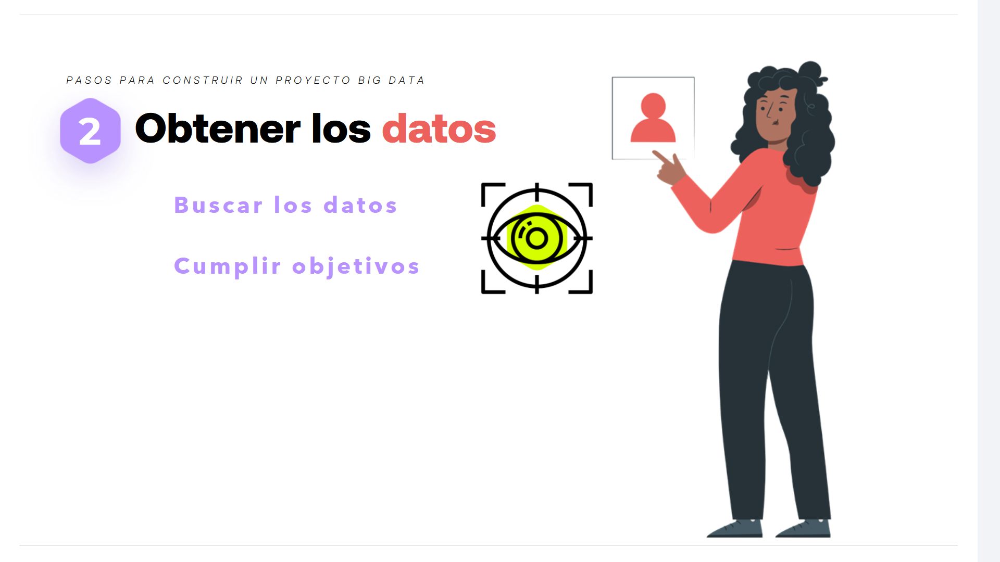

Para avanzar en el proyecto, la fase de recolección debe centrarse en la búsqueda estratégica orientada a resultados:

* **Buscar los datos**
* **Cumplir objetivos**

**¿Cómo?**:  
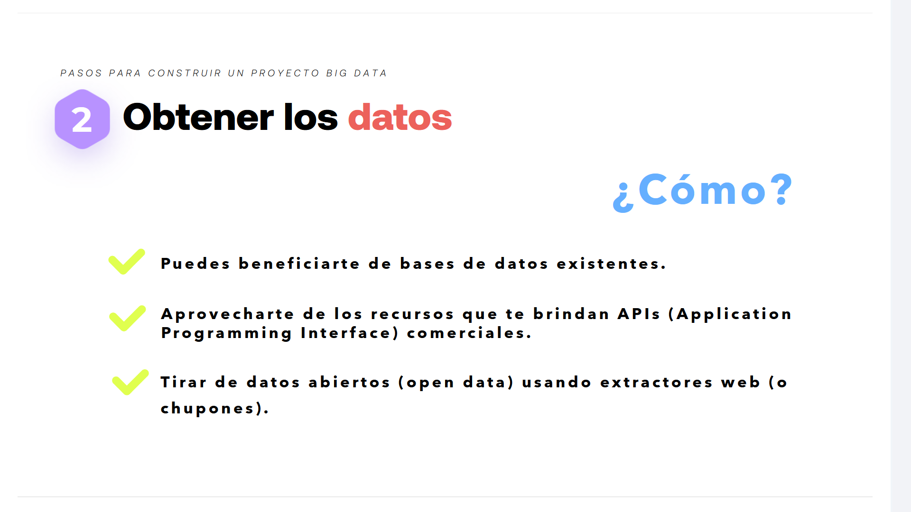

Existen diferentes vías y metodologías para realizar una captura de datos efectiva:

* **Puedes beneficiarte de bases de datos existentes.**
* **Aprovecharte de los recursos que te brindan APIs (Application Programming Interface) comerciales.**
* **Tirar de datos abiertos (open data) usando extractores web (o chupones).**

---

### 3. 	LIMPIEZA DE DATOS
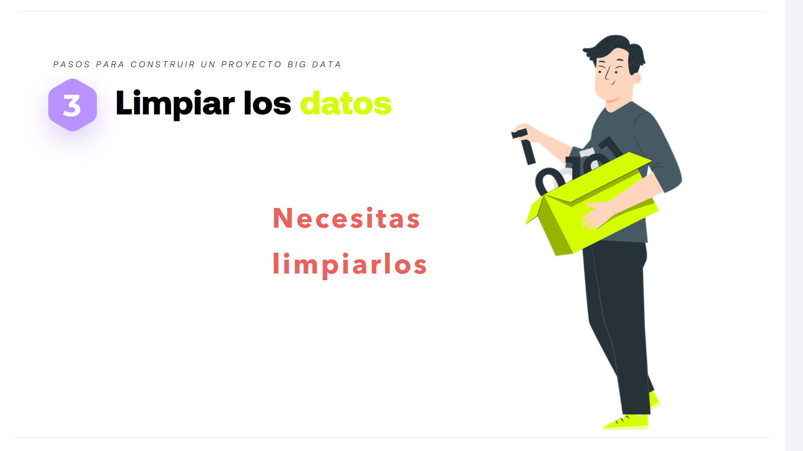

Una vez recolectada la información, los datos están "desordenados",  entramos en una de las fases más críticas del proceso:

* **Necesitas limpiarlos**

Para ello, urge **ajustar el formato**, por ejemplo:

-	Una misma columna con distintos decimales para una misma categoria de información
-	Distintos data types

#### Consideraciones
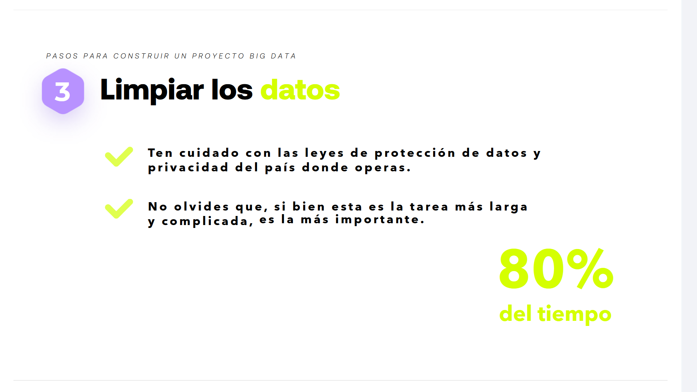

**Se debe tener MUY en cuenta los siguientes preceptos:**

* **Ten cuidado con las leyes de protección de datos y privacidad del país donde operas.**
* **No olvides que, si bien esta es la tarea más larga y complicada, es la más importante.**

Esta fase de limpieza suele representar el **80% del tiempo** total dedicado al proyecto.

---

### 4.	ENRIQUECIMIENTO DE LOS DATOS
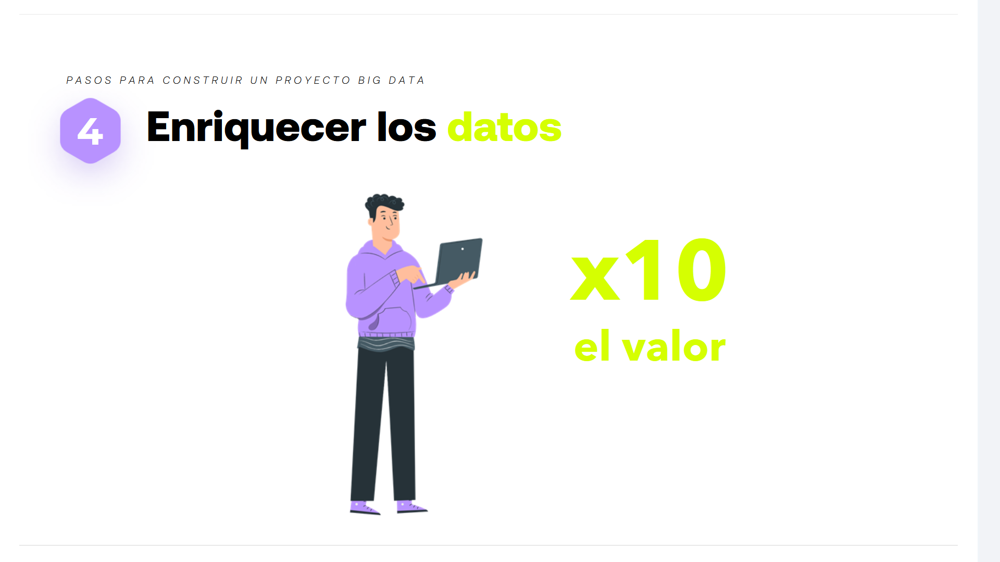

Esta fase permite potenciar drásticamente el impacto de la información recolectada:

* Buscando **x10 el valor**

#### ¿Cómo?
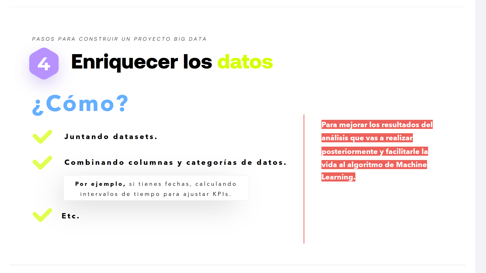

El enriquecimiento se logra mediante la ingeniería de características y la agregación de nuevas fuentes de información:

* **Juntando datasets.**
* **Combinando columnas y categorías de datos.**
  * *Por ejemplo, si tienes fechas, calculando intervalos de tiempo para ajustar KPIs.*
* **Etc.**

> Para mejorar los resultados del análisis que vas a realizar posteriormente y facilitarle la vida al algoritmo de Machine Learning.

---

### 5.	ENCONTRAR INSIGHTS
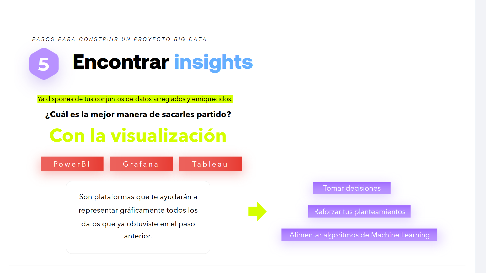

Ya dispones de tus conjuntos de datos arreglados y enriquecidos.

#### ¿Cuál es la mejor manera de sacarles partido?
**Con la visualización**.

Para ello se utilizan herramientas de Business Intelligence y observabilidad como:
* **PowerBI**
* **Grafana**
* **Tableau**

> Son plataformas que te ayudarán a representar gráficamente todos los datos que ya obtuviste en el paso anterior.

#### Resultados y siguientes pasos

La visualización efectiva de estos datos permite:

1. **Tomar decisiones**
2. **Reforzar tus planteamientos**
3. **Alimentar algoritmos de Machine Learning**

---

### 6. 	DESPLEGAR MACHINE LEARNING
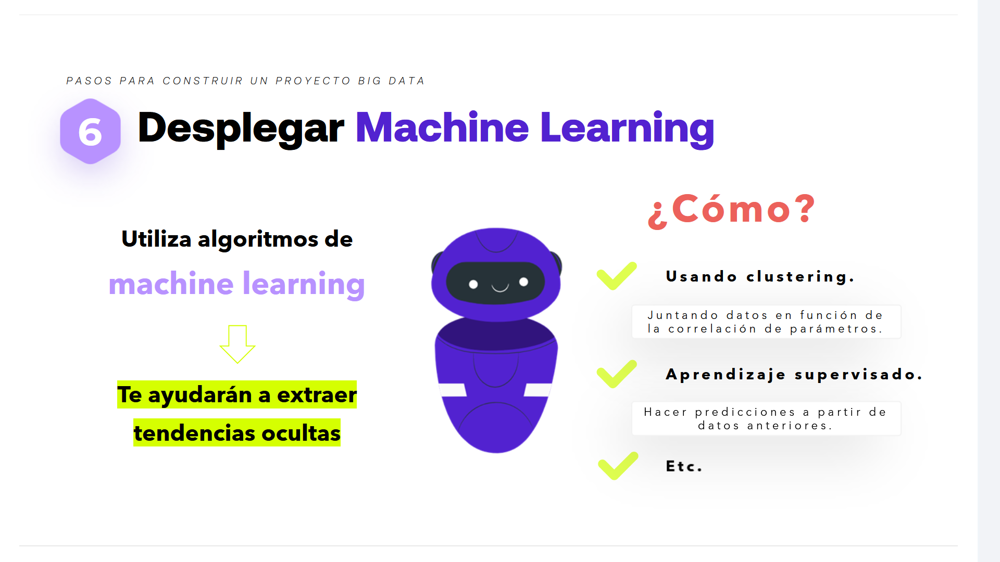

Utiliza algoritmos de machine learning: **Te ayudarán a extraer tendencias ocultas**.

> También tienes que desplegar en una arquitectura operativa para sacarle partido de forma recurrente.

## ¿Cómo?

El modelado y la explotación predictiva de la información se realizan mediante diferentes enfoques analíticos:

* **Usando clustering.**
  * *Juntando datos en función de la correlación de parámetros.*
* **Aprendizaje supervisado.**
  * *Hacer predicciones a partir de datos anteriores.*
* **Etc.**

---

### 7.	ITERAR
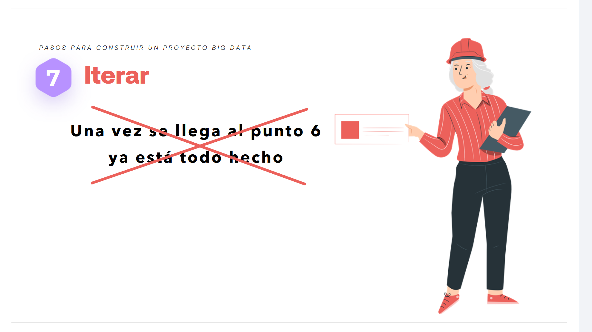

El principal problema radica en que... :  

* ~~Una vez se llega al punto 6 ya está todo hecho~~

## La clave del éxito continuo es ITERAR
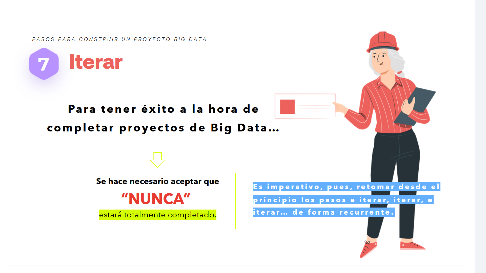

Para tener éxito a la hora de completar proyectos de Big Data...

> Se hace necesario aceptar que **"NUNCA"** estará totalmente completado.

Es imperativo, pues, retomar desde el principio los pasos e iterar, iterar, e iterar... de forma recurrente.

---

