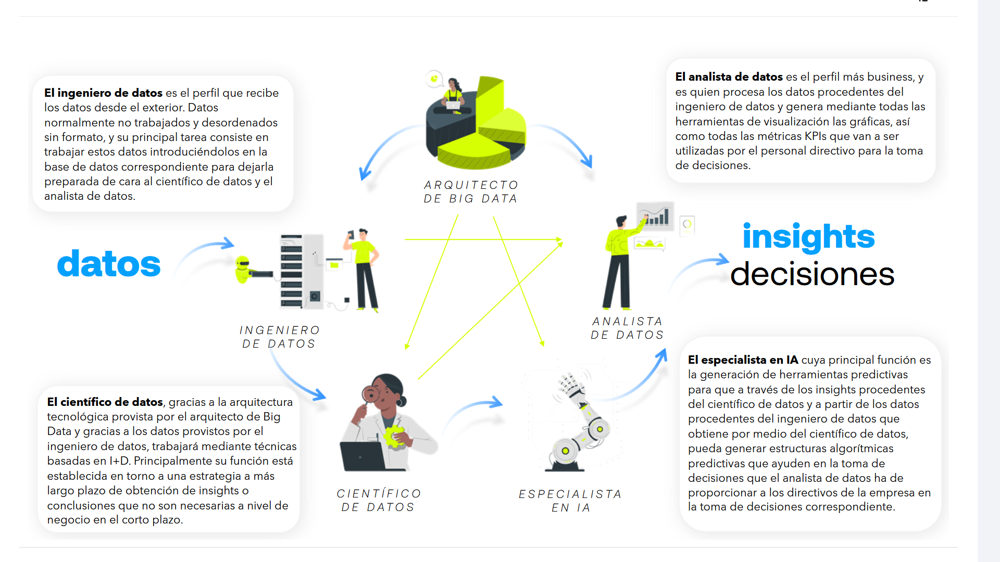
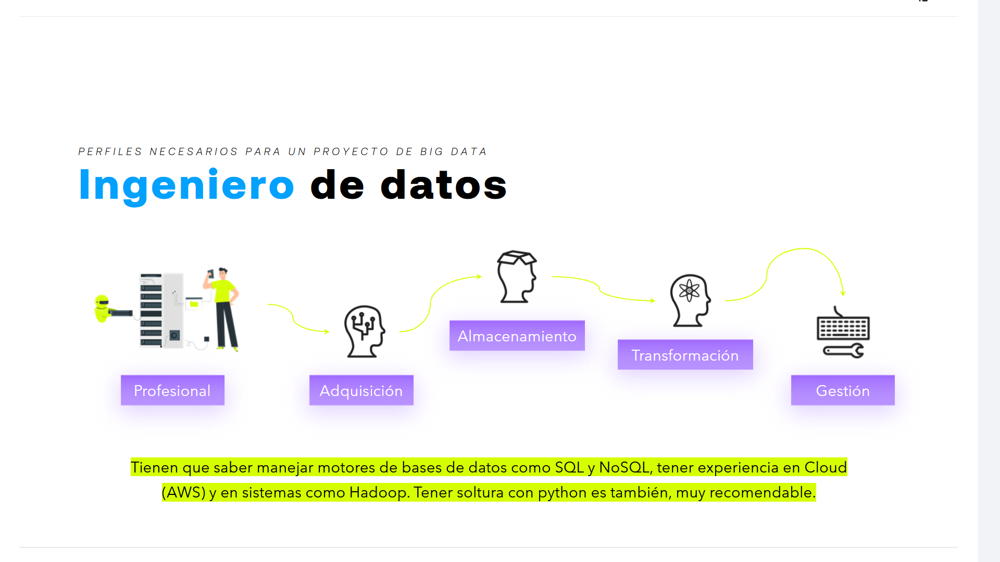
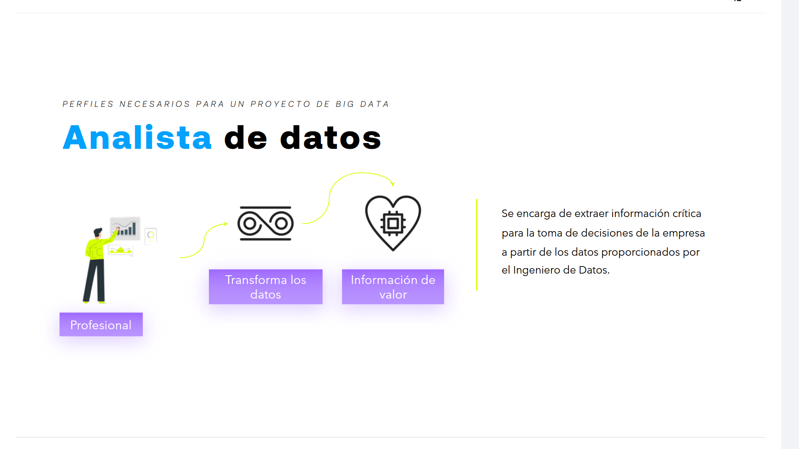
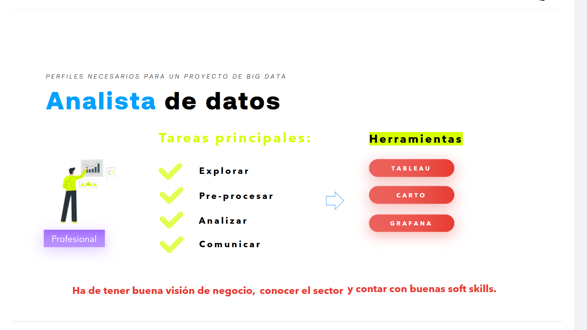
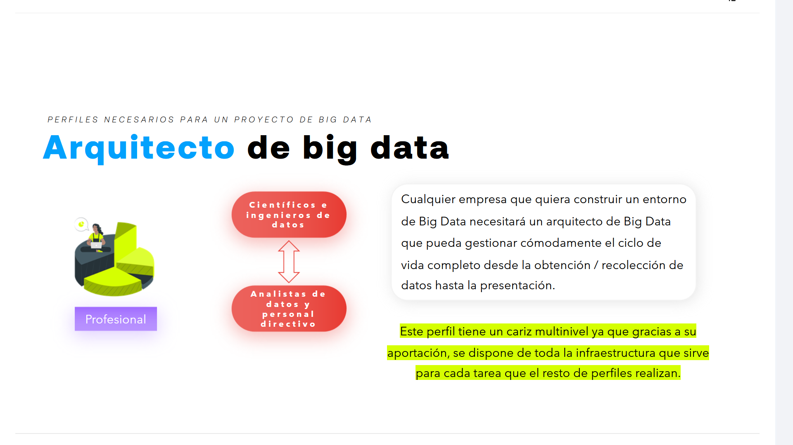
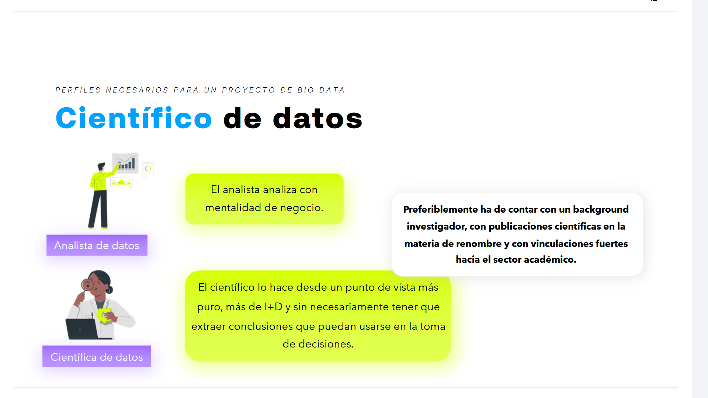

# 02-001:	Perfiles en un proyecto Big Data

1.	Ingeniero de Datos
2.	Científico de Datos
3. 	Arquitecto Big Data
4.	Especialista en IA
5.	Analista de Datos

### Ingeniero de Datos

El ingeniero de datos es el perfil que recibe los datos desde el exterior. Datos normalmente no trabajados y desordenados sin formato, y su principal tarea consiste en trabajar estos datos introduciéndolos en la base de datos correspondiente para dejarla preparada de cara al científico de datos y el analista de datos.

#### Flujo de responsabilidades
`Profesional` ➔ `Adquisición` ➔ `Almacenamiento` ➔ `Transformación` ➔ `Gestión`

#### Requisitos y habilidades clave

* **Motores de bases de datos:** Tienen que saber manejar motores de bases de datos como SQL y NoSQL.
* **Experiencia en Cloud:** Tener experiencia en Cloud (AWS).
* **Ecosistemas de Big Data:** Tener experiencia en sistemas como Hadoop.
* **Lenguajes de programación:** Tener soltura con Python es también muy recomendable.

---

### Analista de datos

El analista de datos es el perfil más business, y es quien procesa los datos procedentes del ingeniero de datos y genera mediante todas las herramientas de visualización las gráficas, así como todas las métricas KPIs que van a ser utilizadas por el personal directivo para la toma de decisiones.

#### Flujo de valor
`Profesional` ➔ `Transforma los datos` ➔ `Información de valor`

> Se encarga de extraer información crítica para la toma de decisiones de la empresa a partir de los datos proporcionados por el Ingeniero de Datos.

#### Tareas principales y Herramientas

El flujo de trabajo del analista se apoya en soluciones de visualización y análisis espacial:

* **Tareas principales:**
  * Explorar
  * Pre-procesar
  * Analizar
  * Comunicar

* **Herramientas clave:**
  * TABLEAU
  * CARTO
  * GRAFANA

#### Aptitudes requeridas

Para desempeñar correctamente su función, este perfil debe cumplir con las siguientes características:
* Ha de tener **buena visión de negocio**.
* Debe **conocer el sector**.
* Es necesario que cuente con **buenas soft skills** (habilidades blandas).

---

### Arquitecto de big data

Es el elemento de cohesion entre todos, desde la parte de Datos, donde ingenieros y científicos de datos realizan sus funciones, hacia la obtención de insights que permitan tomar decisiones elaboradas en base al proceso de dichos datos por parte de los analistas de datos y especialistas en IA.

#### Conector y puente organizacional
`Profesional` ➔ `[ Científicos e ingenieros de datos ]` ↕ `[ Analistas de datos y personal directivo ]`

#### Definición y responsabilidad del rol

Cualquier empresa que quiera construir un entorno de Big Data necesitará un arquitecto de Big Data que pueda gestionar cómodamente el ciclo de vida completo desde la obtención / recolección de datos hasta la presentación.

> Este perfil tiene un cariz multinivel ya que gracias a su aportación, se dispone de toda la infraestructura que sirve para cada tarea que el resto de perfiles realizan.

---

### Especialista en IA

El especialista en IA cuya principal función es la **generación de herramientas predictivas** para que, a través de los insights procedentes del científico de datos y a partir de los datos procedentes del ingeniero de datos que obtiene por medio del científico de datos, pueda **generar estructuras algorítmicas predictivas que ayuden en la toma de decisiones** que el analista de datos ha de proporcionar a los directivos de la empresa en la toma de decisiones correspondiente.

#### Importancia del perfil en el equipo

* **Contar con analistas de datos da una dimensión especial y necesaria al Proyecto de Big Data, en lo referente a la toma de decisiones.**

* **Contar con un especialista en Inteligencia Artificial, en sus vertientes de Machine Learning y, más en concreto, Deep Learning, refuerza el potencial de este tipo de proyectos.**

#### ¿Cómo?

* **Gracias al poder de la predicción, ya que es posible desarrollar algoritmos que sean usados con fines predictivos y refuercen la toma de decisiones.**

#### Situación actual del perfil

> Son perfiles muy escasos que cada vez exigen competencias más específicas, y que requieren un aprendizaje continuo en el tiempo.

---

### Científico de datos

El científico de datos, gracias a la arquitectura tecnológica provista por el arquitecto de Big Data y gracias a los datos provistos por el ingeniero de datos, trabajará mediante técnicas basadas en I+D. Principalmente su función está establecida en torno a una estrategia a más largo plazo de obtención de insights o conclusiones que no son necesarias a nivel de negocio en el corto plazo.

#### Comparativa de enfoque: Analista vs. Científico

* **Analista de datos:**
  * El analista analiza con mentalidad de negocio.

* **Científica de datos:**
  * El científico lo hace desde un punto de vista más puro, más de I+D y sin necesariamente tener que extraer conclusiones que puedan usarse en la toma de decisiones.
  

#### Perfil académico y experiencia

> Preferiblemente ha de contar con un background investigador, con publicaciones científicas en la materia de renombre y con vinculaciones fuertes hacia el sector académico.

---