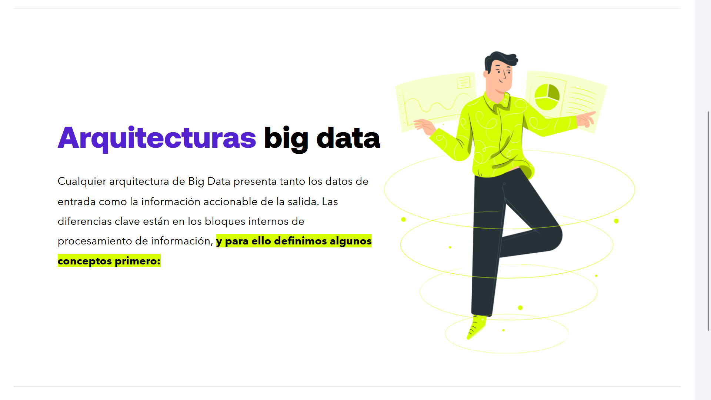
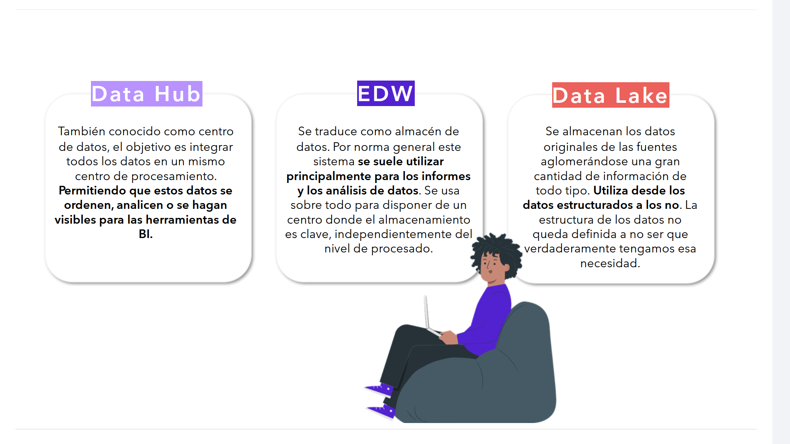

# 02-003:	Arquitecturas Big Data

> Para poner en marcha un proyecto Big Data es necesario contar con un protoclo claro que permita trabajo colaborativo entre todas las partes.

Cualquier arquitectura de Big Data presenta tanto los datos de entrada como la información accionable de la salida.  

Las diferencias clave están en los bloques internos de procesamiento de información, y para ello **definimos algunos conceptos primero**:

## **Data Hub**
También conocido como centro de datos, el objetivo es integrar todos los datos en un mismo centro de procesamiento,  **permitiendo que estos datos se ordenen, analicen o se hagan visibles para las herramientas de BI.**

## **EDW**
Se traduce como almacén de datos. Por norma general este sistema **se suele utilizar principalmente para los informes y los análisis de datos.**  

 Se usa sobre todo para disponer de un centro donde el almacenamiento es clave, independientemente del nivel de procesado.

## **Data Lake**
Se almacenan los datos originales de las fuentes aglomerándose una gran cantidad de información de todo tipo. **Utiliza desde los datos estructurados a los no.**  

La estructura de los datos no queda definida a no ser que verdaderamente tengamos esa necesidad.