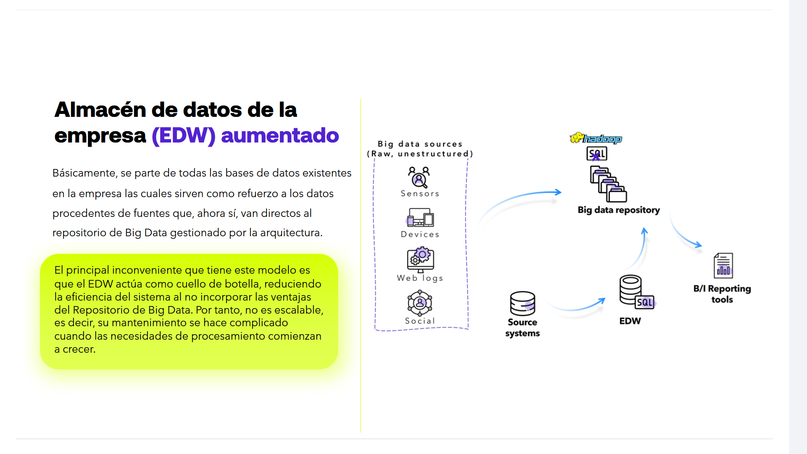
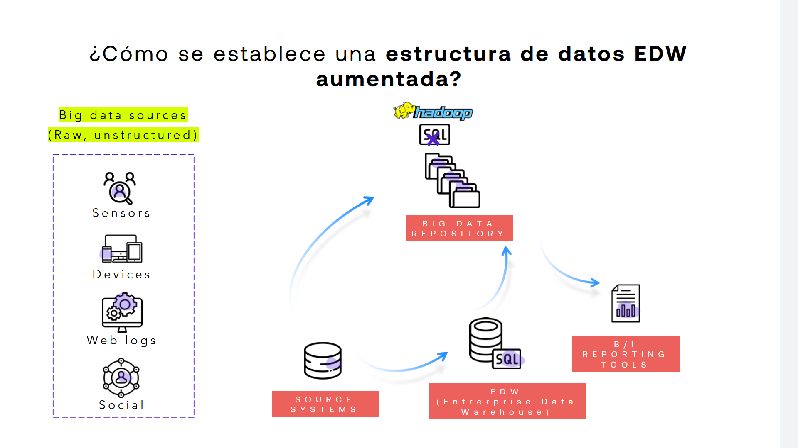
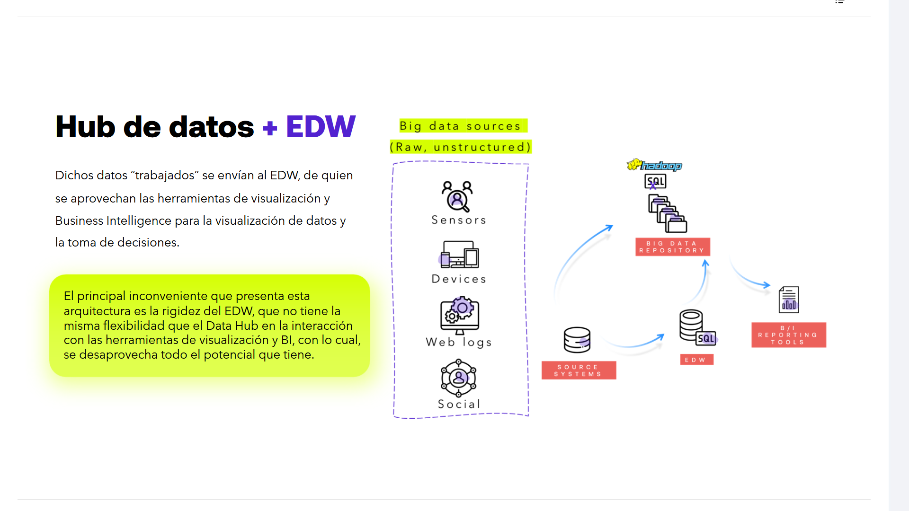
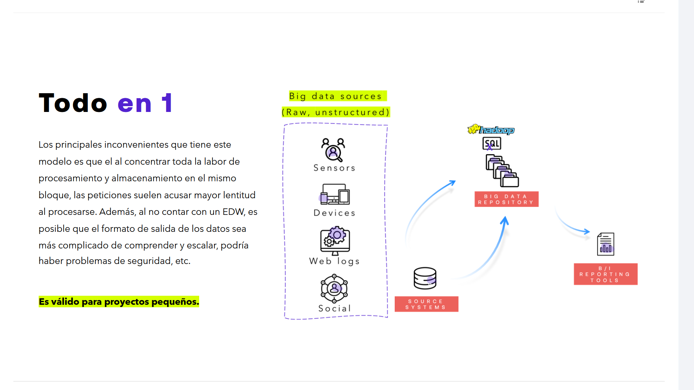
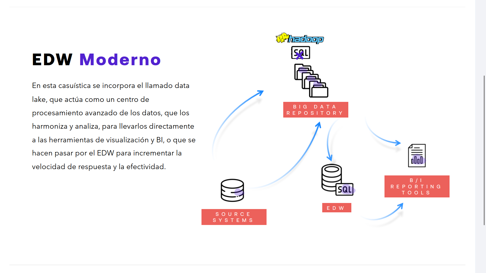

# 02-004:	EDW vs Data Hub vs Data Lake (Comparación de Modelos)

> Por la relación entre todos los modelos (DataHub, EDW, DataLake), en esta guía detallamos los tres, en relación con EDW.

---

## MODELO EDW

Básicamente, se parte de todas las bases de datos existentes en la empresa las cuales sirven como refuerzo a los datos procedentes de fuentes que, ahora sí, van directos al repositorio de Big Data gestionado por la arquitectura.

> El principal inconveniente que tiene este modelo es que el EDW actúa como cuello de botella, reduciendo la eficiencia del sistema al no incorporar las ventajas del Repositorio de Big Data. Por tanto, **no es escalable**, es decir, su mantenimiento se hace complicado cuando las necesidades de procesamiento comienzan a crecer.

### Establecer un EDW

> ¿Cómo se establece una estructura de datos EDW aumentada?

#### Fuentes de Big Data / Big data sources (Raw, unstructured)
* Sensors
* Devices
* Web logs
* Social

#### Flujo y Componentes de la Arquitectura

> Desde los SOURCE SYSTEMS, que son las BBDD que ya se encontraban previamenete establecidas,  los datos se envían hacia los EDW, que aglomeran esa información y la dejan preparada para que todo confluya en el BIG DATA REPOSITORY.  

> Este, junto a los datos estructurados y los no, permiten procesarse con juntamente para generar todos los informes que se envian a los B/I REPORTING TOOLS.  

1. **SOURCE SYSTEMS (Sistemas de origen)** ➔ Envían datos hacia el EDW y el repositorio de Big Data.
2. **EDW (Enterprise Data Warehouse)** ➔ Almacén de datos relacional (SQL) que alimenta al repositorio de Big Data.
3. **BIG DATA REPOSITORY** ➔ Repositorio que integra las fuentes directas y el EDW (asociado con tecnologías como Hadoop y BBDDs NoSQL).
4. **B / I REPORTING TOOLS** ➔ Herramientas de informes de Business Intelligence que consumen la información de salida del repositorio.

---

## MODELO "Data Hub + EDW"

Dichos datos “trabajados” se envían al EDW, de quien se aprovechan las herramientas de visualización y Business Intelligence para la visualización de datos y la toma de decisiones.

> El principal inconveniente que presenta esta arquitectura es la rigidez del EDW, que no tiene la misma flexibilidad que el Data Hub en la interacción con las herramientas de visualización y BI, con lo cual, se desaprovecha todo el potencial que tiene.

---

## MODELO "TODO en 1"

Los principales inconvenientes que tiene este modelo es que el al concentrar toda la labor de procesamiento y almacenamiento en el mismo bloque, las peticiones suelen acusar mayor lentitud al procesarse.  

Además, al no contar con un EDW, **es posible que el formato de salida de los datos sea más complicado de comprender y escalar**, podría haber problemas de seguridad, etc.

**Es válido para proyectos pequeños.**

---

## MODELO Data Lake, EDW Moderno

En realidad, el Data Lake, actua como centro de procesamiento avanzado de los datos, que los armoniza y analiza para llevarlos directamente a las herramientas visualziacion B/I, o que se hacen pasar por el EDW, para incrementar la velocidad de respuesta y efectividad.

A diferencia del Data hub, Data Lake es como un lago de agua cristalina donde se almacenan los datos, tanto los estructurados como los no, y que permite evitar  la necesidad de arreglar los dtos de Data hub, cuando en realidad no es imperativo hacerlo, otorgando mayor flexibilidad.

En esta casuística se incorpora el llamado data lake, que actúa como un centro de procesamiento avanzado de los datos, que los harmoniza y analiza, para llevarlos directamente a las herramientas de visualización y BI, o que se hacen pasar por el EDW para incrementar la velocidad de respuesta y la efectividad.

