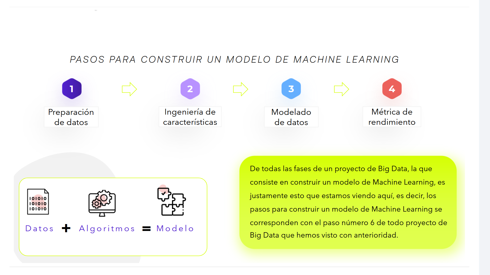
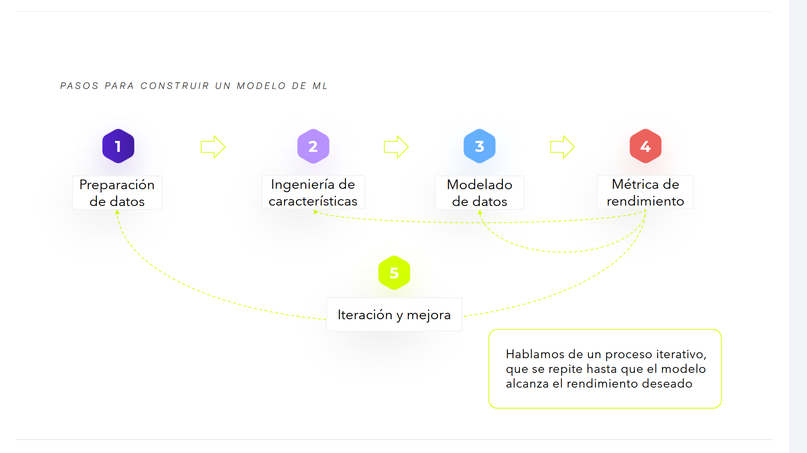

# 02-005:	Machine Learning

> Una vez ya sabemos cuales son los distintos pasos por los que tiene que pasar un proyecto de big data, las personas involucradas así como las arquitecturas disponibles para que esa personas puedan operar fase a fase por un proyecto de Big Data, pasamos a detallar cómo consatruir un proyecto de machine Learning.

## Contexto dentro del proyecto de Big Data

De todas las fases de un proyecto de Big Data, la que consiste en construir un modelo de Machine Learning, es justamente esto que estamos viendo aquí, es decir, los pasos para construir un modelo de Machine Learning se corresponden con **el paso número 6** de todo proyecto de Big Data que hemos visto con anterioridad.

---

## PASOS PARA CONSTRUIR UN MODELO DE MACHINE LEARNING

### Componentes esenciales
`Datos` + `Algoritmos` = `Modelo`

### Flujo de construcción

1. **Preparación de datos**  
2. **Feature Engineering (Extracción de Características**  
3. **Modelado de datos** 
4. **Métrica de rendimiento**
5. **Iteración y Mejora**

---

## FASE 1:	PREPARACIÓN DE DATOS

En la preparación de datos nuestro objetivo es recurrir a las fuentes donde vamos a encontrar los datos que usaremos para entrenar nuestro modelo, que pueden ser:

* AUDIO
* VOZ
* TEXTO
* IMÁGENES

### Formato y estado de las fuentes

> Dichas fuentes nos proporcionarán los datos que necesitamos, pero en formatos o en estados que no nos sirven de primeras. Por ejemplo, podríamos recibir datos de una fuente en un formato de hoja Excel.

> Sin embargo, si para nuestros modelos los datos han de estar en formato CSV, entonces tendremos que hacer la conversión necesaria. Es así que, entonces, podremos lidiar con la segunda fase.

---

## FASE 2:	FEATURE ENGINEERING (Extracción/Ingeniería de características)

>Se define comoel proceso de extracción de características, propiedades y atributos, recurriendo al know-how que tenemos sobre el dominio en cuestión.

Por ejemplo, imaginemos que queremos predecir la estación meteorológica en una zona geográfica a partir de los datos ofrecidos por sensores de calidad del aire. Dichos datos se corresponden con la temperatura, la humedad, la concentración de contaminantes en suspensión y la concentración de CO2.

A priori, y según nuestra intuición, entendemos que la temperatura constituye una magnitud que está estrechamente relacionada con la estación meteorológica. Al seleccionar la temperatura como característica principal de nuestro modelo de predicción, ya podríamos pasar al paso 3."

---

## FASE 3:	MODELADO DE DATOS

Este paso consiste en **diseñar o seleccionar un modelo de machine learning** a cuya entrada tenga disponibles los datos y a cuya salida genere la respuesta correcta. Para ello, primero hemos de entrenar el modelo, inyectando todo nuestro dataset de entrenamiento junto con las respuestas dadas a cada muestra.

El modelo ha de aprender a inferir la respuesta en función del dataset de ejemplo y dar, a la salida, el valor correcto. En función de la tasa de acierto que tiene el modelo, se genera una métrica de rendimiento que es la que usamos en el siguiente paso.

---

## FASE 4:	 PERFORMANCE MEASUREMENT - MÉTRICA DE RENDIMIENTO

Penúltimo paso, consiste en**valorar cuantitativamete cómo rinde nuestro modelo**, de manera que podamos optimizar su rendimiento de forma iterativa y aplicar mejoras, por ejemplo:

- 	`Fase 1, preparación de datos` -> Incrementando la cantidad de fuentes de datos.
- 	`Fase 2, extracción de características` -> Usando otras variables que, a priori, no parecían guardar relación con la respuesta de modelo.
-	`Fase 3, modelado de datos` -> Cambiando la arquitectura del modelo, buscando incrementar la profundidad de la red neuronal o escogiendo otro algoritmo.

> Este proceso termina cuando se alcanza el rendimiento expresado deseado en la corresponiente métrica

Las métricas de rendimiento permiten identificar cómo se ajusta la respuesta del modelo a las expectativas depositadas. Estas métricas tienen una naturaleza profundamente cuantitativa y es por ello que, en función de los resultados obtenidos, finalmente el modelo será aceptable, o requerirá una o varias iteraciones adicionales.

Por poner un ejemplo, una métrica de rendimiento usual es la de la precisión, es decir, el número de aciertos frente al número total de intentos.

---

## FASE 5:	ITERACIÓN y MEJORA

Implica la ejecución de la fase anterior, mejorando el rendimiento, supeditado a cambios que tienen lugar en cada una de las fases previas, y siempre partiendo de la base de que queremos mejorar la métrica seleccionada.

Podríamos plantear que no tenemos datos suficientes o que no están bien preparados y por este motivo trabajar de nuevo en la fase 1. En cambio, podríamos plantear sacar características de los datos no previstas antes y que podrían tener un mayor impacto. O, en cambio, utilizar en el paso 3 algoritmos de Machine Learning distintos para mejorar el rendimiento.

---

