# 03-001:	NoSQL intro

## NoSQL "no solo SQL"

Se diferencia de las bases de datos relacionales en que presenta las siguientes arquitecturas:  

- No poseen esquemas de datos predefinidos.
- No permiten JOIN u otras operaciones típicas de sistemas relacionales.
- No siguen ACID (atomicity, consistency, isolation, durability).

---

## ⏳ Timeline de NoSQL

Carlo Strozzi acuñó el término en 1998; fue Eric Evans quien lo recuperó y estandarizó en 2009.  

Evans propone referirse a esta familia de Bases de datos de nueva generación como "Big Data".  

---

La principal diferencia estriba en cómo se almacenan los datos (por ejemplo, el almacenamiento de una factura):

1. En SQL el almacenamiento en base de datos responde al típico sistema de estructuración orientada a objetos (vida real), con sus relaciones ontológicas

2. En NoSQL se guarda la información sin formato, ya que NoSQL es libre de schemas, es decir, no hay que definir la estructura de las tablas a priori.

---

## TEOREMA CAP
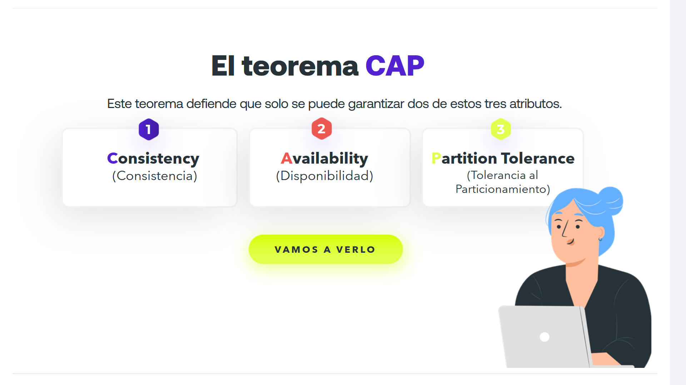

> En Ciencias de la Computación se erige un teorema que dice que, en un sistema de datos, no se puede garantizar consistencia y disponibilidad de estos al mismos tiempo que sufren dispersión, deslocalización, partición.

Este teorema defiende que **solo se puede garantizar dos de estos tres atributos**.

| 1 | 2 | 3 |
|---|---|---|
| **Consistency (Consistencia)** | **Availability (Disponibilidad)** | **Partition Tolerance (Tolerancia al Particionamiento)** |

---

### CP - Consistent y Partition Tolerance

Esto quiere decir que **no se garantiza la disponibilidad**.  

> Hay clientes que por ejemplo requieren que el sistema esté disponible 100% del tiempo o muy cerca, pero con bases de datos que cumplan con CP no es posible garantizar esto, ya que **el sistema está enfocado en aplicar los cambios de forma consistente aunque se pierda comunicación con algunos nodos**.

---

### AP - Abailability y Partition Tolerance

En este caso, **no se garantiza que los datos sean iguales en todos los nodos todo el tiempo**.  

> El sistema **siempre estará disponible para las peticiones aunque se pierda la comunicación** entre los nodos.

---

### CA - Consistent y Abailability

En este caso, **no se puede permitir el particionado de los datos**:  

> Se garantiza que los **datos siempre son iguales**,  se cojan de donde se cojan, y el **sistema estará disponible** respondiendo todas las peticiones.

---

## CAP esquematizado
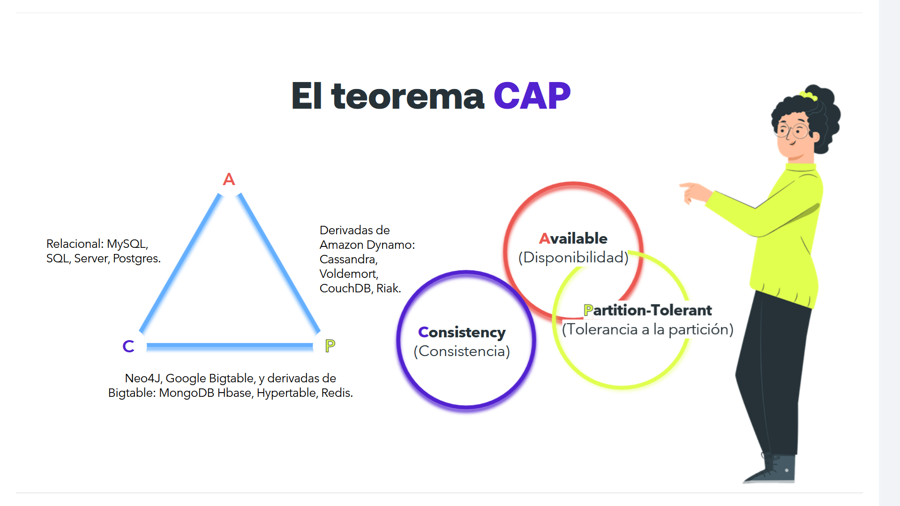

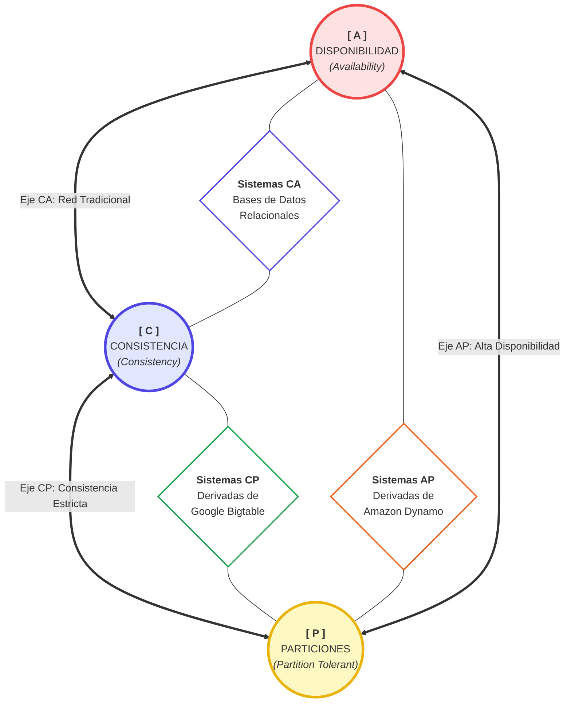

- **Available (Disponibilidad)**
- **Consistency (Consistencia)**
- **Partition-Tolerant (Tolerancia a la partición)**

---

## ACID VS. BASE
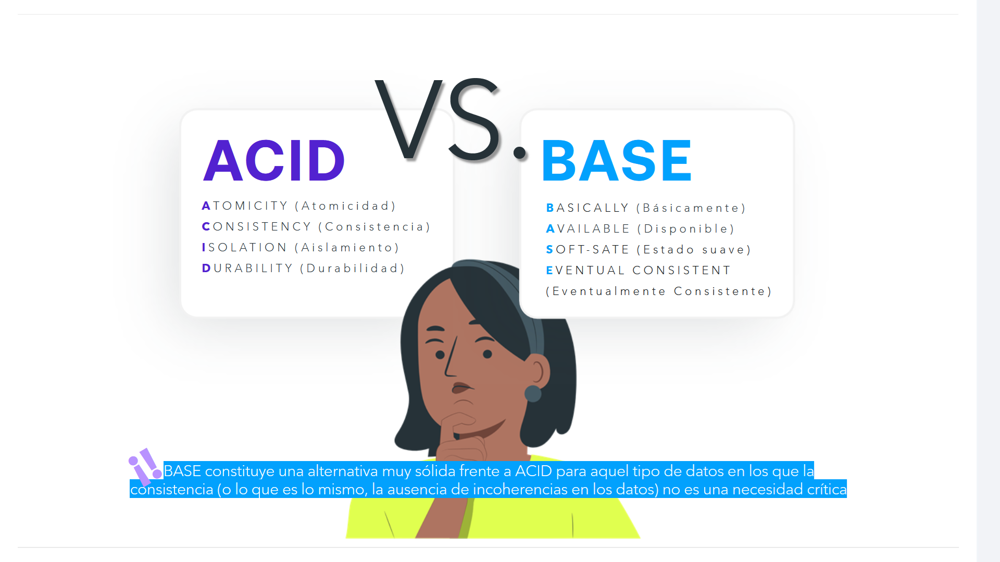

## 🟥 ACID

- **ATOMICITY (Atomicidad)**
- **CONSISTENCY (Consistencia)**
- **ISOLATION (Aislamiento)**
- **DURABILITY (Durabilidad)**

## 🟦 BASE

- **BASICALLY (Básicamente)**
- **AVAILABLE (Disponible)**
- **SOFT-STATE (Estado suave)**
- **EVENTUAL CONSISTENT (Eventualmente Consistente)**

> 📌 BASE constituye una alternativa muy sólida frente a ACID para aquel tipo de datos en los que la consistencia (o lo que es lo mismo, la ausencia de incoherencias en los datos) no es una necesidad crítica.

---

## ACID

> PUNTO FUERTE:		**Recuperación por partición durante transacciones**

* **Atomicidad.** Atomicidad significa que se garantiza que, o bien toda la transacción tiene éxito, o bien ninguna. Con la atomicidad, es "todo o nada".  

* **Consistencia.** Esto garantiza que todos los datos serán consistentes. Todos los datos serán válidos según todas las reglas definidas, incluidas las restricciones, cascadas y disparadores que se hayan aplicado en la base de datos.  

* **Aislamiento.** Garantiza que todas las transacciones se produzcan de forma aislada. Ninguna transacción se verá afectada por ninguna otra. Por lo tanto, una transacción no puede leer datos de otra transacción que aún no haya finalizado.  

*  **Durabilidad.** La durabilidad significa que, una vez confirmada una transacción, ésta permanecerá en el sistema, incluso si se produce una caída del sistema inmediatamente después de la transacción.  

---

## BASE
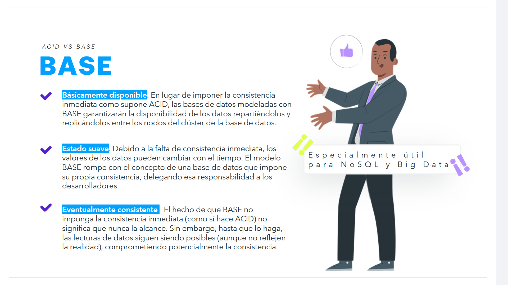

> 💡 **Especialmente útil para NoSQL y Big Data**

* ✔️ **Básicamente disponible.** En lugar de imponer la consistencia inmediata como supone **ACID**, las bases de datos modeladas con **BASE** garantizarán la **disponibilidad** de los datos repartiéndolos y replicándolos entre los nodos del clúster de la base de datos.  

* ✔️ **Estado suave.** Debido a la falta de consistencia inmediata, los valores de los datos pueden cambiar con el tiempo. El modelo **BASE** rompe con el concepto de una base de datos que impone su propia consistencia, delegando esa responsabilidad a los desarrolladores.  

* ✔️ **Eventualmente consistente.** El hecho de que **BASE** no imponga la consistencia inmediata (como sí hace **ACID**) no significa que nunca la alcance. Sin embargo, hasta que lo haga, las lecturas de datos siguen siendo posibles (aunque no reflejen la realidad), comprometiendo potencialmente la consistencia.  

---

## BBDD relacionales VS. NoSQL

## BBDD relacionales

Las bases de datos de tipo relacional nos dan la posibilidad de definir la estructura de un esquema que demanda reglas específicas de formato y consistencia, garantizando **ACID**.

## NoSQL

Los sistemas TI modernos poseen retos muy distintos a los sistemas empresariales convencionales como la banca: **inmensa cantidad de datos sin estructura**, **necesidades de escritura y estructura a alta velocidad** y **cambios continuos de estructura de bases de datos**.

> ⚡ **Consecuencias:** 	Emergencia de soluciones basadas en **NoSQL**: **Cassandra**, **MongoDB**, **CouchDB**, **Dynamo** o **Neo4j**.

---

### BBDD relacionales:	¿Por qué NoSQL?
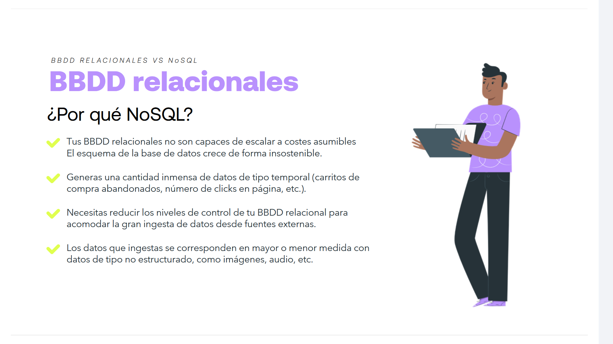

- **BBDD relacionales** no son capaces de escalar a costes asumibles. El esquema de la base de datos crece de forma insostenible.

- Generas una cantidad inmensa de datos de tipo temporal (**carritos de compra abandonados, número de clicks en página, etc.**).

- Necesitas reducir los niveles de control de tu **BBDD relacional** para acomodar la gran ingesta de datos desde fuentes externas.

- Los datos que ingestas se corresponden en mayor o menor medida con datos de tipo no estructurado, como **imágenes, audio, etc.**

---

### Arquitecturas NoSQL:	¿Por qué NoSQL?

- Suelen garantizar **consistencia débil**, o transacciones limitadas a elementos de datos no complejos.

- Recurren a **arquitecturas distribuidas**, donde los datos se guardan de modo redundante en distintos servidores, para su mayor disponibilidad.

- Suelen implementar **estructuras de datos simples** como almacenes de pares **clave-valor**.

- Permiten **mayor flexibilidad** que las bases de datos SQL.

---

## Ranking de bases de datos
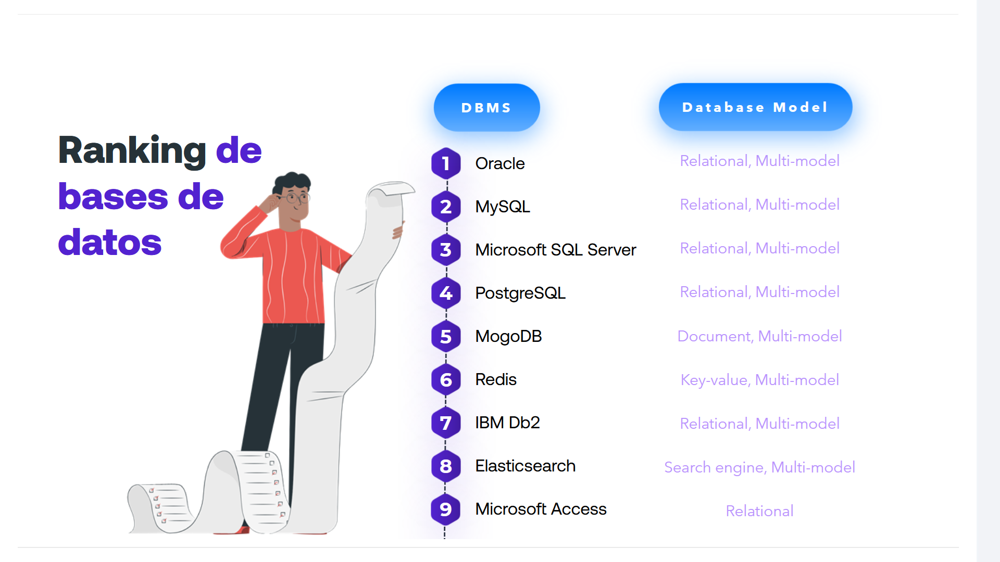

| Ranking | DBMS | Database Model |
|:--:|-------------------------|--------------------------------|
| **1** | **Oracle** | Relational, Multi-model |
| **2** | **MySQL** | Relational, Multi-model |
| **3** | **Microsoft SQL Server** | Relational, Multi-model |
| **4** | **PostgreSQL** | Relational, Multi-model |
| **5** | **MogoDB** | Document, Multi-model |
| **6** | **Redis** | Key-value, Multi-model |
| **7** | **IBM Db2** | Relational, Multi-model |
| **8** | **Elasticsearch** | Search engine, Multi-model |
| **9** | **Microsoft Access** | Relational |

---

## Tipos de soluciones "NoSQL"

Los principales tipos de BBDD de acuerdo con su taxonomía son los siguientes:

## 🟣 Almacenes de KEY-VALUE
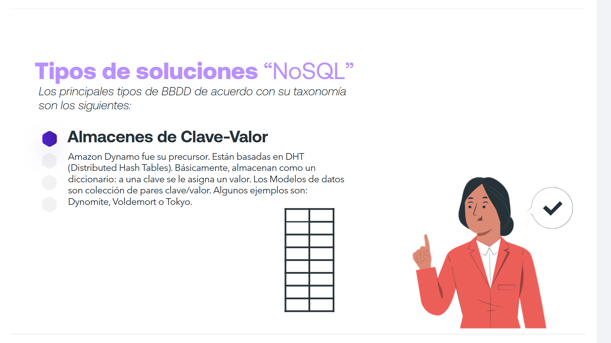

- **Amazon Dynamo** fue su precursor.

- Están basadas en **DHT (Distributed Hash Tables)**.

- Básicamente, almacenan como un diccionario: **a una clave se le asigna un valor**.

- **Los Modelos de datos son colección de pares clave/valor.**

- Algunos ejemplos son:

	- Dynomite
	- Voldemort
	- Tokyo

---

### 🔴 Almacenes de CF's - COLUMN FAMILY
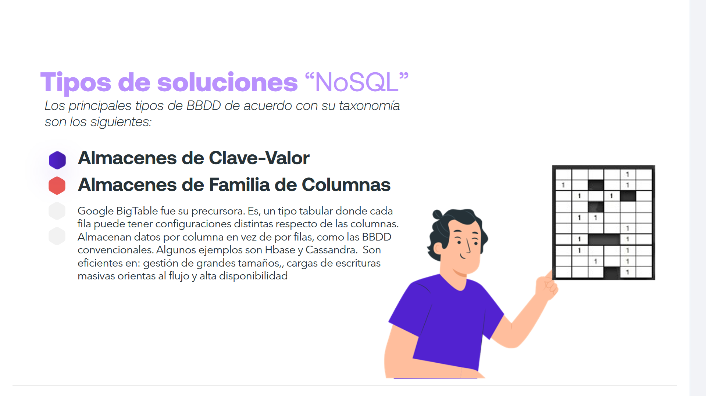

- **Google BigTable** fue su precursora.

- Un tipo tabular donde cada fila puede tener configuraciones distintas respecto de las columnas.

- Almacenan datos por **columna** en vez de por **filas**, como las BBDD convencionales.

- Algunos ejemplos son:
	- Hbase
	- Cassandra

- Son eficientes en:

	- Gestión de grandes tamaños
	- Cargas de escrituras masivas orientas al flujo
	- Alta disponibilidad

---

### 🟣 Almacenes de DOCUMENTS
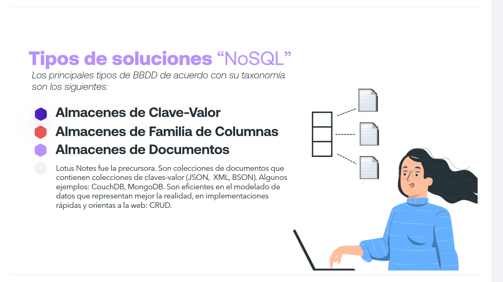

- **Lotus Notes** fue la precursora.

- Son colecciones de documentos que contienen colecciones de claves-valor (**JSON, XML, BSON**).

- Algunos ejemplos:
	- CouchDB
	- MongoDB

- Son eficientes en:
	- El modelado de datos que representan mejor la realidad
	- Implementaciones rápidas
	- Orientas a la web: **CRUD**

---

### 🔵 GRAPHs, Grafos
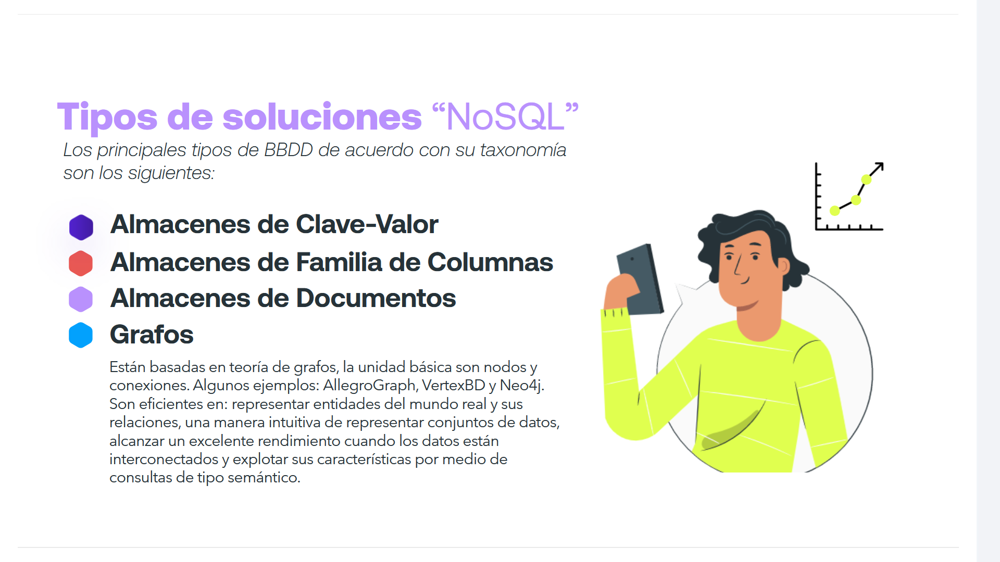

- Están basadas en teoría de grafos, la unidad básica son **nodos** y **conexiones**.

- Algunos ejemplos:
	- AllegroGraph
	- VertexBD
	- Neo4j

- Son eficientes en:
	- Representar entidades del mundo real y sus relaciones
	- Una manera intuitiva de representar conjuntos de datos
	- Alcanzar un excelente rendimiento cuando los datos están interconectados
	- Explotar sus características por medio de consultas de tipo semántico
