# 03-002	HBase

## ¿Qué es HBase?
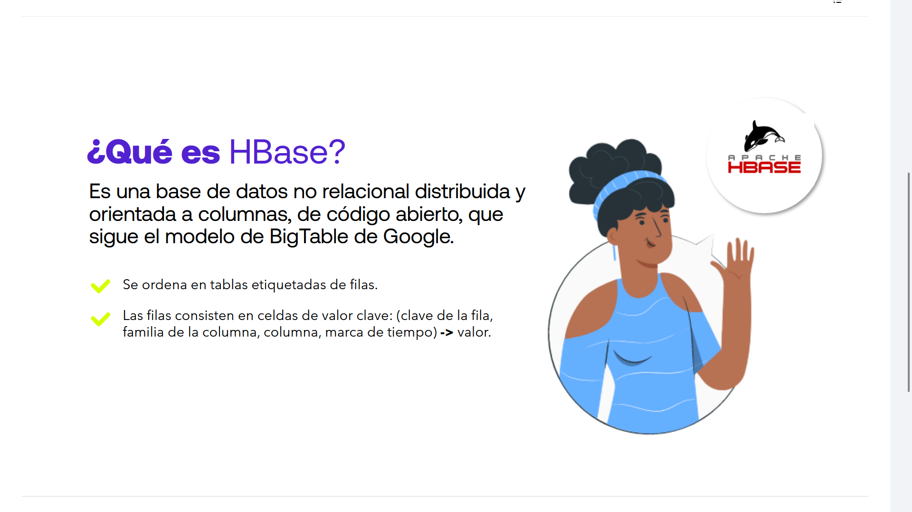

Es una **base de datos no relacional**, **distribuida** y **orientada a columnas**, de **código abierto**, que sigue el modelo de BigTable de Google.

- 🟢 Se ordena en tablas etiquetadas de filas.
- 🟢 Las filas consisten en celdas de valor clave:

> `(clave de la fila, familia de la columna, columna, marca de tiempo) -> valor`

---

## ¿Qué NO es HBase?
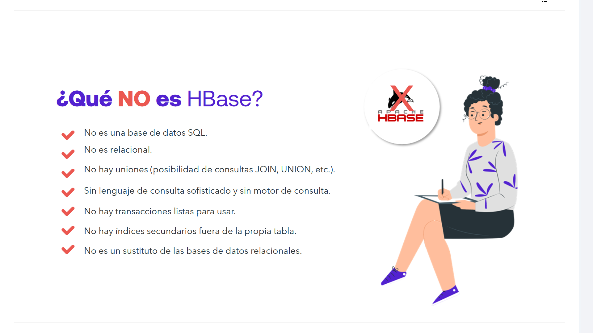


- ❌ No es una base de datos SQL.
- ❌ No es relacional.
- ❌ No hay uniones (posibilidad de consultas JOIN, UNION, etc.).
- ❌ Sin lenguaje de consulta sofisticado y sin motor de consulta.
- ❌ No hay transacciones listas para usar.
- ❌ No hay índices secundarios fuera de la propia tabla.
- ❌ No es un sustituto de las bases de datos relacionales.

---

## Características de HBase


- **Escalabilidad lineal**, capaz de almacenar cientos de terabytes de datos.
- **Separación automática** y configurable de las tablas.
- Soporte automático de **conmutación por error**.
- **Lecturas y escrituras estrictamente consistentes**.

---

## ¿En qué parte del ecosistema Hadoop encaja?
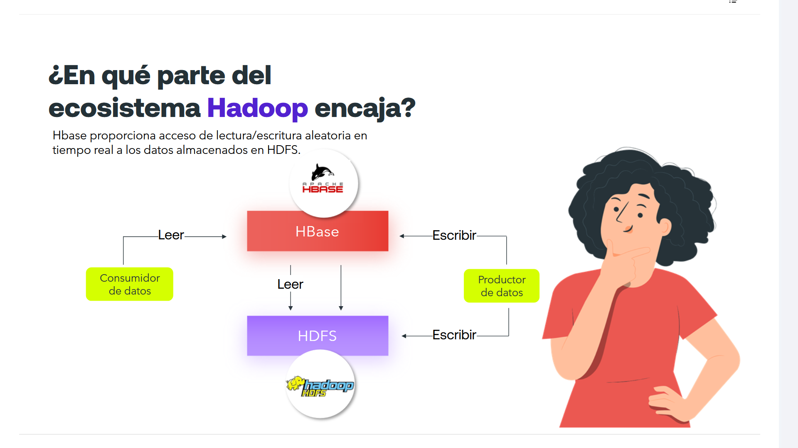

> HBase ayuda a interactuar con HDFS **en tiempo de acceso**

Hbase proporciona acceso de lectura/escritura aleatoria en tiempo real a los datos almacenados en HDFS.

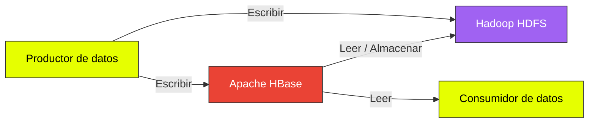

---

## Otras características de HBase
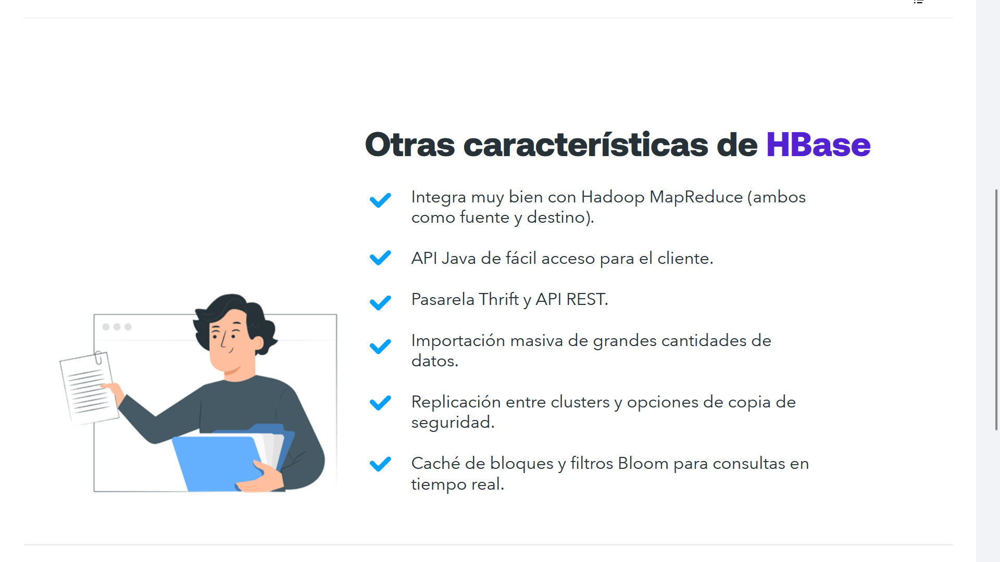

- 🔷 Integra muy bien con **Hadoop MapReduce** (ambos como fuente y destino).
- 🔷 **API Java**de fácil acceso para el cliente.
- 🔷 Pasarela **Thrift** y **API REST**.
- 🔷 Importación masiva de grandes cantidades de datos.
- 🔷 **Replicación entre clusters** y opciones de **copia de seguridad**.
- 🔷 **Caché de bloques y filtros Bloom** para consultas en tiempo real.

---

## Cómo usar HBase

### DATOS
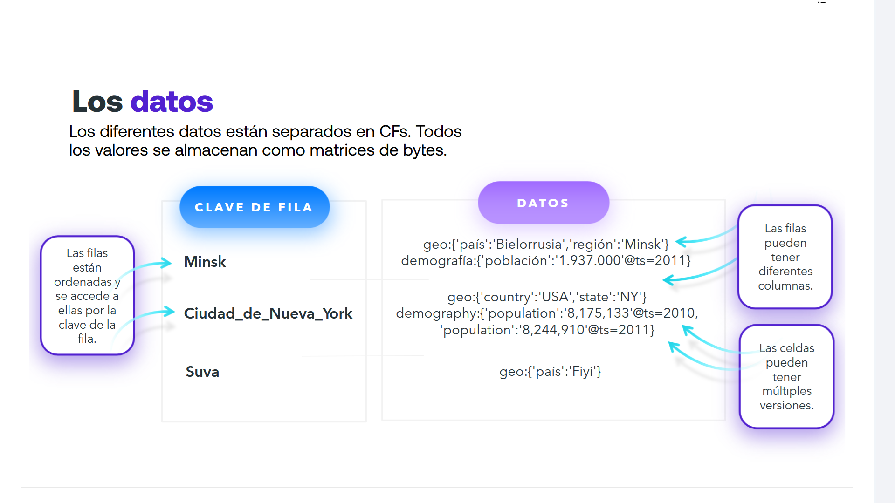

Los diferentes datos están separados en Column Families, CF's.  
Todos los valores se almacenan como matrices de bytes.

| CLAVE DE FILA | DATOS |
|---------------|-----------|
| Minsk | `geo:{'país':'Bielorrusia','región':'Minsk'} demografía:{'población':'1.937.000'@ts=2011}` |
| Ciudad_de_Nueva_York | `geo:{'country':'USA','state':'NY'}demography:{'población':'8,175,133'@ts=2010, 'población':'8,244,910'@ts=2011}` |
| Suva | `geo:{'país':'Fiyi'}` |

- 📌 Las filas están ordenadas y se accede a ellas por la clave de la fila.
- 📌 Las filas pueden tener diferentes columnas.
- 📌 Las celdas pueden tener múltiples versiones.


### DATOS (ii)

- **Es un esquema disperso (Sparse):** Si una fila no tiene datos para una columna, no se almacena un `NULL`; simplemente esa celda no existe en el almacenamiento, ahorrando espacio de manera radical.

- **Sin tipos de datos nativos:** HBase no sabe qué es un `INT`, un `FLOAT` o un `VARCHAR`. Para HBase, todo es una cadena de bytes (`byte[]`). La serialización y deserialización corre a cargo de tu aplicación, por ejemplo, usando clases para conversión de tipos (`Bytes.toBytes()` en Java, etc).

- **Las Column Families son estáticas:** Se definen al crear la tabla y deben ser pocas (raramente más de 2 o 3 por cuestiones de rendimiento en los flujos de descarga a HDFS).

- **Los Column Qualifiers son dinámicos:** Puedes inventarte millones de columnas distintas en tiempo de ejecución bajo una misma familia.


#### Representación de los datos en HBase

Para representar los datos en HBase de forma clara, hay que romper el esquema mental de las bases de datos relacionales tradicionales.

Aunque HBase parece una tabla con filas y columnas, la realidad es que por debajo funciona como un **mapa multidimensional**, distribuido y ordenado por claves, donde **todo se almacena como arrays de bytes (`byte[]`)**.

La estructura lógica sigue esta jerarquía exacta:

```text
ROW KEY -> Column Family -> Column Qualifier -> Timestamp @ -> VALUE
```


---

#### Ejemplo 1: Datos Geográficos

Aquí definimos dos familias de columnas:

- **`geo`** (datos geográficos)
- **`demo`** (datos demográficos historificados por Timestamp)

| **Row Key (Clave de Fila)** | **Column Family: `geo`** | **Column Family: `demo`** |
|:----------------------------|:-------------------------|:--------------------------|
| **BY_MINSK** | `país = "Bielorrusia"` / `región = "Minsk"` | `población = "1.937.000" *(ts=2011)*` |
| **US_NYC** | `country = "USA"` / `state = "NY"` | `población = "8.244.910" *(ts=2011)*` `población = "8,175,133" *(ts=2010)*` |
| **FJ_SUVA** | `país = "Fiyi"` | *(Celda vacía, no ocupa espacio)* |

---

##### La estructura de celdas real por debajo (Jerarquía Key-Value)

HBase no almacena **"filas completas"**, almacena **celdas individuales indexadas**.

El ejemplo de NY se descompone en el disco duro así:

```text
Row Key: "US_NYC" -> CF: "geo"  -> CQ: "country"   -> TS: Current -> Valor: "USA"
Row Key: "US_NYC" -> CF: "geo"  -> CQ: "state"     -> TS: Current -> Valor: "NY"
Row Key: "US_NYC" -> CF: "demo" -> CQ: "población" -> TS: 2011    -> Valor: "8,244,910"
Row Key: "US_NYC" -> CF: "demo" -> CQ: "población" -> TS: 2010    -> Valor: "8,175,133"
```

---

#### Ejemplo 2: Jerarquía avanzada (E-Commerce y Multi-versión)

HBase destaca cuando necesitas almacenar el historial de cambios de una celda sin necesidad de crear nuevas filas.

Imagina un catálogo de productos donde monitorizas el stock y el precio, manteniendo el rastro de las modificaciones.

- **Column Families** fijas: `info` (datos estáticos) y `pricing` (datos dinámicos).
- **Column Qualifiers** dinámicos: Se pueden añadir sobre la marcha (como `promo` o `descuento`).

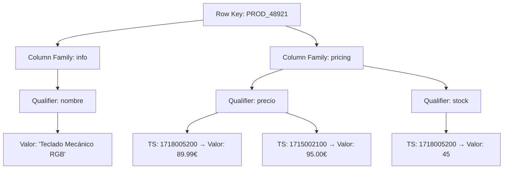

---

#### Ejemplo 3: El truco del diseño de la Row Key (Series Temporales)

En HBase, **el diseño de la clave de fila (`Row Key`) lo es todo** porque es el único índice primario.

Si diseñas una tabla para almacenar métricas de servidores o telemetría, la jerarquía se incrusta directamente en la propia clave utilizando delimitadores (como saltos de línea simulados o guiones).

##### Estructura de la Clave

```text
[ID_Servidor]-[Timestamp_Invertido]
```

Invertir el timestamp asegura que los datos más recientes aparezcan siempre arriba al realizar un escaneo.

| **Row Key (Compuesta)** | **CF: `metrics` (Métricas de rendimiento)** | **CF: `status` (Estado de red)** |
|:-------------------------|:--------------------------------------------|:---------------------------------|
| **srv-madrid-92873491** | `cpu_usage = "14.2%"` / `ram_free = "4096MB"` | `ip = "192.168.1.50"` / `gateway = "OK"` |
| **srv-madrid-92873400** | `cpu_usage = "88.7%"` / `ram_free = "512MB"` | `ip = "192.168.1.50"` |
| **srv-bilbao-92873455** | `cpu_usage = "4.1%"` | `ip = "10.0.0.12"` |

---

### ESCRITURA DE DATOS
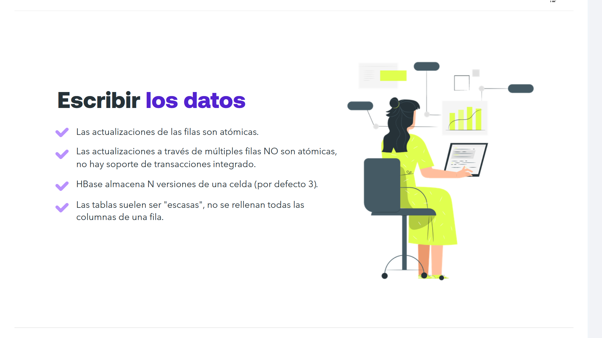

- ✔ Las **actualizaciones de las filas son atómicas**.
- ✔ Las **actualizaciones a través de múltiples filas NO son atómicas**, **no hay soporte de transacciones** integrado.
- ✔ HBase almacena N versiones de una celda (por defecto 3).
- ✔ Las tablas suelen ser "escasas", no se rellenan todas las columnas de una fila.

---

### LECTURA DE DATOS
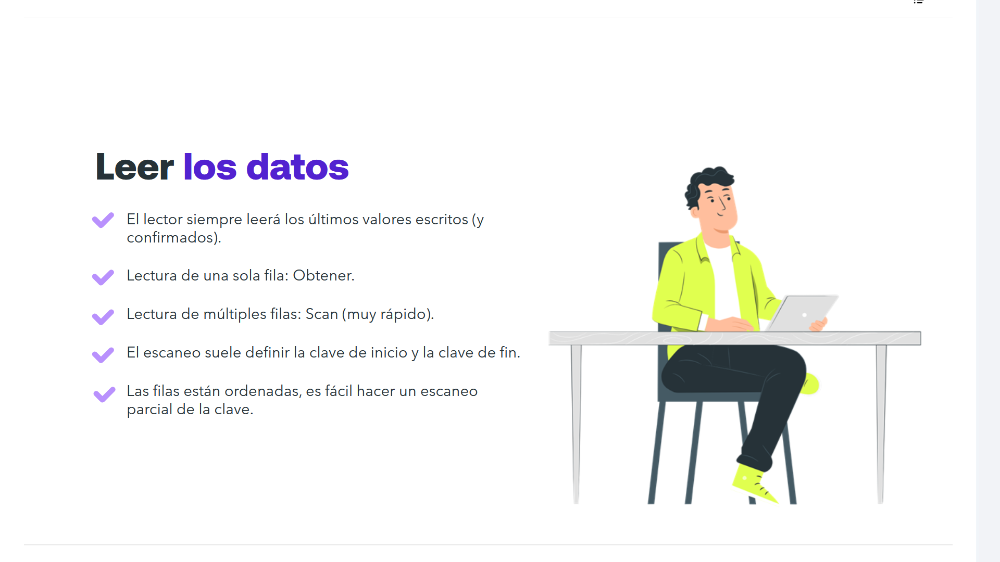

- ✔ El lector siempre leerá los últimos valores escritos (y confirmados).
- ✔ Lectura de una sola fila: Obtener.
- ✔ Lectura de múltiples filas: Scan (muy rápido).
- ✔ El escaneo suele definir la clave de inicio y la clave de fin.
- ✔ Las filas están ordenadas, es fácil hacer un escaneo parcial de la clave.

#### Ejemplo de Estructura de Lectura:
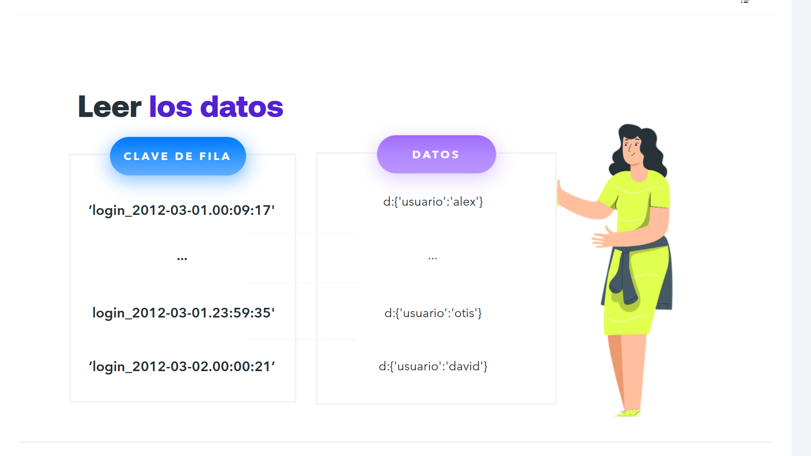

| CLAVE DE FILA | DATOS |
|---------------|-----------|
| 'login_2012-03-01.00:09:17' | d:{'usuario':'alex'} |
| ... | ... |
| login_2012-03-01.23:59:35 | d:{'usuario':'otis'} |
| 'login_2012-03-02.00:00:21' | d:{'usuario':'david'} |

---

### Integración con MapReduce
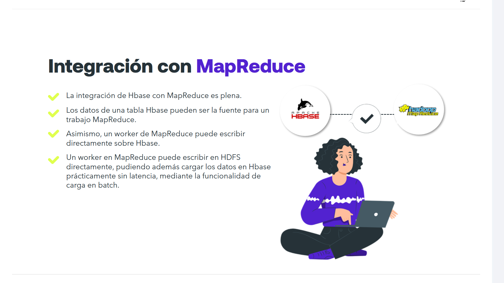

- ✅ La integración de Hbase con MapReduce es plena.
- ✅ Los datos de una tabla Hbase pueden ser la fuente para un trabajo MapReduce.
- ✅ Asimismo, un worker de MapReduce puede escribir directamente sobre Hbase.
- ✅ Un worker en MapReduce puede escribir en HDFS directamente, pudiendo además cargar los datos en Hbase prácticamente sin latencia, mediante la funcionalidad de carga en batch.

---

### Fragmentación de datos
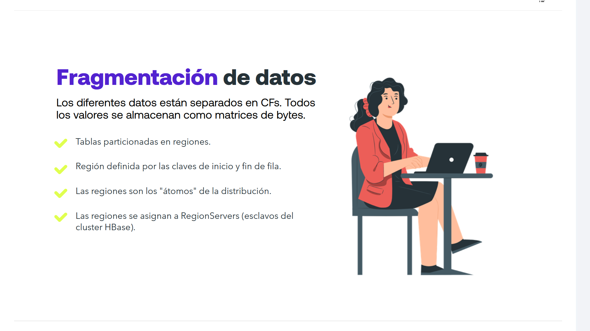

Los diferentes datos están separados en CFs. Todos los valores se almacenan como matrices de bytes.

- ✅ Tablas particionadas en regiones.
- ✅ Región definida por las claves de inicio y fin de fila.
- ✅ Las regiones son los "átomos" de la distribución.
- ✅ Las regiones se asignan a RegionServers (esclavos del cluster HBase).

---

## Componentes de HBase
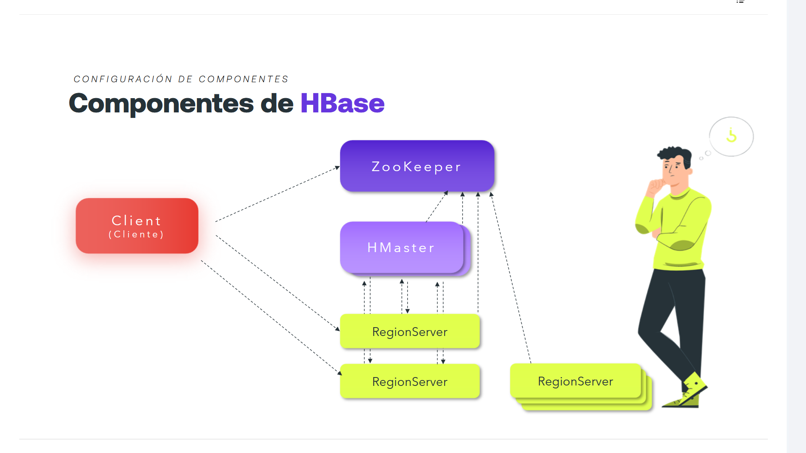

### Configuración de componentes

- Client (Cliente)
- ZooKeeper
- HMaster
- RegionServer

---

## Configuración típica de Hadoop + HBase
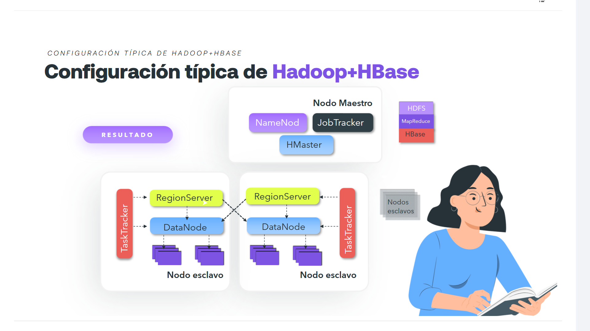

### Nodo Maestro

- NameNode
- JobTracker
- HMaster

### Nodos Esclavos (Estructura repetida por nodo)

- TaskTracker --> RegionServer
- DataNode

---

## Configuración: Conmutación automática
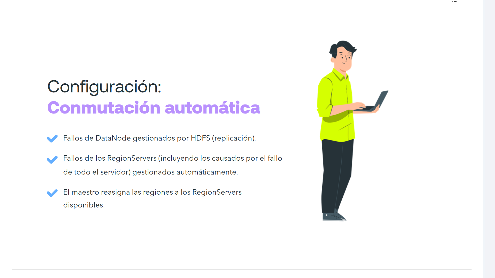

- 🔷 Fallos de DataNode gestionados por HDFS (replicación).
- 🔷 Fallos de los RegionServers (incluyendo los causados por el fallo de todo el servidor) gestionados automáticamente.
- 🔷 El maestro reasigna las regiones a los RegionServers disponibles.

---

## ¿Para qué sirve Hbase?


- 🔷 Proveer gran cantidad de datos: construido para escalar desde el principio.
- 🔷 Acceder aleatoria y rápidamente a los datos.
- 🔷 Gestionar aplicaciones con muchos procesos de escritura.
- 🔷 Escribir con tipo append (inserción/sobreescritura de nuevos datos) en lugar de pesadas operaciones de lectura-modificación-escritura.

---

## ¿Cuándo usar Hbase frente a otras alternativas?


- Cuando es prioritaria la consistencia sobre la disponibilidad.
- Cuando partimos de un ecosistema Hadoop.
- Cuando queremos contar con una gran comunidad: adoptado por gigantes tecnológicos como: Yahoo!, Facebook, Twitter Y muchos +.

---

## Casos de uso típicos
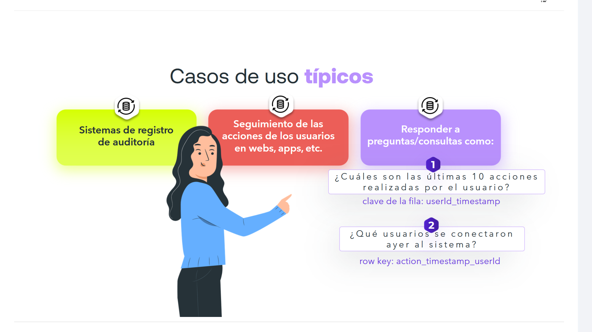

- 🟢 Sistemas de registro de auditoría.

- 🟢 Seguimiento de las acciones de los usuarios en webs, apps, etc.

- 🟢 Responder a preguntas/consultas como:
	> **¿Cuáles son las últimas 10 acciones realizadas por el usuario?**  
	> clave de la fila: `userId_timestamp`

	> **¿Qué usuarios se conectaron ayer al sistema?**  
	> row key: `action_timestamp_userId`

---

## Otros casos de uso
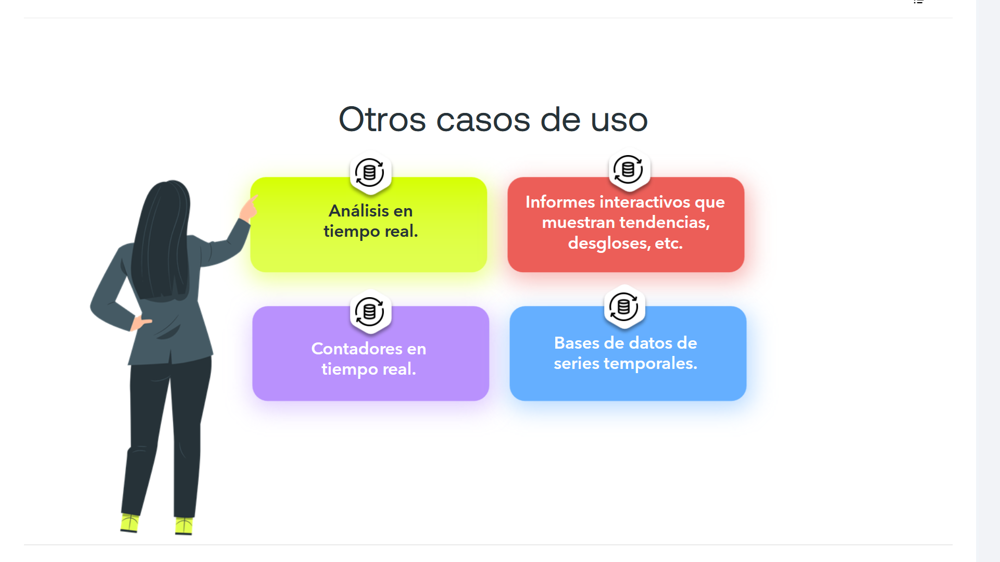

- 🟨 Análisis en tiempo real.
- 🟥 Informes interactivos que muestran tendencias, desgloses, etc.
- 🟪 Contadores en tiempo real.
- 🟦 Bases de datos de series temporales.

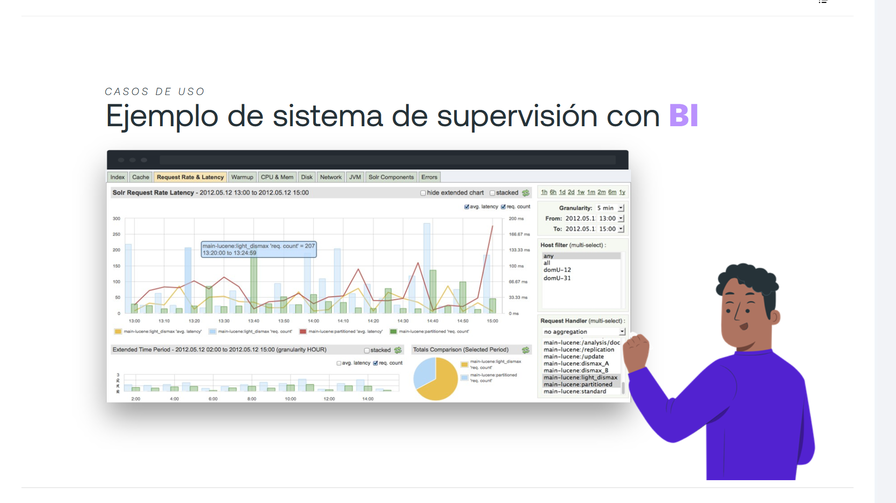

````
