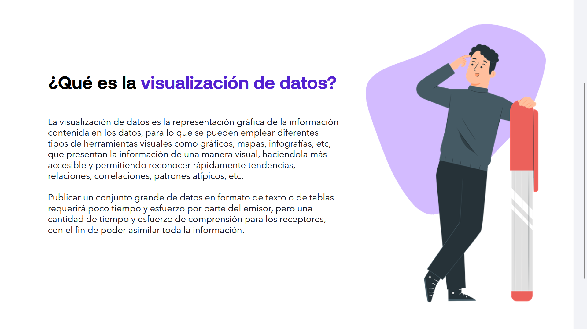
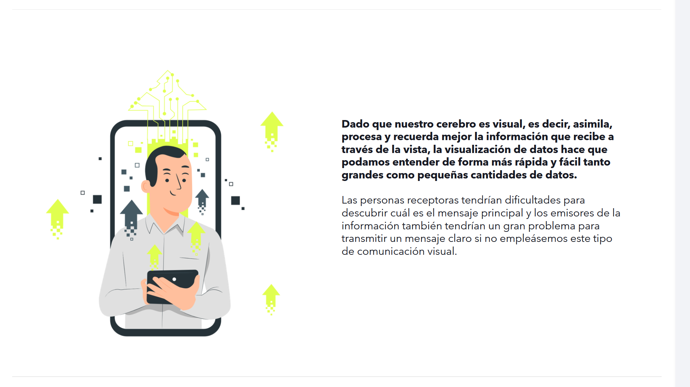
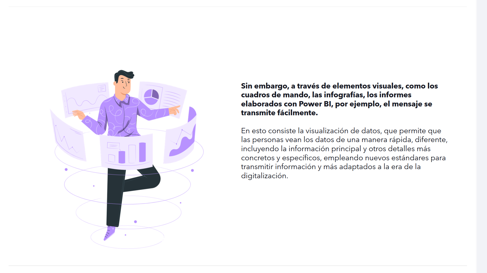
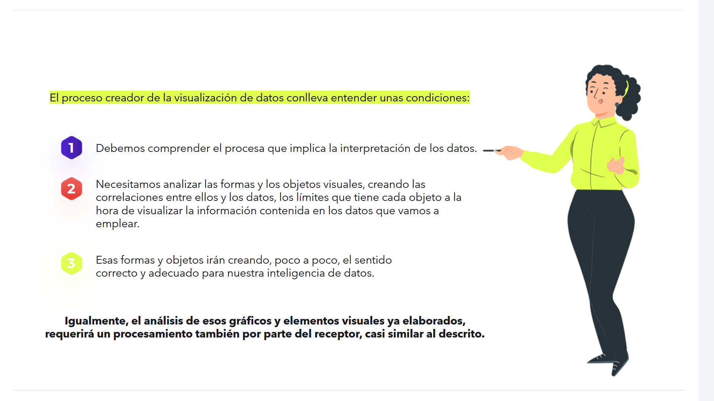

# 05-001: Visualización de Datos

---

## ¿Qué es la visualización de datos?

La **visualización de datos** es la **representación gráfica de la información contenida en los datos**, para lo que se pueden emplear diferentes tipos de herramientas visuales como:
- **Gráficos**
- **Mapas*** 
- **Iinfografías**
- Etc ...

Presentan la información de una manera visual, haciéndola más accesible y permitiendo reconocer rápidamente **tendencias, relaciones, correlaciones, patrones atípicos, etc.**

> Publicar un conjunto grande de datos en formato de texto o de tablas requerirá poco tiempo y esfuerzo por parte del emisor, pero una cantidad de tiempo y esfuerzo de comprensión para los receptores, con el fin de poder asimilar toda la información.

---

## El factor visual en el cerebro

Dado que **nuestro cerebro es visual**, es decir, **asimila, procesa y recuerda mejor la información que recibe a través de la vista**, la visualización de datos hace que podamos entender de forma más rápida y fácil tanto **grandes** como **pequeñas** cantidades de datos.

> Las personas receptoras tendrían dificultades para descubrir cuál es el mensaje principal y los emisores de la información también tendrían un gran problema para transmitir un mensaje claro si no empleásemos este tipo de comunicación visual.

---

## Herramientas modernas de análisis

Sin embargo, a través de **elementos visuales**, como:

* **Cuadros de mando**
* **Infografías**
* **Informes elaborados con Power BI**

... el mensaje se transmite fácilmente.  

En esto consiste la **visualización de datos**, que permite que las personas vean los datos de una manera rápida, diferente, incluyendo la **información principal** y otros **detalles más concretos y específicos**, empleando nuevos estándares para transmitir información y más adaptados a la **era de la digitalización**.

---

## El proceso creador y sus condiciones

El proceso creador de la **visualización de datos** conlleva entender unas condiciones:

1.	 **Debemos comprender** el proceso que implica la interpretación de los datos.

2.	 **Necesitamos analizar** las formas y los objetos visuales, creando las correlaciones entre ellos y los datos, los límites que tiene cada objeto a la hora de visualizar la información contenida en los datos que vamos a emplear.

3.	Esas formas y objetos irán creando, poco a poco, el sentido correcto y adecuado para nuestra **inteligencia de datos**.

> Igualmente, el análisis de esos gráficos y elementos visuales ya elaborados, requerirá un procesamiento también por parte del receptor, casi similar al descrito.
