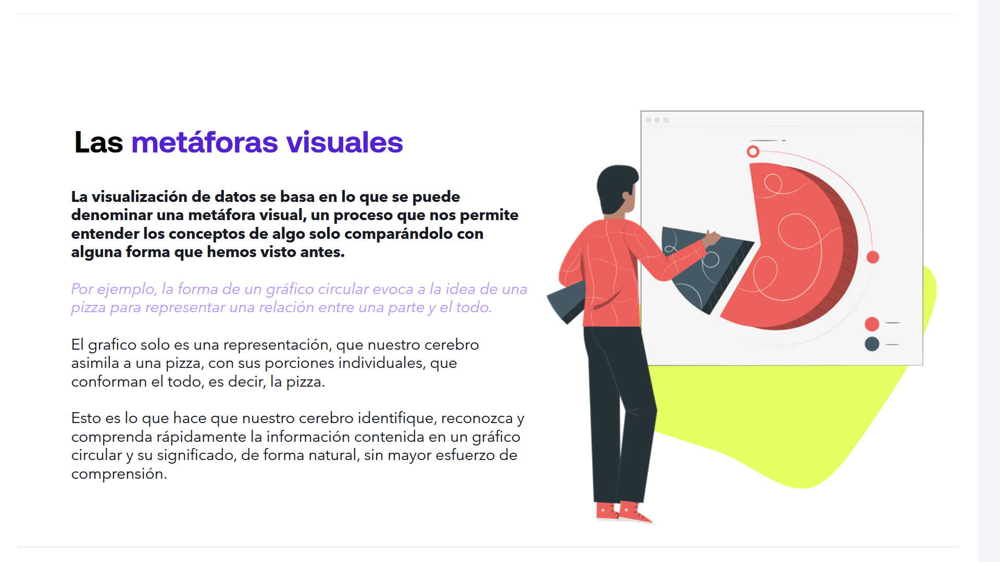
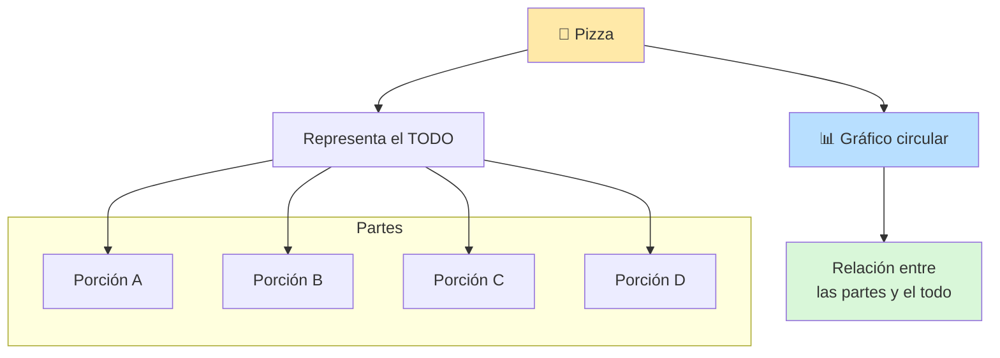
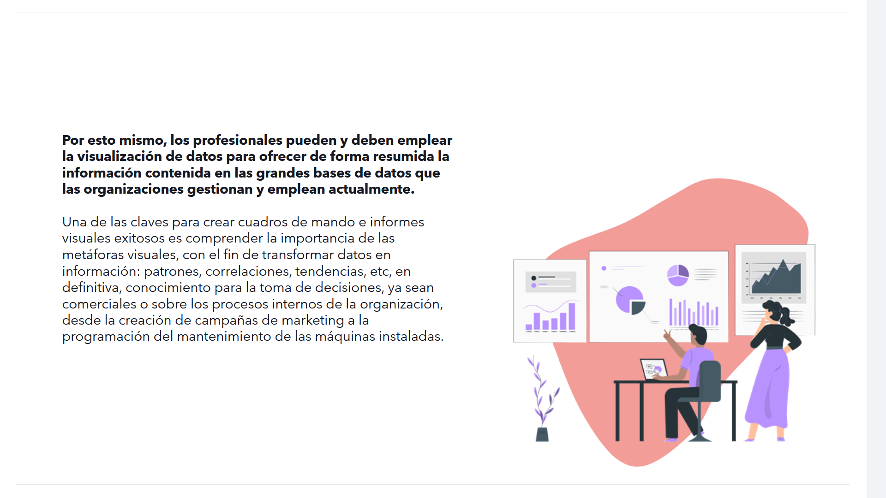

# 05-002: 	Metáforas Visuales

---

##  Las metáforas visuales

La **visualización de datos** se basa en lo que se puede denominar una **metáfora visual**, un proceso que nos permite entender los conceptos de algo solo comparándolo con alguna forma que hemos visto antes.

> Una **metáfora visual** facilita que el cerebro interprete la información de manera **rápida**, **natural** y **casi inmediata**.

### Ejemplo

> La forma de un **gráfico circular** evoca a la idea de una **pizza** para representar una relación entre una **parte** y el **todo**.

El gráfico solo es una representación, que nuestro cerebro asimila a una pizza, con sus porciones individuales, que conforman el todo, es decir, la pizza.

Gracias a esta asociación visual, nuestro cerebro **identifica**, **reconoce** y **comprende** rápidamente la información contenida en un gráfico circular y su significado, de forma natural, sin mayor esfuerzo de comprensión.

---

## Aplicación en las organizaciones y toma de decisiones

Por esto mismo, los profesionales pueden y deben emplear la **visualización de datos** para ofrecer de forma resumida la información contenida en las grandes bases de datos que las organizaciones gestionan y emplean actualmente.

### Clave para crear Cuadros de Mando e Informes visuales exitosos

Comprender la importancia de las **metáforas visuales**, con el fin de transformar **datos** en **información**:

- **Patrones**
- **Correlaciones**
- **Tendencias**
- Etc ...

En definitiva, **conocimiento para la toma de decisiones**, ya sean:

- Comerciales.
- Sobre los procesos internos de la organización.

### Algunos ejemplos

- Creación de campañas de marketing.
- Programación del mantenimiento de las máquinas instaladas.

---

> **Datos → Información → Conocimiento → Toma de decisiones**